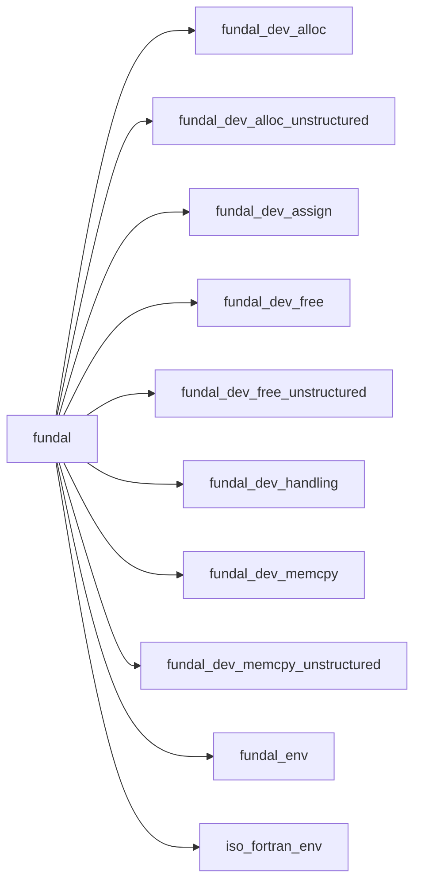
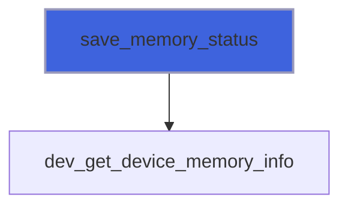

# fundal

> FUNDAL, Fortran UNified Device Acceleration Library.

**Source**: `src/lib/fundal.F90`

**Dependencies**



## Contents

- [save_memory_status](#save-memory-status)

## Subroutines

### save_memory_status

Save the current device-memory status into a file.
 File is accessed in append position.

```fortran
subroutine save_memory_status(file_name, tag)
```

**Arguments**

| Name | Type | Intent | Attributes | Description |
|------|------|--------|------------|-------------|
| `file_name` | character(len=*) | in |  | File name. |
| `tag` | character(len=*) | in | optional | Tag of current status. |

**Call graph**


