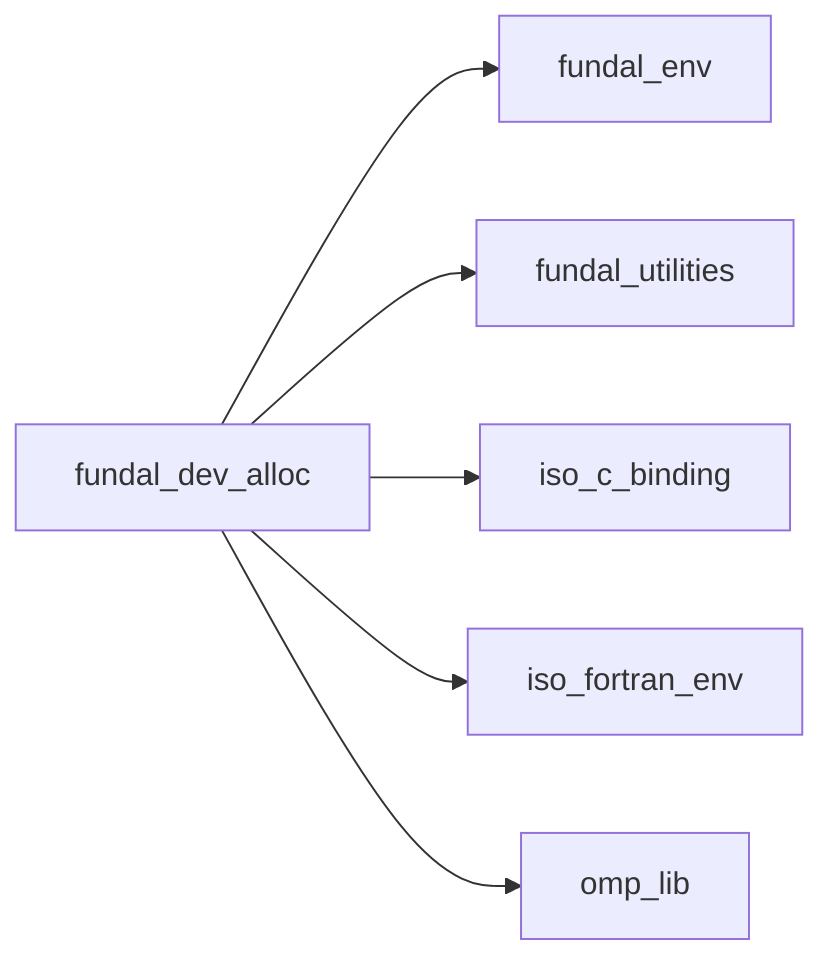
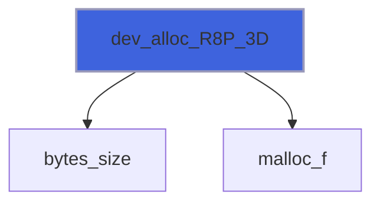
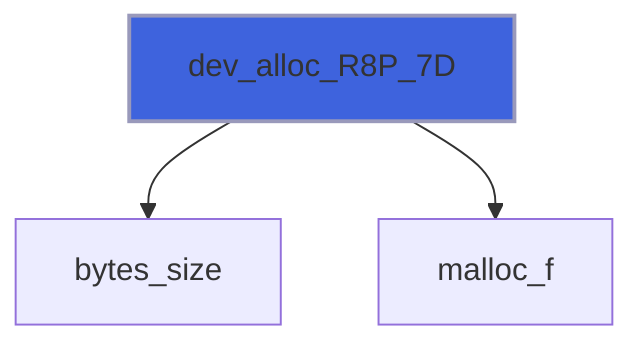
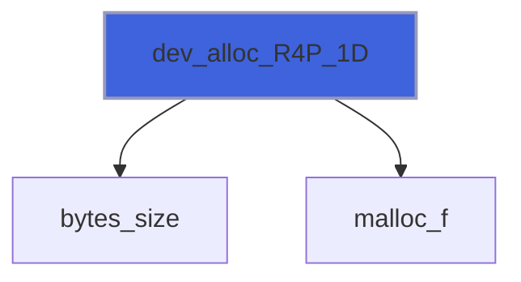
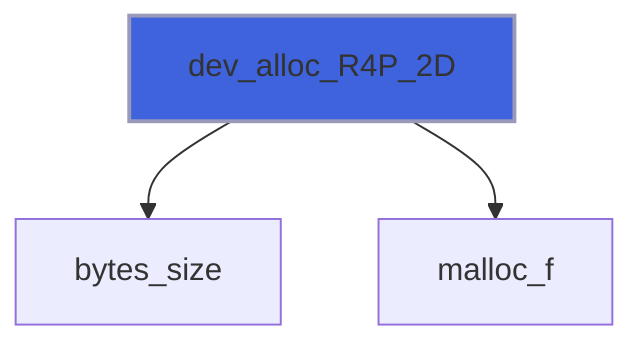
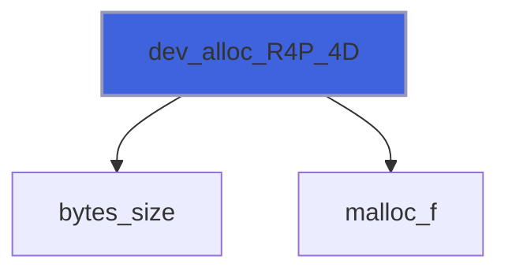
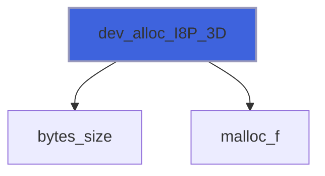

# fundal_dev_alloc

> FUNDAL, memory allocation routines module.

**Source**: `src/lib/fundal_dev_alloc.F90`

**Dependencies**



## Contents

- [dev_alloc](#dev-alloc)
- [malloc_f](#malloc-f)
- [dev_alloc_R8P_1D](#dev-alloc-r8p-1d)
- [dev_alloc_R8P_2D](#dev-alloc-r8p-2d)
- [dev_alloc_R8P_3D](#dev-alloc-r8p-3d)
- [dev_alloc_R8P_4D](#dev-alloc-r8p-4d)
- [dev_alloc_R8P_5D](#dev-alloc-r8p-5d)
- [dev_alloc_R8P_6D](#dev-alloc-r8p-6d)
- [dev_alloc_R8P_7D](#dev-alloc-r8p-7d)
- [dev_alloc_R4P_1D](#dev-alloc-r4p-1d)
- [dev_alloc_R4P_2D](#dev-alloc-r4p-2d)
- [dev_alloc_R4P_3D](#dev-alloc-r4p-3d)
- [dev_alloc_R4P_4D](#dev-alloc-r4p-4d)
- [dev_alloc_R4P_5D](#dev-alloc-r4p-5d)
- [dev_alloc_R4P_6D](#dev-alloc-r4p-6d)
- [dev_alloc_R4P_7D](#dev-alloc-r4p-7d)
- [dev_alloc_I8P_1D](#dev-alloc-i8p-1d)
- [dev_alloc_I8P_2D](#dev-alloc-i8p-2d)
- [dev_alloc_I8P_3D](#dev-alloc-i8p-3d)
- [dev_alloc_I8P_4D](#dev-alloc-i8p-4d)
- [dev_alloc_I8P_5D](#dev-alloc-i8p-5d)
- [dev_alloc_I8P_6D](#dev-alloc-i8p-6d)
- [dev_alloc_I8P_7D](#dev-alloc-i8p-7d)
- [dev_alloc_I4P_1D](#dev-alloc-i4p-1d)
- [dev_alloc_I4P_2D](#dev-alloc-i4p-2d)
- [dev_alloc_I4P_3D](#dev-alloc-i4p-3d)
- [dev_alloc_I4P_4D](#dev-alloc-i4p-4d)
- [dev_alloc_I4P_5D](#dev-alloc-i4p-5d)
- [dev_alloc_I4P_6D](#dev-alloc-i4p-6d)
- [dev_alloc_I4P_7D](#dev-alloc-i4p-7d)
- [dev_alloc_I2P_1D](#dev-alloc-i2p-1d)
- [dev_alloc_I2P_2D](#dev-alloc-i2p-2d)
- [dev_alloc_I2P_3D](#dev-alloc-i2p-3d)
- [dev_alloc_I2P_4D](#dev-alloc-i2p-4d)
- [dev_alloc_I2P_5D](#dev-alloc-i2p-5d)
- [dev_alloc_I2P_6D](#dev-alloc-i2p-6d)
- [dev_alloc_I2P_7D](#dev-alloc-i2p-7d)
- [dev_alloc_I1P_1D](#dev-alloc-i1p-1d)
- [dev_alloc_I1P_2D](#dev-alloc-i1p-2d)
- [dev_alloc_I1P_3D](#dev-alloc-i1p-3d)
- [dev_alloc_I1P_4D](#dev-alloc-i1p-4d)
- [dev_alloc_I1P_5D](#dev-alloc-i1p-5d)
- [dev_alloc_I1P_6D](#dev-alloc-i1p-6d)
- [dev_alloc_I1P_7D](#dev-alloc-i1p-7d)

## Variables

| Name | Type | Attributes | Description |
|------|------|------------|-------------|
| `FUNDAL_ERR_FPTR_DEV_NOT_ALLOCATED` | integer(kind=I4P) | parameter | Error flag, not allocated device memory. |

## Interfaces

### dev_alloc

Allocate device memory.

**Module procedures**: [`dev_alloc_R8P_1D`](/api/src/lib/fundal_dev_alloc_unstructured#dev-alloc-r8p-1d), [`dev_alloc_R8P_2D`](/api/src/lib/fundal_dev_alloc_unstructured#dev-alloc-r8p-2d), [`dev_alloc_R8P_3D`](/api/src/lib/fundal_dev_alloc_unstructured#dev-alloc-r8p-3d), [`dev_alloc_R8P_4D`](/api/src/lib/fundal_dev_alloc_unstructured#dev-alloc-r8p-4d), [`dev_alloc_R8P_5D`](/api/src/lib/fundal_dev_alloc_unstructured#dev-alloc-r8p-5d), [`dev_alloc_R8P_6D`](/api/src/lib/fundal_dev_alloc_unstructured#dev-alloc-r8p-6d), [`dev_alloc_R8P_7D`](/api/src/lib/fundal_dev_alloc_unstructured#dev-alloc-r8p-7d), [`dev_alloc_R4P_1D`](/api/src/lib/fundal_dev_alloc_unstructured#dev-alloc-r4p-1d), [`dev_alloc_R4P_2D`](/api/src/lib/fundal_dev_alloc_unstructured#dev-alloc-r4p-2d), [`dev_alloc_R4P_3D`](/api/src/lib/fundal_dev_alloc_unstructured#dev-alloc-r4p-3d), [`dev_alloc_R4P_4D`](/api/src/lib/fundal_dev_alloc_unstructured#dev-alloc-r4p-4d), [`dev_alloc_R4P_5D`](/api/src/lib/fundal_dev_alloc_unstructured#dev-alloc-r4p-5d), [`dev_alloc_R4P_6D`](/api/src/lib/fundal_dev_alloc_unstructured#dev-alloc-r4p-6d), [`dev_alloc_R4P_7D`](/api/src/lib/fundal_dev_alloc_unstructured#dev-alloc-r4p-7d), [`dev_alloc_I8P_1D`](/api/src/lib/fundal_dev_alloc_unstructured#dev-alloc-i8p-1d), [`dev_alloc_I8P_2D`](/api/src/lib/fundal_dev_alloc_unstructured#dev-alloc-i8p-2d), [`dev_alloc_I8P_3D`](/api/src/lib/fundal_dev_alloc_unstructured#dev-alloc-i8p-3d), [`dev_alloc_I8P_4D`](/api/src/lib/fundal_dev_alloc_unstructured#dev-alloc-i8p-4d), [`dev_alloc_I8P_5D`](/api/src/lib/fundal_dev_alloc_unstructured#dev-alloc-i8p-5d), [`dev_alloc_I8P_6D`](/api/src/lib/fundal_dev_alloc_unstructured#dev-alloc-i8p-6d), [`dev_alloc_I8P_7D`](/api/src/lib/fundal_dev_alloc_unstructured#dev-alloc-i8p-7d), [`dev_alloc_I4P_1D`](/api/src/lib/fundal_dev_alloc_unstructured#dev-alloc-i4p-1d), [`dev_alloc_I4P_2D`](/api/src/lib/fundal_dev_alloc_unstructured#dev-alloc-i4p-2d), [`dev_alloc_I4P_3D`](/api/src/lib/fundal_dev_alloc_unstructured#dev-alloc-i4p-3d), [`dev_alloc_I4P_4D`](/api/src/lib/fundal_dev_alloc_unstructured#dev-alloc-i4p-4d), [`dev_alloc_I4P_5D`](/api/src/lib/fundal_dev_alloc_unstructured#dev-alloc-i4p-5d), [`dev_alloc_I4P_6D`](/api/src/lib/fundal_dev_alloc_unstructured#dev-alloc-i4p-6d), [`dev_alloc_I4P_7D`](/api/src/lib/fundal_dev_alloc_unstructured#dev-alloc-i4p-7d), [`dev_alloc_I2P_1D`](/api/src/lib/fundal_dev_alloc_unstructured#dev-alloc-i2p-1d), [`dev_alloc_I2P_2D`](/api/src/lib/fundal_dev_alloc_unstructured#dev-alloc-i2p-2d), [`dev_alloc_I2P_3D`](/api/src/lib/fundal_dev_alloc_unstructured#dev-alloc-i2p-3d), [`dev_alloc_I2P_4D`](/api/src/lib/fundal_dev_alloc_unstructured#dev-alloc-i2p-4d), [`dev_alloc_I2P_5D`](/api/src/lib/fundal_dev_alloc_unstructured#dev-alloc-i2p-5d), [`dev_alloc_I2P_6D`](/api/src/lib/fundal_dev_alloc_unstructured#dev-alloc-i2p-6d), [`dev_alloc_I2P_7D`](/api/src/lib/fundal_dev_alloc_unstructured#dev-alloc-i2p-7d), [`dev_alloc_I1P_1D`](/api/src/lib/fundal_dev_alloc_unstructured#dev-alloc-i1p-1d), [`dev_alloc_I1P_2D`](/api/src/lib/fundal_dev_alloc_unstructured#dev-alloc-i1p-2d), [`dev_alloc_I1P_3D`](/api/src/lib/fundal_dev_alloc_unstructured#dev-alloc-i1p-3d), [`dev_alloc_I1P_4D`](/api/src/lib/fundal_dev_alloc_unstructured#dev-alloc-i1p-4d), [`dev_alloc_I1P_5D`](/api/src/lib/fundal_dev_alloc_unstructured#dev-alloc-i1p-5d), [`dev_alloc_I1P_6D`](/api/src/lib/fundal_dev_alloc_unstructured#dev-alloc-i1p-6d), [`dev_alloc_I1P_7D`](/api/src/lib/fundal_dev_alloc_unstructured#dev-alloc-i1p-7d)

### malloc_f

## Subroutines

### dev_alloc_R8P_1D

Allocate array, R8P kind, rank 1.

```fortran
subroutine dev_alloc_R8P_1D(fptr_dev, ubounds, ierr, dev_id, lbounds, init_value)
```

**Arguments**

| Name | Type | Intent | Attributes | Description |
|------|------|--------|------------|-------------|
| `fptr_dev` | real(kind=R8P) | out | pointer | Pointer to allocated memory. |
| `ubounds` | integer(kind=I4P) | in |  | Array upper bounds. |
| `ierr` | integer(kind=I4P) | out |  | Error status. |
| `dev_id` | integer(kind=I4P) | in | optional | Device ID (not used, necessary for unified OpenMP API). |
| `lbounds` | integer(kind=I4P) | in | optional | Array lower bounds, 1 if not passed. |
| `init_value` | real(kind=R8P) | in | optional | Optional initial value. |

**Call graph**


### dev_alloc_R8P_2D

Allocate array, R8P kind, rank 2.

```fortran
subroutine dev_alloc_R8P_2D(fptr_dev, ubounds, ierr, dev_id, lbounds, init_value)
```

**Arguments**

| Name | Type | Intent | Attributes | Description |
|------|------|--------|------------|-------------|
| `fptr_dev` | real(kind=R8P) | out | pointer | Pointer to allocated memory. |
| `ubounds` | integer(kind=I4P) | in |  | Array upper bounds. |
| `ierr` | integer(kind=I4P) | out |  | Error status. |
| `dev_id` | integer(kind=I4P) | in | optional | Device ID (not used, necessary for unified OpenMP API). |
| `lbounds` | integer(kind=I4P) | in | optional | Array lower bounds, 1 if not passed. |
| `init_value` | real(kind=R8P) | in | optional | Optional initial value. |

**Call graph**


### dev_alloc_R8P_3D

Allocate array, R8P kind, rank 3.

```fortran
subroutine dev_alloc_R8P_3D(fptr_dev, ubounds, ierr, dev_id, lbounds, init_value)
```

**Arguments**

| Name | Type | Intent | Attributes | Description |
|------|------|--------|------------|-------------|
| `fptr_dev` | real(kind=R8P) | out | pointer | Pointer to allocated memory. |
| `ubounds` | integer(kind=I4P) | in |  | Array upper bounds. |
| `ierr` | integer(kind=I4P) | out |  | Error status. |
| `dev_id` | integer(kind=I4P) | in | optional | Device ID (not used, necessary for unified OpenMP API). |
| `lbounds` | integer(kind=I4P) | in | optional | Array lower bounds, 1 if not passed. |
| `init_value` | real(kind=R8P) | in | optional | Optional initial value. |

**Call graph**



### dev_alloc_R8P_4D

Allocate array, R8P kind, rank 4.

```fortran
subroutine dev_alloc_R8P_4D(fptr_dev, ubounds, ierr, dev_id, lbounds, init_value)
```

**Arguments**

| Name | Type | Intent | Attributes | Description |
|------|------|--------|------------|-------------|
| `fptr_dev` | real(kind=R8P) | out | pointer | Pointer to allocated memory. |
| `ubounds` | integer(kind=I4P) | in |  | Array upper bounds. |
| `ierr` | integer(kind=I4P) | out |  | Error status. |
| `dev_id` | integer(kind=I4P) | in | optional | Device ID (not used, necessary for unified OpenMP API). |
| `lbounds` | integer(kind=I4P) | in | optional | Array lower bounds, 1 if not passed. |
| `init_value` | real(kind=R8P) | in | optional | Optional initial value. |

**Call graph**


### dev_alloc_R8P_5D

Allocate array, R8P kind, rank 5.

```fortran
subroutine dev_alloc_R8P_5D(fptr_dev, ubounds, ierr, dev_id, lbounds, init_value)
```

**Arguments**

| Name | Type | Intent | Attributes | Description |
|------|------|--------|------------|-------------|
| `fptr_dev` | real(kind=R8P) | out | pointer | Pointer to allocated memory. |
| `ubounds` | integer(kind=I4P) | in |  | Array upper bounds. |
| `ierr` | integer(kind=I4P) | out |  | Error status. |
| `dev_id` | integer(kind=I4P) | in | optional | Device ID (not used, necessary for unified OpenMP API). |
| `lbounds` | integer(kind=I4P) | in | optional | Array lower bounds, 1 if not passed. |
| `init_value` | real(kind=R8P) | in | optional | Optional initial value. |

**Call graph**


### dev_alloc_R8P_6D

Allocate array, R8P kind, rank 6.

```fortran
subroutine dev_alloc_R8P_6D(fptr_dev, ubounds, ierr, dev_id, lbounds, init_value)
```

**Arguments**

| Name | Type | Intent | Attributes | Description |
|------|------|--------|------------|-------------|
| `fptr_dev` | real(kind=R8P) | out | pointer | Pointer to allocated memory. |
| `ubounds` | integer(kind=I4P) | in |  | Array upper bounds. |
| `ierr` | integer(kind=I4P) | out |  | Error status. |
| `dev_id` | integer(kind=I4P) | in | optional | Device ID (not used, necessary for unified OpenMP API). |
| `lbounds` | integer(kind=I4P) | in | optional | Array lower bounds, 1 if not passed. |
| `init_value` | real(kind=R8P) | in | optional | Optional initial value. |

**Call graph**


### dev_alloc_R8P_7D

Allocate array, R8P kind, rank 7.

```fortran
subroutine dev_alloc_R8P_7D(fptr_dev, ubounds, ierr, dev_id, lbounds, init_value)
```

**Arguments**

| Name | Type | Intent | Attributes | Description |
|------|------|--------|------------|-------------|
| `fptr_dev` | real(kind=R8P) | out | pointer | Pointer to allocated memory. |
| `ubounds` | integer(kind=I4P) | in |  | Array upper bounds. |
| `ierr` | integer(kind=I4P) | out |  | Error status. |
| `dev_id` | integer(kind=I4P) | in | optional | Device ID (not used, necessary for unified OpenMP API). |
| `lbounds` | integer(kind=I4P) | in | optional | Array lower bounds, 1 if not passed. |
| `init_value` | real(kind=R8P) | in | optional | Optional initial value. |

**Call graph**



### dev_alloc_R4P_1D

Allocate array, R4P kind, rank 1.

```fortran
subroutine dev_alloc_R4P_1D(fptr_dev, ubounds, ierr, dev_id, lbounds, init_value)
```

**Arguments**

| Name | Type | Intent | Attributes | Description |
|------|------|--------|------------|-------------|
| `fptr_dev` | real(kind=R4P) | out | pointer | Pointer to allocated memory. |
| `ubounds` | integer(kind=I4P) | in |  | Array upper bounds. |
| `ierr` | integer(kind=I4P) | out |  | Error status. |
| `dev_id` | integer(kind=I4P) | in | optional | Device ID (not used, necessary for unified OpenMP API). |
| `lbounds` | integer(kind=I4P) | in | optional | Array lower bounds, 1 if not passed. |
| `init_value` | real(kind=R4P) | in | optional | Optional initial value. |

**Call graph**



### dev_alloc_R4P_2D

Allocate array, R4P kind, rank 2.

```fortran
subroutine dev_alloc_R4P_2D(fptr_dev, ubounds, ierr, dev_id, lbounds, init_value)
```

**Arguments**

| Name | Type | Intent | Attributes | Description |
|------|------|--------|------------|-------------|
| `fptr_dev` | real(kind=R4P) | out | pointer | Pointer to allocated memory. |
| `ubounds` | integer(kind=I4P) | in |  | Array upper bounds. |
| `ierr` | integer(kind=I4P) | out |  | Error status. |
| `dev_id` | integer(kind=I4P) | in | optional | Device ID (not used, necessary for unified OpenMP API). |
| `lbounds` | integer(kind=I4P) | in | optional | Array lower bounds, 1 if not passed. |
| `init_value` | real(kind=R4P) | in | optional | Optional initial value. |

**Call graph**



### dev_alloc_R4P_3D

Allocate array, R4P kind, rank 3.

```fortran
subroutine dev_alloc_R4P_3D(fptr_dev, ubounds, ierr, dev_id, lbounds, init_value)
```

**Arguments**

| Name | Type | Intent | Attributes | Description |
|------|------|--------|------------|-------------|
| `fptr_dev` | real(kind=R4P) | out | pointer | Pointer to allocated memory. |
| `ubounds` | integer(kind=I4P) | in |  | Array upper bounds. |
| `ierr` | integer(kind=I4P) | out |  | Error status. |
| `dev_id` | integer(kind=I4P) | in | optional | Device ID (not used, necessary for unified OpenMP API). |
| `lbounds` | integer(kind=I4P) | in | optional | Array lower bounds, 1 if not passed. |
| `init_value` | real(kind=R4P) | in | optional | Optional initial value. |

**Call graph**


### dev_alloc_R4P_4D

Allocate array, R4P kind, rank 4.

```fortran
subroutine dev_alloc_R4P_4D(fptr_dev, ubounds, ierr, dev_id, lbounds, init_value)
```

**Arguments**

| Name | Type | Intent | Attributes | Description |
|------|------|--------|------------|-------------|
| `fptr_dev` | real(kind=R4P) | out | pointer | Pointer to allocated memory. |
| `ubounds` | integer(kind=I4P) | in |  | Array upper bounds. |
| `ierr` | integer(kind=I4P) | out |  | Error status. |
| `dev_id` | integer(kind=I4P) | in | optional | Device ID (not used, necessary for unified OpenMP API). |
| `lbounds` | integer(kind=I4P) | in | optional | Array lower bounds, 1 if not passed. |
| `init_value` | real(kind=R4P) | in | optional | Optional initial value. |

**Call graph**



### dev_alloc_R4P_5D

Allocate array, R4P kind, rank 5.

```fortran
subroutine dev_alloc_R4P_5D(fptr_dev, ubounds, ierr, dev_id, lbounds, init_value)
```

**Arguments**

| Name | Type | Intent | Attributes | Description |
|------|------|--------|------------|-------------|
| `fptr_dev` | real(kind=R4P) | out | pointer | Pointer to allocated memory. |
| `ubounds` | integer(kind=I4P) | in |  | Array upper bounds. |
| `ierr` | integer(kind=I4P) | out |  | Error status. |
| `dev_id` | integer(kind=I4P) | in | optional | Device ID (not used, necessary for unified OpenMP API). |
| `lbounds` | integer(kind=I4P) | in | optional | Array lower bounds, 1 if not passed. |
| `init_value` | real(kind=R4P) | in | optional | Optional initial value. |

**Call graph**


### dev_alloc_R4P_6D

Allocate array, R4P kind, rank 6.

```fortran
subroutine dev_alloc_R4P_6D(fptr_dev, ubounds, ierr, dev_id, lbounds, init_value)
```

**Arguments**

| Name | Type | Intent | Attributes | Description |
|------|------|--------|------------|-------------|
| `fptr_dev` | real(kind=R4P) | out | pointer | Pointer to allocated memory. |
| `ubounds` | integer(kind=I4P) | in |  | Array upper bounds. |
| `ierr` | integer(kind=I4P) | out |  | Error status. |
| `dev_id` | integer(kind=I4P) | in | optional | Device ID (not used, necessary for unified OpenMP API). |
| `lbounds` | integer(kind=I4P) | in | optional | Array lower bounds, 1 if not passed. |
| `init_value` | real(kind=R4P) | in | optional | Optional initial value. |

**Call graph**


### dev_alloc_R4P_7D

Allocate array, R4P kind, rank 7.

```fortran
subroutine dev_alloc_R4P_7D(fptr_dev, ubounds, ierr, dev_id, lbounds, init_value)
```

**Arguments**

| Name | Type | Intent | Attributes | Description |
|------|------|--------|------------|-------------|
| `fptr_dev` | real(kind=R4P) | out | pointer | Pointer to allocated memory. |
| `ubounds` | integer(kind=I4P) | in |  | Array upper bounds. |
| `ierr` | integer(kind=I4P) | out |  | Error status. |
| `dev_id` | integer(kind=I4P) | in | optional | Device ID (not used, necessary for unified OpenMP API). |
| `lbounds` | integer(kind=I4P) | in | optional | Array lower bounds, 1 if not passed. |
| `init_value` | real(kind=R4P) | in | optional | Optional initial value. |

**Call graph**


### dev_alloc_I8P_1D

Allocate array, I8P kind, rank 1.

```fortran
subroutine dev_alloc_I8P_1D(fptr_dev, ubounds, ierr, dev_id, lbounds, init_value)
```

**Arguments**

| Name | Type | Intent | Attributes | Description |
|------|------|--------|------------|-------------|
| `fptr_dev` | integer(kind=I8P) | out | pointer | Pointer to allocated memory. |
| `ubounds` | integer(kind=I4P) | in |  | Array upper bounds. |
| `ierr` | integer(kind=I4P) | out |  | Error status. |
| `dev_id` | integer(kind=I4P) | in | optional | Device ID (not used, necessary for unified OpenMP API). |
| `lbounds` | integer(kind=I4P) | in | optional | Array lower bounds, 1 if not passed. |
| `init_value` | integer(kind=I8P) | in | optional | Optional initial value. |

**Call graph**


### dev_alloc_I8P_2D

Allocate array, I8P kind, rank 2.

```fortran
subroutine dev_alloc_I8P_2D(fptr_dev, ubounds, ierr, dev_id, lbounds, init_value)
```

**Arguments**

| Name | Type | Intent | Attributes | Description |
|------|------|--------|------------|-------------|
| `fptr_dev` | integer(kind=I8P) | out | pointer | Pointer to allocated memory. |
| `ubounds` | integer(kind=I4P) | in |  | Array upper bounds. |
| `ierr` | integer(kind=I4P) | out |  | Error status. |
| `dev_id` | integer(kind=I4P) | in | optional | Device ID (not used, necessary for unified OpenMP API). |
| `lbounds` | integer(kind=I4P) | in | optional | Array lower bounds, 1 if not passed. |
| `init_value` | integer(kind=I8P) | in | optional | Optional initial value. |

**Call graph**


### dev_alloc_I8P_3D

Allocate array, I8P kind, rank 3.

```fortran
subroutine dev_alloc_I8P_3D(fptr_dev, ubounds, ierr, dev_id, lbounds, init_value)
```

**Arguments**

| Name | Type | Intent | Attributes | Description |
|------|------|--------|------------|-------------|
| `fptr_dev` | integer(kind=I8P) | out | pointer | Pointer to allocated memory. |
| `ubounds` | integer(kind=I4P) | in |  | Array upper bounds. |
| `ierr` | integer(kind=I4P) | out |  | Error status. |
| `dev_id` | integer(kind=I4P) | in | optional | Device ID (not used, necessary for unified OpenMP API). |
| `lbounds` | integer(kind=I4P) | in | optional | Array lower bounds, 1 if not passed. |
| `init_value` | integer(kind=I8P) | in | optional | Optional initial value. |

**Call graph**



### dev_alloc_I8P_4D

Allocate array, I8P kind, rank 4.

```fortran
subroutine dev_alloc_I8P_4D(fptr_dev, ubounds, ierr, dev_id, lbounds, init_value)
```

**Arguments**

| Name | Type | Intent | Attributes | Description |
|------|------|--------|------------|-------------|
| `fptr_dev` | integer(kind=I8P) | out | pointer | Pointer to allocated memory. |
| `ubounds` | integer(kind=I4P) | in |  | Array upper bounds. |
| `ierr` | integer(kind=I4P) | out |  | Error status. |
| `dev_id` | integer(kind=I4P) | in | optional | Device ID (not used, necessary for unified OpenMP API). |
| `lbounds` | integer(kind=I4P) | in | optional | Array lower bounds, 1 if not passed. |
| `init_value` | integer(kind=I8P) | in | optional | Optional initial value. |

**Call graph**


### dev_alloc_I8P_5D

Allocate array, I8P kind, rank 5.

```fortran
subroutine dev_alloc_I8P_5D(fptr_dev, ubounds, ierr, dev_id, lbounds, init_value)
```

**Arguments**

| Name | Type | Intent | Attributes | Description |
|------|------|--------|------------|-------------|
| `fptr_dev` | integer(kind=I8P) | out | pointer | Pointer to allocated memory. |
| `ubounds` | integer(kind=I4P) | in |  | Array upper bounds. |
| `ierr` | integer(kind=I4P) | out |  | Error status. |
| `dev_id` | integer(kind=I4P) | in | optional | Device ID (not used, necessary for unified OpenMP API). |
| `lbounds` | integer(kind=I4P) | in | optional | Array lower bounds, 1 if not passed. |
| `init_value` | integer(kind=I8P) | in | optional | Optional initial value. |

**Call graph**


### dev_alloc_I8P_6D

Allocate array, I8P kind, rank 6.

```fortran
subroutine dev_alloc_I8P_6D(fptr_dev, ubounds, ierr, dev_id, lbounds, init_value)
```

**Arguments**

| Name | Type | Intent | Attributes | Description |
|------|------|--------|------------|-------------|
| `fptr_dev` | integer(kind=I8P) | out | pointer | Pointer to allocated memory. |
| `ubounds` | integer(kind=I4P) | in |  | Array upper bounds. |
| `ierr` | integer(kind=I4P) | out |  | Error status. |
| `dev_id` | integer(kind=I4P) | in | optional | Device ID (not used, necessary for unified OpenMP API). |
| `lbounds` | integer(kind=I4P) | in | optional | Array lower bounds, 1 if not passed. |
| `init_value` | integer(kind=I8P) | in | optional | Optional initial value. |

**Call graph**

```mermaid
flowchart TD
  dev_alloc_I8P_6D["dev_alloc_I8P_6D"] --> bytes_size["bytes_size"]
  dev_alloc_I8P_6D["dev_alloc_I8P_6D"] --> malloc_f["malloc_f"]
  style dev_alloc_I8P_6D fill:#3e63dd,stroke:#99b,stroke-width:2px
```

### dev_alloc_I8P_7D

Allocate array, I8P kind, rank 7.

```fortran
subroutine dev_alloc_I8P_7D(fptr_dev, ubounds, ierr, dev_id, lbounds, init_value)
```

**Arguments**

| Name | Type | Intent | Attributes | Description |
|------|------|--------|------------|-------------|
| `fptr_dev` | integer(kind=I8P) | out | pointer | Pointer to allocated memory. |
| `ubounds` | integer(kind=I4P) | in |  | Array upper bounds. |
| `ierr` | integer(kind=I4P) | out |  | Error status. |
| `dev_id` | integer(kind=I4P) | in | optional | Device ID (not used, necessary for unified OpenMP API). |
| `lbounds` | integer(kind=I4P) | in | optional | Array lower bounds, 1 if not passed. |
| `init_value` | integer(kind=I8P) | in | optional | Optional initial value. |

**Call graph**

```mermaid
flowchart TD
  dev_alloc_I8P_7D["dev_alloc_I8P_7D"] --> bytes_size["bytes_size"]
  dev_alloc_I8P_7D["dev_alloc_I8P_7D"] --> malloc_f["malloc_f"]
  style dev_alloc_I8P_7D fill:#3e63dd,stroke:#99b,stroke-width:2px
```

### dev_alloc_I4P_1D

Allocate array, I4P kind, rank 1.

```fortran
subroutine dev_alloc_I4P_1D(fptr_dev, ubounds, ierr, dev_id, lbounds, init_value)
```

**Arguments**

| Name | Type | Intent | Attributes | Description |
|------|------|--------|------------|-------------|
| `fptr_dev` | integer(kind=I4P) | out | pointer | Pointer to allocated memory. |
| `ubounds` | integer(kind=I4P) | in |  | Array upper bounds. |
| `ierr` | integer(kind=I4P) | out |  | Error status. |
| `dev_id` | integer(kind=I4P) | in | optional | Device ID (not used, necessary for unified OpenMP API). |
| `lbounds` | integer(kind=I4P) | in | optional | Array lower bounds, 1 if not passed. |
| `init_value` | integer(kind=I4P) | in | optional | Optional initial value. |

**Call graph**

```mermaid
flowchart TD
  dev_alloc_I4P_1D["dev_alloc_I4P_1D"] --> bytes_size["bytes_size"]
  dev_alloc_I4P_1D["dev_alloc_I4P_1D"] --> malloc_f["malloc_f"]
  style dev_alloc_I4P_1D fill:#3e63dd,stroke:#99b,stroke-width:2px
```

### dev_alloc_I4P_2D

Allocate array, I4P kind, rank 2.

```fortran
subroutine dev_alloc_I4P_2D(fptr_dev, ubounds, ierr, dev_id, lbounds, init_value)
```

**Arguments**

| Name | Type | Intent | Attributes | Description |
|------|------|--------|------------|-------------|
| `fptr_dev` | integer(kind=I4P) | out | pointer | Pointer to allocated memory. |
| `ubounds` | integer(kind=I4P) | in |  | Array upper bounds. |
| `ierr` | integer(kind=I4P) | out |  | Error status. |
| `dev_id` | integer(kind=I4P) | in | optional | Device ID (not used, necessary for unified OpenMP API). |
| `lbounds` | integer(kind=I4P) | in | optional | Array lower bounds, 1 if not passed. |
| `init_value` | integer(kind=I4P) | in | optional | Optional initial value. |

**Call graph**

```mermaid
flowchart TD
  dev_alloc_I4P_2D["dev_alloc_I4P_2D"] --> bytes_size["bytes_size"]
  dev_alloc_I4P_2D["dev_alloc_I4P_2D"] --> malloc_f["malloc_f"]
  style dev_alloc_I4P_2D fill:#3e63dd,stroke:#99b,stroke-width:2px
```

### dev_alloc_I4P_3D

Allocate array, I4P kind, rank 3.

```fortran
subroutine dev_alloc_I4P_3D(fptr_dev, ubounds, ierr, dev_id, lbounds, init_value)
```

**Arguments**

| Name | Type | Intent | Attributes | Description |
|------|------|--------|------------|-------------|
| `fptr_dev` | integer(kind=I4P) | out | pointer | Pointer to allocated memory. |
| `ubounds` | integer(kind=I4P) | in |  | Array upper bounds. |
| `ierr` | integer(kind=I4P) | out |  | Error status. |
| `dev_id` | integer(kind=I4P) | in | optional | Device ID (not used, necessary for unified OpenMP API). |
| `lbounds` | integer(kind=I4P) | in | optional | Array lower bounds, 1 if not passed. |
| `init_value` | integer(kind=I4P) | in | optional | Optional initial value. |

**Call graph**

```mermaid
flowchart TD
  dev_alloc_I4P_3D["dev_alloc_I4P_3D"] --> bytes_size["bytes_size"]
  dev_alloc_I4P_3D["dev_alloc_I4P_3D"] --> malloc_f["malloc_f"]
  style dev_alloc_I4P_3D fill:#3e63dd,stroke:#99b,stroke-width:2px
```

### dev_alloc_I4P_4D

Allocate array, I4P kind, rank 4.

```fortran
subroutine dev_alloc_I4P_4D(fptr_dev, ubounds, ierr, dev_id, lbounds, init_value)
```

**Arguments**

| Name | Type | Intent | Attributes | Description |
|------|------|--------|------------|-------------|
| `fptr_dev` | integer(kind=I4P) | out | pointer | Pointer to allocated memory. |
| `ubounds` | integer(kind=I4P) | in |  | Array upper bounds. |
| `ierr` | integer(kind=I4P) | out |  | Error status. |
| `dev_id` | integer(kind=I4P) | in | optional | Device ID (not used, necessary for unified OpenMP API). |
| `lbounds` | integer(kind=I4P) | in | optional | Array lower bounds, 1 if not passed. |
| `init_value` | integer(kind=I4P) | in | optional | Optional initial value. |

**Call graph**

```mermaid
flowchart TD
  dev_alloc_I4P_4D["dev_alloc_I4P_4D"] --> bytes_size["bytes_size"]
  dev_alloc_I4P_4D["dev_alloc_I4P_4D"] --> malloc_f["malloc_f"]
  style dev_alloc_I4P_4D fill:#3e63dd,stroke:#99b,stroke-width:2px
```

### dev_alloc_I4P_5D

Allocate array, I4P kind, rank 5.

```fortran
subroutine dev_alloc_I4P_5D(fptr_dev, ubounds, ierr, dev_id, lbounds, init_value)
```

**Arguments**

| Name | Type | Intent | Attributes | Description |
|------|------|--------|------------|-------------|
| `fptr_dev` | integer(kind=I4P) | out | pointer | Pointer to allocated memory. |
| `ubounds` | integer(kind=I4P) | in |  | Array upper bounds. |
| `ierr` | integer(kind=I4P) | out |  | Error status. |
| `dev_id` | integer(kind=I4P) | in | optional | Device ID (not used, necessary for unified OpenMP API). |
| `lbounds` | integer(kind=I4P) | in | optional | Array lower bounds, 1 if not passed. |
| `init_value` | integer(kind=I4P) | in | optional | Optional initial value. |

**Call graph**

```mermaid
flowchart TD
  dev_alloc_I4P_5D["dev_alloc_I4P_5D"] --> bytes_size["bytes_size"]
  dev_alloc_I4P_5D["dev_alloc_I4P_5D"] --> malloc_f["malloc_f"]
  style dev_alloc_I4P_5D fill:#3e63dd,stroke:#99b,stroke-width:2px
```

### dev_alloc_I4P_6D

Allocate array, I4P kind, rank 6.

```fortran
subroutine dev_alloc_I4P_6D(fptr_dev, ubounds, ierr, dev_id, lbounds, init_value)
```

**Arguments**

| Name | Type | Intent | Attributes | Description |
|------|------|--------|------------|-------------|
| `fptr_dev` | integer(kind=I4P) | out | pointer | Pointer to allocated memory. |
| `ubounds` | integer(kind=I4P) | in |  | Array upper bounds. |
| `ierr` | integer(kind=I4P) | out |  | Error status. |
| `dev_id` | integer(kind=I4P) | in | optional | Device ID (not used, necessary for unified OpenMP API). |
| `lbounds` | integer(kind=I4P) | in | optional | Array lower bounds, 1 if not passed. |
| `init_value` | integer(kind=I4P) | in | optional | Optional initial value. |

**Call graph**

```mermaid
flowchart TD
  dev_alloc_I4P_6D["dev_alloc_I4P_6D"] --> bytes_size["bytes_size"]
  dev_alloc_I4P_6D["dev_alloc_I4P_6D"] --> malloc_f["malloc_f"]
  style dev_alloc_I4P_6D fill:#3e63dd,stroke:#99b,stroke-width:2px
```

### dev_alloc_I4P_7D

Allocate array, I4P kind, rank 7.

```fortran
subroutine dev_alloc_I4P_7D(fptr_dev, ubounds, ierr, dev_id, lbounds, init_value)
```

**Arguments**

| Name | Type | Intent | Attributes | Description |
|------|------|--------|------------|-------------|
| `fptr_dev` | integer(kind=I4P) | out | pointer | Pointer to allocated memory. |
| `ubounds` | integer(kind=I4P) | in |  | Array upper bounds. |
| `ierr` | integer(kind=I4P) | out |  | Error status. |
| `dev_id` | integer(kind=I4P) | in | optional | Device ID (not used, necessary for unified OpenMP API). |
| `lbounds` | integer(kind=I4P) | in | optional | Array lower bounds, 1 if not passed. |
| `init_value` | integer(kind=I4P) | in | optional | Optional initial value. |

**Call graph**

```mermaid
flowchart TD
  dev_alloc_I4P_7D["dev_alloc_I4P_7D"] --> bytes_size["bytes_size"]
  dev_alloc_I4P_7D["dev_alloc_I4P_7D"] --> malloc_f["malloc_f"]
  style dev_alloc_I4P_7D fill:#3e63dd,stroke:#99b,stroke-width:2px
```

### dev_alloc_I2P_1D

Allocate array, I2P kind, rank 1.

```fortran
subroutine dev_alloc_I2P_1D(fptr_dev, ubounds, ierr, dev_id, lbounds, init_value)
```

**Arguments**

| Name | Type | Intent | Attributes | Description |
|------|------|--------|------------|-------------|
| `fptr_dev` | integer(kind=I2P) | out | pointer | Pointer to allocated memory. |
| `ubounds` | integer(kind=I4P) | in |  | Array upper bounds. |
| `ierr` | integer(kind=I4P) | out |  | Error status. |
| `dev_id` | integer(kind=I4P) | in | optional | Device ID (not used, necessary for unified OpenMP API). |
| `lbounds` | integer(kind=I4P) | in | optional | Array lower bounds, 1 if not passed. |
| `init_value` | integer(kind=I2P) | in | optional | Optional initial value. |

**Call graph**

```mermaid
flowchart TD
  dev_alloc_I2P_1D["dev_alloc_I2P_1D"] --> bytes_size["bytes_size"]
  dev_alloc_I2P_1D["dev_alloc_I2P_1D"] --> malloc_f["malloc_f"]
  style dev_alloc_I2P_1D fill:#3e63dd,stroke:#99b,stroke-width:2px
```

### dev_alloc_I2P_2D

Allocate array, I2P kind, rank 2.

```fortran
subroutine dev_alloc_I2P_2D(fptr_dev, ubounds, ierr, dev_id, lbounds, init_value)
```

**Arguments**

| Name | Type | Intent | Attributes | Description |
|------|------|--------|------------|-------------|
| `fptr_dev` | integer(kind=I2P) | out | pointer | Pointer to allocated memory. |
| `ubounds` | integer(kind=I4P) | in |  | Array upper bounds. |
| `ierr` | integer(kind=I4P) | out |  | Error status. |
| `dev_id` | integer(kind=I4P) | in | optional | Device ID (not used, necessary for unified OpenMP API). |
| `lbounds` | integer(kind=I4P) | in | optional | Array lower bounds, 1 if not passed. |
| `init_value` | integer(kind=I2P) | in | optional | Optional initial value. |

**Call graph**

```mermaid
flowchart TD
  dev_alloc_I2P_2D["dev_alloc_I2P_2D"] --> bytes_size["bytes_size"]
  dev_alloc_I2P_2D["dev_alloc_I2P_2D"] --> malloc_f["malloc_f"]
  style dev_alloc_I2P_2D fill:#3e63dd,stroke:#99b,stroke-width:2px
```

### dev_alloc_I2P_3D

Allocate array, I2P kind, rank 3.

```fortran
subroutine dev_alloc_I2P_3D(fptr_dev, ubounds, ierr, dev_id, lbounds, init_value)
```

**Arguments**

| Name | Type | Intent | Attributes | Description |
|------|------|--------|------------|-------------|
| `fptr_dev` | integer(kind=I2P) | out | pointer | Pointer to allocated memory. |
| `ubounds` | integer(kind=I4P) | in |  | Array upper bounds. |
| `ierr` | integer(kind=I4P) | out |  | Error status. |
| `dev_id` | integer(kind=I4P) | in | optional | Device ID (not used, necessary for unified OpenMP API). |
| `lbounds` | integer(kind=I4P) | in | optional | Array lower bounds, 1 if not passed. |
| `init_value` | integer(kind=I2P) | in | optional | Optional initial value. |

**Call graph**

```mermaid
flowchart TD
  dev_alloc_I2P_3D["dev_alloc_I2P_3D"] --> bytes_size["bytes_size"]
  dev_alloc_I2P_3D["dev_alloc_I2P_3D"] --> malloc_f["malloc_f"]
  style dev_alloc_I2P_3D fill:#3e63dd,stroke:#99b,stroke-width:2px
```

### dev_alloc_I2P_4D

Allocate array, I2P kind, rank 4.

```fortran
subroutine dev_alloc_I2P_4D(fptr_dev, ubounds, ierr, dev_id, lbounds, init_value)
```

**Arguments**

| Name | Type | Intent | Attributes | Description |
|------|------|--------|------------|-------------|
| `fptr_dev` | integer(kind=I2P) | out | pointer | Pointer to allocated memory. |
| `ubounds` | integer(kind=I4P) | in |  | Array upper bounds. |
| `ierr` | integer(kind=I4P) | out |  | Error status. |
| `dev_id` | integer(kind=I4P) | in | optional | Device ID (not used, necessary for unified OpenMP API). |
| `lbounds` | integer(kind=I4P) | in | optional | Array lower bounds, 1 if not passed. |
| `init_value` | integer(kind=I2P) | in | optional | Optional initial value. |

**Call graph**

```mermaid
flowchart TD
  dev_alloc_I2P_4D["dev_alloc_I2P_4D"] --> bytes_size["bytes_size"]
  dev_alloc_I2P_4D["dev_alloc_I2P_4D"] --> malloc_f["malloc_f"]
  style dev_alloc_I2P_4D fill:#3e63dd,stroke:#99b,stroke-width:2px
```

### dev_alloc_I2P_5D

Allocate array, I2P kind, rank 5.

```fortran
subroutine dev_alloc_I2P_5D(fptr_dev, ubounds, ierr, dev_id, lbounds, init_value)
```

**Arguments**

| Name | Type | Intent | Attributes | Description |
|------|------|--------|------------|-------------|
| `fptr_dev` | integer(kind=I2P) | out | pointer | Pointer to allocated memory. |
| `ubounds` | integer(kind=I4P) | in |  | Array upper bounds. |
| `ierr` | integer(kind=I4P) | out |  | Error status. |
| `dev_id` | integer(kind=I4P) | in | optional | Device ID (not used, necessary for unified OpenMP API). |
| `lbounds` | integer(kind=I4P) | in | optional | Array lower bounds, 1 if not passed. |
| `init_value` | integer(kind=I2P) | in | optional | Optional initial value. |

**Call graph**

```mermaid
flowchart TD
  dev_alloc_I2P_5D["dev_alloc_I2P_5D"] --> bytes_size["bytes_size"]
  dev_alloc_I2P_5D["dev_alloc_I2P_5D"] --> malloc_f["malloc_f"]
  style dev_alloc_I2P_5D fill:#3e63dd,stroke:#99b,stroke-width:2px
```

### dev_alloc_I2P_6D

Allocate array, I2P kind, rank 6.

```fortran
subroutine dev_alloc_I2P_6D(fptr_dev, ubounds, ierr, dev_id, lbounds, init_value)
```

**Arguments**

| Name | Type | Intent | Attributes | Description |
|------|------|--------|------------|-------------|
| `fptr_dev` | integer(kind=I2P) | out | pointer | Pointer to allocated memory. |
| `ubounds` | integer(kind=I4P) | in |  | Array upper bounds. |
| `ierr` | integer(kind=I4P) | out |  | Error status. |
| `dev_id` | integer(kind=I4P) | in | optional | Device ID (not used, necessary for unified OpenMP API). |
| `lbounds` | integer(kind=I4P) | in | optional | Array lower bounds, 1 if not passed. |
| `init_value` | integer(kind=I2P) | in | optional | Optional initial value. |

**Call graph**

```mermaid
flowchart TD
  dev_alloc_I2P_6D["dev_alloc_I2P_6D"] --> bytes_size["bytes_size"]
  dev_alloc_I2P_6D["dev_alloc_I2P_6D"] --> malloc_f["malloc_f"]
  style dev_alloc_I2P_6D fill:#3e63dd,stroke:#99b,stroke-width:2px
```

### dev_alloc_I2P_7D

Allocate array, I2P kind, rank 7.

```fortran
subroutine dev_alloc_I2P_7D(fptr_dev, ubounds, ierr, dev_id, lbounds, init_value)
```

**Arguments**

| Name | Type | Intent | Attributes | Description |
|------|------|--------|------------|-------------|
| `fptr_dev` | integer(kind=I2P) | out | pointer | Pointer to allocated memory. |
| `ubounds` | integer(kind=I4P) | in |  | Array upper bounds. |
| `ierr` | integer(kind=I4P) | out |  | Error status. |
| `dev_id` | integer(kind=I4P) | in | optional | Device ID (not used, necessary for unified OpenMP API). |
| `lbounds` | integer(kind=I4P) | in | optional | Array lower bounds, 1 if not passed. |
| `init_value` | integer(kind=I2P) | in | optional | Optional initial value. |

**Call graph**

```mermaid
flowchart TD
  dev_alloc_I2P_7D["dev_alloc_I2P_7D"] --> bytes_size["bytes_size"]
  dev_alloc_I2P_7D["dev_alloc_I2P_7D"] --> malloc_f["malloc_f"]
  style dev_alloc_I2P_7D fill:#3e63dd,stroke:#99b,stroke-width:2px
```

### dev_alloc_I1P_1D

Allocate array, I1P kind, rank 1.

```fortran
subroutine dev_alloc_I1P_1D(fptr_dev, ubounds, ierr, dev_id, lbounds, init_value)
```

**Arguments**

| Name | Type | Intent | Attributes | Description |
|------|------|--------|------------|-------------|
| `fptr_dev` | integer(kind=I1P) | out | pointer | Pointer to allocated memory. |
| `ubounds` | integer(kind=I4P) | in |  | Array upper bounds. |
| `ierr` | integer(kind=I4P) | out |  | Error status. |
| `dev_id` | integer(kind=I4P) | in | optional | Device ID (not used, necessary for unified OpenMP API). |
| `lbounds` | integer(kind=I4P) | in | optional | Array lower bounds, 1 if not passed. |
| `init_value` | integer(kind=I1P) | in | optional | Optional initial value. |

**Call graph**

```mermaid
flowchart TD
  dev_alloc_I1P_1D["dev_alloc_I1P_1D"] --> bytes_size["bytes_size"]
  dev_alloc_I1P_1D["dev_alloc_I1P_1D"] --> malloc_f["malloc_f"]
  style dev_alloc_I1P_1D fill:#3e63dd,stroke:#99b,stroke-width:2px
```

### dev_alloc_I1P_2D

Allocate array, I1P kind, rank 2.

```fortran
subroutine dev_alloc_I1P_2D(fptr_dev, ubounds, ierr, dev_id, lbounds, init_value)
```

**Arguments**

| Name | Type | Intent | Attributes | Description |
|------|------|--------|------------|-------------|
| `fptr_dev` | integer(kind=I1P) | out | pointer | Pointer to allocated memory. |
| `ubounds` | integer(kind=I4P) | in |  | Array upper bounds. |
| `ierr` | integer(kind=I4P) | out |  | Error status. |
| `dev_id` | integer(kind=I4P) | in | optional | Device ID (not used, necessary for unified OpenMP API). |
| `lbounds` | integer(kind=I4P) | in | optional | Array lower bounds, 1 if not passed. |
| `init_value` | integer(kind=I1P) | in | optional | Optional initial value. |

**Call graph**

```mermaid
flowchart TD
  dev_alloc_I1P_2D["dev_alloc_I1P_2D"] --> bytes_size["bytes_size"]
  dev_alloc_I1P_2D["dev_alloc_I1P_2D"] --> malloc_f["malloc_f"]
  style dev_alloc_I1P_2D fill:#3e63dd,stroke:#99b,stroke-width:2px
```

### dev_alloc_I1P_3D

Allocate array, I1P kind, rank 3.

```fortran
subroutine dev_alloc_I1P_3D(fptr_dev, ubounds, ierr, dev_id, lbounds, init_value)
```

**Arguments**

| Name | Type | Intent | Attributes | Description |
|------|------|--------|------------|-------------|
| `fptr_dev` | integer(kind=I1P) | out | pointer | Pointer to allocated memory. |
| `ubounds` | integer(kind=I4P) | in |  | Array upper bounds. |
| `ierr` | integer(kind=I4P) | out |  | Error status. |
| `dev_id` | integer(kind=I4P) | in | optional | Device ID (not used, necessary for unified OpenMP API). |
| `lbounds` | integer(kind=I4P) | in | optional | Array lower bounds, 1 if not passed. |
| `init_value` | integer(kind=I1P) | in | optional | Optional initial value. |

**Call graph**

```mermaid
flowchart TD
  dev_alloc_I1P_3D["dev_alloc_I1P_3D"] --> bytes_size["bytes_size"]
  dev_alloc_I1P_3D["dev_alloc_I1P_3D"] --> malloc_f["malloc_f"]
  style dev_alloc_I1P_3D fill:#3e63dd,stroke:#99b,stroke-width:2px
```

### dev_alloc_I1P_4D

Allocate array, I1P kind, rank 4.

```fortran
subroutine dev_alloc_I1P_4D(fptr_dev, ubounds, ierr, dev_id, lbounds, init_value)
```

**Arguments**

| Name | Type | Intent | Attributes | Description |
|------|------|--------|------------|-------------|
| `fptr_dev` | integer(kind=I1P) | out | pointer | Pointer to allocated memory. |
| `ubounds` | integer(kind=I4P) | in |  | Array upper bounds. |
| `ierr` | integer(kind=I4P) | out |  | Error status. |
| `dev_id` | integer(kind=I4P) | in | optional | Device ID (not used, necessary for unified OpenMP API). |
| `lbounds` | integer(kind=I4P) | in | optional | Array lower bounds, 1 if not passed. |
| `init_value` | integer(kind=I1P) | in | optional | Optional initial value. |

**Call graph**

```mermaid
flowchart TD
  dev_alloc_I1P_4D["dev_alloc_I1P_4D"] --> bytes_size["bytes_size"]
  dev_alloc_I1P_4D["dev_alloc_I1P_4D"] --> malloc_f["malloc_f"]
  style dev_alloc_I1P_4D fill:#3e63dd,stroke:#99b,stroke-width:2px
```

### dev_alloc_I1P_5D

Allocate array, I1P kind, rank 5.

```fortran
subroutine dev_alloc_I1P_5D(fptr_dev, ubounds, ierr, dev_id, lbounds, init_value)
```

**Arguments**

| Name | Type | Intent | Attributes | Description |
|------|------|--------|------------|-------------|
| `fptr_dev` | integer(kind=I1P) | out | pointer | Pointer to allocated memory. |
| `ubounds` | integer(kind=I4P) | in |  | Array upper bounds. |
| `ierr` | integer(kind=I4P) | out |  | Error status. |
| `dev_id` | integer(kind=I4P) | in | optional | Device ID (not used, necessary for unified OpenMP API). |
| `lbounds` | integer(kind=I4P) | in | optional | Array lower bounds, 1 if not passed. |
| `init_value` | integer(kind=I1P) | in | optional | Optional initial value. |

**Call graph**

```mermaid
flowchart TD
  dev_alloc_I1P_5D["dev_alloc_I1P_5D"] --> bytes_size["bytes_size"]
  dev_alloc_I1P_5D["dev_alloc_I1P_5D"] --> malloc_f["malloc_f"]
  style dev_alloc_I1P_5D fill:#3e63dd,stroke:#99b,stroke-width:2px
```

### dev_alloc_I1P_6D

Allocate array, I1P kind, rank 6.

```fortran
subroutine dev_alloc_I1P_6D(fptr_dev, ubounds, ierr, dev_id, lbounds, init_value)
```

**Arguments**

| Name | Type | Intent | Attributes | Description |
|------|------|--------|------------|-------------|
| `fptr_dev` | integer(kind=I1P) | out | pointer | Pointer to allocated memory. |
| `ubounds` | integer(kind=I4P) | in |  | Array upper bounds. |
| `ierr` | integer(kind=I4P) | out |  | Error status. |
| `dev_id` | integer(kind=I4P) | in | optional | Device ID (not used, necessary for unified OpenMP API). |
| `lbounds` | integer(kind=I4P) | in | optional | Array lower bounds, 1 if not passed. |
| `init_value` | integer(kind=I1P) | in | optional | Optional initial value. |

**Call graph**

```mermaid
flowchart TD
  dev_alloc_I1P_6D["dev_alloc_I1P_6D"] --> bytes_size["bytes_size"]
  dev_alloc_I1P_6D["dev_alloc_I1P_6D"] --> malloc_f["malloc_f"]
  style dev_alloc_I1P_6D fill:#3e63dd,stroke:#99b,stroke-width:2px
```

### dev_alloc_I1P_7D

Allocate array, I1P kind, rank 7.

```fortran
subroutine dev_alloc_I1P_7D(fptr_dev, ubounds, ierr, dev_id, lbounds, init_value)
```

**Arguments**

| Name | Type | Intent | Attributes | Description |
|------|------|--------|------------|-------------|
| `fptr_dev` | integer(kind=I1P) | out | pointer | Pointer to allocated memory. |
| `ubounds` | integer(kind=I4P) | in |  | Array upper bounds. |
| `ierr` | integer(kind=I4P) | out |  | Error status. |
| `dev_id` | integer(kind=I4P) | in | optional | Device ID (not used, necessary for unified OpenMP API). |
| `lbounds` | integer(kind=I4P) | in | optional | Array lower bounds, 1 if not passed. |
| `init_value` | integer(kind=I1P) | in | optional | Optional initial value. |

**Call graph**

```mermaid
flowchart TD
  dev_alloc_I1P_7D["dev_alloc_I1P_7D"] --> bytes_size["bytes_size"]
  dev_alloc_I1P_7D["dev_alloc_I1P_7D"] --> malloc_f["malloc_f"]
  style dev_alloc_I1P_7D fill:#3e63dd,stroke:#99b,stroke-width:2px
```
