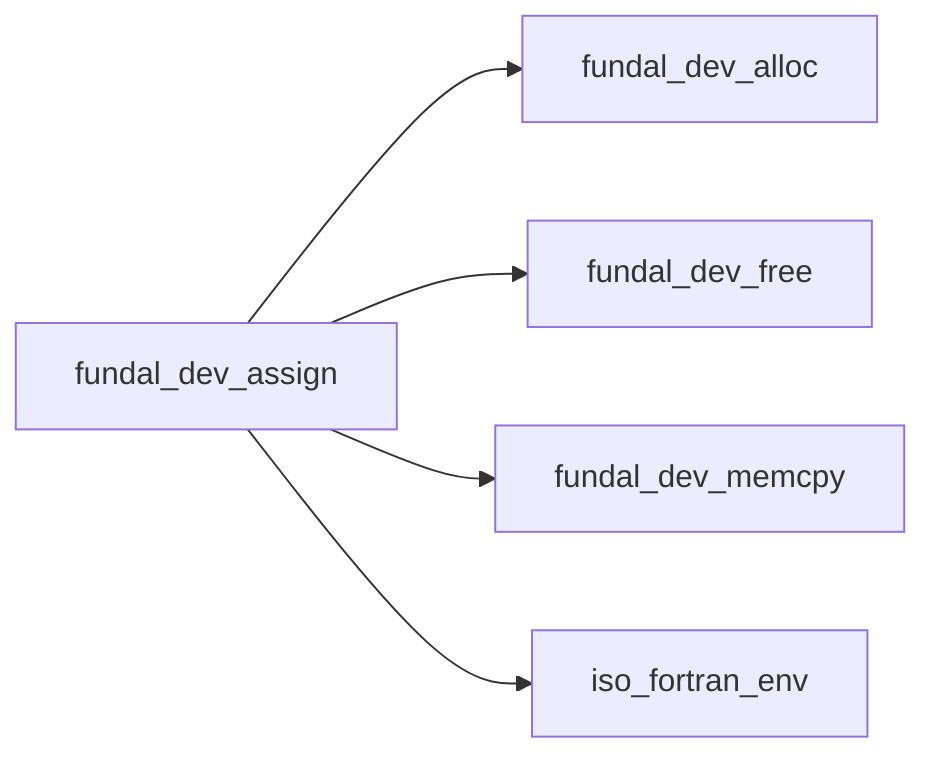
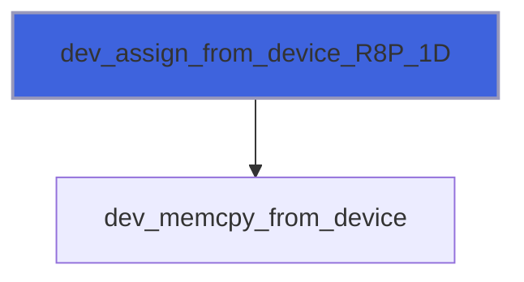
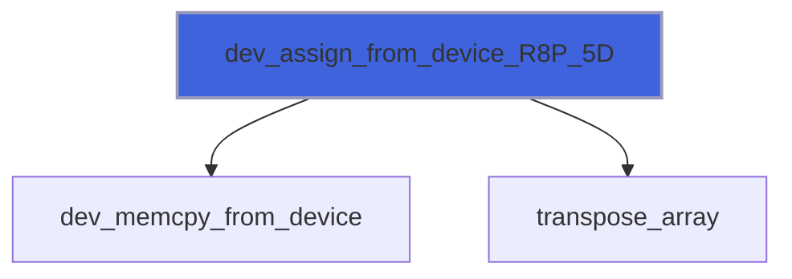
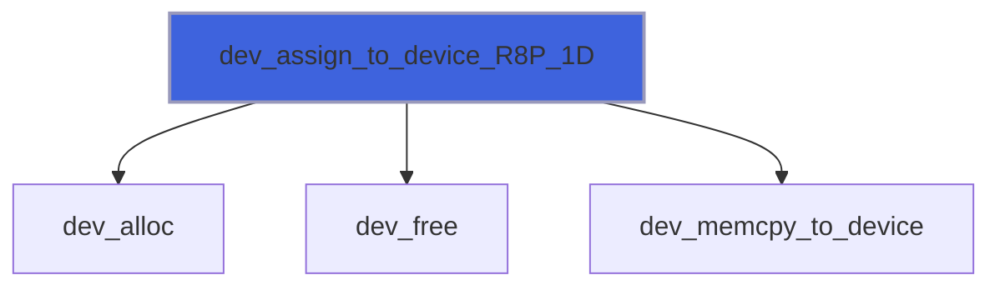
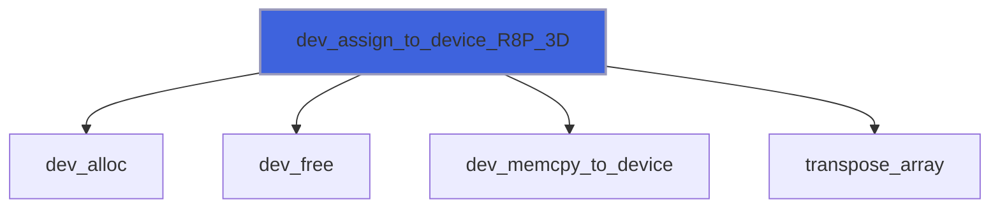

# fundal_dev_assign

> FUNDAL, memory assignment routines module.

**Source**: `src/lib/fundal_dev_assign.F90`

**Dependencies**



## Contents

- [dev_assign_from_device](#dev-assign-from-device)
- [dev_assign_to_device](#dev-assign-to-device)
- [transpose_array](#transpose-array)
- [dev_assign_from_device_R8P_1D](#dev-assign-from-device-r8p-1d)
- [dev_assign_from_device_R8P_2D](#dev-assign-from-device-r8p-2d)
- [dev_assign_from_device_R8P_3D](#dev-assign-from-device-r8p-3d)
- [dev_assign_from_device_R8P_4D](#dev-assign-from-device-r8p-4d)
- [dev_assign_from_device_R8P_5D](#dev-assign-from-device-r8p-5d)
- [dev_assign_from_device_R8P_6D](#dev-assign-from-device-r8p-6d)
- [dev_assign_from_device_R8P_7D](#dev-assign-from-device-r8p-7d)
- [dev_assign_to_device_R8P_1D](#dev-assign-to-device-r8p-1d)
- [dev_assign_to_device_R8P_2D](#dev-assign-to-device-r8p-2d)
- [dev_assign_to_device_R8P_3D](#dev-assign-to-device-r8p-3d)
- [dev_assign_to_device_R8P_4D](#dev-assign-to-device-r8p-4d)
- [dev_assign_to_device_R8P_5D](#dev-assign-to-device-r8p-5d)
- [dev_assign_to_device_R8P_6D](#dev-assign-to-device-r8p-6d)
- [dev_assign_to_device_R8P_7D](#dev-assign-to-device-r8p-7d)
- [dev_assign_from_device_R4P_1D](#dev-assign-from-device-r4p-1d)
- [dev_assign_from_device_R4P_2D](#dev-assign-from-device-r4p-2d)
- [dev_assign_from_device_R4P_3D](#dev-assign-from-device-r4p-3d)
- [dev_assign_from_device_R4P_4D](#dev-assign-from-device-r4p-4d)
- [dev_assign_from_device_R4P_5D](#dev-assign-from-device-r4p-5d)
- [dev_assign_from_device_R4P_6D](#dev-assign-from-device-r4p-6d)
- [dev_assign_from_device_R4P_7D](#dev-assign-from-device-r4p-7d)
- [dev_assign_to_device_R4P_1D](#dev-assign-to-device-r4p-1d)
- [dev_assign_to_device_R4P_2D](#dev-assign-to-device-r4p-2d)
- [dev_assign_to_device_R4P_3D](#dev-assign-to-device-r4p-3d)
- [dev_assign_to_device_R4P_4D](#dev-assign-to-device-r4p-4d)
- [dev_assign_to_device_R4P_5D](#dev-assign-to-device-r4p-5d)
- [dev_assign_to_device_R4P_6D](#dev-assign-to-device-r4p-6d)
- [dev_assign_to_device_R4P_7D](#dev-assign-to-device-r4p-7d)
- [dev_assign_from_device_I8P_1D](#dev-assign-from-device-i8p-1d)
- [dev_assign_from_device_I8P_2D](#dev-assign-from-device-i8p-2d)
- [dev_assign_from_device_I8P_3D](#dev-assign-from-device-i8p-3d)
- [dev_assign_from_device_I8P_4D](#dev-assign-from-device-i8p-4d)
- [dev_assign_from_device_I8P_5D](#dev-assign-from-device-i8p-5d)
- [dev_assign_from_device_I8P_6D](#dev-assign-from-device-i8p-6d)
- [dev_assign_from_device_I8P_7D](#dev-assign-from-device-i8p-7d)
- [dev_assign_to_device_I8P_1D](#dev-assign-to-device-i8p-1d)
- [dev_assign_to_device_I8P_2D](#dev-assign-to-device-i8p-2d)
- [dev_assign_to_device_I8P_3D](#dev-assign-to-device-i8p-3d)
- [dev_assign_to_device_I8P_4D](#dev-assign-to-device-i8p-4d)
- [dev_assign_to_device_I8P_5D](#dev-assign-to-device-i8p-5d)
- [dev_assign_to_device_I8P_6D](#dev-assign-to-device-i8p-6d)
- [dev_assign_to_device_I8P_7D](#dev-assign-to-device-i8p-7d)
- [dev_assign_from_device_I4P_1D](#dev-assign-from-device-i4p-1d)
- [dev_assign_from_device_I4P_2D](#dev-assign-from-device-i4p-2d)
- [dev_assign_from_device_I4P_3D](#dev-assign-from-device-i4p-3d)
- [dev_assign_from_device_I4P_4D](#dev-assign-from-device-i4p-4d)
- [dev_assign_from_device_I4P_5D](#dev-assign-from-device-i4p-5d)
- [dev_assign_from_device_I4P_6D](#dev-assign-from-device-i4p-6d)
- [dev_assign_from_device_I4P_7D](#dev-assign-from-device-i4p-7d)
- [dev_assign_to_device_I4P_1D](#dev-assign-to-device-i4p-1d)
- [dev_assign_to_device_I4P_2D](#dev-assign-to-device-i4p-2d)
- [dev_assign_to_device_I4P_3D](#dev-assign-to-device-i4p-3d)
- [dev_assign_to_device_I4P_4D](#dev-assign-to-device-i4p-4d)
- [dev_assign_to_device_I4P_5D](#dev-assign-to-device-i4p-5d)
- [dev_assign_to_device_I4P_6D](#dev-assign-to-device-i4p-6d)
- [dev_assign_to_device_I4P_7D](#dev-assign-to-device-i4p-7d)
- [dev_assign_from_device_I2P_1D](#dev-assign-from-device-i2p-1d)
- [dev_assign_from_device_I2P_2D](#dev-assign-from-device-i2p-2d)
- [dev_assign_from_device_I2P_3D](#dev-assign-from-device-i2p-3d)
- [dev_assign_from_device_I2P_4D](#dev-assign-from-device-i2p-4d)
- [dev_assign_from_device_I2P_5D](#dev-assign-from-device-i2p-5d)
- [dev_assign_from_device_I2P_6D](#dev-assign-from-device-i2p-6d)
- [dev_assign_from_device_I2P_7D](#dev-assign-from-device-i2p-7d)
- [dev_assign_to_device_I2P_1D](#dev-assign-to-device-i2p-1d)
- [dev_assign_to_device_I2P_2D](#dev-assign-to-device-i2p-2d)
- [dev_assign_to_device_I2P_3D](#dev-assign-to-device-i2p-3d)
- [dev_assign_to_device_I2P_4D](#dev-assign-to-device-i2p-4d)
- [dev_assign_to_device_I2P_5D](#dev-assign-to-device-i2p-5d)
- [dev_assign_to_device_I2P_6D](#dev-assign-to-device-i2p-6d)
- [dev_assign_to_device_I2P_7D](#dev-assign-to-device-i2p-7d)
- [dev_assign_from_device_I1P_1D](#dev-assign-from-device-i1p-1d)
- [dev_assign_from_device_I1P_2D](#dev-assign-from-device-i1p-2d)
- [dev_assign_from_device_I1P_3D](#dev-assign-from-device-i1p-3d)
- [dev_assign_from_device_I1P_4D](#dev-assign-from-device-i1p-4d)
- [dev_assign_from_device_I1P_5D](#dev-assign-from-device-i1p-5d)
- [dev_assign_from_device_I1P_6D](#dev-assign-from-device-i1p-6d)
- [dev_assign_from_device_I1P_7D](#dev-assign-from-device-i1p-7d)
- [dev_assign_to_device_I1P_1D](#dev-assign-to-device-i1p-1d)
- [dev_assign_to_device_I1P_2D](#dev-assign-to-device-i1p-2d)
- [dev_assign_to_device_I1P_3D](#dev-assign-to-device-i1p-3d)
- [dev_assign_to_device_I1P_4D](#dev-assign-to-device-i1p-4d)
- [dev_assign_to_device_I1P_5D](#dev-assign-to-device-i1p-5d)
- [dev_assign_to_device_I1P_6D](#dev-assign-to-device-i1p-6d)
- [dev_assign_to_device_I1P_7D](#dev-assign-to-device-i1p-7d)
- [transpose_array_R8P_2D](#transpose-array-r8p-2d)
- [transpose_array_R8P_3D](#transpose-array-r8p-3d)
- [transpose_array_R8P_4D](#transpose-array-r8p-4d)
- [transpose_array_R8P_5D](#transpose-array-r8p-5d)
- [transpose_array_R8P_6D](#transpose-array-r8p-6d)
- [transpose_array_R8P_7D](#transpose-array-r8p-7d)
- [transpose_array_R4P_2D](#transpose-array-r4p-2d)
- [transpose_array_R4P_3D](#transpose-array-r4p-3d)
- [transpose_array_R4P_4D](#transpose-array-r4p-4d)
- [transpose_array_R4P_5D](#transpose-array-r4p-5d)
- [transpose_array_R4P_6D](#transpose-array-r4p-6d)
- [transpose_array_R4P_7D](#transpose-array-r4p-7d)
- [transpose_array_I8P_2D](#transpose-array-i8p-2d)
- [transpose_array_I8P_3D](#transpose-array-i8p-3d)
- [transpose_array_I8P_4D](#transpose-array-i8p-4d)
- [transpose_array_I8P_5D](#transpose-array-i8p-5d)
- [transpose_array_I8P_6D](#transpose-array-i8p-6d)
- [transpose_array_I8P_7D](#transpose-array-i8p-7d)
- [transpose_array_I4P_2D](#transpose-array-i4p-2d)
- [transpose_array_I4P_3D](#transpose-array-i4p-3d)
- [transpose_array_I4P_4D](#transpose-array-i4p-4d)
- [transpose_array_I4P_5D](#transpose-array-i4p-5d)
- [transpose_array_I4P_6D](#transpose-array-i4p-6d)
- [transpose_array_I4P_7D](#transpose-array-i4p-7d)
- [transpose_array_I2P_2D](#transpose-array-i2p-2d)
- [transpose_array_I2P_3D](#transpose-array-i2p-3d)
- [transpose_array_I2P_4D](#transpose-array-i2p-4d)
- [transpose_array_I2P_5D](#transpose-array-i2p-5d)
- [transpose_array_I2P_6D](#transpose-array-i2p-6d)
- [transpose_array_I2P_7D](#transpose-array-i2p-7d)
- [transpose_array_I1P_2D](#transpose-array-i1p-2d)
- [transpose_array_I1P_3D](#transpose-array-i1p-3d)
- [transpose_array_I1P_4D](#transpose-array-i1p-4d)
- [transpose_array_I1P_5D](#transpose-array-i1p-5d)
- [transpose_array_I1P_6D](#transpose-array-i1p-6d)
- [transpose_array_I1P_7D](#transpose-array-i1p-7d)

## Interfaces

### dev_assign_from_device

Allocate device memory.

**Module procedures**: [`dev_assign_from_device_R8P_1D`](/api/src/lib/fundal_dev_assign#dev-assign-from-device-r8p-1d), [`dev_assign_from_device_R8P_2D`](/api/src/lib/fundal_dev_assign#dev-assign-from-device-r8p-2d), [`dev_assign_from_device_R8P_3D`](/api/src/lib/fundal_dev_assign#dev-assign-from-device-r8p-3d), [`dev_assign_from_device_R8P_4D`](/api/src/lib/fundal_dev_assign#dev-assign-from-device-r8p-4d), [`dev_assign_from_device_R8P_5D`](/api/src/lib/fundal_dev_assign#dev-assign-from-device-r8p-5d), [`dev_assign_from_device_R8P_6D`](/api/src/lib/fundal_dev_assign#dev-assign-from-device-r8p-6d), [`dev_assign_from_device_R8P_7D`](/api/src/lib/fundal_dev_assign#dev-assign-from-device-r8p-7d), [`dev_assign_from_device_R4P_1D`](/api/src/lib/fundal_dev_assign#dev-assign-from-device-r4p-1d), [`dev_assign_from_device_R4P_2D`](/api/src/lib/fundal_dev_assign#dev-assign-from-device-r4p-2d), [`dev_assign_from_device_R4P_3D`](/api/src/lib/fundal_dev_assign#dev-assign-from-device-r4p-3d), [`dev_assign_from_device_R4P_4D`](/api/src/lib/fundal_dev_assign#dev-assign-from-device-r4p-4d), [`dev_assign_from_device_R4P_5D`](/api/src/lib/fundal_dev_assign#dev-assign-from-device-r4p-5d), [`dev_assign_from_device_R4P_6D`](/api/src/lib/fundal_dev_assign#dev-assign-from-device-r4p-6d), [`dev_assign_from_device_R4P_7D`](/api/src/lib/fundal_dev_assign#dev-assign-from-device-r4p-7d), [`dev_assign_from_device_I8P_1D`](/api/src/lib/fundal_dev_assign#dev-assign-from-device-i8p-1d), [`dev_assign_from_device_I8P_2D`](/api/src/lib/fundal_dev_assign#dev-assign-from-device-i8p-2d), [`dev_assign_from_device_I8P_3D`](/api/src/lib/fundal_dev_assign#dev-assign-from-device-i8p-3d), [`dev_assign_from_device_I8P_4D`](/api/src/lib/fundal_dev_assign#dev-assign-from-device-i8p-4d), [`dev_assign_from_device_I8P_5D`](/api/src/lib/fundal_dev_assign#dev-assign-from-device-i8p-5d), [`dev_assign_from_device_I8P_6D`](/api/src/lib/fundal_dev_assign#dev-assign-from-device-i8p-6d), [`dev_assign_from_device_I8P_7D`](/api/src/lib/fundal_dev_assign#dev-assign-from-device-i8p-7d), [`dev_assign_from_device_I4P_1D`](/api/src/lib/fundal_dev_assign#dev-assign-from-device-i4p-1d), [`dev_assign_from_device_I4P_2D`](/api/src/lib/fundal_dev_assign#dev-assign-from-device-i4p-2d), [`dev_assign_from_device_I4P_3D`](/api/src/lib/fundal_dev_assign#dev-assign-from-device-i4p-3d), [`dev_assign_from_device_I4P_4D`](/api/src/lib/fundal_dev_assign#dev-assign-from-device-i4p-4d), [`dev_assign_from_device_I4P_5D`](/api/src/lib/fundal_dev_assign#dev-assign-from-device-i4p-5d), [`dev_assign_from_device_I4P_6D`](/api/src/lib/fundal_dev_assign#dev-assign-from-device-i4p-6d), [`dev_assign_from_device_I4P_7D`](/api/src/lib/fundal_dev_assign#dev-assign-from-device-i4p-7d), [`dev_assign_from_device_I2P_1D`](/api/src/lib/fundal_dev_assign#dev-assign-from-device-i2p-1d), [`dev_assign_from_device_I2P_2D`](/api/src/lib/fundal_dev_assign#dev-assign-from-device-i2p-2d), [`dev_assign_from_device_I2P_3D`](/api/src/lib/fundal_dev_assign#dev-assign-from-device-i2p-3d), [`dev_assign_from_device_I2P_4D`](/api/src/lib/fundal_dev_assign#dev-assign-from-device-i2p-4d), [`dev_assign_from_device_I2P_5D`](/api/src/lib/fundal_dev_assign#dev-assign-from-device-i2p-5d), [`dev_assign_from_device_I2P_6D`](/api/src/lib/fundal_dev_assign#dev-assign-from-device-i2p-6d), [`dev_assign_from_device_I2P_7D`](/api/src/lib/fundal_dev_assign#dev-assign-from-device-i2p-7d), [`dev_assign_from_device_I1P_1D`](/api/src/lib/fundal_dev_assign#dev-assign-from-device-i1p-1d), [`dev_assign_from_device_I1P_2D`](/api/src/lib/fundal_dev_assign#dev-assign-from-device-i1p-2d), [`dev_assign_from_device_I1P_3D`](/api/src/lib/fundal_dev_assign#dev-assign-from-device-i1p-3d), [`dev_assign_from_device_I1P_4D`](/api/src/lib/fundal_dev_assign#dev-assign-from-device-i1p-4d), [`dev_assign_from_device_I1P_5D`](/api/src/lib/fundal_dev_assign#dev-assign-from-device-i1p-5d), [`dev_assign_from_device_I1P_6D`](/api/src/lib/fundal_dev_assign#dev-assign-from-device-i1p-6d), [`dev_assign_from_device_I1P_7D`](/api/src/lib/fundal_dev_assign#dev-assign-from-device-i1p-7d)

### dev_assign_to_device

Allocate device memory.

**Module procedures**: [`dev_assign_to_device_R8P_1D`](/api/src/lib/fundal_dev_assign#dev-assign-to-device-r8p-1d), [`dev_assign_to_device_R8P_2D`](/api/src/lib/fundal_dev_assign#dev-assign-to-device-r8p-2d), [`dev_assign_to_device_R8P_3D`](/api/src/lib/fundal_dev_assign#dev-assign-to-device-r8p-3d), [`dev_assign_to_device_R8P_4D`](/api/src/lib/fundal_dev_assign#dev-assign-to-device-r8p-4d), [`dev_assign_to_device_R8P_5D`](/api/src/lib/fundal_dev_assign#dev-assign-to-device-r8p-5d), [`dev_assign_to_device_R8P_6D`](/api/src/lib/fundal_dev_assign#dev-assign-to-device-r8p-6d), [`dev_assign_to_device_R8P_7D`](/api/src/lib/fundal_dev_assign#dev-assign-to-device-r8p-7d), [`dev_assign_to_device_R4P_1D`](/api/src/lib/fundal_dev_assign#dev-assign-to-device-r4p-1d), [`dev_assign_to_device_R4P_2D`](/api/src/lib/fundal_dev_assign#dev-assign-to-device-r4p-2d), [`dev_assign_to_device_R4P_3D`](/api/src/lib/fundal_dev_assign#dev-assign-to-device-r4p-3d), [`dev_assign_to_device_R4P_4D`](/api/src/lib/fundal_dev_assign#dev-assign-to-device-r4p-4d), [`dev_assign_to_device_R4P_5D`](/api/src/lib/fundal_dev_assign#dev-assign-to-device-r4p-5d), [`dev_assign_to_device_R4P_6D`](/api/src/lib/fundal_dev_assign#dev-assign-to-device-r4p-6d), [`dev_assign_to_device_R4P_7D`](/api/src/lib/fundal_dev_assign#dev-assign-to-device-r4p-7d), [`dev_assign_to_device_I8P_1D`](/api/src/lib/fundal_dev_assign#dev-assign-to-device-i8p-1d), [`dev_assign_to_device_I8P_2D`](/api/src/lib/fundal_dev_assign#dev-assign-to-device-i8p-2d), [`dev_assign_to_device_I8P_3D`](/api/src/lib/fundal_dev_assign#dev-assign-to-device-i8p-3d), [`dev_assign_to_device_I8P_4D`](/api/src/lib/fundal_dev_assign#dev-assign-to-device-i8p-4d), [`dev_assign_to_device_I8P_5D`](/api/src/lib/fundal_dev_assign#dev-assign-to-device-i8p-5d), [`dev_assign_to_device_I8P_6D`](/api/src/lib/fundal_dev_assign#dev-assign-to-device-i8p-6d), [`dev_assign_to_device_I8P_7D`](/api/src/lib/fundal_dev_assign#dev-assign-to-device-i8p-7d), [`dev_assign_to_device_I4P_1D`](/api/src/lib/fundal_dev_assign#dev-assign-to-device-i4p-1d), [`dev_assign_to_device_I4P_2D`](/api/src/lib/fundal_dev_assign#dev-assign-to-device-i4p-2d), [`dev_assign_to_device_I4P_3D`](/api/src/lib/fundal_dev_assign#dev-assign-to-device-i4p-3d), [`dev_assign_to_device_I4P_4D`](/api/src/lib/fundal_dev_assign#dev-assign-to-device-i4p-4d), [`dev_assign_to_device_I4P_5D`](/api/src/lib/fundal_dev_assign#dev-assign-to-device-i4p-5d), [`dev_assign_to_device_I4P_6D`](/api/src/lib/fundal_dev_assign#dev-assign-to-device-i4p-6d), [`dev_assign_to_device_I4P_7D`](/api/src/lib/fundal_dev_assign#dev-assign-to-device-i4p-7d), [`dev_assign_to_device_I2P_1D`](/api/src/lib/fundal_dev_assign#dev-assign-to-device-i2p-1d), [`dev_assign_to_device_I2P_2D`](/api/src/lib/fundal_dev_assign#dev-assign-to-device-i2p-2d), [`dev_assign_to_device_I2P_3D`](/api/src/lib/fundal_dev_assign#dev-assign-to-device-i2p-3d), [`dev_assign_to_device_I2P_4D`](/api/src/lib/fundal_dev_assign#dev-assign-to-device-i2p-4d), [`dev_assign_to_device_I2P_5D`](/api/src/lib/fundal_dev_assign#dev-assign-to-device-i2p-5d), [`dev_assign_to_device_I2P_6D`](/api/src/lib/fundal_dev_assign#dev-assign-to-device-i2p-6d), [`dev_assign_to_device_I2P_7D`](/api/src/lib/fundal_dev_assign#dev-assign-to-device-i2p-7d), [`dev_assign_to_device_I1P_1D`](/api/src/lib/fundal_dev_assign#dev-assign-to-device-i1p-1d), [`dev_assign_to_device_I1P_2D`](/api/src/lib/fundal_dev_assign#dev-assign-to-device-i1p-2d), [`dev_assign_to_device_I1P_3D`](/api/src/lib/fundal_dev_assign#dev-assign-to-device-i1p-3d), [`dev_assign_to_device_I1P_4D`](/api/src/lib/fundal_dev_assign#dev-assign-to-device-i1p-4d), [`dev_assign_to_device_I1P_5D`](/api/src/lib/fundal_dev_assign#dev-assign-to-device-i1p-5d), [`dev_assign_to_device_I1P_6D`](/api/src/lib/fundal_dev_assign#dev-assign-to-device-i1p-6d), [`dev_assign_to_device_I1P_7D`](/api/src/lib/fundal_dev_assign#dev-assign-to-device-i1p-7d)

### transpose_array

Transpose array.

**Module procedures**: [`transpose_array_R8P_2D`](/api/src/lib/fundal_dev_assign#transpose-array-r8p-2d), [`transpose_array_R8P_3D`](/api/src/lib/fundal_dev_assign#transpose-array-r8p-3d), [`transpose_array_R8P_4D`](/api/src/lib/fundal_dev_assign#transpose-array-r8p-4d), [`transpose_array_R8P_5D`](/api/src/lib/fundal_dev_assign#transpose-array-r8p-5d), [`transpose_array_R8P_6D`](/api/src/lib/fundal_dev_assign#transpose-array-r8p-6d), [`transpose_array_R8P_7D`](/api/src/lib/fundal_dev_assign#transpose-array-r8p-7d), [`transpose_array_R4P_2D`](/api/src/lib/fundal_dev_assign#transpose-array-r4p-2d), [`transpose_array_R4P_3D`](/api/src/lib/fundal_dev_assign#transpose-array-r4p-3d), [`transpose_array_R4P_4D`](/api/src/lib/fundal_dev_assign#transpose-array-r4p-4d), [`transpose_array_R4P_5D`](/api/src/lib/fundal_dev_assign#transpose-array-r4p-5d), [`transpose_array_R4P_6D`](/api/src/lib/fundal_dev_assign#transpose-array-r4p-6d), [`transpose_array_R4P_7D`](/api/src/lib/fundal_dev_assign#transpose-array-r4p-7d), [`transpose_array_I8P_2D`](/api/src/lib/fundal_dev_assign#transpose-array-i8p-2d), [`transpose_array_I8P_3D`](/api/src/lib/fundal_dev_assign#transpose-array-i8p-3d), [`transpose_array_I8P_4D`](/api/src/lib/fundal_dev_assign#transpose-array-i8p-4d), [`transpose_array_I8P_5D`](/api/src/lib/fundal_dev_assign#transpose-array-i8p-5d), [`transpose_array_I8P_6D`](/api/src/lib/fundal_dev_assign#transpose-array-i8p-6d), [`transpose_array_I8P_7D`](/api/src/lib/fundal_dev_assign#transpose-array-i8p-7d), [`transpose_array_I4P_2D`](/api/src/lib/fundal_dev_assign#transpose-array-i4p-2d), [`transpose_array_I4P_3D`](/api/src/lib/fundal_dev_assign#transpose-array-i4p-3d), [`transpose_array_I4P_4D`](/api/src/lib/fundal_dev_assign#transpose-array-i4p-4d), [`transpose_array_I4P_5D`](/api/src/lib/fundal_dev_assign#transpose-array-i4p-5d), [`transpose_array_I4P_6D`](/api/src/lib/fundal_dev_assign#transpose-array-i4p-6d), [`transpose_array_I4P_7D`](/api/src/lib/fundal_dev_assign#transpose-array-i4p-7d), [`transpose_array_I2P_2D`](/api/src/lib/fundal_dev_assign#transpose-array-i2p-2d), [`transpose_array_I2P_3D`](/api/src/lib/fundal_dev_assign#transpose-array-i2p-3d), [`transpose_array_I2P_4D`](/api/src/lib/fundal_dev_assign#transpose-array-i2p-4d), [`transpose_array_I2P_5D`](/api/src/lib/fundal_dev_assign#transpose-array-i2p-5d), [`transpose_array_I2P_6D`](/api/src/lib/fundal_dev_assign#transpose-array-i2p-6d), [`transpose_array_I2P_7D`](/api/src/lib/fundal_dev_assign#transpose-array-i2p-7d), [`transpose_array_I1P_2D`](/api/src/lib/fundal_dev_assign#transpose-array-i1p-2d), [`transpose_array_I1P_3D`](/api/src/lib/fundal_dev_assign#transpose-array-i1p-3d), [`transpose_array_I1P_4D`](/api/src/lib/fundal_dev_assign#transpose-array-i1p-4d), [`transpose_array_I1P_5D`](/api/src/lib/fundal_dev_assign#transpose-array-i1p-5d), [`transpose_array_I1P_6D`](/api/src/lib/fundal_dev_assign#transpose-array-i1p-6d), [`transpose_array_I1P_7D`](/api/src/lib/fundal_dev_assign#transpose-array-i1p-7d)

## Subroutines

### dev_assign_from_device_R8P_1D

Assign array, R8P kind, rank 1.

```fortran
subroutine dev_assign_from_device_R8P_1D(dst, src)
```

**Arguments**

| Name | Type | Intent | Attributes | Description |
|------|------|--------|------------|-------------|
| `dst` | real(kind=R8P) | inout | allocatable | Assign memory. |
| `src` | real(kind=R8P) | in |  | Source memory. |

**Call graph**



### dev_assign_from_device_R8P_2D

Assign array, R8P kind, rank 2.

```fortran
subroutine dev_assign_from_device_R8P_2D(dst, src, transposed)
```

**Arguments**

| Name | Type | Intent | Attributes | Description |
|------|------|--------|------------|-------------|
| `dst` | real(kind=R8P) | inout | allocatable | Assign memory. |
| `src` | real(kind=R8P) | in |  | Source memory. |
| `transposed` | logical | in | optional | Assign trasposed src. |

**Call graph**


### dev_assign_from_device_R8P_3D

Assign array, R8P kind, rank 3.

```fortran
subroutine dev_assign_from_device_R8P_3D(dst, src, transposed)
```

**Arguments**

| Name | Type | Intent | Attributes | Description |
|------|------|--------|------------|-------------|
| `dst` | real(kind=R8P) | inout | allocatable | Assign memory. |
| `src` | real(kind=R8P) | in |  | Source memory. |
| `transposed` | logical | in | optional | Assign trasposed src. |

**Call graph**


### dev_assign_from_device_R8P_4D

Assign array, R8P kind, rank 4.

```fortran
subroutine dev_assign_from_device_R8P_4D(dst, src, transposed)
```

**Arguments**

| Name | Type | Intent | Attributes | Description |
|------|------|--------|------------|-------------|
| `dst` | real(kind=R8P) | inout | allocatable | Assign memory. |
| `src` | real(kind=R8P) | in |  | Source memory. |
| `transposed` | logical | in | optional | Assign trasposed src. |

**Call graph**


### dev_assign_from_device_R8P_5D

Assign array, R8P kind, rank 5.

```fortran
subroutine dev_assign_from_device_R8P_5D(dst, src, transposed)
```

**Arguments**

| Name | Type | Intent | Attributes | Description |
|------|------|--------|------------|-------------|
| `dst` | real(kind=R8P) | inout | allocatable | Assign memory. |
| `src` | real(kind=R8P) | in |  | Source memory. |
| `transposed` | logical | in | optional | Assign trasposed src. |

**Call graph**



### dev_assign_from_device_R8P_6D

Assign array, R8P kind, rank 6.

```fortran
subroutine dev_assign_from_device_R8P_6D(dst, src, transposed)
```

**Arguments**

| Name | Type | Intent | Attributes | Description |
|------|------|--------|------------|-------------|
| `dst` | real(kind=R8P) | inout | allocatable | Assign memory. |
| `src` | real(kind=R8P) | in |  | Source memory. |
| `transposed` | logical | in | optional | Assign trasposed src. |

**Call graph**


### dev_assign_from_device_R8P_7D

Assign array, R8P kind, rank 7.

```fortran
subroutine dev_assign_from_device_R8P_7D(dst, src, transposed)
```

**Arguments**

| Name | Type | Intent | Attributes | Description |
|------|------|--------|------------|-------------|
| `dst` | real(kind=R8P) | inout | allocatable | Assign memory. |
| `src` | real(kind=R8P) | in |  | Source memory. |
| `transposed` | logical | in | optional | Assign trasposed src. |

**Call graph**


### dev_assign_to_device_R8P_1D

Assign array, R8P kind, rank 1.

```fortran
subroutine dev_assign_to_device_R8P_1D(dst, src)
```

**Arguments**

| Name | Type | Intent | Attributes | Description |
|------|------|--------|------------|-------------|
| `dst` | real(kind=R8P) | inout | pointer | Pointer to assign memory. |
| `src` | real(kind=R8P) | in |  | Source memory. |

**Call graph**



### dev_assign_to_device_R8P_2D

Assign array, R8P kind, rank 2.

```fortran
subroutine dev_assign_to_device_R8P_2D(dst, src, transposed)
```

**Arguments**

| Name | Type | Intent | Attributes | Description |
|------|------|--------|------------|-------------|
| `dst` | real(kind=R8P) | inout | pointer | Pointer to assign memory. |
| `src` | real(kind=R8P) | in |  | Source memory. |
| `transposed` | logical | in | optional | Assign trasposed src. |

**Call graph**


### dev_assign_to_device_R8P_3D

Assign array, R8P kind, rank 3.

```fortran
subroutine dev_assign_to_device_R8P_3D(dst, src, transposed)
```

**Arguments**

| Name | Type | Intent | Attributes | Description |
|------|------|--------|------------|-------------|
| `dst` | real(kind=R8P) | inout | pointer | Pointer to assign memory. |
| `src` | real(kind=R8P) | in |  | Source memory. |
| `transposed` | logical | in | optional | Assign trasposed src. |

**Call graph**



### dev_assign_to_device_R8P_4D

Assign array, R8P kind, rank 4.

```fortran
subroutine dev_assign_to_device_R8P_4D(dst, src, transposed)
```

**Arguments**

| Name | Type | Intent | Attributes | Description |
|------|------|--------|------------|-------------|
| `dst` | real(kind=R8P) | inout | pointer | Pointer to assign memory. |
| `src` | real(kind=R8P) | in |  | Source memory. |
| `transposed` | logical | in | optional | Assign trasposed src. |

**Call graph**


### dev_assign_to_device_R8P_5D

Assign array, R8P kind, rank 5.

```fortran
subroutine dev_assign_to_device_R8P_5D(dst, src, transposed)
```

**Arguments**

| Name | Type | Intent | Attributes | Description |
|------|------|--------|------------|-------------|
| `dst` | real(kind=R8P) | inout | pointer | Pointer to assign memory. |
| `src` | real(kind=R8P) | in |  | Source memory. |
| `transposed` | logical | in | optional | Assign trasposed src. |

**Call graph**


### dev_assign_to_device_R8P_6D

Assign array, R8P kind, rank 6.

```fortran
subroutine dev_assign_to_device_R8P_6D(dst, src, transposed)
```

**Arguments**

| Name | Type | Intent | Attributes | Description |
|------|------|--------|------------|-------------|
| `dst` | real(kind=R8P) | inout | pointer | Pointer to assign memory. |
| `src` | real(kind=R8P) | in |  | Source memory. |
| `transposed` | logical | in | optional | Assign trasposed src. |

**Call graph**


### dev_assign_to_device_R8P_7D

Assign array, R8P kind, rank 7.

```fortran
subroutine dev_assign_to_device_R8P_7D(dst, src, transposed)
```

**Arguments**

| Name | Type | Intent | Attributes | Description |
|------|------|--------|------------|-------------|
| `dst` | real(kind=R8P) | inout | pointer | Pointer to assign memory. |
| `src` | real(kind=R8P) | in |  | Source memory. |
| `transposed` | logical | in | optional | Assign trasposed src. |

**Call graph**


### dev_assign_from_device_R4P_1D

Assign array, R4P kind, rank 1.

```fortran
subroutine dev_assign_from_device_R4P_1D(dst, src)
```

**Arguments**

| Name | Type | Intent | Attributes | Description |
|------|------|--------|------------|-------------|
| `dst` | real(kind=R4P) | inout | allocatable | Assign memory. |
| `src` | real(kind=R4P) | in |  | Source memory. |

**Call graph**


### dev_assign_from_device_R4P_2D

Assign array, R4P kind, rank 2.

```fortran
subroutine dev_assign_from_device_R4P_2D(dst, src, transposed)
```

**Arguments**

| Name | Type | Intent | Attributes | Description |
|------|------|--------|------------|-------------|
| `dst` | real(kind=R4P) | inout | allocatable | Assign memory. |
| `src` | real(kind=R4P) | in |  | Source memory. |
| `transposed` | logical | in | optional | Assign trasposed src. |

**Call graph**


### dev_assign_from_device_R4P_3D

Assign array, R4P kind, rank 3.

```fortran
subroutine dev_assign_from_device_R4P_3D(dst, src, transposed)
```

**Arguments**

| Name | Type | Intent | Attributes | Description |
|------|------|--------|------------|-------------|
| `dst` | real(kind=R4P) | inout | allocatable | Assign memory. |
| `src` | real(kind=R4P) | in |  | Source memory. |
| `transposed` | logical | in | optional | Assign trasposed src. |

**Call graph**


### dev_assign_from_device_R4P_4D

Assign array, R4P kind, rank 4.

```fortran
subroutine dev_assign_from_device_R4P_4D(dst, src, transposed)
```

**Arguments**

| Name | Type | Intent | Attributes | Description |
|------|------|--------|------------|-------------|
| `dst` | real(kind=R4P) | inout | allocatable | Assign memory. |
| `src` | real(kind=R4P) | in |  | Source memory. |
| `transposed` | logical | in | optional | Assign trasposed src. |

**Call graph**


### dev_assign_from_device_R4P_5D

Assign array, R4P kind, rank 5.

```fortran
subroutine dev_assign_from_device_R4P_5D(dst, src, transposed)
```

**Arguments**

| Name | Type | Intent | Attributes | Description |
|------|------|--------|------------|-------------|
| `dst` | real(kind=R4P) | inout | allocatable | Assign memory. |
| `src` | real(kind=R4P) | in |  | Source memory. |
| `transposed` | logical | in | optional | Assign trasposed src. |

**Call graph**


### dev_assign_from_device_R4P_6D

Assign array, R4P kind, rank 6.

```fortran
subroutine dev_assign_from_device_R4P_6D(dst, src, transposed)
```

**Arguments**

| Name | Type | Intent | Attributes | Description |
|------|------|--------|------------|-------------|
| `dst` | real(kind=R4P) | inout | allocatable | Assign memory. |
| `src` | real(kind=R4P) | in |  | Source memory. |
| `transposed` | logical | in | optional | Assign trasposed src. |

**Call graph**

```mermaid
flowchart TD
  dev_assign_from_device_R4P_6D["dev_assign_from_device_R4P_6D"] --> dev_memcpy_from_device["dev_memcpy_from_device"]
  dev_assign_from_device_R4P_6D["dev_assign_from_device_R4P_6D"] --> transpose_array["transpose_array"]
  style dev_assign_from_device_R4P_6D fill:#3e63dd,stroke:#99b,stroke-width:2px
```

### dev_assign_from_device_R4P_7D

Assign array, R4P kind, rank 7.

```fortran
subroutine dev_assign_from_device_R4P_7D(dst, src, transposed)
```

**Arguments**

| Name | Type | Intent | Attributes | Description |
|------|------|--------|------------|-------------|
| `dst` | real(kind=R4P) | inout | allocatable | Assign memory. |
| `src` | real(kind=R4P) | in |  | Source memory. |
| `transposed` | logical | in | optional | Assign trasposed src. |

**Call graph**

```mermaid
flowchart TD
  dev_assign_from_device_R4P_7D["dev_assign_from_device_R4P_7D"] --> dev_memcpy_from_device["dev_memcpy_from_device"]
  dev_assign_from_device_R4P_7D["dev_assign_from_device_R4P_7D"] --> transpose_array["transpose_array"]
  style dev_assign_from_device_R4P_7D fill:#3e63dd,stroke:#99b,stroke-width:2px
```

### dev_assign_to_device_R4P_1D

Assign array, R4P kind, rank 1.

```fortran
subroutine dev_assign_to_device_R4P_1D(dst, src)
```

**Arguments**

| Name | Type | Intent | Attributes | Description |
|------|------|--------|------------|-------------|
| `dst` | real(kind=R4P) | inout | pointer | Pointer to assign memory. |
| `src` | real(kind=R4P) | in |  | Source memory. |

**Call graph**

```mermaid
flowchart TD
  dev_assign_to_device_R4P_1D["dev_assign_to_device_R4P_1D"] --> dev_alloc["dev_alloc"]
  dev_assign_to_device_R4P_1D["dev_assign_to_device_R4P_1D"] --> dev_free["dev_free"]
  dev_assign_to_device_R4P_1D["dev_assign_to_device_R4P_1D"] --> dev_memcpy_to_device["dev_memcpy_to_device"]
  style dev_assign_to_device_R4P_1D fill:#3e63dd,stroke:#99b,stroke-width:2px
```

### dev_assign_to_device_R4P_2D

Assign array, R4P kind, rank 2.

```fortran
subroutine dev_assign_to_device_R4P_2D(dst, src, transposed)
```

**Arguments**

| Name | Type | Intent | Attributes | Description |
|------|------|--------|------------|-------------|
| `dst` | real(kind=R4P) | inout | pointer | Pointer to assign memory. |
| `src` | real(kind=R4P) | in |  | Source memory. |
| `transposed` | logical | in | optional | Assign trasposed src. |

**Call graph**

```mermaid
flowchart TD
  dev_assign_to_device_R4P_2D["dev_assign_to_device_R4P_2D"] --> dev_alloc["dev_alloc"]
  dev_assign_to_device_R4P_2D["dev_assign_to_device_R4P_2D"] --> dev_free["dev_free"]
  dev_assign_to_device_R4P_2D["dev_assign_to_device_R4P_2D"] --> dev_memcpy_to_device["dev_memcpy_to_device"]
  dev_assign_to_device_R4P_2D["dev_assign_to_device_R4P_2D"] --> transpose_array["transpose_array"]
  style dev_assign_to_device_R4P_2D fill:#3e63dd,stroke:#99b,stroke-width:2px
```

### dev_assign_to_device_R4P_3D

Assign array, R4P kind, rank 3.

```fortran
subroutine dev_assign_to_device_R4P_3D(dst, src, transposed)
```

**Arguments**

| Name | Type | Intent | Attributes | Description |
|------|------|--------|------------|-------------|
| `dst` | real(kind=R4P) | inout | pointer | Pointer to assign memory. |
| `src` | real(kind=R4P) | in |  | Source memory. |
| `transposed` | logical | in | optional | Assign trasposed src. |

**Call graph**

```mermaid
flowchart TD
  dev_assign_to_device_R4P_3D["dev_assign_to_device_R4P_3D"] --> dev_alloc["dev_alloc"]
  dev_assign_to_device_R4P_3D["dev_assign_to_device_R4P_3D"] --> dev_free["dev_free"]
  dev_assign_to_device_R4P_3D["dev_assign_to_device_R4P_3D"] --> dev_memcpy_to_device["dev_memcpy_to_device"]
  dev_assign_to_device_R4P_3D["dev_assign_to_device_R4P_3D"] --> transpose_array["transpose_array"]
  style dev_assign_to_device_R4P_3D fill:#3e63dd,stroke:#99b,stroke-width:2px
```

### dev_assign_to_device_R4P_4D

Assign array, R4P kind, rank 4.

```fortran
subroutine dev_assign_to_device_R4P_4D(dst, src, transposed)
```

**Arguments**

| Name | Type | Intent | Attributes | Description |
|------|------|--------|------------|-------------|
| `dst` | real(kind=R4P) | inout | pointer | Pointer to assign memory. |
| `src` | real(kind=R4P) | in |  | Source memory. |
| `transposed` | logical | in | optional | Assign trasposed src. |

**Call graph**

```mermaid
flowchart TD
  dev_assign_to_device_R4P_4D["dev_assign_to_device_R4P_4D"] --> dev_alloc["dev_alloc"]
  dev_assign_to_device_R4P_4D["dev_assign_to_device_R4P_4D"] --> dev_free["dev_free"]
  dev_assign_to_device_R4P_4D["dev_assign_to_device_R4P_4D"] --> dev_memcpy_to_device["dev_memcpy_to_device"]
  dev_assign_to_device_R4P_4D["dev_assign_to_device_R4P_4D"] --> transpose_array["transpose_array"]
  style dev_assign_to_device_R4P_4D fill:#3e63dd,stroke:#99b,stroke-width:2px
```

### dev_assign_to_device_R4P_5D

Assign array, R4P kind, rank 5.

```fortran
subroutine dev_assign_to_device_R4P_5D(dst, src, transposed)
```

**Arguments**

| Name | Type | Intent | Attributes | Description |
|------|------|--------|------------|-------------|
| `dst` | real(kind=R4P) | inout | pointer | Pointer to assign memory. |
| `src` | real(kind=R4P) | in |  | Source memory. |
| `transposed` | logical | in | optional | Assign trasposed src. |

**Call graph**

```mermaid
flowchart TD
  dev_assign_to_device_R4P_5D["dev_assign_to_device_R4P_5D"] --> dev_alloc["dev_alloc"]
  dev_assign_to_device_R4P_5D["dev_assign_to_device_R4P_5D"] --> dev_free["dev_free"]
  dev_assign_to_device_R4P_5D["dev_assign_to_device_R4P_5D"] --> dev_memcpy_to_device["dev_memcpy_to_device"]
  dev_assign_to_device_R4P_5D["dev_assign_to_device_R4P_5D"] --> transpose_array["transpose_array"]
  style dev_assign_to_device_R4P_5D fill:#3e63dd,stroke:#99b,stroke-width:2px
```

### dev_assign_to_device_R4P_6D

Assign array, R4P kind, rank 6.

```fortran
subroutine dev_assign_to_device_R4P_6D(dst, src, transposed)
```

**Arguments**

| Name | Type | Intent | Attributes | Description |
|------|------|--------|------------|-------------|
| `dst` | real(kind=R4P) | inout | pointer | Pointer to assign memory. |
| `src` | real(kind=R4P) | in |  | Source memory. |
| `transposed` | logical | in | optional | Assign trasposed src. |

**Call graph**

```mermaid
flowchart TD
  dev_assign_to_device_R4P_6D["dev_assign_to_device_R4P_6D"] --> dev_alloc["dev_alloc"]
  dev_assign_to_device_R4P_6D["dev_assign_to_device_R4P_6D"] --> dev_free["dev_free"]
  dev_assign_to_device_R4P_6D["dev_assign_to_device_R4P_6D"] --> dev_memcpy_to_device["dev_memcpy_to_device"]
  dev_assign_to_device_R4P_6D["dev_assign_to_device_R4P_6D"] --> transpose_array["transpose_array"]
  style dev_assign_to_device_R4P_6D fill:#3e63dd,stroke:#99b,stroke-width:2px
```

### dev_assign_to_device_R4P_7D

Assign array, R4P kind, rank 7.

```fortran
subroutine dev_assign_to_device_R4P_7D(dst, src, transposed)
```

**Arguments**

| Name | Type | Intent | Attributes | Description |
|------|------|--------|------------|-------------|
| `dst` | real(kind=R4P) | inout | pointer | Pointer to assign memory. |
| `src` | real(kind=R4P) | in |  | Source memory. |
| `transposed` | logical | in | optional | Assign trasposed src. |

**Call graph**

```mermaid
flowchart TD
  dev_assign_to_device_R4P_7D["dev_assign_to_device_R4P_7D"] --> dev_alloc["dev_alloc"]
  dev_assign_to_device_R4P_7D["dev_assign_to_device_R4P_7D"] --> dev_free["dev_free"]
  dev_assign_to_device_R4P_7D["dev_assign_to_device_R4P_7D"] --> dev_memcpy_to_device["dev_memcpy_to_device"]
  dev_assign_to_device_R4P_7D["dev_assign_to_device_R4P_7D"] --> transpose_array["transpose_array"]
  style dev_assign_to_device_R4P_7D fill:#3e63dd,stroke:#99b,stroke-width:2px
```

### dev_assign_from_device_I8P_1D

Assign array, I8P kind, rank 1.

```fortran
subroutine dev_assign_from_device_I8P_1D(dst, src)
```

**Arguments**

| Name | Type | Intent | Attributes | Description |
|------|------|--------|------------|-------------|
| `dst` | integer(kind=I8P) | inout | allocatable | Assign memory. |
| `src` | integer(kind=I8P) | in |  | Source memory. |

**Call graph**

```mermaid
flowchart TD
  dev_assign_from_device_I8P_1D["dev_assign_from_device_I8P_1D"] --> dev_memcpy_from_device["dev_memcpy_from_device"]
  style dev_assign_from_device_I8P_1D fill:#3e63dd,stroke:#99b,stroke-width:2px
```

### dev_assign_from_device_I8P_2D

Assign array, I8P kind, rank 2.

```fortran
subroutine dev_assign_from_device_I8P_2D(dst, src, transposed)
```

**Arguments**

| Name | Type | Intent | Attributes | Description |
|------|------|--------|------------|-------------|
| `dst` | integer(kind=I8P) | inout | allocatable | Assign memory. |
| `src` | integer(kind=I8P) | in |  | Source memory. |
| `transposed` | logical | in | optional | Assign trasposed src. |

**Call graph**

```mermaid
flowchart TD
  dev_assign_from_device_I8P_2D["dev_assign_from_device_I8P_2D"] --> dev_memcpy_from_device["dev_memcpy_from_device"]
  dev_assign_from_device_I8P_2D["dev_assign_from_device_I8P_2D"] --> transpose_array["transpose_array"]
  style dev_assign_from_device_I8P_2D fill:#3e63dd,stroke:#99b,stroke-width:2px
```

### dev_assign_from_device_I8P_3D

Assign array, I8P kind, rank 3.

```fortran
subroutine dev_assign_from_device_I8P_3D(dst, src, transposed)
```

**Arguments**

| Name | Type | Intent | Attributes | Description |
|------|------|--------|------------|-------------|
| `dst` | integer(kind=I8P) | inout | allocatable | Assign memory. |
| `src` | integer(kind=I8P) | in |  | Source memory. |
| `transposed` | logical | in | optional | Assign trasposed src. |

**Call graph**

```mermaid
flowchart TD
  dev_assign_from_device_I8P_3D["dev_assign_from_device_I8P_3D"] --> dev_memcpy_from_device["dev_memcpy_from_device"]
  dev_assign_from_device_I8P_3D["dev_assign_from_device_I8P_3D"] --> transpose_array["transpose_array"]
  style dev_assign_from_device_I8P_3D fill:#3e63dd,stroke:#99b,stroke-width:2px
```

### dev_assign_from_device_I8P_4D

Assign array, I8P kind, rank 4.

```fortran
subroutine dev_assign_from_device_I8P_4D(dst, src, transposed)
```

**Arguments**

| Name | Type | Intent | Attributes | Description |
|------|------|--------|------------|-------------|
| `dst` | integer(kind=I8P) | inout | allocatable | Assign memory. |
| `src` | integer(kind=I8P) | in |  | Source memory. |
| `transposed` | logical | in | optional | Assign trasposed src. |

**Call graph**

```mermaid
flowchart TD
  dev_assign_from_device_I8P_4D["dev_assign_from_device_I8P_4D"] --> dev_memcpy_from_device["dev_memcpy_from_device"]
  dev_assign_from_device_I8P_4D["dev_assign_from_device_I8P_4D"] --> transpose_array["transpose_array"]
  style dev_assign_from_device_I8P_4D fill:#3e63dd,stroke:#99b,stroke-width:2px
```

### dev_assign_from_device_I8P_5D

Assign array, I8P kind, rank 5.

```fortran
subroutine dev_assign_from_device_I8P_5D(dst, src, transposed)
```

**Arguments**

| Name | Type | Intent | Attributes | Description |
|------|------|--------|------------|-------------|
| `dst` | integer(kind=I8P) | inout | allocatable | Assign memory. |
| `src` | integer(kind=I8P) | in |  | Source memory. |
| `transposed` | logical | in | optional | Assign trasposed src. |

**Call graph**

```mermaid
flowchart TD
  dev_assign_from_device_I8P_5D["dev_assign_from_device_I8P_5D"] --> dev_memcpy_from_device["dev_memcpy_from_device"]
  dev_assign_from_device_I8P_5D["dev_assign_from_device_I8P_5D"] --> transpose_array["transpose_array"]
  style dev_assign_from_device_I8P_5D fill:#3e63dd,stroke:#99b,stroke-width:2px
```

### dev_assign_from_device_I8P_6D

Assign array, I8P kind, rank 6.

```fortran
subroutine dev_assign_from_device_I8P_6D(dst, src, transposed)
```

**Arguments**

| Name | Type | Intent | Attributes | Description |
|------|------|--------|------------|-------------|
| `dst` | integer(kind=I8P) | inout | allocatable | Assign memory. |
| `src` | integer(kind=I8P) | in |  | Source memory. |
| `transposed` | logical | in | optional | Assign trasposed src. |

**Call graph**

```mermaid
flowchart TD
  dev_assign_from_device_I8P_6D["dev_assign_from_device_I8P_6D"] --> dev_memcpy_from_device["dev_memcpy_from_device"]
  dev_assign_from_device_I8P_6D["dev_assign_from_device_I8P_6D"] --> transpose_array["transpose_array"]
  style dev_assign_from_device_I8P_6D fill:#3e63dd,stroke:#99b,stroke-width:2px
```

### dev_assign_from_device_I8P_7D

Assign array, I8P kind, rank 7.

```fortran
subroutine dev_assign_from_device_I8P_7D(dst, src, transposed)
```

**Arguments**

| Name | Type | Intent | Attributes | Description |
|------|------|--------|------------|-------------|
| `dst` | integer(kind=I8P) | inout | allocatable | Assign memory. |
| `src` | integer(kind=I8P) | in |  | Source memory. |
| `transposed` | logical | in | optional | Assign trasposed src. |

**Call graph**

```mermaid
flowchart TD
  dev_assign_from_device_I8P_7D["dev_assign_from_device_I8P_7D"] --> dev_memcpy_from_device["dev_memcpy_from_device"]
  dev_assign_from_device_I8P_7D["dev_assign_from_device_I8P_7D"] --> transpose_array["transpose_array"]
  style dev_assign_from_device_I8P_7D fill:#3e63dd,stroke:#99b,stroke-width:2px
```

### dev_assign_to_device_I8P_1D

Assign array, I8P kind, rank 1.

```fortran
subroutine dev_assign_to_device_I8P_1D(dst, src)
```

**Arguments**

| Name | Type | Intent | Attributes | Description |
|------|------|--------|------------|-------------|
| `dst` | integer(kind=I8P) | inout | pointer | Pointer to assign memory. |
| `src` | integer(kind=I8P) | in |  | Source memory. |

**Call graph**

```mermaid
flowchart TD
  dev_assign_to_device_I8P_1D["dev_assign_to_device_I8P_1D"] --> dev_alloc["dev_alloc"]
  dev_assign_to_device_I8P_1D["dev_assign_to_device_I8P_1D"] --> dev_free["dev_free"]
  dev_assign_to_device_I8P_1D["dev_assign_to_device_I8P_1D"] --> dev_memcpy_to_device["dev_memcpy_to_device"]
  style dev_assign_to_device_I8P_1D fill:#3e63dd,stroke:#99b,stroke-width:2px
```

### dev_assign_to_device_I8P_2D

Assign array, I8P kind, rank 2.

```fortran
subroutine dev_assign_to_device_I8P_2D(dst, src, transposed)
```

**Arguments**

| Name | Type | Intent | Attributes | Description |
|------|------|--------|------------|-------------|
| `dst` | integer(kind=I8P) | inout | pointer | Pointer to assign memory. |
| `src` | integer(kind=I8P) | in |  | Source memory. |
| `transposed` | logical | in | optional | Assign trasposed src. |

**Call graph**

```mermaid
flowchart TD
  dev_assign_to_device_I8P_2D["dev_assign_to_device_I8P_2D"] --> dev_alloc["dev_alloc"]
  dev_assign_to_device_I8P_2D["dev_assign_to_device_I8P_2D"] --> dev_free["dev_free"]
  dev_assign_to_device_I8P_2D["dev_assign_to_device_I8P_2D"] --> dev_memcpy_to_device["dev_memcpy_to_device"]
  dev_assign_to_device_I8P_2D["dev_assign_to_device_I8P_2D"] --> transpose_array["transpose_array"]
  style dev_assign_to_device_I8P_2D fill:#3e63dd,stroke:#99b,stroke-width:2px
```

### dev_assign_to_device_I8P_3D

Assign array, I8P kind, rank 3.

```fortran
subroutine dev_assign_to_device_I8P_3D(dst, src, transposed)
```

**Arguments**

| Name | Type | Intent | Attributes | Description |
|------|------|--------|------------|-------------|
| `dst` | integer(kind=I8P) | inout | pointer | Pointer to assign memory. |
| `src` | integer(kind=I8P) | in |  | Source memory. |
| `transposed` | logical | in | optional | Assign trasposed src. |

**Call graph**

```mermaid
flowchart TD
  dev_assign_to_device_I8P_3D["dev_assign_to_device_I8P_3D"] --> dev_alloc["dev_alloc"]
  dev_assign_to_device_I8P_3D["dev_assign_to_device_I8P_3D"] --> dev_free["dev_free"]
  dev_assign_to_device_I8P_3D["dev_assign_to_device_I8P_3D"] --> dev_memcpy_to_device["dev_memcpy_to_device"]
  dev_assign_to_device_I8P_3D["dev_assign_to_device_I8P_3D"] --> transpose_array["transpose_array"]
  style dev_assign_to_device_I8P_3D fill:#3e63dd,stroke:#99b,stroke-width:2px
```

### dev_assign_to_device_I8P_4D

Assign array, I8P kind, rank 4.

```fortran
subroutine dev_assign_to_device_I8P_4D(dst, src, transposed)
```

**Arguments**

| Name | Type | Intent | Attributes | Description |
|------|------|--------|------------|-------------|
| `dst` | integer(kind=I8P) | inout | pointer | Pointer to assign memory. |
| `src` | integer(kind=I8P) | in |  | Source memory. |
| `transposed` | logical | in | optional | Assign trasposed src. |

**Call graph**

```mermaid
flowchart TD
  dev_assign_to_device_I8P_4D["dev_assign_to_device_I8P_4D"] --> dev_alloc["dev_alloc"]
  dev_assign_to_device_I8P_4D["dev_assign_to_device_I8P_4D"] --> dev_free["dev_free"]
  dev_assign_to_device_I8P_4D["dev_assign_to_device_I8P_4D"] --> dev_memcpy_to_device["dev_memcpy_to_device"]
  dev_assign_to_device_I8P_4D["dev_assign_to_device_I8P_4D"] --> transpose_array["transpose_array"]
  style dev_assign_to_device_I8P_4D fill:#3e63dd,stroke:#99b,stroke-width:2px
```

### dev_assign_to_device_I8P_5D

Assign array, I8P kind, rank 5.

```fortran
subroutine dev_assign_to_device_I8P_5D(dst, src, transposed)
```

**Arguments**

| Name | Type | Intent | Attributes | Description |
|------|------|--------|------------|-------------|
| `dst` | integer(kind=I8P) | inout | pointer | Pointer to assign memory. |
| `src` | integer(kind=I8P) | in |  | Source memory. |
| `transposed` | logical | in | optional | Assign trasposed src. |

**Call graph**

```mermaid
flowchart TD
  dev_assign_to_device_I8P_5D["dev_assign_to_device_I8P_5D"] --> dev_alloc["dev_alloc"]
  dev_assign_to_device_I8P_5D["dev_assign_to_device_I8P_5D"] --> dev_free["dev_free"]
  dev_assign_to_device_I8P_5D["dev_assign_to_device_I8P_5D"] --> dev_memcpy_to_device["dev_memcpy_to_device"]
  dev_assign_to_device_I8P_5D["dev_assign_to_device_I8P_5D"] --> transpose_array["transpose_array"]
  style dev_assign_to_device_I8P_5D fill:#3e63dd,stroke:#99b,stroke-width:2px
```

### dev_assign_to_device_I8P_6D

Assign array, I8P kind, rank 6.

```fortran
subroutine dev_assign_to_device_I8P_6D(dst, src, transposed)
```

**Arguments**

| Name | Type | Intent | Attributes | Description |
|------|------|--------|------------|-------------|
| `dst` | integer(kind=I8P) | inout | pointer | Pointer to assign memory. |
| `src` | integer(kind=I8P) | in |  | Source memory. |
| `transposed` | logical | in | optional | Assign trasposed src. |

**Call graph**

```mermaid
flowchart TD
  dev_assign_to_device_I8P_6D["dev_assign_to_device_I8P_6D"] --> dev_alloc["dev_alloc"]
  dev_assign_to_device_I8P_6D["dev_assign_to_device_I8P_6D"] --> dev_free["dev_free"]
  dev_assign_to_device_I8P_6D["dev_assign_to_device_I8P_6D"] --> dev_memcpy_to_device["dev_memcpy_to_device"]
  dev_assign_to_device_I8P_6D["dev_assign_to_device_I8P_6D"] --> transpose_array["transpose_array"]
  style dev_assign_to_device_I8P_6D fill:#3e63dd,stroke:#99b,stroke-width:2px
```

### dev_assign_to_device_I8P_7D

Assign array, I8P kind, rank 7.

```fortran
subroutine dev_assign_to_device_I8P_7D(dst, src, transposed)
```

**Arguments**

| Name | Type | Intent | Attributes | Description |
|------|------|--------|------------|-------------|
| `dst` | integer(kind=I8P) | inout | pointer | Pointer to assign memory. |
| `src` | integer(kind=I8P) | in |  | Source memory. |
| `transposed` | logical | in | optional | Assign trasposed src. |

**Call graph**

```mermaid
flowchart TD
  dev_assign_to_device_I8P_7D["dev_assign_to_device_I8P_7D"] --> dev_alloc["dev_alloc"]
  dev_assign_to_device_I8P_7D["dev_assign_to_device_I8P_7D"] --> dev_free["dev_free"]
  dev_assign_to_device_I8P_7D["dev_assign_to_device_I8P_7D"] --> dev_memcpy_to_device["dev_memcpy_to_device"]
  dev_assign_to_device_I8P_7D["dev_assign_to_device_I8P_7D"] --> transpose_array["transpose_array"]
  style dev_assign_to_device_I8P_7D fill:#3e63dd,stroke:#99b,stroke-width:2px
```

### dev_assign_from_device_I4P_1D

Assign array, I4P kind, rank 1.

```fortran
subroutine dev_assign_from_device_I4P_1D(dst, src)
```

**Arguments**

| Name | Type | Intent | Attributes | Description |
|------|------|--------|------------|-------------|
| `dst` | integer(kind=I4P) | inout | allocatable | Assign memory. |
| `src` | integer(kind=I4P) | in |  | Source memory. |

**Call graph**

```mermaid
flowchart TD
  dev_assign_from_device_I4P_1D["dev_assign_from_device_I4P_1D"] --> dev_memcpy_from_device["dev_memcpy_from_device"]
  style dev_assign_from_device_I4P_1D fill:#3e63dd,stroke:#99b,stroke-width:2px
```

### dev_assign_from_device_I4P_2D

Assign array, I4P kind, rank 2.

```fortran
subroutine dev_assign_from_device_I4P_2D(dst, src, transposed)
```

**Arguments**

| Name | Type | Intent | Attributes | Description |
|------|------|--------|------------|-------------|
| `dst` | integer(kind=I4P) | inout | allocatable | Assign memory. |
| `src` | integer(kind=I4P) | in |  | Source memory. |
| `transposed` | logical | in | optional | Assign trasposed src. |

**Call graph**

```mermaid
flowchart TD
  dev_assign_from_device_I4P_2D["dev_assign_from_device_I4P_2D"] --> dev_memcpy_from_device["dev_memcpy_from_device"]
  dev_assign_from_device_I4P_2D["dev_assign_from_device_I4P_2D"] --> transpose_array["transpose_array"]
  style dev_assign_from_device_I4P_2D fill:#3e63dd,stroke:#99b,stroke-width:2px
```

### dev_assign_from_device_I4P_3D

Assign array, I4P kind, rank 3.

```fortran
subroutine dev_assign_from_device_I4P_3D(dst, src, transposed)
```

**Arguments**

| Name | Type | Intent | Attributes | Description |
|------|------|--------|------------|-------------|
| `dst` | integer(kind=I4P) | inout | allocatable | Assign memory. |
| `src` | integer(kind=I4P) | in |  | Source memory. |
| `transposed` | logical | in | optional | Assign trasposed src. |

**Call graph**

```mermaid
flowchart TD
  dev_assign_from_device_I4P_3D["dev_assign_from_device_I4P_3D"] --> dev_memcpy_from_device["dev_memcpy_from_device"]
  dev_assign_from_device_I4P_3D["dev_assign_from_device_I4P_3D"] --> transpose_array["transpose_array"]
  style dev_assign_from_device_I4P_3D fill:#3e63dd,stroke:#99b,stroke-width:2px
```

### dev_assign_from_device_I4P_4D

Assign array, I4P kind, rank 4.

```fortran
subroutine dev_assign_from_device_I4P_4D(dst, src, transposed)
```

**Arguments**

| Name | Type | Intent | Attributes | Description |
|------|------|--------|------------|-------------|
| `dst` | integer(kind=I4P) | inout | allocatable | Assign memory. |
| `src` | integer(kind=I4P) | in |  | Source memory. |
| `transposed` | logical | in | optional | Assign trasposed src. |

**Call graph**

```mermaid
flowchart TD
  dev_assign_from_device_I4P_4D["dev_assign_from_device_I4P_4D"] --> dev_memcpy_from_device["dev_memcpy_from_device"]
  dev_assign_from_device_I4P_4D["dev_assign_from_device_I4P_4D"] --> transpose_array["transpose_array"]
  style dev_assign_from_device_I4P_4D fill:#3e63dd,stroke:#99b,stroke-width:2px
```

### dev_assign_from_device_I4P_5D

Assign array, I4P kind, rank 5.

```fortran
subroutine dev_assign_from_device_I4P_5D(dst, src, transposed)
```

**Arguments**

| Name | Type | Intent | Attributes | Description |
|------|------|--------|------------|-------------|
| `dst` | integer(kind=I4P) | inout | allocatable | Assign memory. |
| `src` | integer(kind=I4P) | in |  | Source memory. |
| `transposed` | logical | in | optional | Assign trasposed src. |

**Call graph**

```mermaid
flowchart TD
  dev_assign_from_device_I4P_5D["dev_assign_from_device_I4P_5D"] --> dev_memcpy_from_device["dev_memcpy_from_device"]
  dev_assign_from_device_I4P_5D["dev_assign_from_device_I4P_5D"] --> transpose_array["transpose_array"]
  style dev_assign_from_device_I4P_5D fill:#3e63dd,stroke:#99b,stroke-width:2px
```

### dev_assign_from_device_I4P_6D

Assign array, I4P kind, rank 6.

```fortran
subroutine dev_assign_from_device_I4P_6D(dst, src, transposed)
```

**Arguments**

| Name | Type | Intent | Attributes | Description |
|------|------|--------|------------|-------------|
| `dst` | integer(kind=I4P) | inout | allocatable | Assign memory. |
| `src` | integer(kind=I4P) | in |  | Source memory. |
| `transposed` | logical | in | optional | Assign trasposed src. |

**Call graph**

```mermaid
flowchart TD
  dev_assign_from_device_I4P_6D["dev_assign_from_device_I4P_6D"] --> dev_memcpy_from_device["dev_memcpy_from_device"]
  dev_assign_from_device_I4P_6D["dev_assign_from_device_I4P_6D"] --> transpose_array["transpose_array"]
  style dev_assign_from_device_I4P_6D fill:#3e63dd,stroke:#99b,stroke-width:2px
```

### dev_assign_from_device_I4P_7D

Assign array, I4P kind, rank 7.

```fortran
subroutine dev_assign_from_device_I4P_7D(dst, src, transposed)
```

**Arguments**

| Name | Type | Intent | Attributes | Description |
|------|------|--------|------------|-------------|
| `dst` | integer(kind=I4P) | inout | allocatable | Assign memory. |
| `src` | integer(kind=I4P) | in |  | Source memory. |
| `transposed` | logical | in | optional | Assign trasposed src. |

**Call graph**

```mermaid
flowchart TD
  dev_assign_from_device_I4P_7D["dev_assign_from_device_I4P_7D"] --> dev_memcpy_from_device["dev_memcpy_from_device"]
  dev_assign_from_device_I4P_7D["dev_assign_from_device_I4P_7D"] --> transpose_array["transpose_array"]
  style dev_assign_from_device_I4P_7D fill:#3e63dd,stroke:#99b,stroke-width:2px
```

### dev_assign_to_device_I4P_1D

Assign array, I4P kind, rank 1.

```fortran
subroutine dev_assign_to_device_I4P_1D(dst, src)
```

**Arguments**

| Name | Type | Intent | Attributes | Description |
|------|------|--------|------------|-------------|
| `dst` | integer(kind=I4P) | inout | pointer | Pointer to assign memory. |
| `src` | integer(kind=I4P) | in |  | Source memory. |

**Call graph**

```mermaid
flowchart TD
  dev_assign_to_device_I4P_1D["dev_assign_to_device_I4P_1D"] --> dev_alloc["dev_alloc"]
  dev_assign_to_device_I4P_1D["dev_assign_to_device_I4P_1D"] --> dev_free["dev_free"]
  dev_assign_to_device_I4P_1D["dev_assign_to_device_I4P_1D"] --> dev_memcpy_to_device["dev_memcpy_to_device"]
  style dev_assign_to_device_I4P_1D fill:#3e63dd,stroke:#99b,stroke-width:2px
```

### dev_assign_to_device_I4P_2D

Assign array, I4P kind, rank 2.

```fortran
subroutine dev_assign_to_device_I4P_2D(dst, src, transposed)
```

**Arguments**

| Name | Type | Intent | Attributes | Description |
|------|------|--------|------------|-------------|
| `dst` | integer(kind=I4P) | inout | pointer | Pointer to assign memory. |
| `src` | integer(kind=I4P) | in |  | Source memory. |
| `transposed` | logical | in | optional | Assign trasposed src. |

**Call graph**

```mermaid
flowchart TD
  dev_assign_to_device_I4P_2D["dev_assign_to_device_I4P_2D"] --> dev_alloc["dev_alloc"]
  dev_assign_to_device_I4P_2D["dev_assign_to_device_I4P_2D"] --> dev_free["dev_free"]
  dev_assign_to_device_I4P_2D["dev_assign_to_device_I4P_2D"] --> dev_memcpy_to_device["dev_memcpy_to_device"]
  dev_assign_to_device_I4P_2D["dev_assign_to_device_I4P_2D"] --> transpose_array["transpose_array"]
  style dev_assign_to_device_I4P_2D fill:#3e63dd,stroke:#99b,stroke-width:2px
```

### dev_assign_to_device_I4P_3D

Assign array, I4P kind, rank 3.

```fortran
subroutine dev_assign_to_device_I4P_3D(dst, src, transposed)
```

**Arguments**

| Name | Type | Intent | Attributes | Description |
|------|------|--------|------------|-------------|
| `dst` | integer(kind=I4P) | inout | pointer | Pointer to assign memory. |
| `src` | integer(kind=I4P) | in |  | Source memory. |
| `transposed` | logical | in | optional | Assign trasposed src. |

**Call graph**

```mermaid
flowchart TD
  dev_assign_to_device_I4P_3D["dev_assign_to_device_I4P_3D"] --> dev_alloc["dev_alloc"]
  dev_assign_to_device_I4P_3D["dev_assign_to_device_I4P_3D"] --> dev_free["dev_free"]
  dev_assign_to_device_I4P_3D["dev_assign_to_device_I4P_3D"] --> dev_memcpy_to_device["dev_memcpy_to_device"]
  dev_assign_to_device_I4P_3D["dev_assign_to_device_I4P_3D"] --> transpose_array["transpose_array"]
  style dev_assign_to_device_I4P_3D fill:#3e63dd,stroke:#99b,stroke-width:2px
```

### dev_assign_to_device_I4P_4D

Assign array, I4P kind, rank 4.

```fortran
subroutine dev_assign_to_device_I4P_4D(dst, src, transposed)
```

**Arguments**

| Name | Type | Intent | Attributes | Description |
|------|------|--------|------------|-------------|
| `dst` | integer(kind=I4P) | inout | pointer | Pointer to assign memory. |
| `src` | integer(kind=I4P) | in |  | Source memory. |
| `transposed` | logical | in | optional | Assign trasposed src. |

**Call graph**

```mermaid
flowchart TD
  dev_assign_to_device_I4P_4D["dev_assign_to_device_I4P_4D"] --> dev_alloc["dev_alloc"]
  dev_assign_to_device_I4P_4D["dev_assign_to_device_I4P_4D"] --> dev_free["dev_free"]
  dev_assign_to_device_I4P_4D["dev_assign_to_device_I4P_4D"] --> dev_memcpy_to_device["dev_memcpy_to_device"]
  dev_assign_to_device_I4P_4D["dev_assign_to_device_I4P_4D"] --> transpose_array["transpose_array"]
  style dev_assign_to_device_I4P_4D fill:#3e63dd,stroke:#99b,stroke-width:2px
```

### dev_assign_to_device_I4P_5D

Assign array, I4P kind, rank 5.

```fortran
subroutine dev_assign_to_device_I4P_5D(dst, src, transposed)
```

**Arguments**

| Name | Type | Intent | Attributes | Description |
|------|------|--------|------------|-------------|
| `dst` | integer(kind=I4P) | inout | pointer | Pointer to assign memory. |
| `src` | integer(kind=I4P) | in |  | Source memory. |
| `transposed` | logical | in | optional | Assign trasposed src. |

**Call graph**

```mermaid
flowchart TD
  dev_assign_to_device_I4P_5D["dev_assign_to_device_I4P_5D"] --> dev_alloc["dev_alloc"]
  dev_assign_to_device_I4P_5D["dev_assign_to_device_I4P_5D"] --> dev_free["dev_free"]
  dev_assign_to_device_I4P_5D["dev_assign_to_device_I4P_5D"] --> dev_memcpy_to_device["dev_memcpy_to_device"]
  dev_assign_to_device_I4P_5D["dev_assign_to_device_I4P_5D"] --> transpose_array["transpose_array"]
  style dev_assign_to_device_I4P_5D fill:#3e63dd,stroke:#99b,stroke-width:2px
```

### dev_assign_to_device_I4P_6D

Assign array, I4P kind, rank 6.

```fortran
subroutine dev_assign_to_device_I4P_6D(dst, src, transposed)
```

**Arguments**

| Name | Type | Intent | Attributes | Description |
|------|------|--------|------------|-------------|
| `dst` | integer(kind=I4P) | inout | pointer | Pointer to assign memory. |
| `src` | integer(kind=I4P) | in |  | Source memory. |
| `transposed` | logical | in | optional | Assign trasposed src. |

**Call graph**

```mermaid
flowchart TD
  dev_assign_to_device_I4P_6D["dev_assign_to_device_I4P_6D"] --> dev_alloc["dev_alloc"]
  dev_assign_to_device_I4P_6D["dev_assign_to_device_I4P_6D"] --> dev_free["dev_free"]
  dev_assign_to_device_I4P_6D["dev_assign_to_device_I4P_6D"] --> dev_memcpy_to_device["dev_memcpy_to_device"]
  dev_assign_to_device_I4P_6D["dev_assign_to_device_I4P_6D"] --> transpose_array["transpose_array"]
  style dev_assign_to_device_I4P_6D fill:#3e63dd,stroke:#99b,stroke-width:2px
```

### dev_assign_to_device_I4P_7D

Assign array, I4P kind, rank 7.

```fortran
subroutine dev_assign_to_device_I4P_7D(dst, src, transposed)
```

**Arguments**

| Name | Type | Intent | Attributes | Description |
|------|------|--------|------------|-------------|
| `dst` | integer(kind=I4P) | inout | pointer | Pointer to assign memory. |
| `src` | integer(kind=I4P) | in |  | Source memory. |
| `transposed` | logical | in | optional | Assign trasposed src. |

**Call graph**

```mermaid
flowchart TD
  dev_assign_to_device_I4P_7D["dev_assign_to_device_I4P_7D"] --> dev_alloc["dev_alloc"]
  dev_assign_to_device_I4P_7D["dev_assign_to_device_I4P_7D"] --> dev_free["dev_free"]
  dev_assign_to_device_I4P_7D["dev_assign_to_device_I4P_7D"] --> dev_memcpy_to_device["dev_memcpy_to_device"]
  dev_assign_to_device_I4P_7D["dev_assign_to_device_I4P_7D"] --> transpose_array["transpose_array"]
  style dev_assign_to_device_I4P_7D fill:#3e63dd,stroke:#99b,stroke-width:2px
```

### dev_assign_from_device_I2P_1D

Assign array, I2P kind, rank 1.

```fortran
subroutine dev_assign_from_device_I2P_1D(dst, src)
```

**Arguments**

| Name | Type | Intent | Attributes | Description |
|------|------|--------|------------|-------------|
| `dst` | integer(kind=I2P) | inout | allocatable | Assign memory. |
| `src` | integer(kind=I2P) | in |  | Source memory. |

**Call graph**

```mermaid
flowchart TD
  dev_assign_from_device_I2P_1D["dev_assign_from_device_I2P_1D"] --> dev_memcpy_from_device["dev_memcpy_from_device"]
  style dev_assign_from_device_I2P_1D fill:#3e63dd,stroke:#99b,stroke-width:2px
```

### dev_assign_from_device_I2P_2D

Assign array, I2P kind, rank 2.

```fortran
subroutine dev_assign_from_device_I2P_2D(dst, src, transposed)
```

**Arguments**

| Name | Type | Intent | Attributes | Description |
|------|------|--------|------------|-------------|
| `dst` | integer(kind=I2P) | inout | allocatable | Assign memory. |
| `src` | integer(kind=I2P) | in |  | Source memory. |
| `transposed` | logical | in | optional | Assign trasposed src. |

**Call graph**

```mermaid
flowchart TD
  dev_assign_from_device_I2P_2D["dev_assign_from_device_I2P_2D"] --> dev_memcpy_from_device["dev_memcpy_from_device"]
  dev_assign_from_device_I2P_2D["dev_assign_from_device_I2P_2D"] --> transpose_array["transpose_array"]
  style dev_assign_from_device_I2P_2D fill:#3e63dd,stroke:#99b,stroke-width:2px
```

### dev_assign_from_device_I2P_3D

Assign array, I2P kind, rank 3.

```fortran
subroutine dev_assign_from_device_I2P_3D(dst, src, transposed)
```

**Arguments**

| Name | Type | Intent | Attributes | Description |
|------|------|--------|------------|-------------|
| `dst` | integer(kind=I2P) | inout | allocatable | Assign memory. |
| `src` | integer(kind=I2P) | in |  | Source memory. |
| `transposed` | logical | in | optional | Assign trasposed src. |

**Call graph**

```mermaid
flowchart TD
  dev_assign_from_device_I2P_3D["dev_assign_from_device_I2P_3D"] --> dev_memcpy_from_device["dev_memcpy_from_device"]
  dev_assign_from_device_I2P_3D["dev_assign_from_device_I2P_3D"] --> transpose_array["transpose_array"]
  style dev_assign_from_device_I2P_3D fill:#3e63dd,stroke:#99b,stroke-width:2px
```

### dev_assign_from_device_I2P_4D

Assign array, I2P kind, rank 4.

```fortran
subroutine dev_assign_from_device_I2P_4D(dst, src, transposed)
```

**Arguments**

| Name | Type | Intent | Attributes | Description |
|------|------|--------|------------|-------------|
| `dst` | integer(kind=I2P) | inout | allocatable | Assign memory. |
| `src` | integer(kind=I2P) | in |  | Source memory. |
| `transposed` | logical | in | optional | Assign trasposed src. |

**Call graph**

```mermaid
flowchart TD
  dev_assign_from_device_I2P_4D["dev_assign_from_device_I2P_4D"] --> dev_memcpy_from_device["dev_memcpy_from_device"]
  dev_assign_from_device_I2P_4D["dev_assign_from_device_I2P_4D"] --> transpose_array["transpose_array"]
  style dev_assign_from_device_I2P_4D fill:#3e63dd,stroke:#99b,stroke-width:2px
```

### dev_assign_from_device_I2P_5D

Assign array, I2P kind, rank 5.

```fortran
subroutine dev_assign_from_device_I2P_5D(dst, src, transposed)
```

**Arguments**

| Name | Type | Intent | Attributes | Description |
|------|------|--------|------------|-------------|
| `dst` | integer(kind=I2P) | inout | allocatable | Assign memory. |
| `src` | integer(kind=I2P) | in |  | Source memory. |
| `transposed` | logical | in | optional | Assign trasposed src. |

**Call graph**

```mermaid
flowchart TD
  dev_assign_from_device_I2P_5D["dev_assign_from_device_I2P_5D"] --> dev_memcpy_from_device["dev_memcpy_from_device"]
  dev_assign_from_device_I2P_5D["dev_assign_from_device_I2P_5D"] --> transpose_array["transpose_array"]
  style dev_assign_from_device_I2P_5D fill:#3e63dd,stroke:#99b,stroke-width:2px
```

### dev_assign_from_device_I2P_6D

Assign array, I2P kind, rank 6.

```fortran
subroutine dev_assign_from_device_I2P_6D(dst, src, transposed)
```

**Arguments**

| Name | Type | Intent | Attributes | Description |
|------|------|--------|------------|-------------|
| `dst` | integer(kind=I2P) | inout | allocatable | Assign memory. |
| `src` | integer(kind=I2P) | in |  | Source memory. |
| `transposed` | logical | in | optional | Assign trasposed src. |

**Call graph**

```mermaid
flowchart TD
  dev_assign_from_device_I2P_6D["dev_assign_from_device_I2P_6D"] --> dev_memcpy_from_device["dev_memcpy_from_device"]
  dev_assign_from_device_I2P_6D["dev_assign_from_device_I2P_6D"] --> transpose_array["transpose_array"]
  style dev_assign_from_device_I2P_6D fill:#3e63dd,stroke:#99b,stroke-width:2px
```

### dev_assign_from_device_I2P_7D

Assign array, I2P kind, rank 7.

```fortran
subroutine dev_assign_from_device_I2P_7D(dst, src, transposed)
```

**Arguments**

| Name | Type | Intent | Attributes | Description |
|------|------|--------|------------|-------------|
| `dst` | integer(kind=I2P) | inout | allocatable | Assign memory. |
| `src` | integer(kind=I2P) | in |  | Source memory. |
| `transposed` | logical | in | optional | Assign trasposed src. |

**Call graph**

```mermaid
flowchart TD
  dev_assign_from_device_I2P_7D["dev_assign_from_device_I2P_7D"] --> dev_memcpy_from_device["dev_memcpy_from_device"]
  dev_assign_from_device_I2P_7D["dev_assign_from_device_I2P_7D"] --> transpose_array["transpose_array"]
  style dev_assign_from_device_I2P_7D fill:#3e63dd,stroke:#99b,stroke-width:2px
```

### dev_assign_to_device_I2P_1D

Assign array, I2P kind, rank 1.

```fortran
subroutine dev_assign_to_device_I2P_1D(dst, src)
```

**Arguments**

| Name | Type | Intent | Attributes | Description |
|------|------|--------|------------|-------------|
| `dst` | integer(kind=I2P) | inout | pointer | Pointer to assign memory. |
| `src` | integer(kind=I2P) | in |  | Source memory. |

**Call graph**

```mermaid
flowchart TD
  dev_assign_to_device_I2P_1D["dev_assign_to_device_I2P_1D"] --> dev_alloc["dev_alloc"]
  dev_assign_to_device_I2P_1D["dev_assign_to_device_I2P_1D"] --> dev_free["dev_free"]
  dev_assign_to_device_I2P_1D["dev_assign_to_device_I2P_1D"] --> dev_memcpy_to_device["dev_memcpy_to_device"]
  style dev_assign_to_device_I2P_1D fill:#3e63dd,stroke:#99b,stroke-width:2px
```

### dev_assign_to_device_I2P_2D

Assign array, I2P kind, rank 2.

```fortran
subroutine dev_assign_to_device_I2P_2D(dst, src, transposed)
```

**Arguments**

| Name | Type | Intent | Attributes | Description |
|------|------|--------|------------|-------------|
| `dst` | integer(kind=I2P) | inout | pointer | Pointer to assign memory. |
| `src` | integer(kind=I2P) | in |  | Source memory. |
| `transposed` | logical | in | optional | Assign trasposed src. |

**Call graph**

```mermaid
flowchart TD
  dev_assign_to_device_I2P_2D["dev_assign_to_device_I2P_2D"] --> dev_alloc["dev_alloc"]
  dev_assign_to_device_I2P_2D["dev_assign_to_device_I2P_2D"] --> dev_free["dev_free"]
  dev_assign_to_device_I2P_2D["dev_assign_to_device_I2P_2D"] --> dev_memcpy_to_device["dev_memcpy_to_device"]
  dev_assign_to_device_I2P_2D["dev_assign_to_device_I2P_2D"] --> transpose_array["transpose_array"]
  style dev_assign_to_device_I2P_2D fill:#3e63dd,stroke:#99b,stroke-width:2px
```

### dev_assign_to_device_I2P_3D

Assign array, I2P kind, rank 3.

```fortran
subroutine dev_assign_to_device_I2P_3D(dst, src, transposed)
```

**Arguments**

| Name | Type | Intent | Attributes | Description |
|------|------|--------|------------|-------------|
| `dst` | integer(kind=I2P) | inout | pointer | Pointer to assign memory. |
| `src` | integer(kind=I2P) | in |  | Source memory. |
| `transposed` | logical | in | optional | Assign trasposed src. |

**Call graph**

```mermaid
flowchart TD
  dev_assign_to_device_I2P_3D["dev_assign_to_device_I2P_3D"] --> dev_alloc["dev_alloc"]
  dev_assign_to_device_I2P_3D["dev_assign_to_device_I2P_3D"] --> dev_free["dev_free"]
  dev_assign_to_device_I2P_3D["dev_assign_to_device_I2P_3D"] --> dev_memcpy_to_device["dev_memcpy_to_device"]
  dev_assign_to_device_I2P_3D["dev_assign_to_device_I2P_3D"] --> transpose_array["transpose_array"]
  style dev_assign_to_device_I2P_3D fill:#3e63dd,stroke:#99b,stroke-width:2px
```

### dev_assign_to_device_I2P_4D

Assign array, I2P kind, rank 4.

```fortran
subroutine dev_assign_to_device_I2P_4D(dst, src, transposed)
```

**Arguments**

| Name | Type | Intent | Attributes | Description |
|------|------|--------|------------|-------------|
| `dst` | integer(kind=I2P) | inout | pointer | Pointer to assign memory. |
| `src` | integer(kind=I2P) | in |  | Source memory. |
| `transposed` | logical | in | optional | Assign trasposed src. |

**Call graph**

```mermaid
flowchart TD
  dev_assign_to_device_I2P_4D["dev_assign_to_device_I2P_4D"] --> dev_alloc["dev_alloc"]
  dev_assign_to_device_I2P_4D["dev_assign_to_device_I2P_4D"] --> dev_free["dev_free"]
  dev_assign_to_device_I2P_4D["dev_assign_to_device_I2P_4D"] --> dev_memcpy_to_device["dev_memcpy_to_device"]
  dev_assign_to_device_I2P_4D["dev_assign_to_device_I2P_4D"] --> transpose_array["transpose_array"]
  style dev_assign_to_device_I2P_4D fill:#3e63dd,stroke:#99b,stroke-width:2px
```

### dev_assign_to_device_I2P_5D

Assign array, I2P kind, rank 5.

```fortran
subroutine dev_assign_to_device_I2P_5D(dst, src, transposed)
```

**Arguments**

| Name | Type | Intent | Attributes | Description |
|------|------|--------|------------|-------------|
| `dst` | integer(kind=I2P) | inout | pointer | Pointer to assign memory. |
| `src` | integer(kind=I2P) | in |  | Source memory. |
| `transposed` | logical | in | optional | Assign trasposed src. |

**Call graph**

```mermaid
flowchart TD
  dev_assign_to_device_I2P_5D["dev_assign_to_device_I2P_5D"] --> dev_alloc["dev_alloc"]
  dev_assign_to_device_I2P_5D["dev_assign_to_device_I2P_5D"] --> dev_free["dev_free"]
  dev_assign_to_device_I2P_5D["dev_assign_to_device_I2P_5D"] --> dev_memcpy_to_device["dev_memcpy_to_device"]
  dev_assign_to_device_I2P_5D["dev_assign_to_device_I2P_5D"] --> transpose_array["transpose_array"]
  style dev_assign_to_device_I2P_5D fill:#3e63dd,stroke:#99b,stroke-width:2px
```

### dev_assign_to_device_I2P_6D

Assign array, I2P kind, rank 6.

```fortran
subroutine dev_assign_to_device_I2P_6D(dst, src, transposed)
```

**Arguments**

| Name | Type | Intent | Attributes | Description |
|------|------|--------|------------|-------------|
| `dst` | integer(kind=I2P) | inout | pointer | Pointer to assign memory. |
| `src` | integer(kind=I2P) | in |  | Source memory. |
| `transposed` | logical | in | optional | Assign trasposed src. |

**Call graph**

```mermaid
flowchart TD
  dev_assign_to_device_I2P_6D["dev_assign_to_device_I2P_6D"] --> dev_alloc["dev_alloc"]
  dev_assign_to_device_I2P_6D["dev_assign_to_device_I2P_6D"] --> dev_free["dev_free"]
  dev_assign_to_device_I2P_6D["dev_assign_to_device_I2P_6D"] --> dev_memcpy_to_device["dev_memcpy_to_device"]
  dev_assign_to_device_I2P_6D["dev_assign_to_device_I2P_6D"] --> transpose_array["transpose_array"]
  style dev_assign_to_device_I2P_6D fill:#3e63dd,stroke:#99b,stroke-width:2px
```

### dev_assign_to_device_I2P_7D

Assign array, I2P kind, rank 7.

```fortran
subroutine dev_assign_to_device_I2P_7D(dst, src, transposed)
```

**Arguments**

| Name | Type | Intent | Attributes | Description |
|------|------|--------|------------|-------------|
| `dst` | integer(kind=I2P) | inout | pointer | Pointer to assign memory. |
| `src` | integer(kind=I2P) | in |  | Source memory. |
| `transposed` | logical | in | optional | Assign trasposed src. |

**Call graph**

```mermaid
flowchart TD
  dev_assign_to_device_I2P_7D["dev_assign_to_device_I2P_7D"] --> dev_alloc["dev_alloc"]
  dev_assign_to_device_I2P_7D["dev_assign_to_device_I2P_7D"] --> dev_free["dev_free"]
  dev_assign_to_device_I2P_7D["dev_assign_to_device_I2P_7D"] --> dev_memcpy_to_device["dev_memcpy_to_device"]
  dev_assign_to_device_I2P_7D["dev_assign_to_device_I2P_7D"] --> transpose_array["transpose_array"]
  style dev_assign_to_device_I2P_7D fill:#3e63dd,stroke:#99b,stroke-width:2px
```

### dev_assign_from_device_I1P_1D

Assign array, I1P kind, rank 1.

```fortran
subroutine dev_assign_from_device_I1P_1D(dst, src)
```

**Arguments**

| Name | Type | Intent | Attributes | Description |
|------|------|--------|------------|-------------|
| `dst` | integer(kind=I1P) | inout | allocatable | Assign memory. |
| `src` | integer(kind=I1P) | in |  | Source memory. |

**Call graph**

```mermaid
flowchart TD
  dev_assign_from_device_I1P_1D["dev_assign_from_device_I1P_1D"] --> dev_memcpy_from_device["dev_memcpy_from_device"]
  style dev_assign_from_device_I1P_1D fill:#3e63dd,stroke:#99b,stroke-width:2px
```

### dev_assign_from_device_I1P_2D

Assign array, I1P kind, rank 2.

```fortran
subroutine dev_assign_from_device_I1P_2D(dst, src, transposed)
```

**Arguments**

| Name | Type | Intent | Attributes | Description |
|------|------|--------|------------|-------------|
| `dst` | integer(kind=I1P) | inout | allocatable | Assign memory. |
| `src` | integer(kind=I1P) | in |  | Source memory. |
| `transposed` | logical | in | optional | Assign trasposed src. |

**Call graph**

```mermaid
flowchart TD
  dev_assign_from_device_I1P_2D["dev_assign_from_device_I1P_2D"] --> dev_memcpy_from_device["dev_memcpy_from_device"]
  dev_assign_from_device_I1P_2D["dev_assign_from_device_I1P_2D"] --> transpose_array["transpose_array"]
  style dev_assign_from_device_I1P_2D fill:#3e63dd,stroke:#99b,stroke-width:2px
```

### dev_assign_from_device_I1P_3D

Assign array, I1P kind, rank 3.

```fortran
subroutine dev_assign_from_device_I1P_3D(dst, src, transposed)
```

**Arguments**

| Name | Type | Intent | Attributes | Description |
|------|------|--------|------------|-------------|
| `dst` | integer(kind=I1P) | inout | allocatable | Assign memory. |
| `src` | integer(kind=I1P) | in |  | Source memory. |
| `transposed` | logical | in | optional | Assign trasposed src. |

**Call graph**

```mermaid
flowchart TD
  dev_assign_from_device_I1P_3D["dev_assign_from_device_I1P_3D"] --> dev_memcpy_from_device["dev_memcpy_from_device"]
  dev_assign_from_device_I1P_3D["dev_assign_from_device_I1P_3D"] --> transpose_array["transpose_array"]
  style dev_assign_from_device_I1P_3D fill:#3e63dd,stroke:#99b,stroke-width:2px
```

### dev_assign_from_device_I1P_4D

Assign array, I1P kind, rank 4.

```fortran
subroutine dev_assign_from_device_I1P_4D(dst, src, transposed)
```

**Arguments**

| Name | Type | Intent | Attributes | Description |
|------|------|--------|------------|-------------|
| `dst` | integer(kind=I1P) | inout | allocatable | Assign memory. |
| `src` | integer(kind=I1P) | in |  | Source memory. |
| `transposed` | logical | in | optional | Assign trasposed src. |

**Call graph**

```mermaid
flowchart TD
  dev_assign_from_device_I1P_4D["dev_assign_from_device_I1P_4D"] --> dev_memcpy_from_device["dev_memcpy_from_device"]
  dev_assign_from_device_I1P_4D["dev_assign_from_device_I1P_4D"] --> transpose_array["transpose_array"]
  style dev_assign_from_device_I1P_4D fill:#3e63dd,stroke:#99b,stroke-width:2px
```

### dev_assign_from_device_I1P_5D

Assign array, I1P kind, rank 5.

```fortran
subroutine dev_assign_from_device_I1P_5D(dst, src, transposed)
```

**Arguments**

| Name | Type | Intent | Attributes | Description |
|------|------|--------|------------|-------------|
| `dst` | integer(kind=I1P) | inout | allocatable | Assign memory. |
| `src` | integer(kind=I1P) | in |  | Source memory. |
| `transposed` | logical | in | optional | Assign trasposed src. |

**Call graph**

```mermaid
flowchart TD
  dev_assign_from_device_I1P_5D["dev_assign_from_device_I1P_5D"] --> dev_memcpy_from_device["dev_memcpy_from_device"]
  dev_assign_from_device_I1P_5D["dev_assign_from_device_I1P_5D"] --> transpose_array["transpose_array"]
  style dev_assign_from_device_I1P_5D fill:#3e63dd,stroke:#99b,stroke-width:2px
```

### dev_assign_from_device_I1P_6D

Assign array, I1P kind, rank 6.

```fortran
subroutine dev_assign_from_device_I1P_6D(dst, src, transposed)
```

**Arguments**

| Name | Type | Intent | Attributes | Description |
|------|------|--------|------------|-------------|
| `dst` | integer(kind=I1P) | inout | allocatable | Assign memory. |
| `src` | integer(kind=I1P) | in |  | Source memory. |
| `transposed` | logical | in | optional | Assign trasposed src. |

**Call graph**

```mermaid
flowchart TD
  dev_assign_from_device_I1P_6D["dev_assign_from_device_I1P_6D"] --> dev_memcpy_from_device["dev_memcpy_from_device"]
  dev_assign_from_device_I1P_6D["dev_assign_from_device_I1P_6D"] --> transpose_array["transpose_array"]
  style dev_assign_from_device_I1P_6D fill:#3e63dd,stroke:#99b,stroke-width:2px
```

### dev_assign_from_device_I1P_7D

Assign array, I1P kind, rank 7.

```fortran
subroutine dev_assign_from_device_I1P_7D(dst, src, transposed)
```

**Arguments**

| Name | Type | Intent | Attributes | Description |
|------|------|--------|------------|-------------|
| `dst` | integer(kind=I1P) | inout | allocatable | Assign memory. |
| `src` | integer(kind=I1P) | in |  | Source memory. |
| `transposed` | logical | in | optional | Assign trasposed src. |

**Call graph**

```mermaid
flowchart TD
  dev_assign_from_device_I1P_7D["dev_assign_from_device_I1P_7D"] --> dev_memcpy_from_device["dev_memcpy_from_device"]
  dev_assign_from_device_I1P_7D["dev_assign_from_device_I1P_7D"] --> transpose_array["transpose_array"]
  style dev_assign_from_device_I1P_7D fill:#3e63dd,stroke:#99b,stroke-width:2px
```

### dev_assign_to_device_I1P_1D

Assign array, I1P kind, rank 1.

```fortran
subroutine dev_assign_to_device_I1P_1D(dst, src)
```

**Arguments**

| Name | Type | Intent | Attributes | Description |
|------|------|--------|------------|-------------|
| `dst` | integer(kind=I1P) | inout | pointer | Pointer to assign memory. |
| `src` | integer(kind=I1P) | in |  | Source memory. |

**Call graph**

```mermaid
flowchart TD
  dev_assign_to_device_I1P_1D["dev_assign_to_device_I1P_1D"] --> dev_alloc["dev_alloc"]
  dev_assign_to_device_I1P_1D["dev_assign_to_device_I1P_1D"] --> dev_free["dev_free"]
  dev_assign_to_device_I1P_1D["dev_assign_to_device_I1P_1D"] --> dev_memcpy_to_device["dev_memcpy_to_device"]
  style dev_assign_to_device_I1P_1D fill:#3e63dd,stroke:#99b,stroke-width:2px
```

### dev_assign_to_device_I1P_2D

Assign array, I1P kind, rank 2.

```fortran
subroutine dev_assign_to_device_I1P_2D(dst, src, transposed)
```

**Arguments**

| Name | Type | Intent | Attributes | Description |
|------|------|--------|------------|-------------|
| `dst` | integer(kind=I1P) | inout | pointer | Pointer to assign memory. |
| `src` | integer(kind=I1P) | in |  | Source memory. |
| `transposed` | logical | in | optional | Assign trasposed src. |

**Call graph**

```mermaid
flowchart TD
  dev_assign_to_device_I1P_2D["dev_assign_to_device_I1P_2D"] --> dev_alloc["dev_alloc"]
  dev_assign_to_device_I1P_2D["dev_assign_to_device_I1P_2D"] --> dev_free["dev_free"]
  dev_assign_to_device_I1P_2D["dev_assign_to_device_I1P_2D"] --> dev_memcpy_to_device["dev_memcpy_to_device"]
  dev_assign_to_device_I1P_2D["dev_assign_to_device_I1P_2D"] --> transpose_array["transpose_array"]
  style dev_assign_to_device_I1P_2D fill:#3e63dd,stroke:#99b,stroke-width:2px
```

### dev_assign_to_device_I1P_3D

Assign array, I1P kind, rank 3.

```fortran
subroutine dev_assign_to_device_I1P_3D(dst, src, transposed)
```

**Arguments**

| Name | Type | Intent | Attributes | Description |
|------|------|--------|------------|-------------|
| `dst` | integer(kind=I1P) | inout | pointer | Pointer to assign memory. |
| `src` | integer(kind=I1P) | in |  | Source memory. |
| `transposed` | logical | in | optional | Assign trasposed src. |

**Call graph**

```mermaid
flowchart TD
  dev_assign_to_device_I1P_3D["dev_assign_to_device_I1P_3D"] --> dev_alloc["dev_alloc"]
  dev_assign_to_device_I1P_3D["dev_assign_to_device_I1P_3D"] --> dev_free["dev_free"]
  dev_assign_to_device_I1P_3D["dev_assign_to_device_I1P_3D"] --> dev_memcpy_to_device["dev_memcpy_to_device"]
  dev_assign_to_device_I1P_3D["dev_assign_to_device_I1P_3D"] --> transpose_array["transpose_array"]
  style dev_assign_to_device_I1P_3D fill:#3e63dd,stroke:#99b,stroke-width:2px
```

### dev_assign_to_device_I1P_4D

Assign array, I1P kind, rank 4.

```fortran
subroutine dev_assign_to_device_I1P_4D(dst, src, transposed)
```

**Arguments**

| Name | Type | Intent | Attributes | Description |
|------|------|--------|------------|-------------|
| `dst` | integer(kind=I1P) | inout | pointer | Pointer to assign memory. |
| `src` | integer(kind=I1P) | in |  | Source memory. |
| `transposed` | logical | in | optional | Assign trasposed src. |

**Call graph**

```mermaid
flowchart TD
  dev_assign_to_device_I1P_4D["dev_assign_to_device_I1P_4D"] --> dev_alloc["dev_alloc"]
  dev_assign_to_device_I1P_4D["dev_assign_to_device_I1P_4D"] --> dev_free["dev_free"]
  dev_assign_to_device_I1P_4D["dev_assign_to_device_I1P_4D"] --> dev_memcpy_to_device["dev_memcpy_to_device"]
  dev_assign_to_device_I1P_4D["dev_assign_to_device_I1P_4D"] --> transpose_array["transpose_array"]
  style dev_assign_to_device_I1P_4D fill:#3e63dd,stroke:#99b,stroke-width:2px
```

### dev_assign_to_device_I1P_5D

Assign array, I1P kind, rank 5.

```fortran
subroutine dev_assign_to_device_I1P_5D(dst, src, transposed)
```

**Arguments**

| Name | Type | Intent | Attributes | Description |
|------|------|--------|------------|-------------|
| `dst` | integer(kind=I1P) | inout | pointer | Pointer to assign memory. |
| `src` | integer(kind=I1P) | in |  | Source memory. |
| `transposed` | logical | in | optional | Assign trasposed src. |

**Call graph**

```mermaid
flowchart TD
  dev_assign_to_device_I1P_5D["dev_assign_to_device_I1P_5D"] --> dev_alloc["dev_alloc"]
  dev_assign_to_device_I1P_5D["dev_assign_to_device_I1P_5D"] --> dev_free["dev_free"]
  dev_assign_to_device_I1P_5D["dev_assign_to_device_I1P_5D"] --> dev_memcpy_to_device["dev_memcpy_to_device"]
  dev_assign_to_device_I1P_5D["dev_assign_to_device_I1P_5D"] --> transpose_array["transpose_array"]
  style dev_assign_to_device_I1P_5D fill:#3e63dd,stroke:#99b,stroke-width:2px
```

### dev_assign_to_device_I1P_6D

Assign array, I1P kind, rank 6.

```fortran
subroutine dev_assign_to_device_I1P_6D(dst, src, transposed)
```

**Arguments**

| Name | Type | Intent | Attributes | Description |
|------|------|--------|------------|-------------|
| `dst` | integer(kind=I1P) | inout | pointer | Pointer to assign memory. |
| `src` | integer(kind=I1P) | in |  | Source memory. |
| `transposed` | logical | in | optional | Assign trasposed src. |

**Call graph**

```mermaid
flowchart TD
  dev_assign_to_device_I1P_6D["dev_assign_to_device_I1P_6D"] --> dev_alloc["dev_alloc"]
  dev_assign_to_device_I1P_6D["dev_assign_to_device_I1P_6D"] --> dev_free["dev_free"]
  dev_assign_to_device_I1P_6D["dev_assign_to_device_I1P_6D"] --> dev_memcpy_to_device["dev_memcpy_to_device"]
  dev_assign_to_device_I1P_6D["dev_assign_to_device_I1P_6D"] --> transpose_array["transpose_array"]
  style dev_assign_to_device_I1P_6D fill:#3e63dd,stroke:#99b,stroke-width:2px
```

### dev_assign_to_device_I1P_7D

Assign array, I1P kind, rank 7.

```fortran
subroutine dev_assign_to_device_I1P_7D(dst, src, transposed)
```

**Arguments**

| Name | Type | Intent | Attributes | Description |
|------|------|--------|------------|-------------|
| `dst` | integer(kind=I1P) | inout | pointer | Pointer to assign memory. |
| `src` | integer(kind=I1P) | in |  | Source memory. |
| `transposed` | logical | in | optional | Assign trasposed src. |

**Call graph**

```mermaid
flowchart TD
  dev_assign_to_device_I1P_7D["dev_assign_to_device_I1P_7D"] --> dev_alloc["dev_alloc"]
  dev_assign_to_device_I1P_7D["dev_assign_to_device_I1P_7D"] --> dev_free["dev_free"]
  dev_assign_to_device_I1P_7D["dev_assign_to_device_I1P_7D"] --> dev_memcpy_to_device["dev_memcpy_to_device"]
  dev_assign_to_device_I1P_7D["dev_assign_to_device_I1P_7D"] --> transpose_array["transpose_array"]
  style dev_assign_to_device_I1P_7D fill:#3e63dd,stroke:#99b,stroke-width:2px
```

### transpose_array_R8P_2D

Transpose array (kind R8P, rank 2).

```fortran
subroutine transpose_array_R8P_2D(b1, b2, a, t)
```

**Arguments**

| Name | Type | Intent | Attributes | Description |
|------|------|--------|------------|-------------|
| `b1` | integer(kind=I4P) | in |  | Array dimensions bounds. |
| `b2` | integer(kind=I4P) | in |  | Array dimensions bounds. |
| `a` | real(kind=R8P) | in |  | Input array. |
| `t` | real(kind=R8P) | out | allocatable | Transposed array. |

### transpose_array_R8P_3D

Transpose array (kind R8P, rank 3).

```fortran
subroutine transpose_array_R8P_3D(b1, b2, b3, a, t)
```

**Arguments**

| Name | Type | Intent | Attributes | Description |
|------|------|--------|------------|-------------|
| `b1` | integer(kind=I4P) | in |  | Array dimensions bounds. |
| `b2` | integer(kind=I4P) | in |  | Array dimensions bounds. |
| `b3` | integer(kind=I4P) | in |  | Array dimensions bounds. |
| `a` | real(kind=R8P) | in |  | Input array. |
| `t` | real(kind=R8P) | out | allocatable | Transposed array. |

### transpose_array_R8P_4D

Transpose array (kind R8P, rank 4).

```fortran
subroutine transpose_array_R8P_4D(b1, b2, b3, b4, a, t)
```

**Arguments**

| Name | Type | Intent | Attributes | Description |
|------|------|--------|------------|-------------|
| `b1` | integer(kind=I4P) | in |  | Array dimensions bounds. |
| `b2` | integer(kind=I4P) | in |  | Array dimensions bounds. |
| `b3` | integer(kind=I4P) | in |  | Array dimensions bounds. |
| `b4` | integer(kind=I4P) | in |  | Array dimensions bounds. |
| `a` | real(kind=R8P) | in |  | Input array. |
| `t` | real(kind=R8P) | out | allocatable | Transposed array. |

### transpose_array_R8P_5D

Transpose array (kind R8P, rank 5).

```fortran
subroutine transpose_array_R8P_5D(b1, b2, b3, b4, b5, a, t)
```

**Arguments**

| Name | Type | Intent | Attributes | Description |
|------|------|--------|------------|-------------|
| `b1` | integer(kind=I4P) | in |  | Array dimensions bounds. |
| `b2` | integer(kind=I4P) | in |  | Array dimensions bounds. |
| `b3` | integer(kind=I4P) | in |  | Array dimensions bounds. |
| `b4` | integer(kind=I4P) | in |  | Array dimensions bounds. |
| `b5` | integer(kind=I4P) | in |  | Array dimensions bounds. |
| `a` | real(kind=R8P) | in |  | Input array. |
| `t` | real(kind=R8P) | out | allocatable | Transposed array. |

### transpose_array_R8P_6D

Transpose array (kind R8P, rank 6).

```fortran
subroutine transpose_array_R8P_6D(b1, b2, b3, b4, b5, b6, a, t)
```

**Arguments**

| Name | Type | Intent | Attributes | Description |
|------|------|--------|------------|-------------|
| `b1` | integer(kind=I4P) | in |  | Array dimensions bounds. |
| `b2` | integer(kind=I4P) | in |  | Array dimensions bounds. |
| `b3` | integer(kind=I4P) | in |  | Array dimensions bounds. |
| `b4` | integer(kind=I4P) | in |  | Array dimensions bounds. |
| `b5` | integer(kind=I4P) | in |  | Array dimensions bounds. |
| `b6` | integer(kind=I4P) | in |  | Array dimensions bounds. |
| `a` | real(kind=R8P) | in |  | Input array. |
| `t` | real(kind=R8P) | out | allocatable | Transposed array. |

### transpose_array_R8P_7D

Transpose array (kind R8P, rank 7).

```fortran
subroutine transpose_array_R8P_7D(b1, b2, b3, b4, b5, b6, b7, a, t)
```

**Arguments**

| Name | Type | Intent | Attributes | Description |
|------|------|--------|------------|-------------|
| `b1` | integer(kind=I4P) | in |  | Array dimensions bounds. |
| `b2` | integer(kind=I4P) | in |  | Array dimensions bounds. |
| `b3` | integer(kind=I4P) | in |  | Array dimensions bounds. |
| `b4` | integer(kind=I4P) | in |  | Array dimensions bounds. |
| `b5` | integer(kind=I4P) | in |  | Array dimensions bounds. |
| `b6` | integer(kind=I4P) | in |  | Array dimensions bounds. |
| `b7` | integer(kind=I4P) | in |  | Array dimensions bounds. |
| `a` | real(kind=R8P) | in |  | Input array. |
| `t` | real(kind=R8P) | out | allocatable | Transposed array. |

### transpose_array_R4P_2D

Transpose array (kind R4P, rank 2).

```fortran
subroutine transpose_array_R4P_2D(b1, b2, a, t)
```

**Arguments**

| Name | Type | Intent | Attributes | Description |
|------|------|--------|------------|-------------|
| `b1` | integer(kind=I4P) | in |  | Array dimensions bounds. |
| `b2` | integer(kind=I4P) | in |  | Array dimensions bounds. |
| `a` | real(kind=R4P) | in |  | Input array. |
| `t` | real(kind=R4P) | out | allocatable | Transposed array. |

### transpose_array_R4P_3D

Transpose array (kind R4P, rank 3).

```fortran
subroutine transpose_array_R4P_3D(b1, b2, b3, a, t)
```

**Arguments**

| Name | Type | Intent | Attributes | Description |
|------|------|--------|------------|-------------|
| `b1` | integer(kind=I4P) | in |  | Array dimensions bounds. |
| `b2` | integer(kind=I4P) | in |  | Array dimensions bounds. |
| `b3` | integer(kind=I4P) | in |  | Array dimensions bounds. |
| `a` | real(kind=R4P) | in |  | Input array. |
| `t` | real(kind=R4P) | out | allocatable | Transposed array. |

### transpose_array_R4P_4D

Transpose array (kind R4P, rank 4).

```fortran
subroutine transpose_array_R4P_4D(b1, b2, b3, b4, a, t)
```

**Arguments**

| Name | Type | Intent | Attributes | Description |
|------|------|--------|------------|-------------|
| `b1` | integer(kind=I4P) | in |  | Array dimensions bounds. |
| `b2` | integer(kind=I4P) | in |  | Array dimensions bounds. |
| `b3` | integer(kind=I4P) | in |  | Array dimensions bounds. |
| `b4` | integer(kind=I4P) | in |  | Array dimensions bounds. |
| `a` | real(kind=R4P) | in |  | Input array. |
| `t` | real(kind=R4P) | out | allocatable | Transposed array. |

### transpose_array_R4P_5D

Transpose array (kind R4P, rank 5).

```fortran
subroutine transpose_array_R4P_5D(b1, b2, b3, b4, b5, a, t)
```

**Arguments**

| Name | Type | Intent | Attributes | Description |
|------|------|--------|------------|-------------|
| `b1` | integer(kind=I4P) | in |  | Array dimensions bounds. |
| `b2` | integer(kind=I4P) | in |  | Array dimensions bounds. |
| `b3` | integer(kind=I4P) | in |  | Array dimensions bounds. |
| `b4` | integer(kind=I4P) | in |  | Array dimensions bounds. |
| `b5` | integer(kind=I4P) | in |  | Array dimensions bounds. |
| `a` | real(kind=R4P) | in |  | Input array. |
| `t` | real(kind=R4P) | out | allocatable | Transposed array. |

### transpose_array_R4P_6D

Transpose array (kind R4P, rank 6).

```fortran
subroutine transpose_array_R4P_6D(b1, b2, b3, b4, b5, b6, a, t)
```

**Arguments**

| Name | Type | Intent | Attributes | Description |
|------|------|--------|------------|-------------|
| `b1` | integer(kind=I4P) | in |  | Array dimensions bounds. |
| `b2` | integer(kind=I4P) | in |  | Array dimensions bounds. |
| `b3` | integer(kind=I4P) | in |  | Array dimensions bounds. |
| `b4` | integer(kind=I4P) | in |  | Array dimensions bounds. |
| `b5` | integer(kind=I4P) | in |  | Array dimensions bounds. |
| `b6` | integer(kind=I4P) | in |  | Array dimensions bounds. |
| `a` | real(kind=R4P) | in |  | Input array. |
| `t` | real(kind=R4P) | out | allocatable | Transposed array. |

### transpose_array_R4P_7D

Transpose array (kind R4P, rank 7).

```fortran
subroutine transpose_array_R4P_7D(b1, b2, b3, b4, b5, b6, b7, a, t)
```

**Arguments**

| Name | Type | Intent | Attributes | Description |
|------|------|--------|------------|-------------|
| `b1` | integer(kind=I4P) | in |  | Array dimensions bounds. |
| `b2` | integer(kind=I4P) | in |  | Array dimensions bounds. |
| `b3` | integer(kind=I4P) | in |  | Array dimensions bounds. |
| `b4` | integer(kind=I4P) | in |  | Array dimensions bounds. |
| `b5` | integer(kind=I4P) | in |  | Array dimensions bounds. |
| `b6` | integer(kind=I4P) | in |  | Array dimensions bounds. |
| `b7` | integer(kind=I4P) | in |  | Array dimensions bounds. |
| `a` | real(kind=R4P) | in |  | Input array. |
| `t` | real(kind=R4P) | out | allocatable | Transposed array. |

### transpose_array_I8P_2D

Transpose array (kind I8P, rank 2).

```fortran
subroutine transpose_array_I8P_2D(b1, b2, a, t)
```

**Arguments**

| Name | Type | Intent | Attributes | Description |
|------|------|--------|------------|-------------|
| `b1` | integer(kind=I4P) | in |  | Array dimensions bounds. |
| `b2` | integer(kind=I4P) | in |  | Array dimensions bounds. |
| `a` | integer(kind=I8P) | in |  | Input array. |
| `t` | integer(kind=I8P) | out | allocatable | Transposed array. |

### transpose_array_I8P_3D

Transpose array (kind I8P, rank 3).

```fortran
subroutine transpose_array_I8P_3D(b1, b2, b3, a, t)
```

**Arguments**

| Name | Type | Intent | Attributes | Description |
|------|------|--------|------------|-------------|
| `b1` | integer(kind=I4P) | in |  | Array dimensions bounds. |
| `b2` | integer(kind=I4P) | in |  | Array dimensions bounds. |
| `b3` | integer(kind=I4P) | in |  | Array dimensions bounds. |
| `a` | integer(kind=I8P) | in |  | Input array. |
| `t` | integer(kind=I8P) | out | allocatable | Transposed array. |

### transpose_array_I8P_4D

Transpose array (kind I8P, rank 4).

```fortran
subroutine transpose_array_I8P_4D(b1, b2, b3, b4, a, t)
```

**Arguments**

| Name | Type | Intent | Attributes | Description |
|------|------|--------|------------|-------------|
| `b1` | integer(kind=I4P) | in |  | Array dimensions bounds. |
| `b2` | integer(kind=I4P) | in |  | Array dimensions bounds. |
| `b3` | integer(kind=I4P) | in |  | Array dimensions bounds. |
| `b4` | integer(kind=I4P) | in |  | Array dimensions bounds. |
| `a` | integer(kind=I8P) | in |  | Input array. |
| `t` | integer(kind=I8P) | out | allocatable | Transposed array. |

### transpose_array_I8P_5D

Transpose array (kind I8P, rank 5).

```fortran
subroutine transpose_array_I8P_5D(b1, b2, b3, b4, b5, a, t)
```

**Arguments**

| Name | Type | Intent | Attributes | Description |
|------|------|--------|------------|-------------|
| `b1` | integer(kind=I4P) | in |  | Array dimensions bounds. |
| `b2` | integer(kind=I4P) | in |  | Array dimensions bounds. |
| `b3` | integer(kind=I4P) | in |  | Array dimensions bounds. |
| `b4` | integer(kind=I4P) | in |  | Array dimensions bounds. |
| `b5` | integer(kind=I4P) | in |  | Array dimensions bounds. |
| `a` | integer(kind=I8P) | in |  | Input array. |
| `t` | integer(kind=I8P) | out | allocatable | Transposed array. |

### transpose_array_I8P_6D

Transpose array (kind I8P, rank 6).

```fortran
subroutine transpose_array_I8P_6D(b1, b2, b3, b4, b5, b6, a, t)
```

**Arguments**

| Name | Type | Intent | Attributes | Description |
|------|------|--------|------------|-------------|
| `b1` | integer(kind=I4P) | in |  | Array dimensions bounds. |
| `b2` | integer(kind=I4P) | in |  | Array dimensions bounds. |
| `b3` | integer(kind=I4P) | in |  | Array dimensions bounds. |
| `b4` | integer(kind=I4P) | in |  | Array dimensions bounds. |
| `b5` | integer(kind=I4P) | in |  | Array dimensions bounds. |
| `b6` | integer(kind=I4P) | in |  | Array dimensions bounds. |
| `a` | integer(kind=I8P) | in |  | Input array. |
| `t` | integer(kind=I8P) | out | allocatable | Transposed array. |

### transpose_array_I8P_7D

Transpose array (kind I8P, rank 7).

```fortran
subroutine transpose_array_I8P_7D(b1, b2, b3, b4, b5, b6, b7, a, t)
```

**Arguments**

| Name | Type | Intent | Attributes | Description |
|------|------|--------|------------|-------------|
| `b1` | integer(kind=I4P) | in |  | Array dimensions bounds. |
| `b2` | integer(kind=I4P) | in |  | Array dimensions bounds. |
| `b3` | integer(kind=I4P) | in |  | Array dimensions bounds. |
| `b4` | integer(kind=I4P) | in |  | Array dimensions bounds. |
| `b5` | integer(kind=I4P) | in |  | Array dimensions bounds. |
| `b6` | integer(kind=I4P) | in |  | Array dimensions bounds. |
| `b7` | integer(kind=I4P) | in |  | Array dimensions bounds. |
| `a` | integer(kind=I8P) | in |  | Input array. |
| `t` | integer(kind=I8P) | out | allocatable | Transposed array. |

### transpose_array_I4P_2D

Transpose array (kind I4P, rank 2).

```fortran
subroutine transpose_array_I4P_2D(b1, b2, a, t)
```

**Arguments**

| Name | Type | Intent | Attributes | Description |
|------|------|--------|------------|-------------|
| `b1` | integer(kind=I4P) | in |  | Array dimensions bounds. |
| `b2` | integer(kind=I4P) | in |  | Array dimensions bounds. |
| `a` | integer(kind=I4P) | in |  | Input array. |
| `t` | integer(kind=I4P) | out | allocatable | Transposed array. |

### transpose_array_I4P_3D

Transpose array (kind I4P, rank 3).

```fortran
subroutine transpose_array_I4P_3D(b1, b2, b3, a, t)
```

**Arguments**

| Name | Type | Intent | Attributes | Description |
|------|------|--------|------------|-------------|
| `b1` | integer(kind=I4P) | in |  | Array dimensions bounds. |
| `b2` | integer(kind=I4P) | in |  | Array dimensions bounds. |
| `b3` | integer(kind=I4P) | in |  | Array dimensions bounds. |
| `a` | integer(kind=I4P) | in |  | Input array. |
| `t` | integer(kind=I4P) | out | allocatable | Transposed array. |

### transpose_array_I4P_4D

Transpose array (kind I4P, rank 4).

```fortran
subroutine transpose_array_I4P_4D(b1, b2, b3, b4, a, t)
```

**Arguments**

| Name | Type | Intent | Attributes | Description |
|------|------|--------|------------|-------------|
| `b1` | integer(kind=I4P) | in |  | Array dimensions bounds. |
| `b2` | integer(kind=I4P) | in |  | Array dimensions bounds. |
| `b3` | integer(kind=I4P) | in |  | Array dimensions bounds. |
| `b4` | integer(kind=I4P) | in |  | Array dimensions bounds. |
| `a` | integer(kind=I4P) | in |  | Input array. |
| `t` | integer(kind=I4P) | out | allocatable | Transposed array. |

### transpose_array_I4P_5D

Transpose array (kind I4P, rank 5).

```fortran
subroutine transpose_array_I4P_5D(b1, b2, b3, b4, b5, a, t)
```

**Arguments**

| Name | Type | Intent | Attributes | Description |
|------|------|--------|------------|-------------|
| `b1` | integer(kind=I4P) | in |  | Array dimensions bounds. |
| `b2` | integer(kind=I4P) | in |  | Array dimensions bounds. |
| `b3` | integer(kind=I4P) | in |  | Array dimensions bounds. |
| `b4` | integer(kind=I4P) | in |  | Array dimensions bounds. |
| `b5` | integer(kind=I4P) | in |  | Array dimensions bounds. |
| `a` | integer(kind=I4P) | in |  | Input array. |
| `t` | integer(kind=I4P) | out | allocatable | Transposed array. |

### transpose_array_I4P_6D

Transpose array (kind I4P, rank 6).

```fortran
subroutine transpose_array_I4P_6D(b1, b2, b3, b4, b5, b6, a, t)
```

**Arguments**

| Name | Type | Intent | Attributes | Description |
|------|------|--------|------------|-------------|
| `b1` | integer(kind=I4P) | in |  | Array dimensions bounds. |
| `b2` | integer(kind=I4P) | in |  | Array dimensions bounds. |
| `b3` | integer(kind=I4P) | in |  | Array dimensions bounds. |
| `b4` | integer(kind=I4P) | in |  | Array dimensions bounds. |
| `b5` | integer(kind=I4P) | in |  | Array dimensions bounds. |
| `b6` | integer(kind=I4P) | in |  | Array dimensions bounds. |
| `a` | integer(kind=I4P) | in |  | Input array. |
| `t` | integer(kind=I4P) | out | allocatable | Transposed array. |

### transpose_array_I4P_7D

Transpose array (kind I4P, rank 7).

```fortran
subroutine transpose_array_I4P_7D(b1, b2, b3, b4, b5, b6, b7, a, t)
```

**Arguments**

| Name | Type | Intent | Attributes | Description |
|------|------|--------|------------|-------------|
| `b1` | integer(kind=I4P) | in |  | Array dimensions bounds. |
| `b2` | integer(kind=I4P) | in |  | Array dimensions bounds. |
| `b3` | integer(kind=I4P) | in |  | Array dimensions bounds. |
| `b4` | integer(kind=I4P) | in |  | Array dimensions bounds. |
| `b5` | integer(kind=I4P) | in |  | Array dimensions bounds. |
| `b6` | integer(kind=I4P) | in |  | Array dimensions bounds. |
| `b7` | integer(kind=I4P) | in |  | Array dimensions bounds. |
| `a` | integer(kind=I4P) | in |  | Input array. |
| `t` | integer(kind=I4P) | out | allocatable | Transposed array. |

### transpose_array_I2P_2D

Transpose array (kind I2P, rank 2).

```fortran
subroutine transpose_array_I2P_2D(b1, b2, a, t)
```

**Arguments**

| Name | Type | Intent | Attributes | Description |
|------|------|--------|------------|-------------|
| `b1` | integer(kind=I4P) | in |  | Array dimensions bounds. |
| `b2` | integer(kind=I4P) | in |  | Array dimensions bounds. |
| `a` | integer(kind=I2P) | in |  | Input array. |
| `t` | integer(kind=I2P) | out | allocatable | Transposed array. |

### transpose_array_I2P_3D

Transpose array (kind I2P, rank 3).

```fortran
subroutine transpose_array_I2P_3D(b1, b2, b3, a, t)
```

**Arguments**

| Name | Type | Intent | Attributes | Description |
|------|------|--------|------------|-------------|
| `b1` | integer(kind=I4P) | in |  | Array dimensions bounds. |
| `b2` | integer(kind=I4P) | in |  | Array dimensions bounds. |
| `b3` | integer(kind=I4P) | in |  | Array dimensions bounds. |
| `a` | integer(kind=I2P) | in |  | Input array. |
| `t` | integer(kind=I2P) | out | allocatable | Transposed array. |

### transpose_array_I2P_4D

Transpose array (kind I2P, rank 4).

```fortran
subroutine transpose_array_I2P_4D(b1, b2, b3, b4, a, t)
```

**Arguments**

| Name | Type | Intent | Attributes | Description |
|------|------|--------|------------|-------------|
| `b1` | integer(kind=I4P) | in |  | Array dimensions bounds. |
| `b2` | integer(kind=I4P) | in |  | Array dimensions bounds. |
| `b3` | integer(kind=I4P) | in |  | Array dimensions bounds. |
| `b4` | integer(kind=I4P) | in |  | Array dimensions bounds. |
| `a` | integer(kind=I2P) | in |  | Input array. |
| `t` | integer(kind=I2P) | out | allocatable | Transposed array. |

### transpose_array_I2P_5D

Transpose array (kind I2P, rank 5).

```fortran
subroutine transpose_array_I2P_5D(b1, b2, b3, b4, b5, a, t)
```

**Arguments**

| Name | Type | Intent | Attributes | Description |
|------|------|--------|------------|-------------|
| `b1` | integer(kind=I4P) | in |  | Array dimensions bounds. |
| `b2` | integer(kind=I4P) | in |  | Array dimensions bounds. |
| `b3` | integer(kind=I4P) | in |  | Array dimensions bounds. |
| `b4` | integer(kind=I4P) | in |  | Array dimensions bounds. |
| `b5` | integer(kind=I4P) | in |  | Array dimensions bounds. |
| `a` | integer(kind=I2P) | in |  | Input array. |
| `t` | integer(kind=I2P) | out | allocatable | Transposed array. |

### transpose_array_I2P_6D

Transpose array (kind I2P, rank 6).

```fortran
subroutine transpose_array_I2P_6D(b1, b2, b3, b4, b5, b6, a, t)
```

**Arguments**

| Name | Type | Intent | Attributes | Description |
|------|------|--------|------------|-------------|
| `b1` | integer(kind=I4P) | in |  | Array dimensions bounds. |
| `b2` | integer(kind=I4P) | in |  | Array dimensions bounds. |
| `b3` | integer(kind=I4P) | in |  | Array dimensions bounds. |
| `b4` | integer(kind=I4P) | in |  | Array dimensions bounds. |
| `b5` | integer(kind=I4P) | in |  | Array dimensions bounds. |
| `b6` | integer(kind=I4P) | in |  | Array dimensions bounds. |
| `a` | integer(kind=I2P) | in |  | Input array. |
| `t` | integer(kind=I2P) | out | allocatable | Transposed array. |

### transpose_array_I2P_7D

Transpose array (kind I2P, rank 7).

```fortran
subroutine transpose_array_I2P_7D(b1, b2, b3, b4, b5, b6, b7, a, t)
```

**Arguments**

| Name | Type | Intent | Attributes | Description |
|------|------|--------|------------|-------------|
| `b1` | integer(kind=I4P) | in |  | Array dimensions bounds. |
| `b2` | integer(kind=I4P) | in |  | Array dimensions bounds. |
| `b3` | integer(kind=I4P) | in |  | Array dimensions bounds. |
| `b4` | integer(kind=I4P) | in |  | Array dimensions bounds. |
| `b5` | integer(kind=I4P) | in |  | Array dimensions bounds. |
| `b6` | integer(kind=I4P) | in |  | Array dimensions bounds. |
| `b7` | integer(kind=I4P) | in |  | Array dimensions bounds. |
| `a` | integer(kind=I2P) | in |  | Input array. |
| `t` | integer(kind=I2P) | out | allocatable | Transposed array. |

### transpose_array_I1P_2D

Transpose array (kind I1P, rank 2).

```fortran
subroutine transpose_array_I1P_2D(b1, b2, a, t)
```

**Arguments**

| Name | Type | Intent | Attributes | Description |
|------|------|--------|------------|-------------|
| `b1` | integer(kind=I4P) | in |  | Array dimensions bounds. |
| `b2` | integer(kind=I4P) | in |  | Array dimensions bounds. |
| `a` | integer(kind=I1P) | in |  | Input array. |
| `t` | integer(kind=I1P) | out | allocatable | Transposed array. |

### transpose_array_I1P_3D

Transpose array (kind I1P, rank 3).

```fortran
subroutine transpose_array_I1P_3D(b1, b2, b3, a, t)
```

**Arguments**

| Name | Type | Intent | Attributes | Description |
|------|------|--------|------------|-------------|
| `b1` | integer(kind=I4P) | in |  | Array dimensions bounds. |
| `b2` | integer(kind=I4P) | in |  | Array dimensions bounds. |
| `b3` | integer(kind=I4P) | in |  | Array dimensions bounds. |
| `a` | integer(kind=I1P) | in |  | Input array. |
| `t` | integer(kind=I1P) | out | allocatable | Transposed array. |

### transpose_array_I1P_4D

Transpose array (kind I1P, rank 4).

```fortran
subroutine transpose_array_I1P_4D(b1, b2, b3, b4, a, t)
```

**Arguments**

| Name | Type | Intent | Attributes | Description |
|------|------|--------|------------|-------------|
| `b1` | integer(kind=I4P) | in |  | Array dimensions bounds. |
| `b2` | integer(kind=I4P) | in |  | Array dimensions bounds. |
| `b3` | integer(kind=I4P) | in |  | Array dimensions bounds. |
| `b4` | integer(kind=I4P) | in |  | Array dimensions bounds. |
| `a` | integer(kind=I1P) | in |  | Input array. |
| `t` | integer(kind=I1P) | out | allocatable | Transposed array. |

### transpose_array_I1P_5D

Transpose array (kind I1P, rank 5).

```fortran
subroutine transpose_array_I1P_5D(b1, b2, b3, b4, b5, a, t)
```

**Arguments**

| Name | Type | Intent | Attributes | Description |
|------|------|--------|------------|-------------|
| `b1` | integer(kind=I4P) | in |  | Array dimensions bounds. |
| `b2` | integer(kind=I4P) | in |  | Array dimensions bounds. |
| `b3` | integer(kind=I4P) | in |  | Array dimensions bounds. |
| `b4` | integer(kind=I4P) | in |  | Array dimensions bounds. |
| `b5` | integer(kind=I4P) | in |  | Array dimensions bounds. |
| `a` | integer(kind=I1P) | in |  | Input array. |
| `t` | integer(kind=I1P) | out | allocatable | Transposed array. |

### transpose_array_I1P_6D

Transpose array (kind I1P, rank 6).

```fortran
subroutine transpose_array_I1P_6D(b1, b2, b3, b4, b5, b6, a, t)
```

**Arguments**

| Name | Type | Intent | Attributes | Description |
|------|------|--------|------------|-------------|
| `b1` | integer(kind=I4P) | in |  | Array dimensions bounds. |
| `b2` | integer(kind=I4P) | in |  | Array dimensions bounds. |
| `b3` | integer(kind=I4P) | in |  | Array dimensions bounds. |
| `b4` | integer(kind=I4P) | in |  | Array dimensions bounds. |
| `b5` | integer(kind=I4P) | in |  | Array dimensions bounds. |
| `b6` | integer(kind=I4P) | in |  | Array dimensions bounds. |
| `a` | integer(kind=I1P) | in |  | Input array. |
| `t` | integer(kind=I1P) | out | allocatable | Transposed array. |

### transpose_array_I1P_7D

Transpose array (kind I1P, rank 7).

```fortran
subroutine transpose_array_I1P_7D(b1, b2, b3, b4, b5, b6, b7, a, t)
```

**Arguments**

| Name | Type | Intent | Attributes | Description |
|------|------|--------|------------|-------------|
| `b1` | integer(kind=I4P) | in |  | Array dimensions bounds. |
| `b2` | integer(kind=I4P) | in |  | Array dimensions bounds. |
| `b3` | integer(kind=I4P) | in |  | Array dimensions bounds. |
| `b4` | integer(kind=I4P) | in |  | Array dimensions bounds. |
| `b5` | integer(kind=I4P) | in |  | Array dimensions bounds. |
| `b6` | integer(kind=I4P) | in |  | Array dimensions bounds. |
| `b7` | integer(kind=I4P) | in |  | Array dimensions bounds. |
| `a` | integer(kind=I1P) | in |  | Input array. |
| `t` | integer(kind=I1P) | out | allocatable | Transposed array. |
