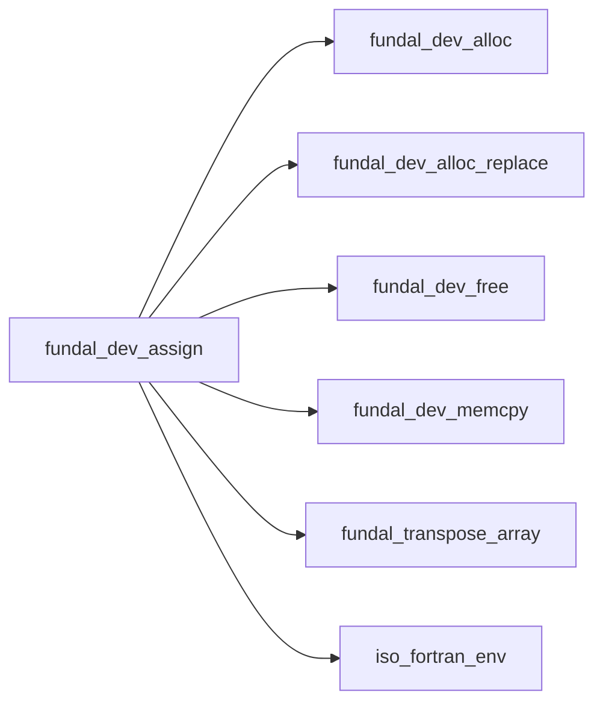
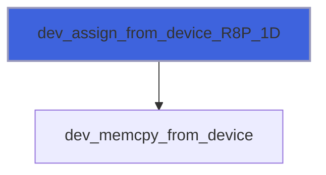
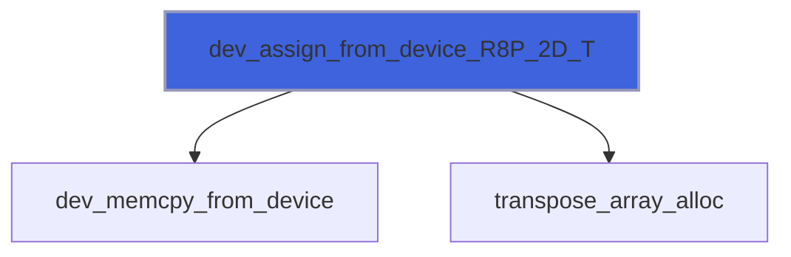
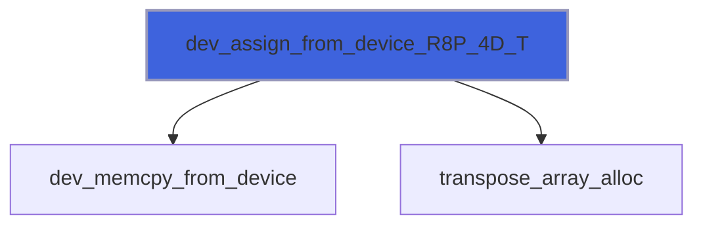
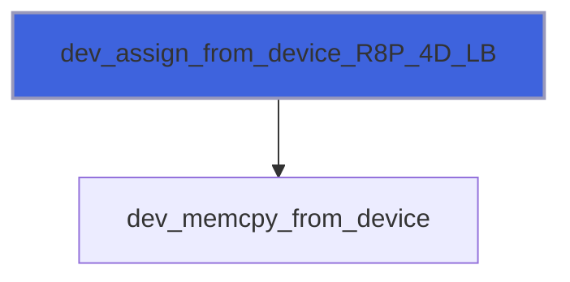

# fundal_dev_assign

> FUNDAL, memory assignment routines module.

**Source**: `src/lib/fundal_dev_assign.F90`

**Dependencies**


```mermaid
graph LR
  fundal_dev_assign["fundal_dev_assign"] --> fundal_dev_alloc["fundal_dev_alloc"]
  fundal_dev_assign["fundal_dev_assign"] --> fundal_dev_alloc_replace["fundal_dev_alloc_replace"]
  fundal_dev_assign["fundal_dev_assign"] --> fundal_dev_free["fundal_dev_free"]
  fundal_dev_assign["fundal_dev_assign"] --> fundal_dev_memcpy["fundal_dev_memcpy"]
  fundal_dev_assign["fundal_dev_assign"] --> fundal_transpose_array["fundal_transpose_array"]
  fundal_dev_assign["fundal_dev_assign"] --> iso_fortran_env["iso_fortran_env"]
```

## Contents

- [dev_assign_from_device](#dev-assign-from-device)
- [dev_assign_to_device](#dev-assign-to-device)
- [dev_assign_from_device_R8P_1D](#dev-assign-from-device-r8p-1d)
- [dev_assign_from_device_R8P_2D](#dev-assign-from-device-r8p-2d)
- [dev_assign_from_device_R8P_3D](#dev-assign-from-device-r8p-3d)
- [dev_assign_from_device_R8P_4D](#dev-assign-from-device-r8p-4d)
- [dev_assign_from_device_R8P_5D](#dev-assign-from-device-r8p-5d)
- [dev_assign_from_device_R8P_6D](#dev-assign-from-device-r8p-6d)
- [dev_assign_from_device_R8P_7D](#dev-assign-from-device-r8p-7d)
- [dev_assign_from_device_R8P_2D_T](#dev-assign-from-device-r8p-2d-t)
- [dev_assign_from_device_R8P_3D_T](#dev-assign-from-device-r8p-3d-t)
- [dev_assign_from_device_R8P_4D_T](#dev-assign-from-device-r8p-4d-t)
- [dev_assign_from_device_R8P_5D_T](#dev-assign-from-device-r8p-5d-t)
- [dev_assign_from_device_R8P_6D_T](#dev-assign-from-device-r8p-6d-t)
- [dev_assign_from_device_R8P_7D_T](#dev-assign-from-device-r8p-7d-t)
- [dev_assign_from_device_R8P_1D_LB](#dev-assign-from-device-r8p-1d-lb)
- [dev_assign_from_device_R8P_2D_LB](#dev-assign-from-device-r8p-2d-lb)
- [dev_assign_from_device_R8P_3D_LB](#dev-assign-from-device-r8p-3d-lb)
- [dev_assign_from_device_R8P_4D_LB](#dev-assign-from-device-r8p-4d-lb)
- [dev_assign_from_device_R8P_5D_LB](#dev-assign-from-device-r8p-5d-lb)
- [dev_assign_from_device_R8P_6D_LB](#dev-assign-from-device-r8p-6d-lb)
- [dev_assign_from_device_R8P_7D_LB](#dev-assign-from-device-r8p-7d-lb)
- [dev_assign_to_device_R8P_1D](#dev-assign-to-device-r8p-1d)
- [dev_assign_to_device_R8P_2D](#dev-assign-to-device-r8p-2d)
- [dev_assign_to_device_R8P_3D](#dev-assign-to-device-r8p-3d)
- [dev_assign_to_device_R8P_4D](#dev-assign-to-device-r8p-4d)
- [dev_assign_to_device_R8P_5D](#dev-assign-to-device-r8p-5d)
- [dev_assign_to_device_R8P_6D](#dev-assign-to-device-r8p-6d)
- [dev_assign_to_device_R8P_7D](#dev-assign-to-device-r8p-7d)
- [dev_assign_to_device_R8P_2D_T](#dev-assign-to-device-r8p-2d-t)
- [dev_assign_to_device_R8P_3D_T](#dev-assign-to-device-r8p-3d-t)
- [dev_assign_to_device_R8P_4D_T](#dev-assign-to-device-r8p-4d-t)
- [dev_assign_to_device_R8P_5D_T](#dev-assign-to-device-r8p-5d-t)
- [dev_assign_to_device_R8P_6D_T](#dev-assign-to-device-r8p-6d-t)
- [dev_assign_to_device_R8P_7D_T](#dev-assign-to-device-r8p-7d-t)
- [dev_assign_to_device_R8P_1D_LB](#dev-assign-to-device-r8p-1d-lb)
- [dev_assign_to_device_R8P_2D_LB](#dev-assign-to-device-r8p-2d-lb)
- [dev_assign_to_device_R8P_3D_LB](#dev-assign-to-device-r8p-3d-lb)
- [dev_assign_to_device_R8P_4D_LB](#dev-assign-to-device-r8p-4d-lb)
- [dev_assign_to_device_R8P_5D_LB](#dev-assign-to-device-r8p-5d-lb)
- [dev_assign_to_device_R8P_6D_LB](#dev-assign-to-device-r8p-6d-lb)
- [dev_assign_to_device_R8P_7D_LB](#dev-assign-to-device-r8p-7d-lb)
- [dev_assign_from_device_R4P_1D](#dev-assign-from-device-r4p-1d)
- [dev_assign_from_device_R4P_2D](#dev-assign-from-device-r4p-2d)
- [dev_assign_from_device_R4P_3D](#dev-assign-from-device-r4p-3d)
- [dev_assign_from_device_R4P_4D](#dev-assign-from-device-r4p-4d)
- [dev_assign_from_device_R4P_5D](#dev-assign-from-device-r4p-5d)
- [dev_assign_from_device_R4P_6D](#dev-assign-from-device-r4p-6d)
- [dev_assign_from_device_R4P_7D](#dev-assign-from-device-r4p-7d)
- [dev_assign_from_device_R4P_2D_T](#dev-assign-from-device-r4p-2d-t)
- [dev_assign_from_device_R4P_3D_T](#dev-assign-from-device-r4p-3d-t)
- [dev_assign_from_device_R4P_4D_T](#dev-assign-from-device-r4p-4d-t)
- [dev_assign_from_device_R4P_5D_T](#dev-assign-from-device-r4p-5d-t)
- [dev_assign_from_device_R4P_6D_T](#dev-assign-from-device-r4p-6d-t)
- [dev_assign_from_device_R4P_7D_T](#dev-assign-from-device-r4p-7d-t)
- [dev_assign_from_device_R4P_1D_LB](#dev-assign-from-device-r4p-1d-lb)
- [dev_assign_from_device_R4P_2D_LB](#dev-assign-from-device-r4p-2d-lb)
- [dev_assign_from_device_R4P_3D_LB](#dev-assign-from-device-r4p-3d-lb)
- [dev_assign_from_device_R4P_4D_LB](#dev-assign-from-device-r4p-4d-lb)
- [dev_assign_from_device_R4P_5D_LB](#dev-assign-from-device-r4p-5d-lb)
- [dev_assign_from_device_R4P_6D_LB](#dev-assign-from-device-r4p-6d-lb)
- [dev_assign_from_device_R4P_7D_LB](#dev-assign-from-device-r4p-7d-lb)
- [dev_assign_to_device_R4P_1D](#dev-assign-to-device-r4p-1d)
- [dev_assign_to_device_R4P_2D](#dev-assign-to-device-r4p-2d)
- [dev_assign_to_device_R4P_3D](#dev-assign-to-device-r4p-3d)
- [dev_assign_to_device_R4P_4D](#dev-assign-to-device-r4p-4d)
- [dev_assign_to_device_R4P_5D](#dev-assign-to-device-r4p-5d)
- [dev_assign_to_device_R4P_6D](#dev-assign-to-device-r4p-6d)
- [dev_assign_to_device_R4P_7D](#dev-assign-to-device-r4p-7d)
- [dev_assign_to_device_R4P_2D_T](#dev-assign-to-device-r4p-2d-t)
- [dev_assign_to_device_R4P_3D_T](#dev-assign-to-device-r4p-3d-t)
- [dev_assign_to_device_R4P_4D_T](#dev-assign-to-device-r4p-4d-t)
- [dev_assign_to_device_R4P_5D_T](#dev-assign-to-device-r4p-5d-t)
- [dev_assign_to_device_R4P_6D_T](#dev-assign-to-device-r4p-6d-t)
- [dev_assign_to_device_R4P_7D_T](#dev-assign-to-device-r4p-7d-t)
- [dev_assign_to_device_R4P_1D_LB](#dev-assign-to-device-r4p-1d-lb)
- [dev_assign_to_device_R4P_2D_LB](#dev-assign-to-device-r4p-2d-lb)
- [dev_assign_to_device_R4P_3D_LB](#dev-assign-to-device-r4p-3d-lb)
- [dev_assign_to_device_R4P_4D_LB](#dev-assign-to-device-r4p-4d-lb)
- [dev_assign_to_device_R4P_5D_LB](#dev-assign-to-device-r4p-5d-lb)
- [dev_assign_to_device_R4P_6D_LB](#dev-assign-to-device-r4p-6d-lb)
- [dev_assign_to_device_R4P_7D_LB](#dev-assign-to-device-r4p-7d-lb)
- [dev_assign_from_device_I8P_1D](#dev-assign-from-device-i8p-1d)
- [dev_assign_from_device_I8P_2D](#dev-assign-from-device-i8p-2d)
- [dev_assign_from_device_I8P_3D](#dev-assign-from-device-i8p-3d)
- [dev_assign_from_device_I8P_4D](#dev-assign-from-device-i8p-4d)
- [dev_assign_from_device_I8P_5D](#dev-assign-from-device-i8p-5d)
- [dev_assign_from_device_I8P_6D](#dev-assign-from-device-i8p-6d)
- [dev_assign_from_device_I8P_7D](#dev-assign-from-device-i8p-7d)
- [dev_assign_from_device_I8P_2D_T](#dev-assign-from-device-i8p-2d-t)
- [dev_assign_from_device_I8P_3D_T](#dev-assign-from-device-i8p-3d-t)
- [dev_assign_from_device_I8P_4D_T](#dev-assign-from-device-i8p-4d-t)
- [dev_assign_from_device_I8P_5D_T](#dev-assign-from-device-i8p-5d-t)
- [dev_assign_from_device_I8P_6D_T](#dev-assign-from-device-i8p-6d-t)
- [dev_assign_from_device_I8P_7D_T](#dev-assign-from-device-i8p-7d-t)
- [dev_assign_from_device_I8P_1D_LB](#dev-assign-from-device-i8p-1d-lb)
- [dev_assign_from_device_I8P_2D_LB](#dev-assign-from-device-i8p-2d-lb)
- [dev_assign_from_device_I8P_3D_LB](#dev-assign-from-device-i8p-3d-lb)
- [dev_assign_from_device_I8P_4D_LB](#dev-assign-from-device-i8p-4d-lb)
- [dev_assign_from_device_I8P_5D_LB](#dev-assign-from-device-i8p-5d-lb)
- [dev_assign_from_device_I8P_6D_LB](#dev-assign-from-device-i8p-6d-lb)
- [dev_assign_from_device_I8P_7D_LB](#dev-assign-from-device-i8p-7d-lb)
- [dev_assign_to_device_I8P_1D](#dev-assign-to-device-i8p-1d)
- [dev_assign_to_device_I8P_2D](#dev-assign-to-device-i8p-2d)
- [dev_assign_to_device_I8P_3D](#dev-assign-to-device-i8p-3d)
- [dev_assign_to_device_I8P_4D](#dev-assign-to-device-i8p-4d)
- [dev_assign_to_device_I8P_5D](#dev-assign-to-device-i8p-5d)
- [dev_assign_to_device_I8P_6D](#dev-assign-to-device-i8p-6d)
- [dev_assign_to_device_I8P_7D](#dev-assign-to-device-i8p-7d)
- [dev_assign_to_device_I8P_2D_T](#dev-assign-to-device-i8p-2d-t)
- [dev_assign_to_device_I8P_3D_T](#dev-assign-to-device-i8p-3d-t)
- [dev_assign_to_device_I8P_4D_T](#dev-assign-to-device-i8p-4d-t)
- [dev_assign_to_device_I8P_5D_T](#dev-assign-to-device-i8p-5d-t)
- [dev_assign_to_device_I8P_6D_T](#dev-assign-to-device-i8p-6d-t)
- [dev_assign_to_device_I8P_7D_T](#dev-assign-to-device-i8p-7d-t)
- [dev_assign_to_device_I8P_1D_LB](#dev-assign-to-device-i8p-1d-lb)
- [dev_assign_to_device_I8P_2D_LB](#dev-assign-to-device-i8p-2d-lb)
- [dev_assign_to_device_I8P_3D_LB](#dev-assign-to-device-i8p-3d-lb)
- [dev_assign_to_device_I8P_4D_LB](#dev-assign-to-device-i8p-4d-lb)
- [dev_assign_to_device_I8P_5D_LB](#dev-assign-to-device-i8p-5d-lb)
- [dev_assign_to_device_I8P_6D_LB](#dev-assign-to-device-i8p-6d-lb)
- [dev_assign_to_device_I8P_7D_LB](#dev-assign-to-device-i8p-7d-lb)
- [dev_assign_from_device_I4P_1D](#dev-assign-from-device-i4p-1d)
- [dev_assign_from_device_I4P_2D](#dev-assign-from-device-i4p-2d)
- [dev_assign_from_device_I4P_3D](#dev-assign-from-device-i4p-3d)
- [dev_assign_from_device_I4P_4D](#dev-assign-from-device-i4p-4d)
- [dev_assign_from_device_I4P_5D](#dev-assign-from-device-i4p-5d)
- [dev_assign_from_device_I4P_6D](#dev-assign-from-device-i4p-6d)
- [dev_assign_from_device_I4P_7D](#dev-assign-from-device-i4p-7d)
- [dev_assign_from_device_I4P_2D_T](#dev-assign-from-device-i4p-2d-t)
- [dev_assign_from_device_I4P_3D_T](#dev-assign-from-device-i4p-3d-t)
- [dev_assign_from_device_I4P_4D_T](#dev-assign-from-device-i4p-4d-t)
- [dev_assign_from_device_I4P_5D_T](#dev-assign-from-device-i4p-5d-t)
- [dev_assign_from_device_I4P_6D_T](#dev-assign-from-device-i4p-6d-t)
- [dev_assign_from_device_I4P_7D_T](#dev-assign-from-device-i4p-7d-t)
- [dev_assign_from_device_I4P_1D_LB](#dev-assign-from-device-i4p-1d-lb)
- [dev_assign_from_device_I4P_2D_LB](#dev-assign-from-device-i4p-2d-lb)
- [dev_assign_from_device_I4P_3D_LB](#dev-assign-from-device-i4p-3d-lb)
- [dev_assign_from_device_I4P_4D_LB](#dev-assign-from-device-i4p-4d-lb)
- [dev_assign_from_device_I4P_5D_LB](#dev-assign-from-device-i4p-5d-lb)
- [dev_assign_from_device_I4P_6D_LB](#dev-assign-from-device-i4p-6d-lb)
- [dev_assign_from_device_I4P_7D_LB](#dev-assign-from-device-i4p-7d-lb)
- [dev_assign_to_device_I4P_1D](#dev-assign-to-device-i4p-1d)
- [dev_assign_to_device_I4P_2D](#dev-assign-to-device-i4p-2d)
- [dev_assign_to_device_I4P_3D](#dev-assign-to-device-i4p-3d)
- [dev_assign_to_device_I4P_4D](#dev-assign-to-device-i4p-4d)
- [dev_assign_to_device_I4P_5D](#dev-assign-to-device-i4p-5d)
- [dev_assign_to_device_I4P_6D](#dev-assign-to-device-i4p-6d)
- [dev_assign_to_device_I4P_7D](#dev-assign-to-device-i4p-7d)
- [dev_assign_to_device_I4P_2D_T](#dev-assign-to-device-i4p-2d-t)
- [dev_assign_to_device_I4P_3D_T](#dev-assign-to-device-i4p-3d-t)
- [dev_assign_to_device_I4P_4D_T](#dev-assign-to-device-i4p-4d-t)
- [dev_assign_to_device_I4P_5D_T](#dev-assign-to-device-i4p-5d-t)
- [dev_assign_to_device_I4P_6D_T](#dev-assign-to-device-i4p-6d-t)
- [dev_assign_to_device_I4P_7D_T](#dev-assign-to-device-i4p-7d-t)
- [dev_assign_to_device_I4P_1D_LB](#dev-assign-to-device-i4p-1d-lb)
- [dev_assign_to_device_I4P_2D_LB](#dev-assign-to-device-i4p-2d-lb)
- [dev_assign_to_device_I4P_3D_LB](#dev-assign-to-device-i4p-3d-lb)
- [dev_assign_to_device_I4P_4D_LB](#dev-assign-to-device-i4p-4d-lb)
- [dev_assign_to_device_I4P_5D_LB](#dev-assign-to-device-i4p-5d-lb)
- [dev_assign_to_device_I4P_6D_LB](#dev-assign-to-device-i4p-6d-lb)
- [dev_assign_to_device_I4P_7D_LB](#dev-assign-to-device-i4p-7d-lb)
- [dev_assign_from_device_I2P_1D](#dev-assign-from-device-i2p-1d)
- [dev_assign_from_device_I2P_2D](#dev-assign-from-device-i2p-2d)
- [dev_assign_from_device_I2P_3D](#dev-assign-from-device-i2p-3d)
- [dev_assign_from_device_I2P_4D](#dev-assign-from-device-i2p-4d)
- [dev_assign_from_device_I2P_5D](#dev-assign-from-device-i2p-5d)
- [dev_assign_from_device_I2P_6D](#dev-assign-from-device-i2p-6d)
- [dev_assign_from_device_I2P_7D](#dev-assign-from-device-i2p-7d)
- [dev_assign_from_device_I2P_2D_T](#dev-assign-from-device-i2p-2d-t)
- [dev_assign_from_device_I2P_3D_T](#dev-assign-from-device-i2p-3d-t)
- [dev_assign_from_device_I2P_4D_T](#dev-assign-from-device-i2p-4d-t)
- [dev_assign_from_device_I2P_5D_T](#dev-assign-from-device-i2p-5d-t)
- [dev_assign_from_device_I2P_6D_T](#dev-assign-from-device-i2p-6d-t)
- [dev_assign_from_device_I2P_7D_T](#dev-assign-from-device-i2p-7d-t)
- [dev_assign_from_device_I2P_1D_LB](#dev-assign-from-device-i2p-1d-lb)
- [dev_assign_from_device_I2P_2D_LB](#dev-assign-from-device-i2p-2d-lb)
- [dev_assign_from_device_I2P_3D_LB](#dev-assign-from-device-i2p-3d-lb)
- [dev_assign_from_device_I2P_4D_LB](#dev-assign-from-device-i2p-4d-lb)
- [dev_assign_from_device_I2P_5D_LB](#dev-assign-from-device-i2p-5d-lb)
- [dev_assign_from_device_I2P_6D_LB](#dev-assign-from-device-i2p-6d-lb)
- [dev_assign_from_device_I2P_7D_LB](#dev-assign-from-device-i2p-7d-lb)
- [dev_assign_to_device_I2P_1D](#dev-assign-to-device-i2p-1d)
- [dev_assign_to_device_I2P_2D](#dev-assign-to-device-i2p-2d)
- [dev_assign_to_device_I2P_3D](#dev-assign-to-device-i2p-3d)
- [dev_assign_to_device_I2P_4D](#dev-assign-to-device-i2p-4d)
- [dev_assign_to_device_I2P_5D](#dev-assign-to-device-i2p-5d)
- [dev_assign_to_device_I2P_6D](#dev-assign-to-device-i2p-6d)
- [dev_assign_to_device_I2P_7D](#dev-assign-to-device-i2p-7d)
- [dev_assign_to_device_I2P_2D_T](#dev-assign-to-device-i2p-2d-t)
- [dev_assign_to_device_I2P_3D_T](#dev-assign-to-device-i2p-3d-t)
- [dev_assign_to_device_I2P_4D_T](#dev-assign-to-device-i2p-4d-t)
- [dev_assign_to_device_I2P_5D_T](#dev-assign-to-device-i2p-5d-t)
- [dev_assign_to_device_I2P_6D_T](#dev-assign-to-device-i2p-6d-t)
- [dev_assign_to_device_I2P_7D_T](#dev-assign-to-device-i2p-7d-t)
- [dev_assign_to_device_I2P_1D_LB](#dev-assign-to-device-i2p-1d-lb)
- [dev_assign_to_device_I2P_2D_LB](#dev-assign-to-device-i2p-2d-lb)
- [dev_assign_to_device_I2P_3D_LB](#dev-assign-to-device-i2p-3d-lb)
- [dev_assign_to_device_I2P_4D_LB](#dev-assign-to-device-i2p-4d-lb)
- [dev_assign_to_device_I2P_5D_LB](#dev-assign-to-device-i2p-5d-lb)
- [dev_assign_to_device_I2P_6D_LB](#dev-assign-to-device-i2p-6d-lb)
- [dev_assign_to_device_I2P_7D_LB](#dev-assign-to-device-i2p-7d-lb)
- [dev_assign_from_device_I1P_1D](#dev-assign-from-device-i1p-1d)
- [dev_assign_from_device_I1P_2D](#dev-assign-from-device-i1p-2d)
- [dev_assign_from_device_I1P_3D](#dev-assign-from-device-i1p-3d)
- [dev_assign_from_device_I1P_4D](#dev-assign-from-device-i1p-4d)
- [dev_assign_from_device_I1P_5D](#dev-assign-from-device-i1p-5d)
- [dev_assign_from_device_I1P_6D](#dev-assign-from-device-i1p-6d)
- [dev_assign_from_device_I1P_7D](#dev-assign-from-device-i1p-7d)
- [dev_assign_from_device_I1P_2D_T](#dev-assign-from-device-i1p-2d-t)
- [dev_assign_from_device_I1P_3D_T](#dev-assign-from-device-i1p-3d-t)
- [dev_assign_from_device_I1P_4D_T](#dev-assign-from-device-i1p-4d-t)
- [dev_assign_from_device_I1P_5D_T](#dev-assign-from-device-i1p-5d-t)
- [dev_assign_from_device_I1P_6D_T](#dev-assign-from-device-i1p-6d-t)
- [dev_assign_from_device_I1P_7D_T](#dev-assign-from-device-i1p-7d-t)
- [dev_assign_from_device_I1P_1D_LB](#dev-assign-from-device-i1p-1d-lb)
- [dev_assign_from_device_I1P_2D_LB](#dev-assign-from-device-i1p-2d-lb)
- [dev_assign_from_device_I1P_3D_LB](#dev-assign-from-device-i1p-3d-lb)
- [dev_assign_from_device_I1P_4D_LB](#dev-assign-from-device-i1p-4d-lb)
- [dev_assign_from_device_I1P_5D_LB](#dev-assign-from-device-i1p-5d-lb)
- [dev_assign_from_device_I1P_6D_LB](#dev-assign-from-device-i1p-6d-lb)
- [dev_assign_from_device_I1P_7D_LB](#dev-assign-from-device-i1p-7d-lb)
- [dev_assign_to_device_I1P_1D](#dev-assign-to-device-i1p-1d)
- [dev_assign_to_device_I1P_2D](#dev-assign-to-device-i1p-2d)
- [dev_assign_to_device_I1P_3D](#dev-assign-to-device-i1p-3d)
- [dev_assign_to_device_I1P_4D](#dev-assign-to-device-i1p-4d)
- [dev_assign_to_device_I1P_5D](#dev-assign-to-device-i1p-5d)
- [dev_assign_to_device_I1P_6D](#dev-assign-to-device-i1p-6d)
- [dev_assign_to_device_I1P_7D](#dev-assign-to-device-i1p-7d)
- [dev_assign_to_device_I1P_2D_T](#dev-assign-to-device-i1p-2d-t)
- [dev_assign_to_device_I1P_3D_T](#dev-assign-to-device-i1p-3d-t)
- [dev_assign_to_device_I1P_4D_T](#dev-assign-to-device-i1p-4d-t)
- [dev_assign_to_device_I1P_5D_T](#dev-assign-to-device-i1p-5d-t)
- [dev_assign_to_device_I1P_6D_T](#dev-assign-to-device-i1p-6d-t)
- [dev_assign_to_device_I1P_7D_T](#dev-assign-to-device-i1p-7d-t)
- [dev_assign_to_device_I1P_1D_LB](#dev-assign-to-device-i1p-1d-lb)
- [dev_assign_to_device_I1P_2D_LB](#dev-assign-to-device-i1p-2d-lb)
- [dev_assign_to_device_I1P_3D_LB](#dev-assign-to-device-i1p-3d-lb)
- [dev_assign_to_device_I1P_4D_LB](#dev-assign-to-device-i1p-4d-lb)
- [dev_assign_to_device_I1P_5D_LB](#dev-assign-to-device-i1p-5d-lb)
- [dev_assign_to_device_I1P_6D_LB](#dev-assign-to-device-i1p-6d-lb)
- [dev_assign_to_device_I1P_7D_LB](#dev-assign-to-device-i1p-7d-lb)

## Interfaces

### dev_assign_from_device

Allocate device memory.

**Module procedures**: [`dev_assign_from_device_R8P_1D`](/api/src/lib/fundal_dev_assign#dev-assign-from-device-r8p-1d), [`dev_assign_from_device_R8P_2D`](/api/src/lib/fundal_dev_assign#dev-assign-from-device-r8p-2d), [`dev_assign_from_device_R8P_3D`](/api/src/lib/fundal_dev_assign#dev-assign-from-device-r8p-3d), [`dev_assign_from_device_R8P_4D`](/api/src/lib/fundal_dev_assign#dev-assign-from-device-r8p-4d), [`dev_assign_from_device_R8P_5D`](/api/src/lib/fundal_dev_assign#dev-assign-from-device-r8p-5d), [`dev_assign_from_device_R8P_6D`](/api/src/lib/fundal_dev_assign#dev-assign-from-device-r8p-6d), [`dev_assign_from_device_R8P_7D`](/api/src/lib/fundal_dev_assign#dev-assign-from-device-r8p-7d), [`dev_assign_from_device_R4P_1D`](/api/src/lib/fundal_dev_assign#dev-assign-from-device-r4p-1d), [`dev_assign_from_device_R4P_2D`](/api/src/lib/fundal_dev_assign#dev-assign-from-device-r4p-2d), [`dev_assign_from_device_R4P_3D`](/api/src/lib/fundal_dev_assign#dev-assign-from-device-r4p-3d), [`dev_assign_from_device_R4P_4D`](/api/src/lib/fundal_dev_assign#dev-assign-from-device-r4p-4d), [`dev_assign_from_device_R4P_5D`](/api/src/lib/fundal_dev_assign#dev-assign-from-device-r4p-5d), [`dev_assign_from_device_R4P_6D`](/api/src/lib/fundal_dev_assign#dev-assign-from-device-r4p-6d), [`dev_assign_from_device_R4P_7D`](/api/src/lib/fundal_dev_assign#dev-assign-from-device-r4p-7d), [`dev_assign_from_device_I8P_1D`](/api/src/lib/fundal_dev_assign#dev-assign-from-device-i8p-1d), [`dev_assign_from_device_I8P_2D`](/api/src/lib/fundal_dev_assign#dev-assign-from-device-i8p-2d), [`dev_assign_from_device_I8P_3D`](/api/src/lib/fundal_dev_assign#dev-assign-from-device-i8p-3d), [`dev_assign_from_device_I8P_4D`](/api/src/lib/fundal_dev_assign#dev-assign-from-device-i8p-4d), [`dev_assign_from_device_I8P_5D`](/api/src/lib/fundal_dev_assign#dev-assign-from-device-i8p-5d), [`dev_assign_from_device_I8P_6D`](/api/src/lib/fundal_dev_assign#dev-assign-from-device-i8p-6d), [`dev_assign_from_device_I8P_7D`](/api/src/lib/fundal_dev_assign#dev-assign-from-device-i8p-7d), [`dev_assign_from_device_I4P_1D`](/api/src/lib/fundal_dev_assign#dev-assign-from-device-i4p-1d), [`dev_assign_from_device_I4P_2D`](/api/src/lib/fundal_dev_assign#dev-assign-from-device-i4p-2d), [`dev_assign_from_device_I4P_3D`](/api/src/lib/fundal_dev_assign#dev-assign-from-device-i4p-3d), [`dev_assign_from_device_I4P_4D`](/api/src/lib/fundal_dev_assign#dev-assign-from-device-i4p-4d), [`dev_assign_from_device_I4P_5D`](/api/src/lib/fundal_dev_assign#dev-assign-from-device-i4p-5d), [`dev_assign_from_device_I4P_6D`](/api/src/lib/fundal_dev_assign#dev-assign-from-device-i4p-6d), [`dev_assign_from_device_I4P_7D`](/api/src/lib/fundal_dev_assign#dev-assign-from-device-i4p-7d), [`dev_assign_from_device_I2P_1D`](/api/src/lib/fundal_dev_assign#dev-assign-from-device-i2p-1d), [`dev_assign_from_device_I2P_2D`](/api/src/lib/fundal_dev_assign#dev-assign-from-device-i2p-2d), [`dev_assign_from_device_I2P_3D`](/api/src/lib/fundal_dev_assign#dev-assign-from-device-i2p-3d), [`dev_assign_from_device_I2P_4D`](/api/src/lib/fundal_dev_assign#dev-assign-from-device-i2p-4d), [`dev_assign_from_device_I2P_5D`](/api/src/lib/fundal_dev_assign#dev-assign-from-device-i2p-5d), [`dev_assign_from_device_I2P_6D`](/api/src/lib/fundal_dev_assign#dev-assign-from-device-i2p-6d), [`dev_assign_from_device_I2P_7D`](/api/src/lib/fundal_dev_assign#dev-assign-from-device-i2p-7d), [`dev_assign_from_device_I1P_1D`](/api/src/lib/fundal_dev_assign#dev-assign-from-device-i1p-1d), [`dev_assign_from_device_I1P_2D`](/api/src/lib/fundal_dev_assign#dev-assign-from-device-i1p-2d), [`dev_assign_from_device_I1P_3D`](/api/src/lib/fundal_dev_assign#dev-assign-from-device-i1p-3d), [`dev_assign_from_device_I1P_4D`](/api/src/lib/fundal_dev_assign#dev-assign-from-device-i1p-4d), [`dev_assign_from_device_I1P_5D`](/api/src/lib/fundal_dev_assign#dev-assign-from-device-i1p-5d), [`dev_assign_from_device_I1P_6D`](/api/src/lib/fundal_dev_assign#dev-assign-from-device-i1p-6d), [`dev_assign_from_device_I1P_7D`](/api/src/lib/fundal_dev_assign#dev-assign-from-device-i1p-7d), [`dev_assign_from_device_R8P_2D_T`](/api/src/lib/fundal_dev_assign#dev-assign-from-device-r8p-2d-t), [`dev_assign_from_device_R8P_3D_T`](/api/src/lib/fundal_dev_assign#dev-assign-from-device-r8p-3d-t), [`dev_assign_from_device_R8P_4D_T`](/api/src/lib/fundal_dev_assign#dev-assign-from-device-r8p-4d-t), [`dev_assign_from_device_R8P_5D_T`](/api/src/lib/fundal_dev_assign#dev-assign-from-device-r8p-5d-t), [`dev_assign_from_device_R8P_6D_T`](/api/src/lib/fundal_dev_assign#dev-assign-from-device-r8p-6d-t), [`dev_assign_from_device_R8P_7D_T`](/api/src/lib/fundal_dev_assign#dev-assign-from-device-r8p-7d-t), [`dev_assign_from_device_R4P_2D_T`](/api/src/lib/fundal_dev_assign#dev-assign-from-device-r4p-2d-t), [`dev_assign_from_device_R4P_3D_T`](/api/src/lib/fundal_dev_assign#dev-assign-from-device-r4p-3d-t), [`dev_assign_from_device_R4P_4D_T`](/api/src/lib/fundal_dev_assign#dev-assign-from-device-r4p-4d-t), [`dev_assign_from_device_R4P_5D_T`](/api/src/lib/fundal_dev_assign#dev-assign-from-device-r4p-5d-t), [`dev_assign_from_device_R4P_6D_T`](/api/src/lib/fundal_dev_assign#dev-assign-from-device-r4p-6d-t), [`dev_assign_from_device_R4P_7D_T`](/api/src/lib/fundal_dev_assign#dev-assign-from-device-r4p-7d-t), [`dev_assign_from_device_I8P_2D_T`](/api/src/lib/fundal_dev_assign#dev-assign-from-device-i8p-2d-t), [`dev_assign_from_device_I8P_3D_T`](/api/src/lib/fundal_dev_assign#dev-assign-from-device-i8p-3d-t), [`dev_assign_from_device_I8P_4D_T`](/api/src/lib/fundal_dev_assign#dev-assign-from-device-i8p-4d-t), [`dev_assign_from_device_I8P_5D_T`](/api/src/lib/fundal_dev_assign#dev-assign-from-device-i8p-5d-t), [`dev_assign_from_device_I8P_6D_T`](/api/src/lib/fundal_dev_assign#dev-assign-from-device-i8p-6d-t), [`dev_assign_from_device_I8P_7D_T`](/api/src/lib/fundal_dev_assign#dev-assign-from-device-i8p-7d-t), [`dev_assign_from_device_I4P_2D_T`](/api/src/lib/fundal_dev_assign#dev-assign-from-device-i4p-2d-t), [`dev_assign_from_device_I4P_3D_T`](/api/src/lib/fundal_dev_assign#dev-assign-from-device-i4p-3d-t), [`dev_assign_from_device_I4P_4D_T`](/api/src/lib/fundal_dev_assign#dev-assign-from-device-i4p-4d-t), [`dev_assign_from_device_I4P_5D_T`](/api/src/lib/fundal_dev_assign#dev-assign-from-device-i4p-5d-t), [`dev_assign_from_device_I4P_6D_T`](/api/src/lib/fundal_dev_assign#dev-assign-from-device-i4p-6d-t), [`dev_assign_from_device_I4P_7D_T`](/api/src/lib/fundal_dev_assign#dev-assign-from-device-i4p-7d-t), [`dev_assign_from_device_I2P_2D_T`](/api/src/lib/fundal_dev_assign#dev-assign-from-device-i2p-2d-t), [`dev_assign_from_device_I2P_3D_T`](/api/src/lib/fundal_dev_assign#dev-assign-from-device-i2p-3d-t), [`dev_assign_from_device_I2P_4D_T`](/api/src/lib/fundal_dev_assign#dev-assign-from-device-i2p-4d-t), [`dev_assign_from_device_I2P_5D_T`](/api/src/lib/fundal_dev_assign#dev-assign-from-device-i2p-5d-t), [`dev_assign_from_device_I2P_6D_T`](/api/src/lib/fundal_dev_assign#dev-assign-from-device-i2p-6d-t), [`dev_assign_from_device_I2P_7D_T`](/api/src/lib/fundal_dev_assign#dev-assign-from-device-i2p-7d-t), [`dev_assign_from_device_I1P_2D_T`](/api/src/lib/fundal_dev_assign#dev-assign-from-device-i1p-2d-t), [`dev_assign_from_device_I1P_3D_T`](/api/src/lib/fundal_dev_assign#dev-assign-from-device-i1p-3d-t), [`dev_assign_from_device_I1P_4D_T`](/api/src/lib/fundal_dev_assign#dev-assign-from-device-i1p-4d-t), [`dev_assign_from_device_I1P_5D_T`](/api/src/lib/fundal_dev_assign#dev-assign-from-device-i1p-5d-t), [`dev_assign_from_device_I1P_6D_T`](/api/src/lib/fundal_dev_assign#dev-assign-from-device-i1p-6d-t), [`dev_assign_from_device_I1P_7D_T`](/api/src/lib/fundal_dev_assign#dev-assign-from-device-i1p-7d-t), [`dev_assign_from_device_R8P_1D_LB`](/api/src/lib/fundal_dev_assign#dev-assign-from-device-r8p-1d-lb), [`dev_assign_from_device_R8P_2D_LB`](/api/src/lib/fundal_dev_assign#dev-assign-from-device-r8p-2d-lb), [`dev_assign_from_device_R8P_3D_LB`](/api/src/lib/fundal_dev_assign#dev-assign-from-device-r8p-3d-lb), [`dev_assign_from_device_R8P_4D_LB`](/api/src/lib/fundal_dev_assign#dev-assign-from-device-r8p-4d-lb), [`dev_assign_from_device_R8P_5D_LB`](/api/src/lib/fundal_dev_assign#dev-assign-from-device-r8p-5d-lb), [`dev_assign_from_device_R8P_6D_LB`](/api/src/lib/fundal_dev_assign#dev-assign-from-device-r8p-6d-lb), [`dev_assign_from_device_R8P_7D_LB`](/api/src/lib/fundal_dev_assign#dev-assign-from-device-r8p-7d-lb), [`dev_assign_from_device_R4P_1D_LB`](/api/src/lib/fundal_dev_assign#dev-assign-from-device-r4p-1d-lb), [`dev_assign_from_device_R4P_2D_LB`](/api/src/lib/fundal_dev_assign#dev-assign-from-device-r4p-2d-lb), [`dev_assign_from_device_R4P_3D_LB`](/api/src/lib/fundal_dev_assign#dev-assign-from-device-r4p-3d-lb), [`dev_assign_from_device_R4P_4D_LB`](/api/src/lib/fundal_dev_assign#dev-assign-from-device-r4p-4d-lb), [`dev_assign_from_device_R4P_5D_LB`](/api/src/lib/fundal_dev_assign#dev-assign-from-device-r4p-5d-lb), [`dev_assign_from_device_R4P_6D_LB`](/api/src/lib/fundal_dev_assign#dev-assign-from-device-r4p-6d-lb), [`dev_assign_from_device_R4P_7D_LB`](/api/src/lib/fundal_dev_assign#dev-assign-from-device-r4p-7d-lb), [`dev_assign_from_device_I8P_1D_LB`](/api/src/lib/fundal_dev_assign#dev-assign-from-device-i8p-1d-lb), [`dev_assign_from_device_I8P_2D_LB`](/api/src/lib/fundal_dev_assign#dev-assign-from-device-i8p-2d-lb), [`dev_assign_from_device_I8P_3D_LB`](/api/src/lib/fundal_dev_assign#dev-assign-from-device-i8p-3d-lb), [`dev_assign_from_device_I8P_4D_LB`](/api/src/lib/fundal_dev_assign#dev-assign-from-device-i8p-4d-lb), [`dev_assign_from_device_I8P_5D_LB`](/api/src/lib/fundal_dev_assign#dev-assign-from-device-i8p-5d-lb), [`dev_assign_from_device_I8P_6D_LB`](/api/src/lib/fundal_dev_assign#dev-assign-from-device-i8p-6d-lb), [`dev_assign_from_device_I8P_7D_LB`](/api/src/lib/fundal_dev_assign#dev-assign-from-device-i8p-7d-lb), [`dev_assign_from_device_I4P_1D_LB`](/api/src/lib/fundal_dev_assign#dev-assign-from-device-i4p-1d-lb), [`dev_assign_from_device_I4P_2D_LB`](/api/src/lib/fundal_dev_assign#dev-assign-from-device-i4p-2d-lb), [`dev_assign_from_device_I4P_3D_LB`](/api/src/lib/fundal_dev_assign#dev-assign-from-device-i4p-3d-lb), [`dev_assign_from_device_I4P_4D_LB`](/api/src/lib/fundal_dev_assign#dev-assign-from-device-i4p-4d-lb), [`dev_assign_from_device_I4P_5D_LB`](/api/src/lib/fundal_dev_assign#dev-assign-from-device-i4p-5d-lb), [`dev_assign_from_device_I4P_6D_LB`](/api/src/lib/fundal_dev_assign#dev-assign-from-device-i4p-6d-lb), [`dev_assign_from_device_I4P_7D_LB`](/api/src/lib/fundal_dev_assign#dev-assign-from-device-i4p-7d-lb), [`dev_assign_from_device_I2P_1D_LB`](/api/src/lib/fundal_dev_assign#dev-assign-from-device-i2p-1d-lb), [`dev_assign_from_device_I2P_2D_LB`](/api/src/lib/fundal_dev_assign#dev-assign-from-device-i2p-2d-lb), [`dev_assign_from_device_I2P_3D_LB`](/api/src/lib/fundal_dev_assign#dev-assign-from-device-i2p-3d-lb), [`dev_assign_from_device_I2P_4D_LB`](/api/src/lib/fundal_dev_assign#dev-assign-from-device-i2p-4d-lb), [`dev_assign_from_device_I2P_5D_LB`](/api/src/lib/fundal_dev_assign#dev-assign-from-device-i2p-5d-lb), [`dev_assign_from_device_I2P_6D_LB`](/api/src/lib/fundal_dev_assign#dev-assign-from-device-i2p-6d-lb), [`dev_assign_from_device_I2P_7D_LB`](/api/src/lib/fundal_dev_assign#dev-assign-from-device-i2p-7d-lb), [`dev_assign_from_device_I1P_1D_LB`](/api/src/lib/fundal_dev_assign#dev-assign-from-device-i1p-1d-lb), [`dev_assign_from_device_I1P_2D_LB`](/api/src/lib/fundal_dev_assign#dev-assign-from-device-i1p-2d-lb), [`dev_assign_from_device_I1P_3D_LB`](/api/src/lib/fundal_dev_assign#dev-assign-from-device-i1p-3d-lb), [`dev_assign_from_device_I1P_4D_LB`](/api/src/lib/fundal_dev_assign#dev-assign-from-device-i1p-4d-lb), [`dev_assign_from_device_I1P_5D_LB`](/api/src/lib/fundal_dev_assign#dev-assign-from-device-i1p-5d-lb), [`dev_assign_from_device_I1P_6D_LB`](/api/src/lib/fundal_dev_assign#dev-assign-from-device-i1p-6d-lb), [`dev_assign_from_device_I1P_7D_LB`](/api/src/lib/fundal_dev_assign#dev-assign-from-device-i1p-7d-lb)

### dev_assign_to_device

Allocate device memory.

**Module procedures**: [`dev_assign_to_device_R8P_1D`](/api/src/lib/fundal_dev_assign#dev-assign-to-device-r8p-1d), [`dev_assign_to_device_R8P_2D`](/api/src/lib/fundal_dev_assign#dev-assign-to-device-r8p-2d), [`dev_assign_to_device_R8P_3D`](/api/src/lib/fundal_dev_assign#dev-assign-to-device-r8p-3d), [`dev_assign_to_device_R8P_4D`](/api/src/lib/fundal_dev_assign#dev-assign-to-device-r8p-4d), [`dev_assign_to_device_R8P_5D`](/api/src/lib/fundal_dev_assign#dev-assign-to-device-r8p-5d), [`dev_assign_to_device_R8P_6D`](/api/src/lib/fundal_dev_assign#dev-assign-to-device-r8p-6d), [`dev_assign_to_device_R8P_7D`](/api/src/lib/fundal_dev_assign#dev-assign-to-device-r8p-7d), [`dev_assign_to_device_R4P_1D`](/api/src/lib/fundal_dev_assign#dev-assign-to-device-r4p-1d), [`dev_assign_to_device_R4P_2D`](/api/src/lib/fundal_dev_assign#dev-assign-to-device-r4p-2d), [`dev_assign_to_device_R4P_3D`](/api/src/lib/fundal_dev_assign#dev-assign-to-device-r4p-3d), [`dev_assign_to_device_R4P_4D`](/api/src/lib/fundal_dev_assign#dev-assign-to-device-r4p-4d), [`dev_assign_to_device_R4P_5D`](/api/src/lib/fundal_dev_assign#dev-assign-to-device-r4p-5d), [`dev_assign_to_device_R4P_6D`](/api/src/lib/fundal_dev_assign#dev-assign-to-device-r4p-6d), [`dev_assign_to_device_R4P_7D`](/api/src/lib/fundal_dev_assign#dev-assign-to-device-r4p-7d), [`dev_assign_to_device_I8P_1D`](/api/src/lib/fundal_dev_assign#dev-assign-to-device-i8p-1d), [`dev_assign_to_device_I8P_2D`](/api/src/lib/fundal_dev_assign#dev-assign-to-device-i8p-2d), [`dev_assign_to_device_I8P_3D`](/api/src/lib/fundal_dev_assign#dev-assign-to-device-i8p-3d), [`dev_assign_to_device_I8P_4D`](/api/src/lib/fundal_dev_assign#dev-assign-to-device-i8p-4d), [`dev_assign_to_device_I8P_5D`](/api/src/lib/fundal_dev_assign#dev-assign-to-device-i8p-5d), [`dev_assign_to_device_I8P_6D`](/api/src/lib/fundal_dev_assign#dev-assign-to-device-i8p-6d), [`dev_assign_to_device_I8P_7D`](/api/src/lib/fundal_dev_assign#dev-assign-to-device-i8p-7d), [`dev_assign_to_device_I4P_1D`](/api/src/lib/fundal_dev_assign#dev-assign-to-device-i4p-1d), [`dev_assign_to_device_I4P_2D`](/api/src/lib/fundal_dev_assign#dev-assign-to-device-i4p-2d), [`dev_assign_to_device_I4P_3D`](/api/src/lib/fundal_dev_assign#dev-assign-to-device-i4p-3d), [`dev_assign_to_device_I4P_4D`](/api/src/lib/fundal_dev_assign#dev-assign-to-device-i4p-4d), [`dev_assign_to_device_I4P_5D`](/api/src/lib/fundal_dev_assign#dev-assign-to-device-i4p-5d), [`dev_assign_to_device_I4P_6D`](/api/src/lib/fundal_dev_assign#dev-assign-to-device-i4p-6d), [`dev_assign_to_device_I4P_7D`](/api/src/lib/fundal_dev_assign#dev-assign-to-device-i4p-7d), [`dev_assign_to_device_I2P_1D`](/api/src/lib/fundal_dev_assign#dev-assign-to-device-i2p-1d), [`dev_assign_to_device_I2P_2D`](/api/src/lib/fundal_dev_assign#dev-assign-to-device-i2p-2d), [`dev_assign_to_device_I2P_3D`](/api/src/lib/fundal_dev_assign#dev-assign-to-device-i2p-3d), [`dev_assign_to_device_I2P_4D`](/api/src/lib/fundal_dev_assign#dev-assign-to-device-i2p-4d), [`dev_assign_to_device_I2P_5D`](/api/src/lib/fundal_dev_assign#dev-assign-to-device-i2p-5d), [`dev_assign_to_device_I2P_6D`](/api/src/lib/fundal_dev_assign#dev-assign-to-device-i2p-6d), [`dev_assign_to_device_I2P_7D`](/api/src/lib/fundal_dev_assign#dev-assign-to-device-i2p-7d), [`dev_assign_to_device_I1P_1D`](/api/src/lib/fundal_dev_assign#dev-assign-to-device-i1p-1d), [`dev_assign_to_device_I1P_2D`](/api/src/lib/fundal_dev_assign#dev-assign-to-device-i1p-2d), [`dev_assign_to_device_I1P_3D`](/api/src/lib/fundal_dev_assign#dev-assign-to-device-i1p-3d), [`dev_assign_to_device_I1P_4D`](/api/src/lib/fundal_dev_assign#dev-assign-to-device-i1p-4d), [`dev_assign_to_device_I1P_5D`](/api/src/lib/fundal_dev_assign#dev-assign-to-device-i1p-5d), [`dev_assign_to_device_I1P_6D`](/api/src/lib/fundal_dev_assign#dev-assign-to-device-i1p-6d), [`dev_assign_to_device_I1P_7D`](/api/src/lib/fundal_dev_assign#dev-assign-to-device-i1p-7d), [`dev_assign_to_device_R8P_2D_T`](/api/src/lib/fundal_dev_assign#dev-assign-to-device-r8p-2d-t), [`dev_assign_to_device_R8P_3D_T`](/api/src/lib/fundal_dev_assign#dev-assign-to-device-r8p-3d-t), [`dev_assign_to_device_R8P_4D_T`](/api/src/lib/fundal_dev_assign#dev-assign-to-device-r8p-4d-t), [`dev_assign_to_device_R8P_5D_T`](/api/src/lib/fundal_dev_assign#dev-assign-to-device-r8p-5d-t), [`dev_assign_to_device_R8P_6D_T`](/api/src/lib/fundal_dev_assign#dev-assign-to-device-r8p-6d-t), [`dev_assign_to_device_R8P_7D_T`](/api/src/lib/fundal_dev_assign#dev-assign-to-device-r8p-7d-t), [`dev_assign_to_device_R4P_2D_T`](/api/src/lib/fundal_dev_assign#dev-assign-to-device-r4p-2d-t), [`dev_assign_to_device_R4P_3D_T`](/api/src/lib/fundal_dev_assign#dev-assign-to-device-r4p-3d-t), [`dev_assign_to_device_R4P_4D_T`](/api/src/lib/fundal_dev_assign#dev-assign-to-device-r4p-4d-t), [`dev_assign_to_device_R4P_5D_T`](/api/src/lib/fundal_dev_assign#dev-assign-to-device-r4p-5d-t), [`dev_assign_to_device_R4P_6D_T`](/api/src/lib/fundal_dev_assign#dev-assign-to-device-r4p-6d-t), [`dev_assign_to_device_R4P_7D_T`](/api/src/lib/fundal_dev_assign#dev-assign-to-device-r4p-7d-t), [`dev_assign_to_device_I8P_2D_T`](/api/src/lib/fundal_dev_assign#dev-assign-to-device-i8p-2d-t), [`dev_assign_to_device_I8P_3D_T`](/api/src/lib/fundal_dev_assign#dev-assign-to-device-i8p-3d-t), [`dev_assign_to_device_I8P_4D_T`](/api/src/lib/fundal_dev_assign#dev-assign-to-device-i8p-4d-t), [`dev_assign_to_device_I8P_5D_T`](/api/src/lib/fundal_dev_assign#dev-assign-to-device-i8p-5d-t), [`dev_assign_to_device_I8P_6D_T`](/api/src/lib/fundal_dev_assign#dev-assign-to-device-i8p-6d-t), [`dev_assign_to_device_I8P_7D_T`](/api/src/lib/fundal_dev_assign#dev-assign-to-device-i8p-7d-t), [`dev_assign_to_device_I4P_2D_T`](/api/src/lib/fundal_dev_assign#dev-assign-to-device-i4p-2d-t), [`dev_assign_to_device_I4P_3D_T`](/api/src/lib/fundal_dev_assign#dev-assign-to-device-i4p-3d-t), [`dev_assign_to_device_I4P_4D_T`](/api/src/lib/fundal_dev_assign#dev-assign-to-device-i4p-4d-t), [`dev_assign_to_device_I4P_5D_T`](/api/src/lib/fundal_dev_assign#dev-assign-to-device-i4p-5d-t), [`dev_assign_to_device_I4P_6D_T`](/api/src/lib/fundal_dev_assign#dev-assign-to-device-i4p-6d-t), [`dev_assign_to_device_I4P_7D_T`](/api/src/lib/fundal_dev_assign#dev-assign-to-device-i4p-7d-t), [`dev_assign_to_device_I2P_2D_T`](/api/src/lib/fundal_dev_assign#dev-assign-to-device-i2p-2d-t), [`dev_assign_to_device_I2P_3D_T`](/api/src/lib/fundal_dev_assign#dev-assign-to-device-i2p-3d-t), [`dev_assign_to_device_I2P_4D_T`](/api/src/lib/fundal_dev_assign#dev-assign-to-device-i2p-4d-t), [`dev_assign_to_device_I2P_5D_T`](/api/src/lib/fundal_dev_assign#dev-assign-to-device-i2p-5d-t), [`dev_assign_to_device_I2P_6D_T`](/api/src/lib/fundal_dev_assign#dev-assign-to-device-i2p-6d-t), [`dev_assign_to_device_I2P_7D_T`](/api/src/lib/fundal_dev_assign#dev-assign-to-device-i2p-7d-t), [`dev_assign_to_device_I1P_2D_T`](/api/src/lib/fundal_dev_assign#dev-assign-to-device-i1p-2d-t), [`dev_assign_to_device_I1P_3D_T`](/api/src/lib/fundal_dev_assign#dev-assign-to-device-i1p-3d-t), [`dev_assign_to_device_I1P_4D_T`](/api/src/lib/fundal_dev_assign#dev-assign-to-device-i1p-4d-t), [`dev_assign_to_device_I1P_5D_T`](/api/src/lib/fundal_dev_assign#dev-assign-to-device-i1p-5d-t), [`dev_assign_to_device_I1P_6D_T`](/api/src/lib/fundal_dev_assign#dev-assign-to-device-i1p-6d-t), [`dev_assign_to_device_I1P_7D_T`](/api/src/lib/fundal_dev_assign#dev-assign-to-device-i1p-7d-t), [`dev_assign_to_device_R8P_1D_LB`](/api/src/lib/fundal_dev_assign#dev-assign-to-device-r8p-1d-lb), [`dev_assign_to_device_R8P_2D_LB`](/api/src/lib/fundal_dev_assign#dev-assign-to-device-r8p-2d-lb), [`dev_assign_to_device_R8P_3D_LB`](/api/src/lib/fundal_dev_assign#dev-assign-to-device-r8p-3d-lb), [`dev_assign_to_device_R8P_4D_LB`](/api/src/lib/fundal_dev_assign#dev-assign-to-device-r8p-4d-lb), [`dev_assign_to_device_R8P_5D_LB`](/api/src/lib/fundal_dev_assign#dev-assign-to-device-r8p-5d-lb), [`dev_assign_to_device_R8P_6D_LB`](/api/src/lib/fundal_dev_assign#dev-assign-to-device-r8p-6d-lb), [`dev_assign_to_device_R8P_7D_LB`](/api/src/lib/fundal_dev_assign#dev-assign-to-device-r8p-7d-lb), [`dev_assign_to_device_R4P_1D_LB`](/api/src/lib/fundal_dev_assign#dev-assign-to-device-r4p-1d-lb), [`dev_assign_to_device_R4P_2D_LB`](/api/src/lib/fundal_dev_assign#dev-assign-to-device-r4p-2d-lb), [`dev_assign_to_device_R4P_3D_LB`](/api/src/lib/fundal_dev_assign#dev-assign-to-device-r4p-3d-lb), [`dev_assign_to_device_R4P_4D_LB`](/api/src/lib/fundal_dev_assign#dev-assign-to-device-r4p-4d-lb), [`dev_assign_to_device_R4P_5D_LB`](/api/src/lib/fundal_dev_assign#dev-assign-to-device-r4p-5d-lb), [`dev_assign_to_device_R4P_6D_LB`](/api/src/lib/fundal_dev_assign#dev-assign-to-device-r4p-6d-lb), [`dev_assign_to_device_R4P_7D_LB`](/api/src/lib/fundal_dev_assign#dev-assign-to-device-r4p-7d-lb), [`dev_assign_to_device_I8P_1D_LB`](/api/src/lib/fundal_dev_assign#dev-assign-to-device-i8p-1d-lb), [`dev_assign_to_device_I8P_2D_LB`](/api/src/lib/fundal_dev_assign#dev-assign-to-device-i8p-2d-lb), [`dev_assign_to_device_I8P_3D_LB`](/api/src/lib/fundal_dev_assign#dev-assign-to-device-i8p-3d-lb), [`dev_assign_to_device_I8P_4D_LB`](/api/src/lib/fundal_dev_assign#dev-assign-to-device-i8p-4d-lb), [`dev_assign_to_device_I8P_5D_LB`](/api/src/lib/fundal_dev_assign#dev-assign-to-device-i8p-5d-lb), [`dev_assign_to_device_I8P_6D_LB`](/api/src/lib/fundal_dev_assign#dev-assign-to-device-i8p-6d-lb), [`dev_assign_to_device_I8P_7D_LB`](/api/src/lib/fundal_dev_assign#dev-assign-to-device-i8p-7d-lb), [`dev_assign_to_device_I4P_1D_LB`](/api/src/lib/fundal_dev_assign#dev-assign-to-device-i4p-1d-lb), [`dev_assign_to_device_I4P_2D_LB`](/api/src/lib/fundal_dev_assign#dev-assign-to-device-i4p-2d-lb), [`dev_assign_to_device_I4P_3D_LB`](/api/src/lib/fundal_dev_assign#dev-assign-to-device-i4p-3d-lb), [`dev_assign_to_device_I4P_4D_LB`](/api/src/lib/fundal_dev_assign#dev-assign-to-device-i4p-4d-lb), [`dev_assign_to_device_I4P_5D_LB`](/api/src/lib/fundal_dev_assign#dev-assign-to-device-i4p-5d-lb), [`dev_assign_to_device_I4P_6D_LB`](/api/src/lib/fundal_dev_assign#dev-assign-to-device-i4p-6d-lb), [`dev_assign_to_device_I4P_7D_LB`](/api/src/lib/fundal_dev_assign#dev-assign-to-device-i4p-7d-lb), [`dev_assign_to_device_I2P_1D_LB`](/api/src/lib/fundal_dev_assign#dev-assign-to-device-i2p-1d-lb), [`dev_assign_to_device_I2P_2D_LB`](/api/src/lib/fundal_dev_assign#dev-assign-to-device-i2p-2d-lb), [`dev_assign_to_device_I2P_3D_LB`](/api/src/lib/fundal_dev_assign#dev-assign-to-device-i2p-3d-lb), [`dev_assign_to_device_I2P_4D_LB`](/api/src/lib/fundal_dev_assign#dev-assign-to-device-i2p-4d-lb), [`dev_assign_to_device_I2P_5D_LB`](/api/src/lib/fundal_dev_assign#dev-assign-to-device-i2p-5d-lb), [`dev_assign_to_device_I2P_6D_LB`](/api/src/lib/fundal_dev_assign#dev-assign-to-device-i2p-6d-lb), [`dev_assign_to_device_I2P_7D_LB`](/api/src/lib/fundal_dev_assign#dev-assign-to-device-i2p-7d-lb), [`dev_assign_to_device_I1P_1D_LB`](/api/src/lib/fundal_dev_assign#dev-assign-to-device-i1p-1d-lb), [`dev_assign_to_device_I1P_2D_LB`](/api/src/lib/fundal_dev_assign#dev-assign-to-device-i1p-2d-lb), [`dev_assign_to_device_I1P_3D_LB`](/api/src/lib/fundal_dev_assign#dev-assign-to-device-i1p-3d-lb), [`dev_assign_to_device_I1P_4D_LB`](/api/src/lib/fundal_dev_assign#dev-assign-to-device-i1p-4d-lb), [`dev_assign_to_device_I1P_5D_LB`](/api/src/lib/fundal_dev_assign#dev-assign-to-device-i1p-5d-lb), [`dev_assign_to_device_I1P_6D_LB`](/api/src/lib/fundal_dev_assign#dev-assign-to-device-i1p-6d-lb), [`dev_assign_to_device_I1P_7D_LB`](/api/src/lib/fundal_dev_assign#dev-assign-to-device-i1p-7d-lb)

## Subroutines

### dev_assign_from_device_R8P_1D

Assign array, R8P kind, rank 1.

```fortran
subroutine dev_assign_from_device_R8P_1D(dst, src)
```

**Arguments**

| Name | Type | Intent | Attributes | Description |
|------|------|--------|------------|-------------|
| `dst` | real(kind=R8P) | inout | allocatable | Assign memory. |
| `src` | real(kind=R8P) | in |  | Source memory. |

**Call graph**


```mermaid
flowchart TD
  dev_assign_from_device_R8P_1D["dev_assign_from_device_R8P_1D"] --> dev_memcpy_from_device["dev_memcpy_from_device"]
  style dev_assign_from_device_R8P_1D fill:#3e63dd,stroke:#99b,stroke-width:2px
```

### dev_assign_from_device_R8P_2D

Assign array, R8P kind, rank 2.

```fortran
subroutine dev_assign_from_device_R8P_2D(dst, src)
```

**Arguments**

| Name | Type | Intent | Attributes | Description |
|------|------|--------|------------|-------------|
| `dst` | real(kind=R8P) | inout | allocatable | Assign memory. |
| `src` | real(kind=R8P) | in |  | Source memory. |

**Call graph**


```mermaid
flowchart TD
  dev_assign_from_device_R8P_2D["dev_assign_from_device_R8P_2D"] --> dev_memcpy_from_device["dev_memcpy_from_device"]
  style dev_assign_from_device_R8P_2D fill:#3e63dd,stroke:#99b,stroke-width:2px
```

### dev_assign_from_device_R8P_3D

Assign array, R8P kind, rank 3.

```fortran
subroutine dev_assign_from_device_R8P_3D(dst, src)
```

**Arguments**

| Name | Type | Intent | Attributes | Description |
|------|------|--------|------------|-------------|
| `dst` | real(kind=R8P) | inout | allocatable | Assign memory. |
| `src` | real(kind=R8P) | in |  | Source memory. |

**Call graph**


```mermaid
flowchart TD
  dev_assign_from_device_R8P_3D["dev_assign_from_device_R8P_3D"] --> dev_memcpy_from_device["dev_memcpy_from_device"]
  style dev_assign_from_device_R8P_3D fill:#3e63dd,stroke:#99b,stroke-width:2px
```

### dev_assign_from_device_R8P_4D

Assign array, R8P kind, rank 4.

```fortran
subroutine dev_assign_from_device_R8P_4D(dst, src)
```

**Arguments**

| Name | Type | Intent | Attributes | Description |
|------|------|--------|------------|-------------|
| `dst` | real(kind=R8P) | inout | allocatable | Assign memory. |
| `src` | real(kind=R8P) | in |  | Source memory. |

**Call graph**


```mermaid
flowchart TD
  dev_assign_from_device_R8P_4D["dev_assign_from_device_R8P_4D"] --> dev_memcpy_from_device["dev_memcpy_from_device"]
  style dev_assign_from_device_R8P_4D fill:#3e63dd,stroke:#99b,stroke-width:2px
```

### dev_assign_from_device_R8P_5D

Assign array, R8P kind, rank 5.

```fortran
subroutine dev_assign_from_device_R8P_5D(dst, src)
```

**Arguments**

| Name | Type | Intent | Attributes | Description |
|------|------|--------|------------|-------------|
| `dst` | real(kind=R8P) | inout | allocatable | Assign memory. |
| `src` | real(kind=R8P) | in |  | Source memory. |

**Call graph**


```mermaid
flowchart TD
  dev_assign_from_device_R8P_5D["dev_assign_from_device_R8P_5D"] --> dev_memcpy_from_device["dev_memcpy_from_device"]
  style dev_assign_from_device_R8P_5D fill:#3e63dd,stroke:#99b,stroke-width:2px
```

### dev_assign_from_device_R8P_6D

Assign array, R8P kind, rank 6.

```fortran
subroutine dev_assign_from_device_R8P_6D(dst, src)
```

**Arguments**

| Name | Type | Intent | Attributes | Description |
|------|------|--------|------------|-------------|
| `dst` | real(kind=R8P) | inout | allocatable | Assign memory. |
| `src` | real(kind=R8P) | in |  | Source memory. |

**Call graph**


```mermaid
flowchart TD
  dev_assign_from_device_R8P_6D["dev_assign_from_device_R8P_6D"] --> dev_memcpy_from_device["dev_memcpy_from_device"]
  style dev_assign_from_device_R8P_6D fill:#3e63dd,stroke:#99b,stroke-width:2px
```

### dev_assign_from_device_R8P_7D

Assign array, R8P kind, rank 7.

```fortran
subroutine dev_assign_from_device_R8P_7D(dst, src)
```

**Arguments**

| Name | Type | Intent | Attributes | Description |
|------|------|--------|------------|-------------|
| `dst` | real(kind=R8P) | inout | allocatable | Assign memory. |
| `src` | real(kind=R8P) | in |  | Source memory. |

**Call graph**


```mermaid
flowchart TD
  dev_assign_from_device_R8P_7D["dev_assign_from_device_R8P_7D"] --> dev_memcpy_from_device["dev_memcpy_from_device"]
  style dev_assign_from_device_R8P_7D fill:#3e63dd,stroke:#99b,stroke-width:2px
```

### dev_assign_from_device_R8P_2D_T

Assign transposed array from device (kind R8P, rank 2), swapping index positions ij(1) and ij(2).

```fortran
subroutine dev_assign_from_device_R8P_2D_T(dst, src, ij)
```

**Arguments**

| Name | Type | Intent | Attributes | Description |
|------|------|--------|------------|-------------|
| `dst` | real(kind=R8P) | inout | allocatable | Transposed host destination. |
| `src` | real(kind=R8P) | in |  | Source device array. |
| `ij` | integer(kind=I4P) | in |  | 1-based index pair to swap. |

**Call graph**


```mermaid
flowchart TD
  dev_assign_from_device_R8P_2D_T["dev_assign_from_device_R8P_2D_T"] --> dev_memcpy_from_device["dev_memcpy_from_device"]
  dev_assign_from_device_R8P_2D_T["dev_assign_from_device_R8P_2D_T"] --> transpose_array_alloc["transpose_array_alloc"]
  style dev_assign_from_device_R8P_2D_T fill:#3e63dd,stroke:#99b,stroke-width:2px
```

### dev_assign_from_device_R8P_3D_T

Assign transposed array from device (kind R8P, rank 3), swapping index positions ij(1) and ij(2).

```fortran
subroutine dev_assign_from_device_R8P_3D_T(dst, src, ij)
```

**Arguments**

| Name | Type | Intent | Attributes | Description |
|------|------|--------|------------|-------------|
| `dst` | real(kind=R8P) | inout | allocatable | Transposed host destination. |
| `src` | real(kind=R8P) | in |  | Source device array. |
| `ij` | integer(kind=I4P) | in |  | 1-based index pair to swap. |

**Call graph**


```mermaid
flowchart TD
  dev_assign_from_device_R8P_3D_T["dev_assign_from_device_R8P_3D_T"] --> dev_memcpy_from_device["dev_memcpy_from_device"]
  dev_assign_from_device_R8P_3D_T["dev_assign_from_device_R8P_3D_T"] --> transpose_array_alloc["transpose_array_alloc"]
  style dev_assign_from_device_R8P_3D_T fill:#3e63dd,stroke:#99b,stroke-width:2px
```

### dev_assign_from_device_R8P_4D_T

Assign transposed array from device (kind R8P, rank 4), swapping index positions ij(1) and ij(2).

```fortran
subroutine dev_assign_from_device_R8P_4D_T(dst, src, ij)
```

**Arguments**

| Name | Type | Intent | Attributes | Description |
|------|------|--------|------------|-------------|
| `dst` | real(kind=R8P) | inout | allocatable | Transposed host destination. |
| `src` | real(kind=R8P) | in |  | Source device array. |
| `ij` | integer(kind=I4P) | in |  | 1-based index pair to swap. |

**Call graph**


```mermaid
flowchart TD
  dev_assign_from_device_R8P_4D_T["dev_assign_from_device_R8P_4D_T"] --> dev_memcpy_from_device["dev_memcpy_from_device"]
  dev_assign_from_device_R8P_4D_T["dev_assign_from_device_R8P_4D_T"] --> transpose_array_alloc["transpose_array_alloc"]
  style dev_assign_from_device_R8P_4D_T fill:#3e63dd,stroke:#99b,stroke-width:2px
```

### dev_assign_from_device_R8P_5D_T

Assign transposed array from device (kind R8P, rank 5), swapping index positions ij(1) and ij(2).

```fortran
subroutine dev_assign_from_device_R8P_5D_T(dst, src, ij)
```

**Arguments**

| Name | Type | Intent | Attributes | Description |
|------|------|--------|------------|-------------|
| `dst` | real(kind=R8P) | inout | allocatable | Transposed host destination. |
| `src` | real(kind=R8P) | in |  | Source device array. |
| `ij` | integer(kind=I4P) | in |  | 1-based index pair to swap. |

**Call graph**


```mermaid
flowchart TD
  dev_assign_from_device_R8P_5D_T["dev_assign_from_device_R8P_5D_T"] --> dev_memcpy_from_device["dev_memcpy_from_device"]
  dev_assign_from_device_R8P_5D_T["dev_assign_from_device_R8P_5D_T"] --> transpose_array_alloc["transpose_array_alloc"]
  style dev_assign_from_device_R8P_5D_T fill:#3e63dd,stroke:#99b,stroke-width:2px
```

### dev_assign_from_device_R8P_6D_T

Assign transposed array from device (kind R8P, rank 6), swapping index positions ij(1) and ij(2).

```fortran
subroutine dev_assign_from_device_R8P_6D_T(dst, src, ij)
```

**Arguments**

| Name | Type | Intent | Attributes | Description |
|------|------|--------|------------|-------------|
| `dst` | real(kind=R8P) | inout | allocatable | Transposed host destination. |
| `src` | real(kind=R8P) | in |  | Source device array. |
| `ij` | integer(kind=I4P) | in |  | 1-based index pair to swap. |

**Call graph**


```mermaid
flowchart TD
  dev_assign_from_device_R8P_6D_T["dev_assign_from_device_R8P_6D_T"] --> dev_memcpy_from_device["dev_memcpy_from_device"]
  dev_assign_from_device_R8P_6D_T["dev_assign_from_device_R8P_6D_T"] --> transpose_array_alloc["transpose_array_alloc"]
  style dev_assign_from_device_R8P_6D_T fill:#3e63dd,stroke:#99b,stroke-width:2px
```

### dev_assign_from_device_R8P_7D_T

Assign transposed array from device (kind R8P, rank 7), swapping index positions ij(1) and ij(2).

```fortran
subroutine dev_assign_from_device_R8P_7D_T(dst, src, ij)
```

**Arguments**

| Name | Type | Intent | Attributes | Description |
|------|------|--------|------------|-------------|
| `dst` | real(kind=R8P) | inout | allocatable | Transposed host destination. |
| `src` | real(kind=R8P) | in |  | Source device array. |
| `ij` | integer(kind=I4P) | in |  | 1-based index pair to swap. |

**Call graph**


```mermaid
flowchart TD
  dev_assign_from_device_R8P_7D_T["dev_assign_from_device_R8P_7D_T"] --> dev_memcpy_from_device["dev_memcpy_from_device"]
  dev_assign_from_device_R8P_7D_T["dev_assign_from_device_R8P_7D_T"] --> transpose_array_alloc["transpose_array_alloc"]
  style dev_assign_from_device_R8P_7D_T fill:#3e63dd,stroke:#99b,stroke-width:2px
```

### dev_assign_from_device_R8P_1D_LB

Assign array, R8P kind, rank 1, lower bound passed.

```fortran
subroutine dev_assign_from_device_R8P_1D_LB(lbounds, dst, src)
```

**Arguments**

| Name | Type | Intent | Attributes | Description |
|------|------|--------|------------|-------------|
| `lbounds` | integer(kind=I4P) | in |  | Array lower bounds, 1 if not passed. |
| `dst` | real(kind=R8P) | inout | allocatable | Assign memory. |
| `src` | real(kind=R8P) | in |  | Source memory. |

**Call graph**


```mermaid
flowchart TD
  dev_assign_from_device_R8P_1D_LB["dev_assign_from_device_R8P_1D_LB"] --> dev_memcpy_from_device["dev_memcpy_from_device"]
  style dev_assign_from_device_R8P_1D_LB fill:#3e63dd,stroke:#99b,stroke-width:2px
```

### dev_assign_from_device_R8P_2D_LB

Assign array, R8P kind, rank 2, lower bound passed.

```fortran
subroutine dev_assign_from_device_R8P_2D_LB(lbounds, dst, src)
```

**Arguments**

| Name | Type | Intent | Attributes | Description |
|------|------|--------|------------|-------------|
| `lbounds` | integer(kind=I4P) | in |  | Array lower bounds, 1 if not passed. |
| `dst` | real(kind=R8P) | inout | allocatable | Assign memory. |
| `src` | real(kind=R8P) | in |  | Source memory. |

**Call graph**


```mermaid
flowchart TD
  dev_assign_from_device_R8P_2D_LB["dev_assign_from_device_R8P_2D_LB"] --> dev_memcpy_from_device["dev_memcpy_from_device"]
  style dev_assign_from_device_R8P_2D_LB fill:#3e63dd,stroke:#99b,stroke-width:2px
```

### dev_assign_from_device_R8P_3D_LB

Assign array, R8P kind, rank 3, lower bound passed.

```fortran
subroutine dev_assign_from_device_R8P_3D_LB(lbounds, dst, src)
```

**Arguments**

| Name | Type | Intent | Attributes | Description |
|------|------|--------|------------|-------------|
| `lbounds` | integer(kind=I4P) | in |  | Array lower bounds, 1 if not passed. |
| `dst` | real(kind=R8P) | inout | allocatable | Assign memory. |
| `src` | real(kind=R8P) | in |  | Source memory. |

**Call graph**


```mermaid
flowchart TD
  dev_assign_from_device_R8P_3D_LB["dev_assign_from_device_R8P_3D_LB"] --> dev_memcpy_from_device["dev_memcpy_from_device"]
  style dev_assign_from_device_R8P_3D_LB fill:#3e63dd,stroke:#99b,stroke-width:2px
```

### dev_assign_from_device_R8P_4D_LB

Assign array, R8P kind, rank 4, lower bound passed.

```fortran
subroutine dev_assign_from_device_R8P_4D_LB(lbounds, dst, src)
```

**Arguments**

| Name | Type | Intent | Attributes | Description |
|------|------|--------|------------|-------------|
| `lbounds` | integer(kind=I4P) | in |  | Array lower bounds, 1 if not passed. |
| `dst` | real(kind=R8P) | inout | allocatable | Assign memory. |
| `src` | real(kind=R8P) | in |  | Source memory. |

**Call graph**


```mermaid
flowchart TD
  dev_assign_from_device_R8P_4D_LB["dev_assign_from_device_R8P_4D_LB"] --> dev_memcpy_from_device["dev_memcpy_from_device"]
  style dev_assign_from_device_R8P_4D_LB fill:#3e63dd,stroke:#99b,stroke-width:2px
```

### dev_assign_from_device_R8P_5D_LB

Assign array, R8P kind, rank 5, lower bound passed.

```fortran
subroutine dev_assign_from_device_R8P_5D_LB(lbounds, dst, src)
```

**Arguments**

| Name | Type | Intent | Attributes | Description |
|------|------|--------|------------|-------------|
| `lbounds` | integer(kind=I4P) | in |  | Array lower bounds, 1 if not passed. |
| `dst` | real(kind=R8P) | inout | allocatable | Assign memory. |
| `src` | real(kind=R8P) | in |  | Source memory. |

**Call graph**


```mermaid
flowchart TD
  dev_assign_from_device_R8P_5D_LB["dev_assign_from_device_R8P_5D_LB"] --> dev_memcpy_from_device["dev_memcpy_from_device"]
  style dev_assign_from_device_R8P_5D_LB fill:#3e63dd,stroke:#99b,stroke-width:2px
```

### dev_assign_from_device_R8P_6D_LB

Assign array, R8P kind, rank 6, lower bound passed.

```fortran
subroutine dev_assign_from_device_R8P_6D_LB(lbounds, dst, src)
```

**Arguments**

| Name | Type | Intent | Attributes | Description |
|------|------|--------|------------|-------------|
| `lbounds` | integer(kind=I4P) | in |  | Array lower bounds, 1 if not passed. |
| `dst` | real(kind=R8P) | inout | allocatable | Assign memory. |
| `src` | real(kind=R8P) | in |  | Source memory. |

**Call graph**


```mermaid
flowchart TD
  dev_assign_from_device_R8P_6D_LB["dev_assign_from_device_R8P_6D_LB"] --> dev_memcpy_from_device["dev_memcpy_from_device"]
  style dev_assign_from_device_R8P_6D_LB fill:#3e63dd,stroke:#99b,stroke-width:2px
```

### dev_assign_from_device_R8P_7D_LB

Assign array, R8P kind, rank 7, lower bound passed.

```fortran
subroutine dev_assign_from_device_R8P_7D_LB(lbounds, dst, src)
```

**Arguments**

| Name | Type | Intent | Attributes | Description |
|------|------|--------|------------|-------------|
| `lbounds` | integer(kind=I4P) | in |  | Array lower bounds, 1 if not passed. |
| `dst` | real(kind=R8P) | inout | allocatable | Assign memory. |
| `src` | real(kind=R8P) | in |  | Source memory. |

**Call graph**

```mermaid
flowchart TD
  dev_assign_from_device_R8P_7D_LB["dev_assign_from_device_R8P_7D_LB"] --> dev_memcpy_from_device["dev_memcpy_from_device"]
  style dev_assign_from_device_R8P_7D_LB fill:#3e63dd,stroke:#99b,stroke-width:2px
```

### dev_assign_to_device_R8P_1D

Assign array, R8P kind, rank 1.

```fortran
subroutine dev_assign_to_device_R8P_1D(dst, src, ierr)
```

**Arguments**

| Name | Type | Intent | Attributes | Description |
|------|------|--------|------------|-------------|
| `dst` | real(kind=R8P) | inout | pointer | Pointer to assign memory. |
| `src` | real(kind=R8P) | in |  | Source memory. |
| `ierr` | integer(kind=I4P) | out | optional | Error status. |

**Call graph**

```mermaid
flowchart TD
  dev_assign_to_device_R8P_1D["dev_assign_to_device_R8P_1D"] --> dev_alloc_replace["dev_alloc_replace"]
  dev_assign_to_device_R8P_1D["dev_assign_to_device_R8P_1D"] --> dev_memcpy_to_device["dev_memcpy_to_device"]
  style dev_assign_to_device_R8P_1D fill:#3e63dd,stroke:#99b,stroke-width:2px
```

### dev_assign_to_device_R8P_2D

Assign array, R8P kind, rank 2.

```fortran
subroutine dev_assign_to_device_R8P_2D(dst, src, ierr)
```

**Arguments**

| Name | Type | Intent | Attributes | Description |
|------|------|--------|------------|-------------|
| `dst` | real(kind=R8P) | inout | pointer | Pointer to assign memory. |
| `src` | real(kind=R8P) | in |  | Source memory. |
| `ierr` | integer(kind=I4P) | out | optional | Error status. |

**Call graph**

```mermaid
flowchart TD
  dev_assign_to_device_R8P_2D["dev_assign_to_device_R8P_2D"] --> dev_alloc_replace["dev_alloc_replace"]
  dev_assign_to_device_R8P_2D["dev_assign_to_device_R8P_2D"] --> dev_memcpy_to_device["dev_memcpy_to_device"]
  style dev_assign_to_device_R8P_2D fill:#3e63dd,stroke:#99b,stroke-width:2px
```

### dev_assign_to_device_R8P_3D

Assign array, R8P kind, rank 3.

```fortran
subroutine dev_assign_to_device_R8P_3D(dst, src, ierr)
```

**Arguments**

| Name | Type | Intent | Attributes | Description |
|------|------|--------|------------|-------------|
| `dst` | real(kind=R8P) | inout | pointer | Pointer to assign memory. |
| `src` | real(kind=R8P) | in |  | Source memory. |
| `ierr` | integer(kind=I4P) | out | optional | Error status. |

**Call graph**

```mermaid
flowchart TD
  dev_assign_to_device_R8P_3D["dev_assign_to_device_R8P_3D"] --> dev_alloc_replace["dev_alloc_replace"]
  dev_assign_to_device_R8P_3D["dev_assign_to_device_R8P_3D"] --> dev_memcpy_to_device["dev_memcpy_to_device"]
  style dev_assign_to_device_R8P_3D fill:#3e63dd,stroke:#99b,stroke-width:2px
```

### dev_assign_to_device_R8P_4D

Assign array, R8P kind, rank 4.

```fortran
subroutine dev_assign_to_device_R8P_4D(dst, src, ierr)
```

**Arguments**

| Name | Type | Intent | Attributes | Description |
|------|------|--------|------------|-------------|
| `dst` | real(kind=R8P) | inout | pointer | Pointer to assign memory. |
| `src` | real(kind=R8P) | in |  | Source memory. |
| `ierr` | integer(kind=I4P) | out | optional | Error status. |

**Call graph**

```mermaid
flowchart TD
  dev_assign_to_device_R8P_4D["dev_assign_to_device_R8P_4D"] --> dev_alloc_replace["dev_alloc_replace"]
  dev_assign_to_device_R8P_4D["dev_assign_to_device_R8P_4D"] --> dev_memcpy_to_device["dev_memcpy_to_device"]
  style dev_assign_to_device_R8P_4D fill:#3e63dd,stroke:#99b,stroke-width:2px
```

### dev_assign_to_device_R8P_5D

Assign array, R8P kind, rank 5.

```fortran
subroutine dev_assign_to_device_R8P_5D(dst, src, ierr)
```

**Arguments**

| Name | Type | Intent | Attributes | Description |
|------|------|--------|------------|-------------|
| `dst` | real(kind=R8P) | inout | pointer | Pointer to assign memory. |
| `src` | real(kind=R8P) | in |  | Source memory. |
| `ierr` | integer(kind=I4P) | out | optional | Error status. |

**Call graph**

```mermaid
flowchart TD
  dev_assign_to_device_R8P_5D["dev_assign_to_device_R8P_5D"] --> dev_alloc_replace["dev_alloc_replace"]
  dev_assign_to_device_R8P_5D["dev_assign_to_device_R8P_5D"] --> dev_memcpy_to_device["dev_memcpy_to_device"]
  style dev_assign_to_device_R8P_5D fill:#3e63dd,stroke:#99b,stroke-width:2px
```

### dev_assign_to_device_R8P_6D

Assign array, R8P kind, rank 6.

```fortran
subroutine dev_assign_to_device_R8P_6D(dst, src, ierr)
```

**Arguments**

| Name | Type | Intent | Attributes | Description |
|------|------|--------|------------|-------------|
| `dst` | real(kind=R8P) | inout | pointer | Pointer to assign memory. |
| `src` | real(kind=R8P) | in |  | Source memory. |
| `ierr` | integer(kind=I4P) | out | optional | Error status. |

**Call graph**

```mermaid
flowchart TD
  dev_assign_to_device_R8P_6D["dev_assign_to_device_R8P_6D"] --> dev_alloc_replace["dev_alloc_replace"]
  dev_assign_to_device_R8P_6D["dev_assign_to_device_R8P_6D"] --> dev_memcpy_to_device["dev_memcpy_to_device"]
  style dev_assign_to_device_R8P_6D fill:#3e63dd,stroke:#99b,stroke-width:2px
```

### dev_assign_to_device_R8P_7D

Assign array, R8P kind, rank 7.

```fortran
subroutine dev_assign_to_device_R8P_7D(dst, src, ierr)
```

**Arguments**

| Name | Type | Intent | Attributes | Description |
|------|------|--------|------------|-------------|
| `dst` | real(kind=R8P) | inout | pointer | Pointer to assign memory. |
| `src` | real(kind=R8P) | in |  | Source memory. |
| `ierr` | integer(kind=I4P) | out | optional | Error status. |

**Call graph**

```mermaid
flowchart TD
  dev_assign_to_device_R8P_7D["dev_assign_to_device_R8P_7D"] --> dev_alloc_replace["dev_alloc_replace"]
  dev_assign_to_device_R8P_7D["dev_assign_to_device_R8P_7D"] --> dev_memcpy_to_device["dev_memcpy_to_device"]
  style dev_assign_to_device_R8P_7D fill:#3e63dd,stroke:#99b,stroke-width:2px
```

### dev_assign_to_device_R8P_2D_T

Assign transposed array to device (kind R8P, rank 2), swapping index positions ij(1) and ij(2).

```fortran
subroutine dev_assign_to_device_R8P_2D_T(dst, src, ij, ierr)
```

**Arguments**

| Name | Type | Intent | Attributes | Description |
|------|------|--------|------------|-------------|
| `dst` | real(kind=R8P) | inout | pointer | Pointer to device memory. |
| `src` | real(kind=R8P) | in |  | Source host array. |
| `ij` | integer(kind=I4P) | in |  | 1-based index pair to swap (always [1,2] for rank 2). |
| `ierr` | integer(kind=I4P) | out | optional | Error status. |

**Call graph**

```mermaid
flowchart TD
  dev_assign_to_device_R8P_2D_T["dev_assign_to_device_R8P_2D_T"] --> dev_alloc_replace["dev_alloc_replace"]
  dev_assign_to_device_R8P_2D_T["dev_assign_to_device_R8P_2D_T"] --> dev_memcpy_to_device["dev_memcpy_to_device"]
  dev_assign_to_device_R8P_2D_T["dev_assign_to_device_R8P_2D_T"] --> transpose_array_alloc["transpose_array_alloc"]
  style dev_assign_to_device_R8P_2D_T fill:#3e63dd,stroke:#99b,stroke-width:2px
```

### dev_assign_to_device_R8P_3D_T

Assign transposed array to device (kind R8P, rank 3), swapping index positions ij(1) and ij(2).

```fortran
subroutine dev_assign_to_device_R8P_3D_T(dst, src, ij, ierr)
```

**Arguments**

| Name | Type | Intent | Attributes | Description |
|------|------|--------|------------|-------------|
| `dst` | real(kind=R8P) | inout | pointer | Pointer to device memory. |
| `src` | real(kind=R8P) | in |  | Source host array. |
| `ij` | integer(kind=I4P) | in |  | 1-based index pair to swap. |
| `ierr` | integer(kind=I4P) | out | optional | Error status. |

**Call graph**

```mermaid
flowchart TD
  dev_assign_to_device_R8P_3D_T["dev_assign_to_device_R8P_3D_T"] --> dev_alloc_replace["dev_alloc_replace"]
  dev_assign_to_device_R8P_3D_T["dev_assign_to_device_R8P_3D_T"] --> dev_memcpy_to_device["dev_memcpy_to_device"]
  dev_assign_to_device_R8P_3D_T["dev_assign_to_device_R8P_3D_T"] --> transpose_array_alloc["transpose_array_alloc"]
  style dev_assign_to_device_R8P_3D_T fill:#3e63dd,stroke:#99b,stroke-width:2px
```

### dev_assign_to_device_R8P_4D_T

Assign transposed array to device (kind R8P, rank 4), swapping index positions ij(1) and ij(2).

```fortran
subroutine dev_assign_to_device_R8P_4D_T(dst, src, ij, ierr)
```

**Arguments**

| Name | Type | Intent | Attributes | Description |
|------|------|--------|------------|-------------|
| `dst` | real(kind=R8P) | inout | pointer | Pointer to device memory. |
| `src` | real(kind=R8P) | in |  | Source host array. |
| `ij` | integer(kind=I4P) | in |  | 1-based index pair to swap. |
| `ierr` | integer(kind=I4P) | out | optional | Error status. |

**Call graph**

```mermaid
flowchart TD
  dev_assign_to_device_R8P_4D_T["dev_assign_to_device_R8P_4D_T"] --> dev_alloc_replace["dev_alloc_replace"]
  dev_assign_to_device_R8P_4D_T["dev_assign_to_device_R8P_4D_T"] --> dev_memcpy_to_device["dev_memcpy_to_device"]
  dev_assign_to_device_R8P_4D_T["dev_assign_to_device_R8P_4D_T"] --> transpose_array_alloc["transpose_array_alloc"]
  style dev_assign_to_device_R8P_4D_T fill:#3e63dd,stroke:#99b,stroke-width:2px
```

### dev_assign_to_device_R8P_5D_T

Assign transposed array to device (kind R8P, rank 5), swapping index positions ij(1) and ij(2).

```fortran
subroutine dev_assign_to_device_R8P_5D_T(dst, src, ij, ierr)
```

**Arguments**

| Name | Type | Intent | Attributes | Description |
|------|------|--------|------------|-------------|
| `dst` | real(kind=R8P) | inout | pointer | Pointer to device memory. |
| `src` | real(kind=R8P) | in |  | Source host array. |
| `ij` | integer(kind=I4P) | in |  | 1-based index pair to swap. |
| `ierr` | integer(kind=I4P) | out | optional | Error status. |

**Call graph**

```mermaid
flowchart TD
  dev_assign_to_device_R8P_5D_T["dev_assign_to_device_R8P_5D_T"] --> dev_alloc_replace["dev_alloc_replace"]
  dev_assign_to_device_R8P_5D_T["dev_assign_to_device_R8P_5D_T"] --> dev_memcpy_to_device["dev_memcpy_to_device"]
  dev_assign_to_device_R8P_5D_T["dev_assign_to_device_R8P_5D_T"] --> transpose_array_alloc["transpose_array_alloc"]
  style dev_assign_to_device_R8P_5D_T fill:#3e63dd,stroke:#99b,stroke-width:2px
```

### dev_assign_to_device_R8P_6D_T

Assign transposed array to device (kind R8P, rank 6), swapping index positions ij(1) and ij(2).

```fortran
subroutine dev_assign_to_device_R8P_6D_T(dst, src, ij, ierr)
```

**Arguments**

| Name | Type | Intent | Attributes | Description |
|------|------|--------|------------|-------------|
| `dst` | real(kind=R8P) | inout | pointer | Pointer to device memory. |
| `src` | real(kind=R8P) | in |  | Source host array. |
| `ij` | integer(kind=I4P) | in |  | 1-based index pair to swap. |
| `ierr` | integer(kind=I4P) | out | optional | Error status. |

**Call graph**

```mermaid
flowchart TD
  dev_assign_to_device_R8P_6D_T["dev_assign_to_device_R8P_6D_T"] --> dev_alloc_replace["dev_alloc_replace"]
  dev_assign_to_device_R8P_6D_T["dev_assign_to_device_R8P_6D_T"] --> dev_memcpy_to_device["dev_memcpy_to_device"]
  dev_assign_to_device_R8P_6D_T["dev_assign_to_device_R8P_6D_T"] --> transpose_array_alloc["transpose_array_alloc"]
  style dev_assign_to_device_R8P_6D_T fill:#3e63dd,stroke:#99b,stroke-width:2px
```

### dev_assign_to_device_R8P_7D_T

Assign transposed array to device (kind R8P, rank 7), swapping index positions ij(1) and ij(2).

```fortran
subroutine dev_assign_to_device_R8P_7D_T(dst, src, ij, ierr)
```

**Arguments**

| Name | Type | Intent | Attributes | Description |
|------|------|--------|------------|-------------|
| `dst` | real(kind=R8P) | inout | pointer | Pointer to device memory. |
| `src` | real(kind=R8P) | in |  | Source host array. |
| `ij` | integer(kind=I4P) | in |  | 1-based index pair to swap. |
| `ierr` | integer(kind=I4P) | out | optional | Error status. |

**Call graph**

```mermaid
flowchart TD
  dev_assign_to_device_R8P_7D_T["dev_assign_to_device_R8P_7D_T"] --> dev_alloc_replace["dev_alloc_replace"]
  dev_assign_to_device_R8P_7D_T["dev_assign_to_device_R8P_7D_T"] --> dev_memcpy_to_device["dev_memcpy_to_device"]
  dev_assign_to_device_R8P_7D_T["dev_assign_to_device_R8P_7D_T"] --> transpose_array_alloc["transpose_array_alloc"]
  style dev_assign_to_device_R8P_7D_T fill:#3e63dd,stroke:#99b,stroke-width:2px
```

### dev_assign_to_device_R8P_1D_LB

Assign array, R8P kind, rank 1, lower bound passed.

```fortran
subroutine dev_assign_to_device_R8P_1D_LB(lbounds, dst, src, ierr)
```

**Arguments**

| Name | Type | Intent | Attributes | Description |
|------|------|--------|------------|-------------|
| `lbounds` | integer(kind=I4P) | in |  | Array lower bounds, 1 if not passed. |
| `dst` | real(kind=R8P) | inout | pointer | Pointer to assign memory. |
| `src` | real(kind=R8P) | in |  | Source memory. |
| `ierr` | integer(kind=I4P) | out | optional | Error status. |

**Call graph**

```mermaid
flowchart TD
  dev_assign_to_device_R8P_1D_LB["dev_assign_to_device_R8P_1D_LB"] --> dev_alloc_replace["dev_alloc_replace"]
  dev_assign_to_device_R8P_1D_LB["dev_assign_to_device_R8P_1D_LB"] --> dev_memcpy_to_device["dev_memcpy_to_device"]
  style dev_assign_to_device_R8P_1D_LB fill:#3e63dd,stroke:#99b,stroke-width:2px
```

### dev_assign_to_device_R8P_2D_LB

Assign array, R8P kind, rank 2, lower bound passed.

```fortran
subroutine dev_assign_to_device_R8P_2D_LB(lbounds, dst, src, ierr)
```

**Arguments**

| Name | Type | Intent | Attributes | Description |
|------|------|--------|------------|-------------|
| `lbounds` | integer(kind=I4P) | in |  | Array lower bounds, 1 if not passed. |
| `dst` | real(kind=R8P) | inout | pointer | Pointer to assign memory. |
| `src` | real(kind=R8P) | in |  | Source memory. |
| `ierr` | integer(kind=I4P) | out | optional | Error status. |

**Call graph**

```mermaid
flowchart TD
  dev_assign_to_device_R8P_2D_LB["dev_assign_to_device_R8P_2D_LB"] --> dev_alloc_replace["dev_alloc_replace"]
  dev_assign_to_device_R8P_2D_LB["dev_assign_to_device_R8P_2D_LB"] --> dev_memcpy_to_device["dev_memcpy_to_device"]
  style dev_assign_to_device_R8P_2D_LB fill:#3e63dd,stroke:#99b,stroke-width:2px
```

### dev_assign_to_device_R8P_3D_LB

Assign array, R8P kind, rank 3, lower bound passed.

```fortran
subroutine dev_assign_to_device_R8P_3D_LB(lbounds, dst, src, ierr)
```

**Arguments**

| Name | Type | Intent | Attributes | Description |
|------|------|--------|------------|-------------|
| `lbounds` | integer(kind=I4P) | in |  | Array lower bounds, 1 if not passed. |
| `dst` | real(kind=R8P) | inout | pointer | Pointer to assign memory. |
| `src` | real(kind=R8P) | in |  | Source memory. |
| `ierr` | integer(kind=I4P) | out | optional | Error status. |

**Call graph**

```mermaid
flowchart TD
  dev_assign_to_device_R8P_3D_LB["dev_assign_to_device_R8P_3D_LB"] --> dev_alloc_replace["dev_alloc_replace"]
  dev_assign_to_device_R8P_3D_LB["dev_assign_to_device_R8P_3D_LB"] --> dev_memcpy_to_device["dev_memcpy_to_device"]
  style dev_assign_to_device_R8P_3D_LB fill:#3e63dd,stroke:#99b,stroke-width:2px
```

### dev_assign_to_device_R8P_4D_LB

Assign array, R8P kind, rank 4, lower bound passed.

```fortran
subroutine dev_assign_to_device_R8P_4D_LB(lbounds, dst, src, ierr)
```

**Arguments**

| Name | Type | Intent | Attributes | Description |
|------|------|--------|------------|-------------|
| `lbounds` | integer(kind=I4P) | in |  | Array lower bounds, 1 if not passed. |
| `dst` | real(kind=R8P) | inout | pointer | Pointer to assign memory. |
| `src` | real(kind=R8P) | in |  | Source memory. |
| `ierr` | integer(kind=I4P) | out | optional | Error status. |

**Call graph**

```mermaid
flowchart TD
  dev_assign_to_device_R8P_4D_LB["dev_assign_to_device_R8P_4D_LB"] --> dev_alloc_replace["dev_alloc_replace"]
  dev_assign_to_device_R8P_4D_LB["dev_assign_to_device_R8P_4D_LB"] --> dev_memcpy_to_device["dev_memcpy_to_device"]
  style dev_assign_to_device_R8P_4D_LB fill:#3e63dd,stroke:#99b,stroke-width:2px
```

### dev_assign_to_device_R8P_5D_LB

Assign array, R8P kind, rank 5, lower bound passed.

```fortran
subroutine dev_assign_to_device_R8P_5D_LB(lbounds, dst, src, ierr)
```

**Arguments**

| Name | Type | Intent | Attributes | Description |
|------|------|--------|------------|-------------|
| `lbounds` | integer(kind=I4P) | in |  | Array lower bounds, 1 if not passed. |
| `dst` | real(kind=R8P) | inout | pointer | Pointer to assign memory. |
| `src` | real(kind=R8P) | in |  | Source memory. |
| `ierr` | integer(kind=I4P) | out | optional | Error status. |

**Call graph**

```mermaid
flowchart TD
  dev_assign_to_device_R8P_5D_LB["dev_assign_to_device_R8P_5D_LB"] --> dev_alloc_replace["dev_alloc_replace"]
  dev_assign_to_device_R8P_5D_LB["dev_assign_to_device_R8P_5D_LB"] --> dev_memcpy_to_device["dev_memcpy_to_device"]
  style dev_assign_to_device_R8P_5D_LB fill:#3e63dd,stroke:#99b,stroke-width:2px
```

### dev_assign_to_device_R8P_6D_LB

Assign array, R8P kind, rank 6, lower bound passed.

```fortran
subroutine dev_assign_to_device_R8P_6D_LB(lbounds, dst, src, ierr)
```

**Arguments**

| Name | Type | Intent | Attributes | Description |
|------|------|--------|------------|-------------|
| `lbounds` | integer(kind=I4P) | in |  | Array lower bounds, 1 if not passed. |
| `dst` | real(kind=R8P) | inout | pointer | Pointer to assign memory. |
| `src` | real(kind=R8P) | in |  | Source memory. |
| `ierr` | integer(kind=I4P) | out | optional | Error status. |

**Call graph**

```mermaid
flowchart TD
  dev_assign_to_device_R8P_6D_LB["dev_assign_to_device_R8P_6D_LB"] --> dev_alloc_replace["dev_alloc_replace"]
  dev_assign_to_device_R8P_6D_LB["dev_assign_to_device_R8P_6D_LB"] --> dev_memcpy_to_device["dev_memcpy_to_device"]
  style dev_assign_to_device_R8P_6D_LB fill:#3e63dd,stroke:#99b,stroke-width:2px
```

### dev_assign_to_device_R8P_7D_LB

Assign array, R8P kind, rank 7, lower bound passed.

```fortran
subroutine dev_assign_to_device_R8P_7D_LB(lbounds, dst, src, ierr)
```

**Arguments**

| Name | Type | Intent | Attributes | Description |
|------|------|--------|------------|-------------|
| `lbounds` | integer(kind=I4P) | in |  | Array lower bounds, 1 if not passed. |
| `dst` | real(kind=R8P) | inout | pointer | Pointer to assign memory. |
| `src` | real(kind=R8P) | in |  | Source memory. |
| `ierr` | integer(kind=I4P) | out | optional | Error status. |

**Call graph**

```mermaid
flowchart TD
  dev_assign_to_device_R8P_7D_LB["dev_assign_to_device_R8P_7D_LB"] --> dev_alloc_replace["dev_alloc_replace"]
  dev_assign_to_device_R8P_7D_LB["dev_assign_to_device_R8P_7D_LB"] --> dev_memcpy_to_device["dev_memcpy_to_device"]
  style dev_assign_to_device_R8P_7D_LB fill:#3e63dd,stroke:#99b,stroke-width:2px
```

### dev_assign_from_device_R4P_1D

Assign array, R4P kind, rank 1.

```fortran
subroutine dev_assign_from_device_R4P_1D(dst, src)
```

**Arguments**

| Name | Type | Intent | Attributes | Description |
|------|------|--------|------------|-------------|
| `dst` | real(kind=R4P) | inout | allocatable | Assign memory. |
| `src` | real(kind=R4P) | in |  | Source memory. |

**Call graph**

```mermaid
flowchart TD
  dev_assign_from_device_R4P_1D["dev_assign_from_device_R4P_1D"] --> dev_memcpy_from_device["dev_memcpy_from_device"]
  style dev_assign_from_device_R4P_1D fill:#3e63dd,stroke:#99b,stroke-width:2px
```

### dev_assign_from_device_R4P_2D

Assign array, R4P kind, rank 2.

```fortran
subroutine dev_assign_from_device_R4P_2D(dst, src)
```

**Arguments**

| Name | Type | Intent | Attributes | Description |
|------|------|--------|------------|-------------|
| `dst` | real(kind=R4P) | inout | allocatable | Assign memory. |
| `src` | real(kind=R4P) | in |  | Source memory. |

**Call graph**

```mermaid
flowchart TD
  dev_assign_from_device_R4P_2D["dev_assign_from_device_R4P_2D"] --> dev_memcpy_from_device["dev_memcpy_from_device"]
  style dev_assign_from_device_R4P_2D fill:#3e63dd,stroke:#99b,stroke-width:2px
```

### dev_assign_from_device_R4P_3D

Assign array, R4P kind, rank 3.

```fortran
subroutine dev_assign_from_device_R4P_3D(dst, src)
```

**Arguments**

| Name | Type | Intent | Attributes | Description |
|------|------|--------|------------|-------------|
| `dst` | real(kind=R4P) | inout | allocatable | Assign memory. |
| `src` | real(kind=R4P) | in |  | Source memory. |

**Call graph**

```mermaid
flowchart TD
  dev_assign_from_device_R4P_3D["dev_assign_from_device_R4P_3D"] --> dev_memcpy_from_device["dev_memcpy_from_device"]
  style dev_assign_from_device_R4P_3D fill:#3e63dd,stroke:#99b,stroke-width:2px
```

### dev_assign_from_device_R4P_4D

Assign array, R4P kind, rank 4.

```fortran
subroutine dev_assign_from_device_R4P_4D(dst, src)
```

**Arguments**

| Name | Type | Intent | Attributes | Description |
|------|------|--------|------------|-------------|
| `dst` | real(kind=R4P) | inout | allocatable | Assign memory. |
| `src` | real(kind=R4P) | in |  | Source memory. |

**Call graph**

```mermaid
flowchart TD
  dev_assign_from_device_R4P_4D["dev_assign_from_device_R4P_4D"] --> dev_memcpy_from_device["dev_memcpy_from_device"]
  style dev_assign_from_device_R4P_4D fill:#3e63dd,stroke:#99b,stroke-width:2px
```

### dev_assign_from_device_R4P_5D

Assign array, R4P kind, rank 5.

```fortran
subroutine dev_assign_from_device_R4P_5D(dst, src)
```

**Arguments**

| Name | Type | Intent | Attributes | Description |
|------|------|--------|------------|-------------|
| `dst` | real(kind=R4P) | inout | allocatable | Assign memory. |
| `src` | real(kind=R4P) | in |  | Source memory. |

**Call graph**

```mermaid
flowchart TD
  dev_assign_from_device_R4P_5D["dev_assign_from_device_R4P_5D"] --> dev_memcpy_from_device["dev_memcpy_from_device"]
  style dev_assign_from_device_R4P_5D fill:#3e63dd,stroke:#99b,stroke-width:2px
```

### dev_assign_from_device_R4P_6D

Assign array, R4P kind, rank 6.

```fortran
subroutine dev_assign_from_device_R4P_6D(dst, src)
```

**Arguments**

| Name | Type | Intent | Attributes | Description |
|------|------|--------|------------|-------------|
| `dst` | real(kind=R4P) | inout | allocatable | Assign memory. |
| `src` | real(kind=R4P) | in |  | Source memory. |

**Call graph**

```mermaid
flowchart TD
  dev_assign_from_device_R4P_6D["dev_assign_from_device_R4P_6D"] --> dev_memcpy_from_device["dev_memcpy_from_device"]
  style dev_assign_from_device_R4P_6D fill:#3e63dd,stroke:#99b,stroke-width:2px
```

### dev_assign_from_device_R4P_7D

Assign array, R4P kind, rank 7.

```fortran
subroutine dev_assign_from_device_R4P_7D(dst, src)
```

**Arguments**

| Name | Type | Intent | Attributes | Description |
|------|------|--------|------------|-------------|
| `dst` | real(kind=R4P) | inout | allocatable | Assign memory. |
| `src` | real(kind=R4P) | in |  | Source memory. |

**Call graph**

```mermaid
flowchart TD
  dev_assign_from_device_R4P_7D["dev_assign_from_device_R4P_7D"] --> dev_memcpy_from_device["dev_memcpy_from_device"]
  style dev_assign_from_device_R4P_7D fill:#3e63dd,stroke:#99b,stroke-width:2px
```

### dev_assign_from_device_R4P_2D_T

Assign transposed array from device (kind R4P, rank 2), swapping index positions ij(1) and ij(2).

```fortran
subroutine dev_assign_from_device_R4P_2D_T(dst, src, ij)
```

**Arguments**

| Name | Type | Intent | Attributes | Description |
|------|------|--------|------------|-------------|
| `dst` | real(kind=R4P) | inout | allocatable | Transposed host destination. |
| `src` | real(kind=R4P) | in |  | Source device array. |
| `ij` | integer(kind=I4P) | in |  | 1-based index pair to swap. |

**Call graph**

```mermaid
flowchart TD
  dev_assign_from_device_R4P_2D_T["dev_assign_from_device_R4P_2D_T"] --> dev_memcpy_from_device["dev_memcpy_from_device"]
  dev_assign_from_device_R4P_2D_T["dev_assign_from_device_R4P_2D_T"] --> transpose_array_alloc["transpose_array_alloc"]
  style dev_assign_from_device_R4P_2D_T fill:#3e63dd,stroke:#99b,stroke-width:2px
```

### dev_assign_from_device_R4P_3D_T

Assign transposed array from device (kind R4P, rank 3), swapping index positions ij(1) and ij(2).

```fortran
subroutine dev_assign_from_device_R4P_3D_T(dst, src, ij)
```

**Arguments**

| Name | Type | Intent | Attributes | Description |
|------|------|--------|------------|-------------|
| `dst` | real(kind=R4P) | inout | allocatable | Transposed host destination. |
| `src` | real(kind=R4P) | in |  | Source device array. |
| `ij` | integer(kind=I4P) | in |  | 1-based index pair to swap. |

**Call graph**

```mermaid
flowchart TD
  dev_assign_from_device_R4P_3D_T["dev_assign_from_device_R4P_3D_T"] --> dev_memcpy_from_device["dev_memcpy_from_device"]
  dev_assign_from_device_R4P_3D_T["dev_assign_from_device_R4P_3D_T"] --> transpose_array_alloc["transpose_array_alloc"]
  style dev_assign_from_device_R4P_3D_T fill:#3e63dd,stroke:#99b,stroke-width:2px
```

### dev_assign_from_device_R4P_4D_T

Assign transposed array from device (kind R4P, rank 4), swapping index positions ij(1) and ij(2).

```fortran
subroutine dev_assign_from_device_R4P_4D_T(dst, src, ij)
```

**Arguments**

| Name | Type | Intent | Attributes | Description |
|------|------|--------|------------|-------------|
| `dst` | real(kind=R4P) | inout | allocatable | Transposed host destination. |
| `src` | real(kind=R4P) | in |  | Source device array. |
| `ij` | integer(kind=I4P) | in |  | 1-based index pair to swap. |

**Call graph**

```mermaid
flowchart TD
  dev_assign_from_device_R4P_4D_T["dev_assign_from_device_R4P_4D_T"] --> dev_memcpy_from_device["dev_memcpy_from_device"]
  dev_assign_from_device_R4P_4D_T["dev_assign_from_device_R4P_4D_T"] --> transpose_array_alloc["transpose_array_alloc"]
  style dev_assign_from_device_R4P_4D_T fill:#3e63dd,stroke:#99b,stroke-width:2px
```

### dev_assign_from_device_R4P_5D_T

Assign transposed array from device (kind R4P, rank 5), swapping index positions ij(1) and ij(2).

```fortran
subroutine dev_assign_from_device_R4P_5D_T(dst, src, ij)
```

**Arguments**

| Name | Type | Intent | Attributes | Description |
|------|------|--------|------------|-------------|
| `dst` | real(kind=R4P) | inout | allocatable | Transposed host destination. |
| `src` | real(kind=R4P) | in |  | Source device array. |
| `ij` | integer(kind=I4P) | in |  | 1-based index pair to swap. |

**Call graph**

```mermaid
flowchart TD
  dev_assign_from_device_R4P_5D_T["dev_assign_from_device_R4P_5D_T"] --> dev_memcpy_from_device["dev_memcpy_from_device"]
  dev_assign_from_device_R4P_5D_T["dev_assign_from_device_R4P_5D_T"] --> transpose_array_alloc["transpose_array_alloc"]
  style dev_assign_from_device_R4P_5D_T fill:#3e63dd,stroke:#99b,stroke-width:2px
```

### dev_assign_from_device_R4P_6D_T

Assign transposed array from device (kind R4P, rank 6), swapping index positions ij(1) and ij(2).

```fortran
subroutine dev_assign_from_device_R4P_6D_T(dst, src, ij)
```

**Arguments**

| Name | Type | Intent | Attributes | Description |
|------|------|--------|------------|-------------|
| `dst` | real(kind=R4P) | inout | allocatable | Transposed host destination. |
| `src` | real(kind=R4P) | in |  | Source device array. |
| `ij` | integer(kind=I4P) | in |  | 1-based index pair to swap. |

**Call graph**

```mermaid
flowchart TD
  dev_assign_from_device_R4P_6D_T["dev_assign_from_device_R4P_6D_T"] --> dev_memcpy_from_device["dev_memcpy_from_device"]
  dev_assign_from_device_R4P_6D_T["dev_assign_from_device_R4P_6D_T"] --> transpose_array_alloc["transpose_array_alloc"]
  style dev_assign_from_device_R4P_6D_T fill:#3e63dd,stroke:#99b,stroke-width:2px
```

### dev_assign_from_device_R4P_7D_T

Assign transposed array from device (kind R4P, rank 7), swapping index positions ij(1) and ij(2).

```fortran
subroutine dev_assign_from_device_R4P_7D_T(dst, src, ij)
```

**Arguments**

| Name | Type | Intent | Attributes | Description |
|------|------|--------|------------|-------------|
| `dst` | real(kind=R4P) | inout | allocatable | Transposed host destination. |
| `src` | real(kind=R4P) | in |  | Source device array. |
| `ij` | integer(kind=I4P) | in |  | 1-based index pair to swap. |

**Call graph**

```mermaid
flowchart TD
  dev_assign_from_device_R4P_7D_T["dev_assign_from_device_R4P_7D_T"] --> dev_memcpy_from_device["dev_memcpy_from_device"]
  dev_assign_from_device_R4P_7D_T["dev_assign_from_device_R4P_7D_T"] --> transpose_array_alloc["transpose_array_alloc"]
  style dev_assign_from_device_R4P_7D_T fill:#3e63dd,stroke:#99b,stroke-width:2px
```

### dev_assign_from_device_R4P_1D_LB

Assign array, R4P kind, rank 1, lower bound passed.

```fortran
subroutine dev_assign_from_device_R4P_1D_LB(lbounds, dst, src)
```

**Arguments**

| Name | Type | Intent | Attributes | Description |
|------|------|--------|------------|-------------|
| `lbounds` | integer(kind=I4P) | in |  | Array lower bounds, 1 if not passed. |
| `dst` | real(kind=R4P) | inout | allocatable | Assign memory. |
| `src` | real(kind=R4P) | in |  | Source memory. |

**Call graph**

```mermaid
flowchart TD
  dev_assign_from_device_R4P_1D_LB["dev_assign_from_device_R4P_1D_LB"] --> dev_memcpy_from_device["dev_memcpy_from_device"]
  style dev_assign_from_device_R4P_1D_LB fill:#3e63dd,stroke:#99b,stroke-width:2px
```

### dev_assign_from_device_R4P_2D_LB

Assign array, R4P kind, rank 2, lower bound passed.

```fortran
subroutine dev_assign_from_device_R4P_2D_LB(lbounds, dst, src)
```

**Arguments**

| Name | Type | Intent | Attributes | Description |
|------|------|--------|------------|-------------|
| `lbounds` | integer(kind=I4P) | in |  | Array lower bounds, 1 if not passed. |
| `dst` | real(kind=R4P) | inout | allocatable | Assign memory. |
| `src` | real(kind=R4P) | in |  | Source memory. |

**Call graph**

```mermaid
flowchart TD
  dev_assign_from_device_R4P_2D_LB["dev_assign_from_device_R4P_2D_LB"] --> dev_memcpy_from_device["dev_memcpy_from_device"]
  style dev_assign_from_device_R4P_2D_LB fill:#3e63dd,stroke:#99b,stroke-width:2px
```

### dev_assign_from_device_R4P_3D_LB

Assign array, R4P kind, rank 3, lower bound passed.

```fortran
subroutine dev_assign_from_device_R4P_3D_LB(lbounds, dst, src)
```

**Arguments**

| Name | Type | Intent | Attributes | Description |
|------|------|--------|------------|-------------|
| `lbounds` | integer(kind=I4P) | in |  | Array lower bounds, 1 if not passed. |
| `dst` | real(kind=R4P) | inout | allocatable | Assign memory. |
| `src` | real(kind=R4P) | in |  | Source memory. |

**Call graph**

```mermaid
flowchart TD
  dev_assign_from_device_R4P_3D_LB["dev_assign_from_device_R4P_3D_LB"] --> dev_memcpy_from_device["dev_memcpy_from_device"]
  style dev_assign_from_device_R4P_3D_LB fill:#3e63dd,stroke:#99b,stroke-width:2px
```

### dev_assign_from_device_R4P_4D_LB

Assign array, R4P kind, rank 4, lower bound passed.

```fortran
subroutine dev_assign_from_device_R4P_4D_LB(lbounds, dst, src)
```

**Arguments**

| Name | Type | Intent | Attributes | Description |
|------|------|--------|------------|-------------|
| `lbounds` | integer(kind=I4P) | in |  | Array lower bounds, 1 if not passed. |
| `dst` | real(kind=R4P) | inout | allocatable | Assign memory. |
| `src` | real(kind=R4P) | in |  | Source memory. |

**Call graph**

```mermaid
flowchart TD
  dev_assign_from_device_R4P_4D_LB["dev_assign_from_device_R4P_4D_LB"] --> dev_memcpy_from_device["dev_memcpy_from_device"]
  style dev_assign_from_device_R4P_4D_LB fill:#3e63dd,stroke:#99b,stroke-width:2px
```

### dev_assign_from_device_R4P_5D_LB

Assign array, R4P kind, rank 5, lower bound passed.

```fortran
subroutine dev_assign_from_device_R4P_5D_LB(lbounds, dst, src)
```

**Arguments**

| Name | Type | Intent | Attributes | Description |
|------|------|--------|------------|-------------|
| `lbounds` | integer(kind=I4P) | in |  | Array lower bounds, 1 if not passed. |
| `dst` | real(kind=R4P) | inout | allocatable | Assign memory. |
| `src` | real(kind=R4P) | in |  | Source memory. |

**Call graph**

```mermaid
flowchart TD
  dev_assign_from_device_R4P_5D_LB["dev_assign_from_device_R4P_5D_LB"] --> dev_memcpy_from_device["dev_memcpy_from_device"]
  style dev_assign_from_device_R4P_5D_LB fill:#3e63dd,stroke:#99b,stroke-width:2px
```

### dev_assign_from_device_R4P_6D_LB

Assign array, R4P kind, rank 6, lower bound passed.

```fortran
subroutine dev_assign_from_device_R4P_6D_LB(lbounds, dst, src)
```

**Arguments**

| Name | Type | Intent | Attributes | Description |
|------|------|--------|------------|-------------|
| `lbounds` | integer(kind=I4P) | in |  | Array lower bounds, 1 if not passed. |
| `dst` | real(kind=R4P) | inout | allocatable | Assign memory. |
| `src` | real(kind=R4P) | in |  | Source memory. |

**Call graph**

```mermaid
flowchart TD
  dev_assign_from_device_R4P_6D_LB["dev_assign_from_device_R4P_6D_LB"] --> dev_memcpy_from_device["dev_memcpy_from_device"]
  style dev_assign_from_device_R4P_6D_LB fill:#3e63dd,stroke:#99b,stroke-width:2px
```

### dev_assign_from_device_R4P_7D_LB

Assign array, R4P kind, rank 7, lower bound passed.

```fortran
subroutine dev_assign_from_device_R4P_7D_LB(lbounds, dst, src)
```

**Arguments**

| Name | Type | Intent | Attributes | Description |
|------|------|--------|------------|-------------|
| `lbounds` | integer(kind=I4P) | in |  | Array lower bounds, 1 if not passed. |
| `dst` | real(kind=R4P) | inout | allocatable | Assign memory. |
| `src` | real(kind=R4P) | in |  | Source memory. |

**Call graph**

```mermaid
flowchart TD
  dev_assign_from_device_R4P_7D_LB["dev_assign_from_device_R4P_7D_LB"] --> dev_memcpy_from_device["dev_memcpy_from_device"]
  style dev_assign_from_device_R4P_7D_LB fill:#3e63dd,stroke:#99b,stroke-width:2px
```

### dev_assign_to_device_R4P_1D

Assign array, R4P kind, rank 1.

```fortran
subroutine dev_assign_to_device_R4P_1D(dst, src, ierr)
```

**Arguments**

| Name | Type | Intent | Attributes | Description |
|------|------|--------|------------|-------------|
| `dst` | real(kind=R4P) | inout | pointer | Pointer to assign memory. |
| `src` | real(kind=R4P) | in |  | Source memory. |
| `ierr` | integer(kind=I4P) | out | optional | Error status. |

**Call graph**

```mermaid
flowchart TD
  dev_assign_to_device_R4P_1D["dev_assign_to_device_R4P_1D"] --> dev_alloc_replace["dev_alloc_replace"]
  dev_assign_to_device_R4P_1D["dev_assign_to_device_R4P_1D"] --> dev_memcpy_to_device["dev_memcpy_to_device"]
  style dev_assign_to_device_R4P_1D fill:#3e63dd,stroke:#99b,stroke-width:2px
```

### dev_assign_to_device_R4P_2D

Assign array, R4P kind, rank 2.

```fortran
subroutine dev_assign_to_device_R4P_2D(dst, src, ierr)
```

**Arguments**

| Name | Type | Intent | Attributes | Description |
|------|------|--------|------------|-------------|
| `dst` | real(kind=R4P) | inout | pointer | Pointer to assign memory. |
| `src` | real(kind=R4P) | in |  | Source memory. |
| `ierr` | integer(kind=I4P) | out | optional | Error status. |

**Call graph**

```mermaid
flowchart TD
  dev_assign_to_device_R4P_2D["dev_assign_to_device_R4P_2D"] --> dev_alloc_replace["dev_alloc_replace"]
  dev_assign_to_device_R4P_2D["dev_assign_to_device_R4P_2D"] --> dev_memcpy_to_device["dev_memcpy_to_device"]
  style dev_assign_to_device_R4P_2D fill:#3e63dd,stroke:#99b,stroke-width:2px
```

### dev_assign_to_device_R4P_3D

Assign array, R4P kind, rank 3.

```fortran
subroutine dev_assign_to_device_R4P_3D(dst, src, ierr)
```

**Arguments**

| Name | Type | Intent | Attributes | Description |
|------|------|--------|------------|-------------|
| `dst` | real(kind=R4P) | inout | pointer | Pointer to assign memory. |
| `src` | real(kind=R4P) | in |  | Source memory. |
| `ierr` | integer(kind=I4P) | out | optional | Error status. |

**Call graph**

```mermaid
flowchart TD
  dev_assign_to_device_R4P_3D["dev_assign_to_device_R4P_3D"] --> dev_alloc_replace["dev_alloc_replace"]
  dev_assign_to_device_R4P_3D["dev_assign_to_device_R4P_3D"] --> dev_memcpy_to_device["dev_memcpy_to_device"]
  style dev_assign_to_device_R4P_3D fill:#3e63dd,stroke:#99b,stroke-width:2px
```

### dev_assign_to_device_R4P_4D

Assign array, R4P kind, rank 4.

```fortran
subroutine dev_assign_to_device_R4P_4D(dst, src, ierr)
```

**Arguments**

| Name | Type | Intent | Attributes | Description |
|------|------|--------|------------|-------------|
| `dst` | real(kind=R4P) | inout | pointer | Pointer to assign memory. |
| `src` | real(kind=R4P) | in |  | Source memory. |
| `ierr` | integer(kind=I4P) | out | optional | Error status. |

**Call graph**

```mermaid
flowchart TD
  dev_assign_to_device_R4P_4D["dev_assign_to_device_R4P_4D"] --> dev_alloc_replace["dev_alloc_replace"]
  dev_assign_to_device_R4P_4D["dev_assign_to_device_R4P_4D"] --> dev_memcpy_to_device["dev_memcpy_to_device"]
  style dev_assign_to_device_R4P_4D fill:#3e63dd,stroke:#99b,stroke-width:2px
```

### dev_assign_to_device_R4P_5D

Assign array, R4P kind, rank 5.

```fortran
subroutine dev_assign_to_device_R4P_5D(dst, src, ierr)
```

**Arguments**

| Name | Type | Intent | Attributes | Description |
|------|------|--------|------------|-------------|
| `dst` | real(kind=R4P) | inout | pointer | Pointer to assign memory. |
| `src` | real(kind=R4P) | in |  | Source memory. |
| `ierr` | integer(kind=I4P) | out | optional | Error status. |

**Call graph**

```mermaid
flowchart TD
  dev_assign_to_device_R4P_5D["dev_assign_to_device_R4P_5D"] --> dev_alloc_replace["dev_alloc_replace"]
  dev_assign_to_device_R4P_5D["dev_assign_to_device_R4P_5D"] --> dev_memcpy_to_device["dev_memcpy_to_device"]
  style dev_assign_to_device_R4P_5D fill:#3e63dd,stroke:#99b,stroke-width:2px
```

### dev_assign_to_device_R4P_6D

Assign array, R4P kind, rank 6.

```fortran
subroutine dev_assign_to_device_R4P_6D(dst, src, ierr)
```

**Arguments**

| Name | Type | Intent | Attributes | Description |
|------|------|--------|------------|-------------|
| `dst` | real(kind=R4P) | inout | pointer | Pointer to assign memory. |
| `src` | real(kind=R4P) | in |  | Source memory. |
| `ierr` | integer(kind=I4P) | out | optional | Error status. |

**Call graph**

```mermaid
flowchart TD
  dev_assign_to_device_R4P_6D["dev_assign_to_device_R4P_6D"] --> dev_alloc_replace["dev_alloc_replace"]
  dev_assign_to_device_R4P_6D["dev_assign_to_device_R4P_6D"] --> dev_memcpy_to_device["dev_memcpy_to_device"]
  style dev_assign_to_device_R4P_6D fill:#3e63dd,stroke:#99b,stroke-width:2px
```

### dev_assign_to_device_R4P_7D

Assign array, R4P kind, rank 7.

```fortran
subroutine dev_assign_to_device_R4P_7D(dst, src, ierr)
```

**Arguments**

| Name | Type | Intent | Attributes | Description |
|------|------|--------|------------|-------------|
| `dst` | real(kind=R4P) | inout | pointer | Pointer to assign memory. |
| `src` | real(kind=R4P) | in |  | Source memory. |
| `ierr` | integer(kind=I4P) | out | optional | Error status. |

**Call graph**

```mermaid
flowchart TD
  dev_assign_to_device_R4P_7D["dev_assign_to_device_R4P_7D"] --> dev_alloc_replace["dev_alloc_replace"]
  dev_assign_to_device_R4P_7D["dev_assign_to_device_R4P_7D"] --> dev_memcpy_to_device["dev_memcpy_to_device"]
  style dev_assign_to_device_R4P_7D fill:#3e63dd,stroke:#99b,stroke-width:2px
```

### dev_assign_to_device_R4P_2D_T

Assign transposed array to device (kind R4P, rank 2), swapping index positions ij(1) and ij(2).

```fortran
subroutine dev_assign_to_device_R4P_2D_T(dst, src, ij, ierr)
```

**Arguments**

| Name | Type | Intent | Attributes | Description |
|------|------|--------|------------|-------------|
| `dst` | real(kind=R4P) | inout | pointer | Pointer to device memory. |
| `src` | real(kind=R4P) | in |  | Source host array. |
| `ij` | integer(kind=I4P) | in |  | 1-based index pair to swap (always [1,2] for rank 2). |
| `ierr` | integer(kind=I4P) | out | optional | Error status. |

**Call graph**

```mermaid
flowchart TD
  dev_assign_to_device_R4P_2D_T["dev_assign_to_device_R4P_2D_T"] --> dev_alloc_replace["dev_alloc_replace"]
  dev_assign_to_device_R4P_2D_T["dev_assign_to_device_R4P_2D_T"] --> dev_memcpy_to_device["dev_memcpy_to_device"]
  dev_assign_to_device_R4P_2D_T["dev_assign_to_device_R4P_2D_T"] --> transpose_array_alloc["transpose_array_alloc"]
  style dev_assign_to_device_R4P_2D_T fill:#3e63dd,stroke:#99b,stroke-width:2px
```

### dev_assign_to_device_R4P_3D_T

Assign transposed array to device (kind R4P, rank 3), swapping index positions ij(1) and ij(2).

```fortran
subroutine dev_assign_to_device_R4P_3D_T(dst, src, ij, ierr)
```

**Arguments**

| Name | Type | Intent | Attributes | Description |
|------|------|--------|------------|-------------|
| `dst` | real(kind=R4P) | inout | pointer | Pointer to device memory. |
| `src` | real(kind=R4P) | in |  | Source host array. |
| `ij` | integer(kind=I4P) | in |  | 1-based index pair to swap. |
| `ierr` | integer(kind=I4P) | out | optional | Error status. |

**Call graph**

```mermaid
flowchart TD
  dev_assign_to_device_R4P_3D_T["dev_assign_to_device_R4P_3D_T"] --> dev_alloc_replace["dev_alloc_replace"]
  dev_assign_to_device_R4P_3D_T["dev_assign_to_device_R4P_3D_T"] --> dev_memcpy_to_device["dev_memcpy_to_device"]
  dev_assign_to_device_R4P_3D_T["dev_assign_to_device_R4P_3D_T"] --> transpose_array_alloc["transpose_array_alloc"]
  style dev_assign_to_device_R4P_3D_T fill:#3e63dd,stroke:#99b,stroke-width:2px
```

### dev_assign_to_device_R4P_4D_T

Assign transposed array to device (kind R4P, rank 4), swapping index positions ij(1) and ij(2).

```fortran
subroutine dev_assign_to_device_R4P_4D_T(dst, src, ij, ierr)
```

**Arguments**

| Name | Type | Intent | Attributes | Description |
|------|------|--------|------------|-------------|
| `dst` | real(kind=R4P) | inout | pointer | Pointer to device memory. |
| `src` | real(kind=R4P) | in |  | Source host array. |
| `ij` | integer(kind=I4P) | in |  | 1-based index pair to swap. |
| `ierr` | integer(kind=I4P) | out | optional | Error status. |

**Call graph**

```mermaid
flowchart TD
  dev_assign_to_device_R4P_4D_T["dev_assign_to_device_R4P_4D_T"] --> dev_alloc_replace["dev_alloc_replace"]
  dev_assign_to_device_R4P_4D_T["dev_assign_to_device_R4P_4D_T"] --> dev_memcpy_to_device["dev_memcpy_to_device"]
  dev_assign_to_device_R4P_4D_T["dev_assign_to_device_R4P_4D_T"] --> transpose_array_alloc["transpose_array_alloc"]
  style dev_assign_to_device_R4P_4D_T fill:#3e63dd,stroke:#99b,stroke-width:2px
```

### dev_assign_to_device_R4P_5D_T

Assign transposed array to device (kind R4P, rank 5), swapping index positions ij(1) and ij(2).

```fortran
subroutine dev_assign_to_device_R4P_5D_T(dst, src, ij, ierr)
```

**Arguments**

| Name | Type | Intent | Attributes | Description |
|------|------|--------|------------|-------------|
| `dst` | real(kind=R4P) | inout | pointer | Pointer to device memory. |
| `src` | real(kind=R4P) | in |  | Source host array. |
| `ij` | integer(kind=I4P) | in |  | 1-based index pair to swap. |
| `ierr` | integer(kind=I4P) | out | optional | Error status. |

**Call graph**

```mermaid
flowchart TD
  dev_assign_to_device_R4P_5D_T["dev_assign_to_device_R4P_5D_T"] --> dev_alloc_replace["dev_alloc_replace"]
  dev_assign_to_device_R4P_5D_T["dev_assign_to_device_R4P_5D_T"] --> dev_memcpy_to_device["dev_memcpy_to_device"]
  dev_assign_to_device_R4P_5D_T["dev_assign_to_device_R4P_5D_T"] --> transpose_array_alloc["transpose_array_alloc"]
  style dev_assign_to_device_R4P_5D_T fill:#3e63dd,stroke:#99b,stroke-width:2px
```

### dev_assign_to_device_R4P_6D_T

Assign transposed array to device (kind R4P, rank 6), swapping index positions ij(1) and ij(2).

```fortran
subroutine dev_assign_to_device_R4P_6D_T(dst, src, ij, ierr)
```

**Arguments**

| Name | Type | Intent | Attributes | Description |
|------|------|--------|------------|-------------|
| `dst` | real(kind=R4P) | inout | pointer | Pointer to device memory. |
| `src` | real(kind=R4P) | in |  | Source host array. |
| `ij` | integer(kind=I4P) | in |  | 1-based index pair to swap. |
| `ierr` | integer(kind=I4P) | out | optional | Error status. |

**Call graph**

```mermaid
flowchart TD
  dev_assign_to_device_R4P_6D_T["dev_assign_to_device_R4P_6D_T"] --> dev_alloc_replace["dev_alloc_replace"]
  dev_assign_to_device_R4P_6D_T["dev_assign_to_device_R4P_6D_T"] --> dev_memcpy_to_device["dev_memcpy_to_device"]
  dev_assign_to_device_R4P_6D_T["dev_assign_to_device_R4P_6D_T"] --> transpose_array_alloc["transpose_array_alloc"]
  style dev_assign_to_device_R4P_6D_T fill:#3e63dd,stroke:#99b,stroke-width:2px
```

### dev_assign_to_device_R4P_7D_T

Assign transposed array to device (kind R4P, rank 7), swapping index positions ij(1) and ij(2).

```fortran
subroutine dev_assign_to_device_R4P_7D_T(dst, src, ij, ierr)
```

**Arguments**

| Name | Type | Intent | Attributes | Description |
|------|------|--------|------------|-------------|
| `dst` | real(kind=R4P) | inout | pointer | Pointer to device memory. |
| `src` | real(kind=R4P) | in |  | Source host array. |
| `ij` | integer(kind=I4P) | in |  | 1-based index pair to swap. |
| `ierr` | integer(kind=I4P) | out | optional | Error status. |

**Call graph**

```mermaid
flowchart TD
  dev_assign_to_device_R4P_7D_T["dev_assign_to_device_R4P_7D_T"] --> dev_alloc_replace["dev_alloc_replace"]
  dev_assign_to_device_R4P_7D_T["dev_assign_to_device_R4P_7D_T"] --> dev_memcpy_to_device["dev_memcpy_to_device"]
  dev_assign_to_device_R4P_7D_T["dev_assign_to_device_R4P_7D_T"] --> transpose_array_alloc["transpose_array_alloc"]
  style dev_assign_to_device_R4P_7D_T fill:#3e63dd,stroke:#99b,stroke-width:2px
```

### dev_assign_to_device_R4P_1D_LB

Assign array, R4P kind, rank 1, lower bound passed.

```fortran
subroutine dev_assign_to_device_R4P_1D_LB(lbounds, dst, src, ierr)
```

**Arguments**

| Name | Type | Intent | Attributes | Description |
|------|------|--------|------------|-------------|
| `lbounds` | integer(kind=I4P) | in |  | Array lower bounds, 1 if not passed. |
| `dst` | real(kind=R4P) | inout | pointer | Pointer to assign memory. |
| `src` | real(kind=R4P) | in |  | Source memory. |
| `ierr` | integer(kind=I4P) | out | optional | Error status. |

**Call graph**

```mermaid
flowchart TD
  dev_assign_to_device_R4P_1D_LB["dev_assign_to_device_R4P_1D_LB"] --> dev_alloc_replace["dev_alloc_replace"]
  dev_assign_to_device_R4P_1D_LB["dev_assign_to_device_R4P_1D_LB"] --> dev_memcpy_to_device["dev_memcpy_to_device"]
  style dev_assign_to_device_R4P_1D_LB fill:#3e63dd,stroke:#99b,stroke-width:2px
```

### dev_assign_to_device_R4P_2D_LB

Assign array, R4P kind, rank 2, lower bound passed.

```fortran
subroutine dev_assign_to_device_R4P_2D_LB(lbounds, dst, src, ierr)
```

**Arguments**

| Name | Type | Intent | Attributes | Description |
|------|------|--------|------------|-------------|
| `lbounds` | integer(kind=I4P) | in |  | Array lower bounds, 1 if not passed. |
| `dst` | real(kind=R4P) | inout | pointer | Pointer to assign memory. |
| `src` | real(kind=R4P) | in |  | Source memory. |
| `ierr` | integer(kind=I4P) | out | optional | Error status. |

**Call graph**

```mermaid
flowchart TD
  dev_assign_to_device_R4P_2D_LB["dev_assign_to_device_R4P_2D_LB"] --> dev_alloc_replace["dev_alloc_replace"]
  dev_assign_to_device_R4P_2D_LB["dev_assign_to_device_R4P_2D_LB"] --> dev_memcpy_to_device["dev_memcpy_to_device"]
  style dev_assign_to_device_R4P_2D_LB fill:#3e63dd,stroke:#99b,stroke-width:2px
```

### dev_assign_to_device_R4P_3D_LB

Assign array, R4P kind, rank 3, lower bound passed.

```fortran
subroutine dev_assign_to_device_R4P_3D_LB(lbounds, dst, src, ierr)
```

**Arguments**

| Name | Type | Intent | Attributes | Description |
|------|------|--------|------------|-------------|
| `lbounds` | integer(kind=I4P) | in |  | Array lower bounds, 1 if not passed. |
| `dst` | real(kind=R4P) | inout | pointer | Pointer to assign memory. |
| `src` | real(kind=R4P) | in |  | Source memory. |
| `ierr` | integer(kind=I4P) | out | optional | Error status. |

**Call graph**

```mermaid
flowchart TD
  dev_assign_to_device_R4P_3D_LB["dev_assign_to_device_R4P_3D_LB"] --> dev_alloc_replace["dev_alloc_replace"]
  dev_assign_to_device_R4P_3D_LB["dev_assign_to_device_R4P_3D_LB"] --> dev_memcpy_to_device["dev_memcpy_to_device"]
  style dev_assign_to_device_R4P_3D_LB fill:#3e63dd,stroke:#99b,stroke-width:2px
```

### dev_assign_to_device_R4P_4D_LB

Assign array, R4P kind, rank 4, lower bound passed.

```fortran
subroutine dev_assign_to_device_R4P_4D_LB(lbounds, dst, src, ierr)
```

**Arguments**

| Name | Type | Intent | Attributes | Description |
|------|------|--------|------------|-------------|
| `lbounds` | integer(kind=I4P) | in |  | Array lower bounds, 1 if not passed. |
| `dst` | real(kind=R4P) | inout | pointer | Pointer to assign memory. |
| `src` | real(kind=R4P) | in |  | Source memory. |
| `ierr` | integer(kind=I4P) | out | optional | Error status. |

**Call graph**

```mermaid
flowchart TD
  dev_assign_to_device_R4P_4D_LB["dev_assign_to_device_R4P_4D_LB"] --> dev_alloc_replace["dev_alloc_replace"]
  dev_assign_to_device_R4P_4D_LB["dev_assign_to_device_R4P_4D_LB"] --> dev_memcpy_to_device["dev_memcpy_to_device"]
  style dev_assign_to_device_R4P_4D_LB fill:#3e63dd,stroke:#99b,stroke-width:2px
```

### dev_assign_to_device_R4P_5D_LB

Assign array, R4P kind, rank 5, lower bound passed.

```fortran
subroutine dev_assign_to_device_R4P_5D_LB(lbounds, dst, src, ierr)
```

**Arguments**

| Name | Type | Intent | Attributes | Description |
|------|------|--------|------------|-------------|
| `lbounds` | integer(kind=I4P) | in |  | Array lower bounds, 1 if not passed. |
| `dst` | real(kind=R4P) | inout | pointer | Pointer to assign memory. |
| `src` | real(kind=R4P) | in |  | Source memory. |
| `ierr` | integer(kind=I4P) | out | optional | Error status. |

**Call graph**

```mermaid
flowchart TD
  dev_assign_to_device_R4P_5D_LB["dev_assign_to_device_R4P_5D_LB"] --> dev_alloc_replace["dev_alloc_replace"]
  dev_assign_to_device_R4P_5D_LB["dev_assign_to_device_R4P_5D_LB"] --> dev_memcpy_to_device["dev_memcpy_to_device"]
  style dev_assign_to_device_R4P_5D_LB fill:#3e63dd,stroke:#99b,stroke-width:2px
```

### dev_assign_to_device_R4P_6D_LB

Assign array, R4P kind, rank 6, lower bound passed.

```fortran
subroutine dev_assign_to_device_R4P_6D_LB(lbounds, dst, src, ierr)
```

**Arguments**

| Name | Type | Intent | Attributes | Description |
|------|------|--------|------------|-------------|
| `lbounds` | integer(kind=I4P) | in |  | Array lower bounds, 1 if not passed. |
| `dst` | real(kind=R4P) | inout | pointer | Pointer to assign memory. |
| `src` | real(kind=R4P) | in |  | Source memory. |
| `ierr` | integer(kind=I4P) | out | optional | Error status. |

**Call graph**

```mermaid
flowchart TD
  dev_assign_to_device_R4P_6D_LB["dev_assign_to_device_R4P_6D_LB"] --> dev_alloc_replace["dev_alloc_replace"]
  dev_assign_to_device_R4P_6D_LB["dev_assign_to_device_R4P_6D_LB"] --> dev_memcpy_to_device["dev_memcpy_to_device"]
  style dev_assign_to_device_R4P_6D_LB fill:#3e63dd,stroke:#99b,stroke-width:2px
```

### dev_assign_to_device_R4P_7D_LB

Assign array, R4P kind, rank 7, lower bound passed.

```fortran
subroutine dev_assign_to_device_R4P_7D_LB(lbounds, dst, src, ierr)
```

**Arguments**

| Name | Type | Intent | Attributes | Description |
|------|------|--------|------------|-------------|
| `lbounds` | integer(kind=I4P) | in |  | Array lower bounds, 1 if not passed. |
| `dst` | real(kind=R4P) | inout | pointer | Pointer to assign memory. |
| `src` | real(kind=R4P) | in |  | Source memory. |
| `ierr` | integer(kind=I4P) | out | optional | Error status. |

**Call graph**

```mermaid
flowchart TD
  dev_assign_to_device_R4P_7D_LB["dev_assign_to_device_R4P_7D_LB"] --> dev_alloc_replace["dev_alloc_replace"]
  dev_assign_to_device_R4P_7D_LB["dev_assign_to_device_R4P_7D_LB"] --> dev_memcpy_to_device["dev_memcpy_to_device"]
  style dev_assign_to_device_R4P_7D_LB fill:#3e63dd,stroke:#99b,stroke-width:2px
```

### dev_assign_from_device_I8P_1D

Assign array, I8P kind, rank 1.

```fortran
subroutine dev_assign_from_device_I8P_1D(dst, src)
```

**Arguments**

| Name | Type | Intent | Attributes | Description |
|------|------|--------|------------|-------------|
| `dst` | integer(kind=I8P) | inout | allocatable | Assign memory. |
| `src` | integer(kind=I8P) | in |  | Source memory. |

**Call graph**

```mermaid
flowchart TD
  dev_assign_from_device_I8P_1D["dev_assign_from_device_I8P_1D"] --> dev_memcpy_from_device["dev_memcpy_from_device"]
  style dev_assign_from_device_I8P_1D fill:#3e63dd,stroke:#99b,stroke-width:2px
```

### dev_assign_from_device_I8P_2D

Assign array, I8P kind, rank 2.

```fortran
subroutine dev_assign_from_device_I8P_2D(dst, src)
```

**Arguments**

| Name | Type | Intent | Attributes | Description |
|------|------|--------|------------|-------------|
| `dst` | integer(kind=I8P) | inout | allocatable | Assign memory. |
| `src` | integer(kind=I8P) | in |  | Source memory. |

**Call graph**

```mermaid
flowchart TD
  dev_assign_from_device_I8P_2D["dev_assign_from_device_I8P_2D"] --> dev_memcpy_from_device["dev_memcpy_from_device"]
  style dev_assign_from_device_I8P_2D fill:#3e63dd,stroke:#99b,stroke-width:2px
```

### dev_assign_from_device_I8P_3D

Assign array, I8P kind, rank 3.

```fortran
subroutine dev_assign_from_device_I8P_3D(dst, src)
```

**Arguments**

| Name | Type | Intent | Attributes | Description |
|------|------|--------|------------|-------------|
| `dst` | integer(kind=I8P) | inout | allocatable | Assign memory. |
| `src` | integer(kind=I8P) | in |  | Source memory. |

**Call graph**

```mermaid
flowchart TD
  dev_assign_from_device_I8P_3D["dev_assign_from_device_I8P_3D"] --> dev_memcpy_from_device["dev_memcpy_from_device"]
  style dev_assign_from_device_I8P_3D fill:#3e63dd,stroke:#99b,stroke-width:2px
```

### dev_assign_from_device_I8P_4D

Assign array, I8P kind, rank 4.

```fortran
subroutine dev_assign_from_device_I8P_4D(dst, src)
```

**Arguments**

| Name | Type | Intent | Attributes | Description |
|------|------|--------|------------|-------------|
| `dst` | integer(kind=I8P) | inout | allocatable | Assign memory. |
| `src` | integer(kind=I8P) | in |  | Source memory. |

**Call graph**

```mermaid
flowchart TD
  dev_assign_from_device_I8P_4D["dev_assign_from_device_I8P_4D"] --> dev_memcpy_from_device["dev_memcpy_from_device"]
  style dev_assign_from_device_I8P_4D fill:#3e63dd,stroke:#99b,stroke-width:2px
```

### dev_assign_from_device_I8P_5D

Assign array, I8P kind, rank 5.

```fortran
subroutine dev_assign_from_device_I8P_5D(dst, src)
```

**Arguments**

| Name | Type | Intent | Attributes | Description |
|------|------|--------|------------|-------------|
| `dst` | integer(kind=I8P) | inout | allocatable | Assign memory. |
| `src` | integer(kind=I8P) | in |  | Source memory. |

**Call graph**

```mermaid
flowchart TD
  dev_assign_from_device_I8P_5D["dev_assign_from_device_I8P_5D"] --> dev_memcpy_from_device["dev_memcpy_from_device"]
  style dev_assign_from_device_I8P_5D fill:#3e63dd,stroke:#99b,stroke-width:2px
```

### dev_assign_from_device_I8P_6D

Assign array, I8P kind, rank 6.

```fortran
subroutine dev_assign_from_device_I8P_6D(dst, src)
```

**Arguments**

| Name | Type | Intent | Attributes | Description |
|------|------|--------|------------|-------------|
| `dst` | integer(kind=I8P) | inout | allocatable | Assign memory. |
| `src` | integer(kind=I8P) | in |  | Source memory. |

**Call graph**

```mermaid
flowchart TD
  dev_assign_from_device_I8P_6D["dev_assign_from_device_I8P_6D"] --> dev_memcpy_from_device["dev_memcpy_from_device"]
  style dev_assign_from_device_I8P_6D fill:#3e63dd,stroke:#99b,stroke-width:2px
```

### dev_assign_from_device_I8P_7D

Assign array, I8P kind, rank 7.

```fortran
subroutine dev_assign_from_device_I8P_7D(dst, src)
```

**Arguments**

| Name | Type | Intent | Attributes | Description |
|------|------|--------|------------|-------------|
| `dst` | integer(kind=I8P) | inout | allocatable | Assign memory. |
| `src` | integer(kind=I8P) | in |  | Source memory. |

**Call graph**

```mermaid
flowchart TD
  dev_assign_from_device_I8P_7D["dev_assign_from_device_I8P_7D"] --> dev_memcpy_from_device["dev_memcpy_from_device"]
  style dev_assign_from_device_I8P_7D fill:#3e63dd,stroke:#99b,stroke-width:2px
```

### dev_assign_from_device_I8P_2D_T

Assign transposed array from device (kind I8P, rank 2), swapping index positions ij(1) and ij(2).

```fortran
subroutine dev_assign_from_device_I8P_2D_T(dst, src, ij)
```

**Arguments**

| Name | Type | Intent | Attributes | Description |
|------|------|--------|------------|-------------|
| `dst` | integer(kind=I8P) | inout | allocatable | Transposed host destination. |
| `src` | integer(kind=I8P) | in |  | Source device array. |
| `ij` | integer(kind=I4P) | in |  | 1-based index pair to swap. |

**Call graph**

```mermaid
flowchart TD
  dev_assign_from_device_I8P_2D_T["dev_assign_from_device_I8P_2D_T"] --> dev_memcpy_from_device["dev_memcpy_from_device"]
  dev_assign_from_device_I8P_2D_T["dev_assign_from_device_I8P_2D_T"] --> transpose_array_alloc["transpose_array_alloc"]
  style dev_assign_from_device_I8P_2D_T fill:#3e63dd,stroke:#99b,stroke-width:2px
```

### dev_assign_from_device_I8P_3D_T

Assign transposed array from device (kind I8P, rank 3), swapping index positions ij(1) and ij(2).

```fortran
subroutine dev_assign_from_device_I8P_3D_T(dst, src, ij)
```

**Arguments**

| Name | Type | Intent | Attributes | Description |
|------|------|--------|------------|-------------|
| `dst` | integer(kind=I8P) | inout | allocatable | Transposed host destination. |
| `src` | integer(kind=I8P) | in |  | Source device array. |
| `ij` | integer(kind=I4P) | in |  | 1-based index pair to swap. |

**Call graph**

```mermaid
flowchart TD
  dev_assign_from_device_I8P_3D_T["dev_assign_from_device_I8P_3D_T"] --> dev_memcpy_from_device["dev_memcpy_from_device"]
  dev_assign_from_device_I8P_3D_T["dev_assign_from_device_I8P_3D_T"] --> transpose_array_alloc["transpose_array_alloc"]
  style dev_assign_from_device_I8P_3D_T fill:#3e63dd,stroke:#99b,stroke-width:2px
```

### dev_assign_from_device_I8P_4D_T

Assign transposed array from device (kind I8P, rank 4), swapping index positions ij(1) and ij(2).

```fortran
subroutine dev_assign_from_device_I8P_4D_T(dst, src, ij)
```

**Arguments**

| Name | Type | Intent | Attributes | Description |
|------|------|--------|------------|-------------|
| `dst` | integer(kind=I8P) | inout | allocatable | Transposed host destination. |
| `src` | integer(kind=I8P) | in |  | Source device array. |
| `ij` | integer(kind=I4P) | in |  | 1-based index pair to swap. |

**Call graph**

```mermaid
flowchart TD
  dev_assign_from_device_I8P_4D_T["dev_assign_from_device_I8P_4D_T"] --> dev_memcpy_from_device["dev_memcpy_from_device"]
  dev_assign_from_device_I8P_4D_T["dev_assign_from_device_I8P_4D_T"] --> transpose_array_alloc["transpose_array_alloc"]
  style dev_assign_from_device_I8P_4D_T fill:#3e63dd,stroke:#99b,stroke-width:2px
```

### dev_assign_from_device_I8P_5D_T

Assign transposed array from device (kind I8P, rank 5), swapping index positions ij(1) and ij(2).

```fortran
subroutine dev_assign_from_device_I8P_5D_T(dst, src, ij)
```

**Arguments**

| Name | Type | Intent | Attributes | Description |
|------|------|--------|------------|-------------|
| `dst` | integer(kind=I8P) | inout | allocatable | Transposed host destination. |
| `src` | integer(kind=I8P) | in |  | Source device array. |
| `ij` | integer(kind=I4P) | in |  | 1-based index pair to swap. |

**Call graph**

```mermaid
flowchart TD
  dev_assign_from_device_I8P_5D_T["dev_assign_from_device_I8P_5D_T"] --> dev_memcpy_from_device["dev_memcpy_from_device"]
  dev_assign_from_device_I8P_5D_T["dev_assign_from_device_I8P_5D_T"] --> transpose_array_alloc["transpose_array_alloc"]
  style dev_assign_from_device_I8P_5D_T fill:#3e63dd,stroke:#99b,stroke-width:2px
```

### dev_assign_from_device_I8P_6D_T

Assign transposed array from device (kind I8P, rank 6), swapping index positions ij(1) and ij(2).

```fortran
subroutine dev_assign_from_device_I8P_6D_T(dst, src, ij)
```

**Arguments**

| Name | Type | Intent | Attributes | Description |
|------|------|--------|------------|-------------|
| `dst` | integer(kind=I8P) | inout | allocatable | Transposed host destination. |
| `src` | integer(kind=I8P) | in |  | Source device array. |
| `ij` | integer(kind=I4P) | in |  | 1-based index pair to swap. |

**Call graph**

```mermaid
flowchart TD
  dev_assign_from_device_I8P_6D_T["dev_assign_from_device_I8P_6D_T"] --> dev_memcpy_from_device["dev_memcpy_from_device"]
  dev_assign_from_device_I8P_6D_T["dev_assign_from_device_I8P_6D_T"] --> transpose_array_alloc["transpose_array_alloc"]
  style dev_assign_from_device_I8P_6D_T fill:#3e63dd,stroke:#99b,stroke-width:2px
```

### dev_assign_from_device_I8P_7D_T

Assign transposed array from device (kind I8P, rank 7), swapping index positions ij(1) and ij(2).

```fortran
subroutine dev_assign_from_device_I8P_7D_T(dst, src, ij)
```

**Arguments**

| Name | Type | Intent | Attributes | Description |
|------|------|--------|------------|-------------|
| `dst` | integer(kind=I8P) | inout | allocatable | Transposed host destination. |
| `src` | integer(kind=I8P) | in |  | Source device array. |
| `ij` | integer(kind=I4P) | in |  | 1-based index pair to swap. |

**Call graph**

```mermaid
flowchart TD
  dev_assign_from_device_I8P_7D_T["dev_assign_from_device_I8P_7D_T"] --> dev_memcpy_from_device["dev_memcpy_from_device"]
  dev_assign_from_device_I8P_7D_T["dev_assign_from_device_I8P_7D_T"] --> transpose_array_alloc["transpose_array_alloc"]
  style dev_assign_from_device_I8P_7D_T fill:#3e63dd,stroke:#99b,stroke-width:2px
```

### dev_assign_from_device_I8P_1D_LB

Assign array, I8P kind, rank 1, lower bound passed.

```fortran
subroutine dev_assign_from_device_I8P_1D_LB(lbounds, dst, src)
```

**Arguments**

| Name | Type | Intent | Attributes | Description |
|------|------|--------|------------|-------------|
| `lbounds` | integer(kind=I4P) | in |  | Array lower bounds, 1 if not passed. |
| `dst` | integer(kind=I8P) | inout | allocatable | Assign memory. |
| `src` | integer(kind=I8P) | in |  | Source memory. |

**Call graph**

```mermaid
flowchart TD
  dev_assign_from_device_I8P_1D_LB["dev_assign_from_device_I8P_1D_LB"] --> dev_memcpy_from_device["dev_memcpy_from_device"]
  style dev_assign_from_device_I8P_1D_LB fill:#3e63dd,stroke:#99b,stroke-width:2px
```

### dev_assign_from_device_I8P_2D_LB

Assign array, I8P kind, rank 2, lower bound passed.

```fortran
subroutine dev_assign_from_device_I8P_2D_LB(lbounds, dst, src)
```

**Arguments**

| Name | Type | Intent | Attributes | Description |
|------|------|--------|------------|-------------|
| `lbounds` | integer(kind=I4P) | in |  | Array lower bounds, 1 if not passed. |
| `dst` | integer(kind=I8P) | inout | allocatable | Assign memory. |
| `src` | integer(kind=I8P) | in |  | Source memory. |

**Call graph**

```mermaid
flowchart TD
  dev_assign_from_device_I8P_2D_LB["dev_assign_from_device_I8P_2D_LB"] --> dev_memcpy_from_device["dev_memcpy_from_device"]
  style dev_assign_from_device_I8P_2D_LB fill:#3e63dd,stroke:#99b,stroke-width:2px
```

### dev_assign_from_device_I8P_3D_LB

Assign array, I8P kind, rank 3, lower bound passed.

```fortran
subroutine dev_assign_from_device_I8P_3D_LB(lbounds, dst, src)
```

**Arguments**

| Name | Type | Intent | Attributes | Description |
|------|------|--------|------------|-------------|
| `lbounds` | integer(kind=I4P) | in |  | Array lower bounds, 1 if not passed. |
| `dst` | integer(kind=I8P) | inout | allocatable | Assign memory. |
| `src` | integer(kind=I8P) | in |  | Source memory. |

**Call graph**

```mermaid
flowchart TD
  dev_assign_from_device_I8P_3D_LB["dev_assign_from_device_I8P_3D_LB"] --> dev_memcpy_from_device["dev_memcpy_from_device"]
  style dev_assign_from_device_I8P_3D_LB fill:#3e63dd,stroke:#99b,stroke-width:2px
```

### dev_assign_from_device_I8P_4D_LB

Assign array, I8P kind, rank 4, lower bound passed.

```fortran
subroutine dev_assign_from_device_I8P_4D_LB(lbounds, dst, src)
```

**Arguments**

| Name | Type | Intent | Attributes | Description |
|------|------|--------|------------|-------------|
| `lbounds` | integer(kind=I4P) | in |  | Array lower bounds, 1 if not passed. |
| `dst` | integer(kind=I8P) | inout | allocatable | Assign memory. |
| `src` | integer(kind=I8P) | in |  | Source memory. |

**Call graph**

```mermaid
flowchart TD
  dev_assign_from_device_I8P_4D_LB["dev_assign_from_device_I8P_4D_LB"] --> dev_memcpy_from_device["dev_memcpy_from_device"]
  style dev_assign_from_device_I8P_4D_LB fill:#3e63dd,stroke:#99b,stroke-width:2px
```

### dev_assign_from_device_I8P_5D_LB

Assign array, I8P kind, rank 5, lower bound passed.

```fortran
subroutine dev_assign_from_device_I8P_5D_LB(lbounds, dst, src)
```

**Arguments**

| Name | Type | Intent | Attributes | Description |
|------|------|--------|------------|-------------|
| `lbounds` | integer(kind=I4P) | in |  | Array lower bounds, 1 if not passed. |
| `dst` | integer(kind=I8P) | inout | allocatable | Assign memory. |
| `src` | integer(kind=I8P) | in |  | Source memory. |

**Call graph**

```mermaid
flowchart TD
  dev_assign_from_device_I8P_5D_LB["dev_assign_from_device_I8P_5D_LB"] --> dev_memcpy_from_device["dev_memcpy_from_device"]
  style dev_assign_from_device_I8P_5D_LB fill:#3e63dd,stroke:#99b,stroke-width:2px
```

### dev_assign_from_device_I8P_6D_LB

Assign array, I8P kind, rank 6, lower bound passed.

```fortran
subroutine dev_assign_from_device_I8P_6D_LB(lbounds, dst, src)
```

**Arguments**

| Name | Type | Intent | Attributes | Description |
|------|------|--------|------------|-------------|
| `lbounds` | integer(kind=I4P) | in |  | Array lower bounds, 1 if not passed. |
| `dst` | integer(kind=I8P) | inout | allocatable | Assign memory. |
| `src` | integer(kind=I8P) | in |  | Source memory. |

**Call graph**

```mermaid
flowchart TD
  dev_assign_from_device_I8P_6D_LB["dev_assign_from_device_I8P_6D_LB"] --> dev_memcpy_from_device["dev_memcpy_from_device"]
  style dev_assign_from_device_I8P_6D_LB fill:#3e63dd,stroke:#99b,stroke-width:2px
```

### dev_assign_from_device_I8P_7D_LB

Assign array, I8P kind, rank 7, lower bound passed.

```fortran
subroutine dev_assign_from_device_I8P_7D_LB(lbounds, dst, src)
```

**Arguments**

| Name | Type | Intent | Attributes | Description |
|------|------|--------|------------|-------------|
| `lbounds` | integer(kind=I4P) | in |  | Array lower bounds, 1 if not passed. |
| `dst` | integer(kind=I8P) | inout | allocatable | Assign memory. |
| `src` | integer(kind=I8P) | in |  | Source memory. |

**Call graph**

```mermaid
flowchart TD
  dev_assign_from_device_I8P_7D_LB["dev_assign_from_device_I8P_7D_LB"] --> dev_memcpy_from_device["dev_memcpy_from_device"]
  style dev_assign_from_device_I8P_7D_LB fill:#3e63dd,stroke:#99b,stroke-width:2px
```

### dev_assign_to_device_I8P_1D

Assign array, I8P kind, rank 1.

```fortran
subroutine dev_assign_to_device_I8P_1D(dst, src, ierr)
```

**Arguments**

| Name | Type | Intent | Attributes | Description |
|------|------|--------|------------|-------------|
| `dst` | integer(kind=I8P) | inout | pointer | Pointer to assign memory. |
| `src` | integer(kind=I8P) | in |  | Source memory. |
| `ierr` | integer(kind=I4P) | out | optional | Error status. |

**Call graph**

```mermaid
flowchart TD
  dev_assign_to_device_I8P_1D["dev_assign_to_device_I8P_1D"] --> dev_alloc_replace["dev_alloc_replace"]
  dev_assign_to_device_I8P_1D["dev_assign_to_device_I8P_1D"] --> dev_memcpy_to_device["dev_memcpy_to_device"]
  style dev_assign_to_device_I8P_1D fill:#3e63dd,stroke:#99b,stroke-width:2px
```

### dev_assign_to_device_I8P_2D

Assign array, I8P kind, rank 2.

```fortran
subroutine dev_assign_to_device_I8P_2D(dst, src, ierr)
```

**Arguments**

| Name | Type | Intent | Attributes | Description |
|------|------|--------|------------|-------------|
| `dst` | integer(kind=I8P) | inout | pointer | Pointer to assign memory. |
| `src` | integer(kind=I8P) | in |  | Source memory. |
| `ierr` | integer(kind=I4P) | out | optional | Error status. |

**Call graph**

```mermaid
flowchart TD
  dev_assign_to_device_I8P_2D["dev_assign_to_device_I8P_2D"] --> dev_alloc_replace["dev_alloc_replace"]
  dev_assign_to_device_I8P_2D["dev_assign_to_device_I8P_2D"] --> dev_memcpy_to_device["dev_memcpy_to_device"]
  style dev_assign_to_device_I8P_2D fill:#3e63dd,stroke:#99b,stroke-width:2px
```

### dev_assign_to_device_I8P_3D

Assign array, I8P kind, rank 3.

```fortran
subroutine dev_assign_to_device_I8P_3D(dst, src, ierr)
```

**Arguments**

| Name | Type | Intent | Attributes | Description |
|------|------|--------|------------|-------------|
| `dst` | integer(kind=I8P) | inout | pointer | Pointer to assign memory. |
| `src` | integer(kind=I8P) | in |  | Source memory. |
| `ierr` | integer(kind=I4P) | out | optional | Error status. |

**Call graph**

```mermaid
flowchart TD
  dev_assign_to_device_I8P_3D["dev_assign_to_device_I8P_3D"] --> dev_alloc_replace["dev_alloc_replace"]
  dev_assign_to_device_I8P_3D["dev_assign_to_device_I8P_3D"] --> dev_memcpy_to_device["dev_memcpy_to_device"]
  style dev_assign_to_device_I8P_3D fill:#3e63dd,stroke:#99b,stroke-width:2px
```

### dev_assign_to_device_I8P_4D

Assign array, I8P kind, rank 4.

```fortran
subroutine dev_assign_to_device_I8P_4D(dst, src, ierr)
```

**Arguments**

| Name | Type | Intent | Attributes | Description |
|------|------|--------|------------|-------------|
| `dst` | integer(kind=I8P) | inout | pointer | Pointer to assign memory. |
| `src` | integer(kind=I8P) | in |  | Source memory. |
| `ierr` | integer(kind=I4P) | out | optional | Error status. |

**Call graph**

```mermaid
flowchart TD
  dev_assign_to_device_I8P_4D["dev_assign_to_device_I8P_4D"] --> dev_alloc_replace["dev_alloc_replace"]
  dev_assign_to_device_I8P_4D["dev_assign_to_device_I8P_4D"] --> dev_memcpy_to_device["dev_memcpy_to_device"]
  style dev_assign_to_device_I8P_4D fill:#3e63dd,stroke:#99b,stroke-width:2px
```

### dev_assign_to_device_I8P_5D

Assign array, I8P kind, rank 5.

```fortran
subroutine dev_assign_to_device_I8P_5D(dst, src, ierr)
```

**Arguments**

| Name | Type | Intent | Attributes | Description |
|------|------|--------|------------|-------------|
| `dst` | integer(kind=I8P) | inout | pointer | Pointer to assign memory. |
| `src` | integer(kind=I8P) | in |  | Source memory. |
| `ierr` | integer(kind=I4P) | out | optional | Error status. |

**Call graph**

```mermaid
flowchart TD
  dev_assign_to_device_I8P_5D["dev_assign_to_device_I8P_5D"] --> dev_alloc_replace["dev_alloc_replace"]
  dev_assign_to_device_I8P_5D["dev_assign_to_device_I8P_5D"] --> dev_memcpy_to_device["dev_memcpy_to_device"]
  style dev_assign_to_device_I8P_5D fill:#3e63dd,stroke:#99b,stroke-width:2px
```

### dev_assign_to_device_I8P_6D

Assign array, I8P kind, rank 6.

```fortran
subroutine dev_assign_to_device_I8P_6D(dst, src, ierr)
```

**Arguments**

| Name | Type | Intent | Attributes | Description |
|------|------|--------|------------|-------------|
| `dst` | integer(kind=I8P) | inout | pointer | Pointer to assign memory. |
| `src` | integer(kind=I8P) | in |  | Source memory. |
| `ierr` | integer(kind=I4P) | out | optional | Error status. |

**Call graph**

```mermaid
flowchart TD
  dev_assign_to_device_I8P_6D["dev_assign_to_device_I8P_6D"] --> dev_alloc_replace["dev_alloc_replace"]
  dev_assign_to_device_I8P_6D["dev_assign_to_device_I8P_6D"] --> dev_memcpy_to_device["dev_memcpy_to_device"]
  style dev_assign_to_device_I8P_6D fill:#3e63dd,stroke:#99b,stroke-width:2px
```

### dev_assign_to_device_I8P_7D

Assign array, I8P kind, rank 7.

```fortran
subroutine dev_assign_to_device_I8P_7D(dst, src, ierr)
```

**Arguments**

| Name | Type | Intent | Attributes | Description |
|------|------|--------|------------|-------------|
| `dst` | integer(kind=I8P) | inout | pointer | Pointer to assign memory. |
| `src` | integer(kind=I8P) | in |  | Source memory. |
| `ierr` | integer(kind=I4P) | out | optional | Error status. |

**Call graph**

```mermaid
flowchart TD
  dev_assign_to_device_I8P_7D["dev_assign_to_device_I8P_7D"] --> dev_alloc_replace["dev_alloc_replace"]
  dev_assign_to_device_I8P_7D["dev_assign_to_device_I8P_7D"] --> dev_memcpy_to_device["dev_memcpy_to_device"]
  style dev_assign_to_device_I8P_7D fill:#3e63dd,stroke:#99b,stroke-width:2px
```

### dev_assign_to_device_I8P_2D_T

Assign transposed array to device (kind I8P, rank 2), swapping index positions ij(1) and ij(2).

```fortran
subroutine dev_assign_to_device_I8P_2D_T(dst, src, ij, ierr)
```

**Arguments**

| Name | Type | Intent | Attributes | Description |
|------|------|--------|------------|-------------|
| `dst` | integer(kind=I8P) | inout | pointer | Pointer to device memory. |
| `src` | integer(kind=I8P) | in |  | Source host array. |
| `ij` | integer(kind=I4P) | in |  | 1-based index pair to swap (always [1,2] for rank 2). |
| `ierr` | integer(kind=I4P) | out | optional | Error status. |

**Call graph**

```mermaid
flowchart TD
  dev_assign_to_device_I8P_2D_T["dev_assign_to_device_I8P_2D_T"] --> dev_alloc_replace["dev_alloc_replace"]
  dev_assign_to_device_I8P_2D_T["dev_assign_to_device_I8P_2D_T"] --> dev_memcpy_to_device["dev_memcpy_to_device"]
  dev_assign_to_device_I8P_2D_T["dev_assign_to_device_I8P_2D_T"] --> transpose_array_alloc["transpose_array_alloc"]
  style dev_assign_to_device_I8P_2D_T fill:#3e63dd,stroke:#99b,stroke-width:2px
```

### dev_assign_to_device_I8P_3D_T

Assign transposed array to device (kind I8P, rank 3), swapping index positions ij(1) and ij(2).

```fortran
subroutine dev_assign_to_device_I8P_3D_T(dst, src, ij, ierr)
```

**Arguments**

| Name | Type | Intent | Attributes | Description |
|------|------|--------|------------|-------------|
| `dst` | integer(kind=I8P) | inout | pointer | Pointer to device memory. |
| `src` | integer(kind=I8P) | in |  | Source host array. |
| `ij` | integer(kind=I4P) | in |  | 1-based index pair to swap. |
| `ierr` | integer(kind=I4P) | out | optional | Error status. |

**Call graph**

```mermaid
flowchart TD
  dev_assign_to_device_I8P_3D_T["dev_assign_to_device_I8P_3D_T"] --> dev_alloc_replace["dev_alloc_replace"]
  dev_assign_to_device_I8P_3D_T["dev_assign_to_device_I8P_3D_T"] --> dev_memcpy_to_device["dev_memcpy_to_device"]
  dev_assign_to_device_I8P_3D_T["dev_assign_to_device_I8P_3D_T"] --> transpose_array_alloc["transpose_array_alloc"]
  style dev_assign_to_device_I8P_3D_T fill:#3e63dd,stroke:#99b,stroke-width:2px
```

### dev_assign_to_device_I8P_4D_T

Assign transposed array to device (kind I8P, rank 4), swapping index positions ij(1) and ij(2).

```fortran
subroutine dev_assign_to_device_I8P_4D_T(dst, src, ij, ierr)
```

**Arguments**

| Name | Type | Intent | Attributes | Description |
|------|------|--------|------------|-------------|
| `dst` | integer(kind=I8P) | inout | pointer | Pointer to device memory. |
| `src` | integer(kind=I8P) | in |  | Source host array. |
| `ij` | integer(kind=I4P) | in |  | 1-based index pair to swap. |
| `ierr` | integer(kind=I4P) | out | optional | Error status. |

**Call graph**

```mermaid
flowchart TD
  dev_assign_to_device_I8P_4D_T["dev_assign_to_device_I8P_4D_T"] --> dev_alloc_replace["dev_alloc_replace"]
  dev_assign_to_device_I8P_4D_T["dev_assign_to_device_I8P_4D_T"] --> dev_memcpy_to_device["dev_memcpy_to_device"]
  dev_assign_to_device_I8P_4D_T["dev_assign_to_device_I8P_4D_T"] --> transpose_array_alloc["transpose_array_alloc"]
  style dev_assign_to_device_I8P_4D_T fill:#3e63dd,stroke:#99b,stroke-width:2px
```

### dev_assign_to_device_I8P_5D_T

Assign transposed array to device (kind I8P, rank 5), swapping index positions ij(1) and ij(2).

```fortran
subroutine dev_assign_to_device_I8P_5D_T(dst, src, ij, ierr)
```

**Arguments**

| Name | Type | Intent | Attributes | Description |
|------|------|--------|------------|-------------|
| `dst` | integer(kind=I8P) | inout | pointer | Pointer to device memory. |
| `src` | integer(kind=I8P) | in |  | Source host array. |
| `ij` | integer(kind=I4P) | in |  | 1-based index pair to swap. |
| `ierr` | integer(kind=I4P) | out | optional | Error status. |

**Call graph**

```mermaid
flowchart TD
  dev_assign_to_device_I8P_5D_T["dev_assign_to_device_I8P_5D_T"] --> dev_alloc_replace["dev_alloc_replace"]
  dev_assign_to_device_I8P_5D_T["dev_assign_to_device_I8P_5D_T"] --> dev_memcpy_to_device["dev_memcpy_to_device"]
  dev_assign_to_device_I8P_5D_T["dev_assign_to_device_I8P_5D_T"] --> transpose_array_alloc["transpose_array_alloc"]
  style dev_assign_to_device_I8P_5D_T fill:#3e63dd,stroke:#99b,stroke-width:2px
```

### dev_assign_to_device_I8P_6D_T

Assign transposed array to device (kind I8P, rank 6), swapping index positions ij(1) and ij(2).

```fortran
subroutine dev_assign_to_device_I8P_6D_T(dst, src, ij, ierr)
```

**Arguments**

| Name | Type | Intent | Attributes | Description |
|------|------|--------|------------|-------------|
| `dst` | integer(kind=I8P) | inout | pointer | Pointer to device memory. |
| `src` | integer(kind=I8P) | in |  | Source host array. |
| `ij` | integer(kind=I4P) | in |  | 1-based index pair to swap. |
| `ierr` | integer(kind=I4P) | out | optional | Error status. |

**Call graph**

```mermaid
flowchart TD
  dev_assign_to_device_I8P_6D_T["dev_assign_to_device_I8P_6D_T"] --> dev_alloc_replace["dev_alloc_replace"]
  dev_assign_to_device_I8P_6D_T["dev_assign_to_device_I8P_6D_T"] --> dev_memcpy_to_device["dev_memcpy_to_device"]
  dev_assign_to_device_I8P_6D_T["dev_assign_to_device_I8P_6D_T"] --> transpose_array_alloc["transpose_array_alloc"]
  style dev_assign_to_device_I8P_6D_T fill:#3e63dd,stroke:#99b,stroke-width:2px
```

### dev_assign_to_device_I8P_7D_T

Assign transposed array to device (kind I8P, rank 7), swapping index positions ij(1) and ij(2).

```fortran
subroutine dev_assign_to_device_I8P_7D_T(dst, src, ij, ierr)
```

**Arguments**

| Name | Type | Intent | Attributes | Description |
|------|------|--------|------------|-------------|
| `dst` | integer(kind=I8P) | inout | pointer | Pointer to device memory. |
| `src` | integer(kind=I8P) | in |  | Source host array. |
| `ij` | integer(kind=I4P) | in |  | 1-based index pair to swap. |
| `ierr` | integer(kind=I4P) | out | optional | Error status. |

**Call graph**

```mermaid
flowchart TD
  dev_assign_to_device_I8P_7D_T["dev_assign_to_device_I8P_7D_T"] --> dev_alloc_replace["dev_alloc_replace"]
  dev_assign_to_device_I8P_7D_T["dev_assign_to_device_I8P_7D_T"] --> dev_memcpy_to_device["dev_memcpy_to_device"]
  dev_assign_to_device_I8P_7D_T["dev_assign_to_device_I8P_7D_T"] --> transpose_array_alloc["transpose_array_alloc"]
  style dev_assign_to_device_I8P_7D_T fill:#3e63dd,stroke:#99b,stroke-width:2px
```

### dev_assign_to_device_I8P_1D_LB

Assign array, I8P kind, rank 1, lower bound passed.

```fortran
subroutine dev_assign_to_device_I8P_1D_LB(lbounds, dst, src, ierr)
```

**Arguments**

| Name | Type | Intent | Attributes | Description |
|------|------|--------|------------|-------------|
| `lbounds` | integer(kind=I4P) | in |  | Array lower bounds, 1 if not passed. |
| `dst` | integer(kind=I8P) | inout | pointer | Pointer to assign memory. |
| `src` | integer(kind=I8P) | in |  | Source memory. |
| `ierr` | integer(kind=I4P) | out | optional | Error status. |

**Call graph**

```mermaid
flowchart TD
  dev_assign_to_device_I8P_1D_LB["dev_assign_to_device_I8P_1D_LB"] --> dev_alloc_replace["dev_alloc_replace"]
  dev_assign_to_device_I8P_1D_LB["dev_assign_to_device_I8P_1D_LB"] --> dev_memcpy_to_device["dev_memcpy_to_device"]
  style dev_assign_to_device_I8P_1D_LB fill:#3e63dd,stroke:#99b,stroke-width:2px
```

### dev_assign_to_device_I8P_2D_LB

Assign array, I8P kind, rank 2, lower bound passed.

```fortran
subroutine dev_assign_to_device_I8P_2D_LB(lbounds, dst, src, ierr)
```

**Arguments**

| Name | Type | Intent | Attributes | Description |
|------|------|--------|------------|-------------|
| `lbounds` | integer(kind=I4P) | in |  | Array lower bounds, 1 if not passed. |
| `dst` | integer(kind=I8P) | inout | pointer | Pointer to assign memory. |
| `src` | integer(kind=I8P) | in |  | Source memory. |
| `ierr` | integer(kind=I4P) | out | optional | Error status. |

**Call graph**

```mermaid
flowchart TD
  dev_assign_to_device_I8P_2D_LB["dev_assign_to_device_I8P_2D_LB"] --> dev_alloc_replace["dev_alloc_replace"]
  dev_assign_to_device_I8P_2D_LB["dev_assign_to_device_I8P_2D_LB"] --> dev_memcpy_to_device["dev_memcpy_to_device"]
  style dev_assign_to_device_I8P_2D_LB fill:#3e63dd,stroke:#99b,stroke-width:2px
```

### dev_assign_to_device_I8P_3D_LB

Assign array, I8P kind, rank 3, lower bound passed.

```fortran
subroutine dev_assign_to_device_I8P_3D_LB(lbounds, dst, src, ierr)
```

**Arguments**

| Name | Type | Intent | Attributes | Description |
|------|------|--------|------------|-------------|
| `lbounds` | integer(kind=I4P) | in |  | Array lower bounds, 1 if not passed. |
| `dst` | integer(kind=I8P) | inout | pointer | Pointer to assign memory. |
| `src` | integer(kind=I8P) | in |  | Source memory. |
| `ierr` | integer(kind=I4P) | out | optional | Error status. |

**Call graph**

```mermaid
flowchart TD
  dev_assign_to_device_I8P_3D_LB["dev_assign_to_device_I8P_3D_LB"] --> dev_alloc_replace["dev_alloc_replace"]
  dev_assign_to_device_I8P_3D_LB["dev_assign_to_device_I8P_3D_LB"] --> dev_memcpy_to_device["dev_memcpy_to_device"]
  style dev_assign_to_device_I8P_3D_LB fill:#3e63dd,stroke:#99b,stroke-width:2px
```

### dev_assign_to_device_I8P_4D_LB

Assign array, I8P kind, rank 4, lower bound passed.

```fortran
subroutine dev_assign_to_device_I8P_4D_LB(lbounds, dst, src, ierr)
```

**Arguments**

| Name | Type | Intent | Attributes | Description |
|------|------|--------|------------|-------------|
| `lbounds` | integer(kind=I4P) | in |  | Array lower bounds, 1 if not passed. |
| `dst` | integer(kind=I8P) | inout | pointer | Pointer to assign memory. |
| `src` | integer(kind=I8P) | in |  | Source memory. |
| `ierr` | integer(kind=I4P) | out | optional | Error status. |

**Call graph**

```mermaid
flowchart TD
  dev_assign_to_device_I8P_4D_LB["dev_assign_to_device_I8P_4D_LB"] --> dev_alloc_replace["dev_alloc_replace"]
  dev_assign_to_device_I8P_4D_LB["dev_assign_to_device_I8P_4D_LB"] --> dev_memcpy_to_device["dev_memcpy_to_device"]
  style dev_assign_to_device_I8P_4D_LB fill:#3e63dd,stroke:#99b,stroke-width:2px
```

### dev_assign_to_device_I8P_5D_LB

Assign array, I8P kind, rank 5, lower bound passed.

```fortran
subroutine dev_assign_to_device_I8P_5D_LB(lbounds, dst, src, ierr)
```

**Arguments**

| Name | Type | Intent | Attributes | Description |
|------|------|--------|------------|-------------|
| `lbounds` | integer(kind=I4P) | in |  | Array lower bounds, 1 if not passed. |
| `dst` | integer(kind=I8P) | inout | pointer | Pointer to assign memory. |
| `src` | integer(kind=I8P) | in |  | Source memory. |
| `ierr` | integer(kind=I4P) | out | optional | Error status. |

**Call graph**

```mermaid
flowchart TD
  dev_assign_to_device_I8P_5D_LB["dev_assign_to_device_I8P_5D_LB"] --> dev_alloc_replace["dev_alloc_replace"]
  dev_assign_to_device_I8P_5D_LB["dev_assign_to_device_I8P_5D_LB"] --> dev_memcpy_to_device["dev_memcpy_to_device"]
  style dev_assign_to_device_I8P_5D_LB fill:#3e63dd,stroke:#99b,stroke-width:2px
```

### dev_assign_to_device_I8P_6D_LB

Assign array, I8P kind, rank 6, lower bound passed.

```fortran
subroutine dev_assign_to_device_I8P_6D_LB(lbounds, dst, src, ierr)
```

**Arguments**

| Name | Type | Intent | Attributes | Description |
|------|------|--------|------------|-------------|
| `lbounds` | integer(kind=I4P) | in |  | Array lower bounds, 1 if not passed. |
| `dst` | integer(kind=I8P) | inout | pointer | Pointer to assign memory. |
| `src` | integer(kind=I8P) | in |  | Source memory. |
| `ierr` | integer(kind=I4P) | out | optional | Error status. |

**Call graph**

```mermaid
flowchart TD
  dev_assign_to_device_I8P_6D_LB["dev_assign_to_device_I8P_6D_LB"] --> dev_alloc_replace["dev_alloc_replace"]
  dev_assign_to_device_I8P_6D_LB["dev_assign_to_device_I8P_6D_LB"] --> dev_memcpy_to_device["dev_memcpy_to_device"]
  style dev_assign_to_device_I8P_6D_LB fill:#3e63dd,stroke:#99b,stroke-width:2px
```

### dev_assign_to_device_I8P_7D_LB

Assign array, I8P kind, rank 7, lower bound passed.

```fortran
subroutine dev_assign_to_device_I8P_7D_LB(lbounds, dst, src, ierr)
```

**Arguments**

| Name | Type | Intent | Attributes | Description |
|------|------|--------|------------|-------------|
| `lbounds` | integer(kind=I4P) | in |  | Array lower bounds, 1 if not passed. |
| `dst` | integer(kind=I8P) | inout | pointer | Pointer to assign memory. |
| `src` | integer(kind=I8P) | in |  | Source memory. |
| `ierr` | integer(kind=I4P) | out | optional | Error status. |

**Call graph**

```mermaid
flowchart TD
  dev_assign_to_device_I8P_7D_LB["dev_assign_to_device_I8P_7D_LB"] --> dev_alloc_replace["dev_alloc_replace"]
  dev_assign_to_device_I8P_7D_LB["dev_assign_to_device_I8P_7D_LB"] --> dev_memcpy_to_device["dev_memcpy_to_device"]
  style dev_assign_to_device_I8P_7D_LB fill:#3e63dd,stroke:#99b,stroke-width:2px
```

### dev_assign_from_device_I4P_1D

Assign array, I4P kind, rank 1.

```fortran
subroutine dev_assign_from_device_I4P_1D(dst, src)
```

**Arguments**

| Name | Type | Intent | Attributes | Description |
|------|------|--------|------------|-------------|
| `dst` | integer(kind=I4P) | inout | allocatable | Assign memory. |
| `src` | integer(kind=I4P) | in |  | Source memory. |

**Call graph**

```mermaid
flowchart TD
  dev_assign_from_device_I4P_1D["dev_assign_from_device_I4P_1D"] --> dev_memcpy_from_device["dev_memcpy_from_device"]
  style dev_assign_from_device_I4P_1D fill:#3e63dd,stroke:#99b,stroke-width:2px
```

### dev_assign_from_device_I4P_2D

Assign array, I4P kind, rank 2.

```fortran
subroutine dev_assign_from_device_I4P_2D(dst, src)
```

**Arguments**

| Name | Type | Intent | Attributes | Description |
|------|------|--------|------------|-------------|
| `dst` | integer(kind=I4P) | inout | allocatable | Assign memory. |
| `src` | integer(kind=I4P) | in |  | Source memory. |

**Call graph**

```mermaid
flowchart TD
  dev_assign_from_device_I4P_2D["dev_assign_from_device_I4P_2D"] --> dev_memcpy_from_device["dev_memcpy_from_device"]
  style dev_assign_from_device_I4P_2D fill:#3e63dd,stroke:#99b,stroke-width:2px
```

### dev_assign_from_device_I4P_3D

Assign array, I4P kind, rank 3.

```fortran
subroutine dev_assign_from_device_I4P_3D(dst, src)
```

**Arguments**

| Name | Type | Intent | Attributes | Description |
|------|------|--------|------------|-------------|
| `dst` | integer(kind=I4P) | inout | allocatable | Assign memory. |
| `src` | integer(kind=I4P) | in |  | Source memory. |

**Call graph**

```mermaid
flowchart TD
  dev_assign_from_device_I4P_3D["dev_assign_from_device_I4P_3D"] --> dev_memcpy_from_device["dev_memcpy_from_device"]
  style dev_assign_from_device_I4P_3D fill:#3e63dd,stroke:#99b,stroke-width:2px
```

### dev_assign_from_device_I4P_4D

Assign array, I4P kind, rank 4.

```fortran
subroutine dev_assign_from_device_I4P_4D(dst, src)
```

**Arguments**

| Name | Type | Intent | Attributes | Description |
|------|------|--------|------------|-------------|
| `dst` | integer(kind=I4P) | inout | allocatable | Assign memory. |
| `src` | integer(kind=I4P) | in |  | Source memory. |

**Call graph**

```mermaid
flowchart TD
  dev_assign_from_device_I4P_4D["dev_assign_from_device_I4P_4D"] --> dev_memcpy_from_device["dev_memcpy_from_device"]
  style dev_assign_from_device_I4P_4D fill:#3e63dd,stroke:#99b,stroke-width:2px
```

### dev_assign_from_device_I4P_5D

Assign array, I4P kind, rank 5.

```fortran
subroutine dev_assign_from_device_I4P_5D(dst, src)
```

**Arguments**

| Name | Type | Intent | Attributes | Description |
|------|------|--------|------------|-------------|
| `dst` | integer(kind=I4P) | inout | allocatable | Assign memory. |
| `src` | integer(kind=I4P) | in |  | Source memory. |

**Call graph**

```mermaid
flowchart TD
  dev_assign_from_device_I4P_5D["dev_assign_from_device_I4P_5D"] --> dev_memcpy_from_device["dev_memcpy_from_device"]
  style dev_assign_from_device_I4P_5D fill:#3e63dd,stroke:#99b,stroke-width:2px
```

### dev_assign_from_device_I4P_6D

Assign array, I4P kind, rank 6.

```fortran
subroutine dev_assign_from_device_I4P_6D(dst, src)
```

**Arguments**

| Name | Type | Intent | Attributes | Description |
|------|------|--------|------------|-------------|
| `dst` | integer(kind=I4P) | inout | allocatable | Assign memory. |
| `src` | integer(kind=I4P) | in |  | Source memory. |

**Call graph**

```mermaid
flowchart TD
  dev_assign_from_device_I4P_6D["dev_assign_from_device_I4P_6D"] --> dev_memcpy_from_device["dev_memcpy_from_device"]
  style dev_assign_from_device_I4P_6D fill:#3e63dd,stroke:#99b,stroke-width:2px
```

### dev_assign_from_device_I4P_7D

Assign array, I4P kind, rank 7.

```fortran
subroutine dev_assign_from_device_I4P_7D(dst, src)
```

**Arguments**

| Name | Type | Intent | Attributes | Description |
|------|------|--------|------------|-------------|
| `dst` | integer(kind=I4P) | inout | allocatable | Assign memory. |
| `src` | integer(kind=I4P) | in |  | Source memory. |

**Call graph**

```mermaid
flowchart TD
  dev_assign_from_device_I4P_7D["dev_assign_from_device_I4P_7D"] --> dev_memcpy_from_device["dev_memcpy_from_device"]
  style dev_assign_from_device_I4P_7D fill:#3e63dd,stroke:#99b,stroke-width:2px
```

### dev_assign_from_device_I4P_2D_T

Assign transposed array from device (kind I4P, rank 2), swapping index positions ij(1) and ij(2).

```fortran
subroutine dev_assign_from_device_I4P_2D_T(dst, src, ij)
```

**Arguments**

| Name | Type | Intent | Attributes | Description |
|------|------|--------|------------|-------------|
| `dst` | integer(kind=I4P) | inout | allocatable | Transposed host destination. |
| `src` | integer(kind=I4P) | in |  | Source device array. |
| `ij` | integer(kind=I4P) | in |  | 1-based index pair to swap. |

**Call graph**

```mermaid
flowchart TD
  dev_assign_from_device_I4P_2D_T["dev_assign_from_device_I4P_2D_T"] --> dev_memcpy_from_device["dev_memcpy_from_device"]
  dev_assign_from_device_I4P_2D_T["dev_assign_from_device_I4P_2D_T"] --> transpose_array_alloc["transpose_array_alloc"]
  style dev_assign_from_device_I4P_2D_T fill:#3e63dd,stroke:#99b,stroke-width:2px
```

### dev_assign_from_device_I4P_3D_T

Assign transposed array from device (kind I4P, rank 3), swapping index positions ij(1) and ij(2).

```fortran
subroutine dev_assign_from_device_I4P_3D_T(dst, src, ij)
```

**Arguments**

| Name | Type | Intent | Attributes | Description |
|------|------|--------|------------|-------------|
| `dst` | integer(kind=I4P) | inout | allocatable | Transposed host destination. |
| `src` | integer(kind=I4P) | in |  | Source device array. |
| `ij` | integer(kind=I4P) | in |  | 1-based index pair to swap. |

**Call graph**

```mermaid
flowchart TD
  dev_assign_from_device_I4P_3D_T["dev_assign_from_device_I4P_3D_T"] --> dev_memcpy_from_device["dev_memcpy_from_device"]
  dev_assign_from_device_I4P_3D_T["dev_assign_from_device_I4P_3D_T"] --> transpose_array_alloc["transpose_array_alloc"]
  style dev_assign_from_device_I4P_3D_T fill:#3e63dd,stroke:#99b,stroke-width:2px
```

### dev_assign_from_device_I4P_4D_T

Assign transposed array from device (kind I4P, rank 4), swapping index positions ij(1) and ij(2).

```fortran
subroutine dev_assign_from_device_I4P_4D_T(dst, src, ij)
```

**Arguments**

| Name | Type | Intent | Attributes | Description |
|------|------|--------|------------|-------------|
| `dst` | integer(kind=I4P) | inout | allocatable | Transposed host destination. |
| `src` | integer(kind=I4P) | in |  | Source device array. |
| `ij` | integer(kind=I4P) | in |  | 1-based index pair to swap. |

**Call graph**

```mermaid
flowchart TD
  dev_assign_from_device_I4P_4D_T["dev_assign_from_device_I4P_4D_T"] --> dev_memcpy_from_device["dev_memcpy_from_device"]
  dev_assign_from_device_I4P_4D_T["dev_assign_from_device_I4P_4D_T"] --> transpose_array_alloc["transpose_array_alloc"]
  style dev_assign_from_device_I4P_4D_T fill:#3e63dd,stroke:#99b,stroke-width:2px
```

### dev_assign_from_device_I4P_5D_T

Assign transposed array from device (kind I4P, rank 5), swapping index positions ij(1) and ij(2).

```fortran
subroutine dev_assign_from_device_I4P_5D_T(dst, src, ij)
```

**Arguments**

| Name | Type | Intent | Attributes | Description |
|------|------|--------|------------|-------------|
| `dst` | integer(kind=I4P) | inout | allocatable | Transposed host destination. |
| `src` | integer(kind=I4P) | in |  | Source device array. |
| `ij` | integer(kind=I4P) | in |  | 1-based index pair to swap. |

**Call graph**

```mermaid
flowchart TD
  dev_assign_from_device_I4P_5D_T["dev_assign_from_device_I4P_5D_T"] --> dev_memcpy_from_device["dev_memcpy_from_device"]
  dev_assign_from_device_I4P_5D_T["dev_assign_from_device_I4P_5D_T"] --> transpose_array_alloc["transpose_array_alloc"]
  style dev_assign_from_device_I4P_5D_T fill:#3e63dd,stroke:#99b,stroke-width:2px
```

### dev_assign_from_device_I4P_6D_T

Assign transposed array from device (kind I4P, rank 6), swapping index positions ij(1) and ij(2).

```fortran
subroutine dev_assign_from_device_I4P_6D_T(dst, src, ij)
```

**Arguments**

| Name | Type | Intent | Attributes | Description |
|------|------|--------|------------|-------------|
| `dst` | integer(kind=I4P) | inout | allocatable | Transposed host destination. |
| `src` | integer(kind=I4P) | in |  | Source device array. |
| `ij` | integer(kind=I4P) | in |  | 1-based index pair to swap. |

**Call graph**

```mermaid
flowchart TD
  dev_assign_from_device_I4P_6D_T["dev_assign_from_device_I4P_6D_T"] --> dev_memcpy_from_device["dev_memcpy_from_device"]
  dev_assign_from_device_I4P_6D_T["dev_assign_from_device_I4P_6D_T"] --> transpose_array_alloc["transpose_array_alloc"]
  style dev_assign_from_device_I4P_6D_T fill:#3e63dd,stroke:#99b,stroke-width:2px
```

### dev_assign_from_device_I4P_7D_T

Assign transposed array from device (kind I4P, rank 7), swapping index positions ij(1) and ij(2).

```fortran
subroutine dev_assign_from_device_I4P_7D_T(dst, src, ij)
```

**Arguments**

| Name | Type | Intent | Attributes | Description |
|------|------|--------|------------|-------------|
| `dst` | integer(kind=I4P) | inout | allocatable | Transposed host destination. |
| `src` | integer(kind=I4P) | in |  | Source device array. |
| `ij` | integer(kind=I4P) | in |  | 1-based index pair to swap. |

**Call graph**

```mermaid
flowchart TD
  dev_assign_from_device_I4P_7D_T["dev_assign_from_device_I4P_7D_T"] --> dev_memcpy_from_device["dev_memcpy_from_device"]
  dev_assign_from_device_I4P_7D_T["dev_assign_from_device_I4P_7D_T"] --> transpose_array_alloc["transpose_array_alloc"]
  style dev_assign_from_device_I4P_7D_T fill:#3e63dd,stroke:#99b,stroke-width:2px
```

### dev_assign_from_device_I4P_1D_LB

Assign array, I4P kind, rank 1, lower bound passed.

```fortran
subroutine dev_assign_from_device_I4P_1D_LB(lbounds, dst, src)
```

**Arguments**

| Name | Type | Intent | Attributes | Description |
|------|------|--------|------------|-------------|
| `lbounds` | integer(kind=I4P) | in |  | Array lower bounds, 1 if not passed. |
| `dst` | integer(kind=I4P) | inout | allocatable | Assign memory. |
| `src` | integer(kind=I4P) | in |  | Source memory. |

**Call graph**

```mermaid
flowchart TD
  dev_assign_from_device_I4P_1D_LB["dev_assign_from_device_I4P_1D_LB"] --> dev_memcpy_from_device["dev_memcpy_from_device"]
  style dev_assign_from_device_I4P_1D_LB fill:#3e63dd,stroke:#99b,stroke-width:2px
```

### dev_assign_from_device_I4P_2D_LB

Assign array, I4P kind, rank 2, lower bound passed.

```fortran
subroutine dev_assign_from_device_I4P_2D_LB(lbounds, dst, src)
```

**Arguments**

| Name | Type | Intent | Attributes | Description |
|------|------|--------|------------|-------------|
| `lbounds` | integer(kind=I4P) | in |  | Array lower bounds, 1 if not passed. |
| `dst` | integer(kind=I4P) | inout | allocatable | Assign memory. |
| `src` | integer(kind=I4P) | in |  | Source memory. |

**Call graph**

```mermaid
flowchart TD
  dev_assign_from_device_I4P_2D_LB["dev_assign_from_device_I4P_2D_LB"] --> dev_memcpy_from_device["dev_memcpy_from_device"]
  style dev_assign_from_device_I4P_2D_LB fill:#3e63dd,stroke:#99b,stroke-width:2px
```

### dev_assign_from_device_I4P_3D_LB

Assign array, I4P kind, rank 3, lower bound passed.

```fortran
subroutine dev_assign_from_device_I4P_3D_LB(lbounds, dst, src)
```

**Arguments**

| Name | Type | Intent | Attributes | Description |
|------|------|--------|------------|-------------|
| `lbounds` | integer(kind=I4P) | in |  | Array lower bounds, 1 if not passed. |
| `dst` | integer(kind=I4P) | inout | allocatable | Assign memory. |
| `src` | integer(kind=I4P) | in |  | Source memory. |

**Call graph**

```mermaid
flowchart TD
  dev_assign_from_device_I4P_3D_LB["dev_assign_from_device_I4P_3D_LB"] --> dev_memcpy_from_device["dev_memcpy_from_device"]
  style dev_assign_from_device_I4P_3D_LB fill:#3e63dd,stroke:#99b,stroke-width:2px
```

### dev_assign_from_device_I4P_4D_LB

Assign array, I4P kind, rank 4, lower bound passed.

```fortran
subroutine dev_assign_from_device_I4P_4D_LB(lbounds, dst, src)
```

**Arguments**

| Name | Type | Intent | Attributes | Description |
|------|------|--------|------------|-------------|
| `lbounds` | integer(kind=I4P) | in |  | Array lower bounds, 1 if not passed. |
| `dst` | integer(kind=I4P) | inout | allocatable | Assign memory. |
| `src` | integer(kind=I4P) | in |  | Source memory. |

**Call graph**

```mermaid
flowchart TD
  dev_assign_from_device_I4P_4D_LB["dev_assign_from_device_I4P_4D_LB"] --> dev_memcpy_from_device["dev_memcpy_from_device"]
  style dev_assign_from_device_I4P_4D_LB fill:#3e63dd,stroke:#99b,stroke-width:2px
```

### dev_assign_from_device_I4P_5D_LB

Assign array, I4P kind, rank 5, lower bound passed.

```fortran
subroutine dev_assign_from_device_I4P_5D_LB(lbounds, dst, src)
```

**Arguments**

| Name | Type | Intent | Attributes | Description |
|------|------|--------|------------|-------------|
| `lbounds` | integer(kind=I4P) | in |  | Array lower bounds, 1 if not passed. |
| `dst` | integer(kind=I4P) | inout | allocatable | Assign memory. |
| `src` | integer(kind=I4P) | in |  | Source memory. |

**Call graph**

```mermaid
flowchart TD
  dev_assign_from_device_I4P_5D_LB["dev_assign_from_device_I4P_5D_LB"] --> dev_memcpy_from_device["dev_memcpy_from_device"]
  style dev_assign_from_device_I4P_5D_LB fill:#3e63dd,stroke:#99b,stroke-width:2px
```

### dev_assign_from_device_I4P_6D_LB

Assign array, I4P kind, rank 6, lower bound passed.

```fortran
subroutine dev_assign_from_device_I4P_6D_LB(lbounds, dst, src)
```

**Arguments**

| Name | Type | Intent | Attributes | Description |
|------|------|--------|------------|-------------|
| `lbounds` | integer(kind=I4P) | in |  | Array lower bounds, 1 if not passed. |
| `dst` | integer(kind=I4P) | inout | allocatable | Assign memory. |
| `src` | integer(kind=I4P) | in |  | Source memory. |

**Call graph**

```mermaid
flowchart TD
  dev_assign_from_device_I4P_6D_LB["dev_assign_from_device_I4P_6D_LB"] --> dev_memcpy_from_device["dev_memcpy_from_device"]
  style dev_assign_from_device_I4P_6D_LB fill:#3e63dd,stroke:#99b,stroke-width:2px
```

### dev_assign_from_device_I4P_7D_LB

Assign array, I4P kind, rank 7, lower bound passed.

```fortran
subroutine dev_assign_from_device_I4P_7D_LB(lbounds, dst, src)
```

**Arguments**

| Name | Type | Intent | Attributes | Description |
|------|------|--------|------------|-------------|
| `lbounds` | integer(kind=I4P) | in |  | Array lower bounds, 1 if not passed. |
| `dst` | integer(kind=I4P) | inout | allocatable | Assign memory. |
| `src` | integer(kind=I4P) | in |  | Source memory. |

**Call graph**

```mermaid
flowchart TD
  dev_assign_from_device_I4P_7D_LB["dev_assign_from_device_I4P_7D_LB"] --> dev_memcpy_from_device["dev_memcpy_from_device"]
  style dev_assign_from_device_I4P_7D_LB fill:#3e63dd,stroke:#99b,stroke-width:2px
```

### dev_assign_to_device_I4P_1D

Assign array, I4P kind, rank 1.

```fortran
subroutine dev_assign_to_device_I4P_1D(dst, src, ierr)
```

**Arguments**

| Name | Type | Intent | Attributes | Description |
|------|------|--------|------------|-------------|
| `dst` | integer(kind=I4P) | inout | pointer | Pointer to assign memory. |
| `src` | integer(kind=I4P) | in |  | Source memory. |
| `ierr` | integer(kind=I4P) | out | optional | Error status. |

**Call graph**

```mermaid
flowchart TD
  dev_assign_to_device_I4P_1D["dev_assign_to_device_I4P_1D"] --> dev_alloc_replace["dev_alloc_replace"]
  dev_assign_to_device_I4P_1D["dev_assign_to_device_I4P_1D"] --> dev_memcpy_to_device["dev_memcpy_to_device"]
  style dev_assign_to_device_I4P_1D fill:#3e63dd,stroke:#99b,stroke-width:2px
```

### dev_assign_to_device_I4P_2D

Assign array, I4P kind, rank 2.

```fortran
subroutine dev_assign_to_device_I4P_2D(dst, src, ierr)
```

**Arguments**

| Name | Type | Intent | Attributes | Description |
|------|------|--------|------------|-------------|
| `dst` | integer(kind=I4P) | inout | pointer | Pointer to assign memory. |
| `src` | integer(kind=I4P) | in |  | Source memory. |
| `ierr` | integer(kind=I4P) | out | optional | Error status. |

**Call graph**

```mermaid
flowchart TD
  dev_assign_to_device_I4P_2D["dev_assign_to_device_I4P_2D"] --> dev_alloc_replace["dev_alloc_replace"]
  dev_assign_to_device_I4P_2D["dev_assign_to_device_I4P_2D"] --> dev_memcpy_to_device["dev_memcpy_to_device"]
  style dev_assign_to_device_I4P_2D fill:#3e63dd,stroke:#99b,stroke-width:2px
```

### dev_assign_to_device_I4P_3D

Assign array, I4P kind, rank 3.

```fortran
subroutine dev_assign_to_device_I4P_3D(dst, src, ierr)
```

**Arguments**

| Name | Type | Intent | Attributes | Description |
|------|------|--------|------------|-------------|
| `dst` | integer(kind=I4P) | inout | pointer | Pointer to assign memory. |
| `src` | integer(kind=I4P) | in |  | Source memory. |
| `ierr` | integer(kind=I4P) | out | optional | Error status. |

**Call graph**

```mermaid
flowchart TD
  dev_assign_to_device_I4P_3D["dev_assign_to_device_I4P_3D"] --> dev_alloc_replace["dev_alloc_replace"]
  dev_assign_to_device_I4P_3D["dev_assign_to_device_I4P_3D"] --> dev_memcpy_to_device["dev_memcpy_to_device"]
  style dev_assign_to_device_I4P_3D fill:#3e63dd,stroke:#99b,stroke-width:2px
```

### dev_assign_to_device_I4P_4D

Assign array, I4P kind, rank 4.

```fortran
subroutine dev_assign_to_device_I4P_4D(dst, src, ierr)
```

**Arguments**

| Name | Type | Intent | Attributes | Description |
|------|------|--------|------------|-------------|
| `dst` | integer(kind=I4P) | inout | pointer | Pointer to assign memory. |
| `src` | integer(kind=I4P) | in |  | Source memory. |
| `ierr` | integer(kind=I4P) | out | optional | Error status. |

**Call graph**

```mermaid
flowchart TD
  dev_assign_to_device_I4P_4D["dev_assign_to_device_I4P_4D"] --> dev_alloc_replace["dev_alloc_replace"]
  dev_assign_to_device_I4P_4D["dev_assign_to_device_I4P_4D"] --> dev_memcpy_to_device["dev_memcpy_to_device"]
  style dev_assign_to_device_I4P_4D fill:#3e63dd,stroke:#99b,stroke-width:2px
```

### dev_assign_to_device_I4P_5D

Assign array, I4P kind, rank 5.

```fortran
subroutine dev_assign_to_device_I4P_5D(dst, src, ierr)
```

**Arguments**

| Name | Type | Intent | Attributes | Description |
|------|------|--------|------------|-------------|
| `dst` | integer(kind=I4P) | inout | pointer | Pointer to assign memory. |
| `src` | integer(kind=I4P) | in |  | Source memory. |
| `ierr` | integer(kind=I4P) | out | optional | Error status. |

**Call graph**

```mermaid
flowchart TD
  dev_assign_to_device_I4P_5D["dev_assign_to_device_I4P_5D"] --> dev_alloc_replace["dev_alloc_replace"]
  dev_assign_to_device_I4P_5D["dev_assign_to_device_I4P_5D"] --> dev_memcpy_to_device["dev_memcpy_to_device"]
  style dev_assign_to_device_I4P_5D fill:#3e63dd,stroke:#99b,stroke-width:2px
```

### dev_assign_to_device_I4P_6D

Assign array, I4P kind, rank 6.

```fortran
subroutine dev_assign_to_device_I4P_6D(dst, src, ierr)
```

**Arguments**

| Name | Type | Intent | Attributes | Description |
|------|------|--------|------------|-------------|
| `dst` | integer(kind=I4P) | inout | pointer | Pointer to assign memory. |
| `src` | integer(kind=I4P) | in |  | Source memory. |
| `ierr` | integer(kind=I4P) | out | optional | Error status. |

**Call graph**

```mermaid
flowchart TD
  dev_assign_to_device_I4P_6D["dev_assign_to_device_I4P_6D"] --> dev_alloc_replace["dev_alloc_replace"]
  dev_assign_to_device_I4P_6D["dev_assign_to_device_I4P_6D"] --> dev_memcpy_to_device["dev_memcpy_to_device"]
  style dev_assign_to_device_I4P_6D fill:#3e63dd,stroke:#99b,stroke-width:2px
```

### dev_assign_to_device_I4P_7D

Assign array, I4P kind, rank 7.

```fortran
subroutine dev_assign_to_device_I4P_7D(dst, src, ierr)
```

**Arguments**

| Name | Type | Intent | Attributes | Description |
|------|------|--------|------------|-------------|
| `dst` | integer(kind=I4P) | inout | pointer | Pointer to assign memory. |
| `src` | integer(kind=I4P) | in |  | Source memory. |
| `ierr` | integer(kind=I4P) | out | optional | Error status. |

**Call graph**

```mermaid
flowchart TD
  dev_assign_to_device_I4P_7D["dev_assign_to_device_I4P_7D"] --> dev_alloc_replace["dev_alloc_replace"]
  dev_assign_to_device_I4P_7D["dev_assign_to_device_I4P_7D"] --> dev_memcpy_to_device["dev_memcpy_to_device"]
  style dev_assign_to_device_I4P_7D fill:#3e63dd,stroke:#99b,stroke-width:2px
```

### dev_assign_to_device_I4P_2D_T

Assign transposed array to device (kind I4P, rank 2), swapping index positions ij(1) and ij(2).

```fortran
subroutine dev_assign_to_device_I4P_2D_T(dst, src, ij, ierr)
```

**Arguments**

| Name | Type | Intent | Attributes | Description |
|------|------|--------|------------|-------------|
| `dst` | integer(kind=I4P) | inout | pointer | Pointer to device memory. |
| `src` | integer(kind=I4P) | in |  | Source host array. |
| `ij` | integer(kind=I4P) | in |  | 1-based index pair to swap (always [1,2] for rank 2). |
| `ierr` | integer(kind=I4P) | out | optional | Error status. |

**Call graph**

```mermaid
flowchart TD
  dev_assign_to_device_I4P_2D_T["dev_assign_to_device_I4P_2D_T"] --> dev_alloc_replace["dev_alloc_replace"]
  dev_assign_to_device_I4P_2D_T["dev_assign_to_device_I4P_2D_T"] --> dev_memcpy_to_device["dev_memcpy_to_device"]
  dev_assign_to_device_I4P_2D_T["dev_assign_to_device_I4P_2D_T"] --> transpose_array_alloc["transpose_array_alloc"]
  style dev_assign_to_device_I4P_2D_T fill:#3e63dd,stroke:#99b,stroke-width:2px
```

### dev_assign_to_device_I4P_3D_T

Assign transposed array to device (kind I4P, rank 3), swapping index positions ij(1) and ij(2).

```fortran
subroutine dev_assign_to_device_I4P_3D_T(dst, src, ij, ierr)
```

**Arguments**

| Name | Type | Intent | Attributes | Description |
|------|------|--------|------------|-------------|
| `dst` | integer(kind=I4P) | inout | pointer | Pointer to device memory. |
| `src` | integer(kind=I4P) | in |  | Source host array. |
| `ij` | integer(kind=I4P) | in |  | 1-based index pair to swap. |
| `ierr` | integer(kind=I4P) | out | optional | Error status. |

**Call graph**

```mermaid
flowchart TD
  dev_assign_to_device_I4P_3D_T["dev_assign_to_device_I4P_3D_T"] --> dev_alloc_replace["dev_alloc_replace"]
  dev_assign_to_device_I4P_3D_T["dev_assign_to_device_I4P_3D_T"] --> dev_memcpy_to_device["dev_memcpy_to_device"]
  dev_assign_to_device_I4P_3D_T["dev_assign_to_device_I4P_3D_T"] --> transpose_array_alloc["transpose_array_alloc"]
  style dev_assign_to_device_I4P_3D_T fill:#3e63dd,stroke:#99b,stroke-width:2px
```

### dev_assign_to_device_I4P_4D_T

Assign transposed array to device (kind I4P, rank 4), swapping index positions ij(1) and ij(2).

```fortran
subroutine dev_assign_to_device_I4P_4D_T(dst, src, ij, ierr)
```

**Arguments**

| Name | Type | Intent | Attributes | Description |
|------|------|--------|------------|-------------|
| `dst` | integer(kind=I4P) | inout | pointer | Pointer to device memory. |
| `src` | integer(kind=I4P) | in |  | Source host array. |
| `ij` | integer(kind=I4P) | in |  | 1-based index pair to swap. |
| `ierr` | integer(kind=I4P) | out | optional | Error status. |

**Call graph**

```mermaid
flowchart TD
  dev_assign_to_device_I4P_4D_T["dev_assign_to_device_I4P_4D_T"] --> dev_alloc_replace["dev_alloc_replace"]
  dev_assign_to_device_I4P_4D_T["dev_assign_to_device_I4P_4D_T"] --> dev_memcpy_to_device["dev_memcpy_to_device"]
  dev_assign_to_device_I4P_4D_T["dev_assign_to_device_I4P_4D_T"] --> transpose_array_alloc["transpose_array_alloc"]
  style dev_assign_to_device_I4P_4D_T fill:#3e63dd,stroke:#99b,stroke-width:2px
```

### dev_assign_to_device_I4P_5D_T

Assign transposed array to device (kind I4P, rank 5), swapping index positions ij(1) and ij(2).

```fortran
subroutine dev_assign_to_device_I4P_5D_T(dst, src, ij, ierr)
```

**Arguments**

| Name | Type | Intent | Attributes | Description |
|------|------|--------|------------|-------------|
| `dst` | integer(kind=I4P) | inout | pointer | Pointer to device memory. |
| `src` | integer(kind=I4P) | in |  | Source host array. |
| `ij` | integer(kind=I4P) | in |  | 1-based index pair to swap. |
| `ierr` | integer(kind=I4P) | out | optional | Error status. |

**Call graph**

```mermaid
flowchart TD
  dev_assign_to_device_I4P_5D_T["dev_assign_to_device_I4P_5D_T"] --> dev_alloc_replace["dev_alloc_replace"]
  dev_assign_to_device_I4P_5D_T["dev_assign_to_device_I4P_5D_T"] --> dev_memcpy_to_device["dev_memcpy_to_device"]
  dev_assign_to_device_I4P_5D_T["dev_assign_to_device_I4P_5D_T"] --> transpose_array_alloc["transpose_array_alloc"]
  style dev_assign_to_device_I4P_5D_T fill:#3e63dd,stroke:#99b,stroke-width:2px
```

### dev_assign_to_device_I4P_6D_T

Assign transposed array to device (kind I4P, rank 6), swapping index positions ij(1) and ij(2).

```fortran
subroutine dev_assign_to_device_I4P_6D_T(dst, src, ij, ierr)
```

**Arguments**

| Name | Type | Intent | Attributes | Description |
|------|------|--------|------------|-------------|
| `dst` | integer(kind=I4P) | inout | pointer | Pointer to device memory. |
| `src` | integer(kind=I4P) | in |  | Source host array. |
| `ij` | integer(kind=I4P) | in |  | 1-based index pair to swap. |
| `ierr` | integer(kind=I4P) | out | optional | Error status. |

**Call graph**

```mermaid
flowchart TD
  dev_assign_to_device_I4P_6D_T["dev_assign_to_device_I4P_6D_T"] --> dev_alloc_replace["dev_alloc_replace"]
  dev_assign_to_device_I4P_6D_T["dev_assign_to_device_I4P_6D_T"] --> dev_memcpy_to_device["dev_memcpy_to_device"]
  dev_assign_to_device_I4P_6D_T["dev_assign_to_device_I4P_6D_T"] --> transpose_array_alloc["transpose_array_alloc"]
  style dev_assign_to_device_I4P_6D_T fill:#3e63dd,stroke:#99b,stroke-width:2px
```

### dev_assign_to_device_I4P_7D_T

Assign transposed array to device (kind I4P, rank 7), swapping index positions ij(1) and ij(2).

```fortran
subroutine dev_assign_to_device_I4P_7D_T(dst, src, ij, ierr)
```

**Arguments**

| Name | Type | Intent | Attributes | Description |
|------|------|--------|------------|-------------|
| `dst` | integer(kind=I4P) | inout | pointer | Pointer to device memory. |
| `src` | integer(kind=I4P) | in |  | Source host array. |
| `ij` | integer(kind=I4P) | in |  | 1-based index pair to swap. |
| `ierr` | integer(kind=I4P) | out | optional | Error status. |

**Call graph**

```mermaid
flowchart TD
  dev_assign_to_device_I4P_7D_T["dev_assign_to_device_I4P_7D_T"] --> dev_alloc_replace["dev_alloc_replace"]
  dev_assign_to_device_I4P_7D_T["dev_assign_to_device_I4P_7D_T"] --> dev_memcpy_to_device["dev_memcpy_to_device"]
  dev_assign_to_device_I4P_7D_T["dev_assign_to_device_I4P_7D_T"] --> transpose_array_alloc["transpose_array_alloc"]
  style dev_assign_to_device_I4P_7D_T fill:#3e63dd,stroke:#99b,stroke-width:2px
```

### dev_assign_to_device_I4P_1D_LB

Assign array, I4P kind, rank 1, lower bound passed.

```fortran
subroutine dev_assign_to_device_I4P_1D_LB(lbounds, dst, src, ierr)
```

**Arguments**

| Name | Type | Intent | Attributes | Description |
|------|------|--------|------------|-------------|
| `lbounds` | integer(kind=I4P) | in |  | Array lower bounds, 1 if not passed. |
| `dst` | integer(kind=I4P) | inout | pointer | Pointer to assign memory. |
| `src` | integer(kind=I4P) | in |  | Source memory. |
| `ierr` | integer(kind=I4P) | out | optional | Error status. |

**Call graph**

```mermaid
flowchart TD
  dev_assign_to_device_I4P_1D_LB["dev_assign_to_device_I4P_1D_LB"] --> dev_alloc_replace["dev_alloc_replace"]
  dev_assign_to_device_I4P_1D_LB["dev_assign_to_device_I4P_1D_LB"] --> dev_memcpy_to_device["dev_memcpy_to_device"]
  style dev_assign_to_device_I4P_1D_LB fill:#3e63dd,stroke:#99b,stroke-width:2px
```

### dev_assign_to_device_I4P_2D_LB

Assign array, I4P kind, rank 2, lower bound passed.

```fortran
subroutine dev_assign_to_device_I4P_2D_LB(lbounds, dst, src, ierr)
```

**Arguments**

| Name | Type | Intent | Attributes | Description |
|------|------|--------|------------|-------------|
| `lbounds` | integer(kind=I4P) | in |  | Array lower bounds, 1 if not passed. |
| `dst` | integer(kind=I4P) | inout | pointer | Pointer to assign memory. |
| `src` | integer(kind=I4P) | in |  | Source memory. |
| `ierr` | integer(kind=I4P) | out | optional | Error status. |

**Call graph**

```mermaid
flowchart TD
  dev_assign_to_device_I4P_2D_LB["dev_assign_to_device_I4P_2D_LB"] --> dev_alloc_replace["dev_alloc_replace"]
  dev_assign_to_device_I4P_2D_LB["dev_assign_to_device_I4P_2D_LB"] --> dev_memcpy_to_device["dev_memcpy_to_device"]
  style dev_assign_to_device_I4P_2D_LB fill:#3e63dd,stroke:#99b,stroke-width:2px
```

### dev_assign_to_device_I4P_3D_LB

Assign array, I4P kind, rank 3, lower bound passed.

```fortran
subroutine dev_assign_to_device_I4P_3D_LB(lbounds, dst, src, ierr)
```

**Arguments**

| Name | Type | Intent | Attributes | Description |
|------|------|--------|------------|-------------|
| `lbounds` | integer(kind=I4P) | in |  | Array lower bounds, 1 if not passed. |
| `dst` | integer(kind=I4P) | inout | pointer | Pointer to assign memory. |
| `src` | integer(kind=I4P) | in |  | Source memory. |
| `ierr` | integer(kind=I4P) | out | optional | Error status. |

**Call graph**

```mermaid
flowchart TD
  dev_assign_to_device_I4P_3D_LB["dev_assign_to_device_I4P_3D_LB"] --> dev_alloc_replace["dev_alloc_replace"]
  dev_assign_to_device_I4P_3D_LB["dev_assign_to_device_I4P_3D_LB"] --> dev_memcpy_to_device["dev_memcpy_to_device"]
  style dev_assign_to_device_I4P_3D_LB fill:#3e63dd,stroke:#99b,stroke-width:2px
```

### dev_assign_to_device_I4P_4D_LB

Assign array, I4P kind, rank 4, lower bound passed.

```fortran
subroutine dev_assign_to_device_I4P_4D_LB(lbounds, dst, src, ierr)
```

**Arguments**

| Name | Type | Intent | Attributes | Description |
|------|------|--------|------------|-------------|
| `lbounds` | integer(kind=I4P) | in |  | Array lower bounds, 1 if not passed. |
| `dst` | integer(kind=I4P) | inout | pointer | Pointer to assign memory. |
| `src` | integer(kind=I4P) | in |  | Source memory. |
| `ierr` | integer(kind=I4P) | out | optional | Error status. |

**Call graph**

```mermaid
flowchart TD
  dev_assign_to_device_I4P_4D_LB["dev_assign_to_device_I4P_4D_LB"] --> dev_alloc_replace["dev_alloc_replace"]
  dev_assign_to_device_I4P_4D_LB["dev_assign_to_device_I4P_4D_LB"] --> dev_memcpy_to_device["dev_memcpy_to_device"]
  style dev_assign_to_device_I4P_4D_LB fill:#3e63dd,stroke:#99b,stroke-width:2px
```

### dev_assign_to_device_I4P_5D_LB

Assign array, I4P kind, rank 5, lower bound passed.

```fortran
subroutine dev_assign_to_device_I4P_5D_LB(lbounds, dst, src, ierr)
```

**Arguments**

| Name | Type | Intent | Attributes | Description |
|------|------|--------|------------|-------------|
| `lbounds` | integer(kind=I4P) | in |  | Array lower bounds, 1 if not passed. |
| `dst` | integer(kind=I4P) | inout | pointer | Pointer to assign memory. |
| `src` | integer(kind=I4P) | in |  | Source memory. |
| `ierr` | integer(kind=I4P) | out | optional | Error status. |

**Call graph**

```mermaid
flowchart TD
  dev_assign_to_device_I4P_5D_LB["dev_assign_to_device_I4P_5D_LB"] --> dev_alloc_replace["dev_alloc_replace"]
  dev_assign_to_device_I4P_5D_LB["dev_assign_to_device_I4P_5D_LB"] --> dev_memcpy_to_device["dev_memcpy_to_device"]
  style dev_assign_to_device_I4P_5D_LB fill:#3e63dd,stroke:#99b,stroke-width:2px
```

### dev_assign_to_device_I4P_6D_LB

Assign array, I4P kind, rank 6, lower bound passed.

```fortran
subroutine dev_assign_to_device_I4P_6D_LB(lbounds, dst, src, ierr)
```

**Arguments**

| Name | Type | Intent | Attributes | Description |
|------|------|--------|------------|-------------|
| `lbounds` | integer(kind=I4P) | in |  | Array lower bounds, 1 if not passed. |
| `dst` | integer(kind=I4P) | inout | pointer | Pointer to assign memory. |
| `src` | integer(kind=I4P) | in |  | Source memory. |
| `ierr` | integer(kind=I4P) | out | optional | Error status. |

**Call graph**

```mermaid
flowchart TD
  dev_assign_to_device_I4P_6D_LB["dev_assign_to_device_I4P_6D_LB"] --> dev_alloc_replace["dev_alloc_replace"]
  dev_assign_to_device_I4P_6D_LB["dev_assign_to_device_I4P_6D_LB"] --> dev_memcpy_to_device["dev_memcpy_to_device"]
  style dev_assign_to_device_I4P_6D_LB fill:#3e63dd,stroke:#99b,stroke-width:2px
```

### dev_assign_to_device_I4P_7D_LB

Assign array, I4P kind, rank 7, lower bound passed.

```fortran
subroutine dev_assign_to_device_I4P_7D_LB(lbounds, dst, src, ierr)
```

**Arguments**

| Name | Type | Intent | Attributes | Description |
|------|------|--------|------------|-------------|
| `lbounds` | integer(kind=I4P) | in |  | Array lower bounds, 1 if not passed. |
| `dst` | integer(kind=I4P) | inout | pointer | Pointer to assign memory. |
| `src` | integer(kind=I4P) | in |  | Source memory. |
| `ierr` | integer(kind=I4P) | out | optional | Error status. |

**Call graph**

```mermaid
flowchart TD
  dev_assign_to_device_I4P_7D_LB["dev_assign_to_device_I4P_7D_LB"] --> dev_alloc_replace["dev_alloc_replace"]
  dev_assign_to_device_I4P_7D_LB["dev_assign_to_device_I4P_7D_LB"] --> dev_memcpy_to_device["dev_memcpy_to_device"]
  style dev_assign_to_device_I4P_7D_LB fill:#3e63dd,stroke:#99b,stroke-width:2px
```

### dev_assign_from_device_I2P_1D

Assign array, I2P kind, rank 1.

```fortran
subroutine dev_assign_from_device_I2P_1D(dst, src)
```

**Arguments**

| Name | Type | Intent | Attributes | Description |
|------|------|--------|------------|-------------|
| `dst` | integer(kind=I2P) | inout | allocatable | Assign memory. |
| `src` | integer(kind=I2P) | in |  | Source memory. |

**Call graph**

```mermaid
flowchart TD
  dev_assign_from_device_I2P_1D["dev_assign_from_device_I2P_1D"] --> dev_memcpy_from_device["dev_memcpy_from_device"]
  style dev_assign_from_device_I2P_1D fill:#3e63dd,stroke:#99b,stroke-width:2px
```

### dev_assign_from_device_I2P_2D

Assign array, I2P kind, rank 2.

```fortran
subroutine dev_assign_from_device_I2P_2D(dst, src)
```

**Arguments**

| Name | Type | Intent | Attributes | Description |
|------|------|--------|------------|-------------|
| `dst` | integer(kind=I2P) | inout | allocatable | Assign memory. |
| `src` | integer(kind=I2P) | in |  | Source memory. |

**Call graph**

```mermaid
flowchart TD
  dev_assign_from_device_I2P_2D["dev_assign_from_device_I2P_2D"] --> dev_memcpy_from_device["dev_memcpy_from_device"]
  style dev_assign_from_device_I2P_2D fill:#3e63dd,stroke:#99b,stroke-width:2px
```

### dev_assign_from_device_I2P_3D

Assign array, I2P kind, rank 3.

```fortran
subroutine dev_assign_from_device_I2P_3D(dst, src)
```

**Arguments**

| Name | Type | Intent | Attributes | Description |
|------|------|--------|------------|-------------|
| `dst` | integer(kind=I2P) | inout | allocatable | Assign memory. |
| `src` | integer(kind=I2P) | in |  | Source memory. |

**Call graph**

```mermaid
flowchart TD
  dev_assign_from_device_I2P_3D["dev_assign_from_device_I2P_3D"] --> dev_memcpy_from_device["dev_memcpy_from_device"]
  style dev_assign_from_device_I2P_3D fill:#3e63dd,stroke:#99b,stroke-width:2px
```

### dev_assign_from_device_I2P_4D

Assign array, I2P kind, rank 4.

```fortran
subroutine dev_assign_from_device_I2P_4D(dst, src)
```

**Arguments**

| Name | Type | Intent | Attributes | Description |
|------|------|--------|------------|-------------|
| `dst` | integer(kind=I2P) | inout | allocatable | Assign memory. |
| `src` | integer(kind=I2P) | in |  | Source memory. |

**Call graph**

```mermaid
flowchart TD
  dev_assign_from_device_I2P_4D["dev_assign_from_device_I2P_4D"] --> dev_memcpy_from_device["dev_memcpy_from_device"]
  style dev_assign_from_device_I2P_4D fill:#3e63dd,stroke:#99b,stroke-width:2px
```

### dev_assign_from_device_I2P_5D

Assign array, I2P kind, rank 5.

```fortran
subroutine dev_assign_from_device_I2P_5D(dst, src)
```

**Arguments**

| Name | Type | Intent | Attributes | Description |
|------|------|--------|------------|-------------|
| `dst` | integer(kind=I2P) | inout | allocatable | Assign memory. |
| `src` | integer(kind=I2P) | in |  | Source memory. |

**Call graph**

```mermaid
flowchart TD
  dev_assign_from_device_I2P_5D["dev_assign_from_device_I2P_5D"] --> dev_memcpy_from_device["dev_memcpy_from_device"]
  style dev_assign_from_device_I2P_5D fill:#3e63dd,stroke:#99b,stroke-width:2px
```

### dev_assign_from_device_I2P_6D

Assign array, I2P kind, rank 6.

```fortran
subroutine dev_assign_from_device_I2P_6D(dst, src)
```

**Arguments**

| Name | Type | Intent | Attributes | Description |
|------|------|--------|------------|-------------|
| `dst` | integer(kind=I2P) | inout | allocatable | Assign memory. |
| `src` | integer(kind=I2P) | in |  | Source memory. |

**Call graph**

```mermaid
flowchart TD
  dev_assign_from_device_I2P_6D["dev_assign_from_device_I2P_6D"] --> dev_memcpy_from_device["dev_memcpy_from_device"]
  style dev_assign_from_device_I2P_6D fill:#3e63dd,stroke:#99b,stroke-width:2px
```

### dev_assign_from_device_I2P_7D

Assign array, I2P kind, rank 7.

```fortran
subroutine dev_assign_from_device_I2P_7D(dst, src)
```

**Arguments**

| Name | Type | Intent | Attributes | Description |
|------|------|--------|------------|-------------|
| `dst` | integer(kind=I2P) | inout | allocatable | Assign memory. |
| `src` | integer(kind=I2P) | in |  | Source memory. |

**Call graph**

```mermaid
flowchart TD
  dev_assign_from_device_I2P_7D["dev_assign_from_device_I2P_7D"] --> dev_memcpy_from_device["dev_memcpy_from_device"]
  style dev_assign_from_device_I2P_7D fill:#3e63dd,stroke:#99b,stroke-width:2px
```

### dev_assign_from_device_I2P_2D_T

Assign transposed array from device (kind I2P, rank 2), swapping index positions ij(1) and ij(2).

```fortran
subroutine dev_assign_from_device_I2P_2D_T(dst, src, ij)
```

**Arguments**

| Name | Type | Intent | Attributes | Description |
|------|------|--------|------------|-------------|
| `dst` | integer(kind=I2P) | inout | allocatable | Transposed host destination. |
| `src` | integer(kind=I2P) | in |  | Source device array. |
| `ij` | integer(kind=I4P) | in |  | 1-based index pair to swap. |

**Call graph**

```mermaid
flowchart TD
  dev_assign_from_device_I2P_2D_T["dev_assign_from_device_I2P_2D_T"] --> dev_memcpy_from_device["dev_memcpy_from_device"]
  dev_assign_from_device_I2P_2D_T["dev_assign_from_device_I2P_2D_T"] --> transpose_array_alloc["transpose_array_alloc"]
  style dev_assign_from_device_I2P_2D_T fill:#3e63dd,stroke:#99b,stroke-width:2px
```

### dev_assign_from_device_I2P_3D_T

Assign transposed array from device (kind I2P, rank 3), swapping index positions ij(1) and ij(2).

```fortran
subroutine dev_assign_from_device_I2P_3D_T(dst, src, ij)
```

**Arguments**

| Name | Type | Intent | Attributes | Description |
|------|------|--------|------------|-------------|
| `dst` | integer(kind=I2P) | inout | allocatable | Transposed host destination. |
| `src` | integer(kind=I2P) | in |  | Source device array. |
| `ij` | integer(kind=I4P) | in |  | 1-based index pair to swap. |

**Call graph**

```mermaid
flowchart TD
  dev_assign_from_device_I2P_3D_T["dev_assign_from_device_I2P_3D_T"] --> dev_memcpy_from_device["dev_memcpy_from_device"]
  dev_assign_from_device_I2P_3D_T["dev_assign_from_device_I2P_3D_T"] --> transpose_array_alloc["transpose_array_alloc"]
  style dev_assign_from_device_I2P_3D_T fill:#3e63dd,stroke:#99b,stroke-width:2px
```

### dev_assign_from_device_I2P_4D_T

Assign transposed array from device (kind I2P, rank 4), swapping index positions ij(1) and ij(2).

```fortran
subroutine dev_assign_from_device_I2P_4D_T(dst, src, ij)
```

**Arguments**

| Name | Type | Intent | Attributes | Description |
|------|------|--------|------------|-------------|
| `dst` | integer(kind=I2P) | inout | allocatable | Transposed host destination. |
| `src` | integer(kind=I2P) | in |  | Source device array. |
| `ij` | integer(kind=I4P) | in |  | 1-based index pair to swap. |

**Call graph**

```mermaid
flowchart TD
  dev_assign_from_device_I2P_4D_T["dev_assign_from_device_I2P_4D_T"] --> dev_memcpy_from_device["dev_memcpy_from_device"]
  dev_assign_from_device_I2P_4D_T["dev_assign_from_device_I2P_4D_T"] --> transpose_array_alloc["transpose_array_alloc"]
  style dev_assign_from_device_I2P_4D_T fill:#3e63dd,stroke:#99b,stroke-width:2px
```

### dev_assign_from_device_I2P_5D_T

Assign transposed array from device (kind I2P, rank 5), swapping index positions ij(1) and ij(2).

```fortran
subroutine dev_assign_from_device_I2P_5D_T(dst, src, ij)
```

**Arguments**

| Name | Type | Intent | Attributes | Description |
|------|------|--------|------------|-------------|
| `dst` | integer(kind=I2P) | inout | allocatable | Transposed host destination. |
| `src` | integer(kind=I2P) | in |  | Source device array. |
| `ij` | integer(kind=I4P) | in |  | 1-based index pair to swap. |

**Call graph**

```mermaid
flowchart TD
  dev_assign_from_device_I2P_5D_T["dev_assign_from_device_I2P_5D_T"] --> dev_memcpy_from_device["dev_memcpy_from_device"]
  dev_assign_from_device_I2P_5D_T["dev_assign_from_device_I2P_5D_T"] --> transpose_array_alloc["transpose_array_alloc"]
  style dev_assign_from_device_I2P_5D_T fill:#3e63dd,stroke:#99b,stroke-width:2px
```

### dev_assign_from_device_I2P_6D_T

Assign transposed array from device (kind I2P, rank 6), swapping index positions ij(1) and ij(2).

```fortran
subroutine dev_assign_from_device_I2P_6D_T(dst, src, ij)
```

**Arguments**

| Name | Type | Intent | Attributes | Description |
|------|------|--------|------------|-------------|
| `dst` | integer(kind=I2P) | inout | allocatable | Transposed host destination. |
| `src` | integer(kind=I2P) | in |  | Source device array. |
| `ij` | integer(kind=I4P) | in |  | 1-based index pair to swap. |

**Call graph**

```mermaid
flowchart TD
  dev_assign_from_device_I2P_6D_T["dev_assign_from_device_I2P_6D_T"] --> dev_memcpy_from_device["dev_memcpy_from_device"]
  dev_assign_from_device_I2P_6D_T["dev_assign_from_device_I2P_6D_T"] --> transpose_array_alloc["transpose_array_alloc"]
  style dev_assign_from_device_I2P_6D_T fill:#3e63dd,stroke:#99b,stroke-width:2px
```

### dev_assign_from_device_I2P_7D_T

Assign transposed array from device (kind I2P, rank 7), swapping index positions ij(1) and ij(2).

```fortran
subroutine dev_assign_from_device_I2P_7D_T(dst, src, ij)
```

**Arguments**

| Name | Type | Intent | Attributes | Description |
|------|------|--------|------------|-------------|
| `dst` | integer(kind=I2P) | inout | allocatable | Transposed host destination. |
| `src` | integer(kind=I2P) | in |  | Source device array. |
| `ij` | integer(kind=I4P) | in |  | 1-based index pair to swap. |

**Call graph**

```mermaid
flowchart TD
  dev_assign_from_device_I2P_7D_T["dev_assign_from_device_I2P_7D_T"] --> dev_memcpy_from_device["dev_memcpy_from_device"]
  dev_assign_from_device_I2P_7D_T["dev_assign_from_device_I2P_7D_T"] --> transpose_array_alloc["transpose_array_alloc"]
  style dev_assign_from_device_I2P_7D_T fill:#3e63dd,stroke:#99b,stroke-width:2px
```

### dev_assign_from_device_I2P_1D_LB

Assign array, I2P kind, rank 1, lower bound passed.

```fortran
subroutine dev_assign_from_device_I2P_1D_LB(lbounds, dst, src)
```

**Arguments**

| Name | Type | Intent | Attributes | Description |
|------|------|--------|------------|-------------|
| `lbounds` | integer(kind=I4P) | in |  | Array lower bounds, 1 if not passed. |
| `dst` | integer(kind=I2P) | inout | allocatable | Assign memory. |
| `src` | integer(kind=I2P) | in |  | Source memory. |

**Call graph**

```mermaid
flowchart TD
  dev_assign_from_device_I2P_1D_LB["dev_assign_from_device_I2P_1D_LB"] --> dev_memcpy_from_device["dev_memcpy_from_device"]
  style dev_assign_from_device_I2P_1D_LB fill:#3e63dd,stroke:#99b,stroke-width:2px
```

### dev_assign_from_device_I2P_2D_LB

Assign array, I2P kind, rank 2, lower bound passed.

```fortran
subroutine dev_assign_from_device_I2P_2D_LB(lbounds, dst, src)
```

**Arguments**

| Name | Type | Intent | Attributes | Description |
|------|------|--------|------------|-------------|
| `lbounds` | integer(kind=I4P) | in |  | Array lower bounds, 1 if not passed. |
| `dst` | integer(kind=I2P) | inout | allocatable | Assign memory. |
| `src` | integer(kind=I2P) | in |  | Source memory. |

**Call graph**

```mermaid
flowchart TD
  dev_assign_from_device_I2P_2D_LB["dev_assign_from_device_I2P_2D_LB"] --> dev_memcpy_from_device["dev_memcpy_from_device"]
  style dev_assign_from_device_I2P_2D_LB fill:#3e63dd,stroke:#99b,stroke-width:2px
```

### dev_assign_from_device_I2P_3D_LB

Assign array, I2P kind, rank 3, lower bound passed.

```fortran
subroutine dev_assign_from_device_I2P_3D_LB(lbounds, dst, src)
```

**Arguments**

| Name | Type | Intent | Attributes | Description |
|------|------|--------|------------|-------------|
| `lbounds` | integer(kind=I4P) | in |  | Array lower bounds, 1 if not passed. |
| `dst` | integer(kind=I2P) | inout | allocatable | Assign memory. |
| `src` | integer(kind=I2P) | in |  | Source memory. |

**Call graph**

```mermaid
flowchart TD
  dev_assign_from_device_I2P_3D_LB["dev_assign_from_device_I2P_3D_LB"] --> dev_memcpy_from_device["dev_memcpy_from_device"]
  style dev_assign_from_device_I2P_3D_LB fill:#3e63dd,stroke:#99b,stroke-width:2px
```

### dev_assign_from_device_I2P_4D_LB

Assign array, I2P kind, rank 4, lower bound passed.

```fortran
subroutine dev_assign_from_device_I2P_4D_LB(lbounds, dst, src)
```

**Arguments**

| Name | Type | Intent | Attributes | Description |
|------|------|--------|------------|-------------|
| `lbounds` | integer(kind=I4P) | in |  | Array lower bounds, 1 if not passed. |
| `dst` | integer(kind=I2P) | inout | allocatable | Assign memory. |
| `src` | integer(kind=I2P) | in |  | Source memory. |

**Call graph**

```mermaid
flowchart TD
  dev_assign_from_device_I2P_4D_LB["dev_assign_from_device_I2P_4D_LB"] --> dev_memcpy_from_device["dev_memcpy_from_device"]
  style dev_assign_from_device_I2P_4D_LB fill:#3e63dd,stroke:#99b,stroke-width:2px
```

### dev_assign_from_device_I2P_5D_LB

Assign array, I2P kind, rank 5, lower bound passed.

```fortran
subroutine dev_assign_from_device_I2P_5D_LB(lbounds, dst, src)
```

**Arguments**

| Name | Type | Intent | Attributes | Description |
|------|------|--------|------------|-------------|
| `lbounds` | integer(kind=I4P) | in |  | Array lower bounds, 1 if not passed. |
| `dst` | integer(kind=I2P) | inout | allocatable | Assign memory. |
| `src` | integer(kind=I2P) | in |  | Source memory. |

**Call graph**

```mermaid
flowchart TD
  dev_assign_from_device_I2P_5D_LB["dev_assign_from_device_I2P_5D_LB"] --> dev_memcpy_from_device["dev_memcpy_from_device"]
  style dev_assign_from_device_I2P_5D_LB fill:#3e63dd,stroke:#99b,stroke-width:2px
```

### dev_assign_from_device_I2P_6D_LB

Assign array, I2P kind, rank 6, lower bound passed.

```fortran
subroutine dev_assign_from_device_I2P_6D_LB(lbounds, dst, src)
```

**Arguments**

| Name | Type | Intent | Attributes | Description |
|------|------|--------|------------|-------------|
| `lbounds` | integer(kind=I4P) | in |  | Array lower bounds, 1 if not passed. |
| `dst` | integer(kind=I2P) | inout | allocatable | Assign memory. |
| `src` | integer(kind=I2P) | in |  | Source memory. |

**Call graph**

```mermaid
flowchart TD
  dev_assign_from_device_I2P_6D_LB["dev_assign_from_device_I2P_6D_LB"] --> dev_memcpy_from_device["dev_memcpy_from_device"]
  style dev_assign_from_device_I2P_6D_LB fill:#3e63dd,stroke:#99b,stroke-width:2px
```

### dev_assign_from_device_I2P_7D_LB

Assign array, I2P kind, rank 7, lower bound passed.

```fortran
subroutine dev_assign_from_device_I2P_7D_LB(lbounds, dst, src)
```

**Arguments**

| Name | Type | Intent | Attributes | Description |
|------|------|--------|------------|-------------|
| `lbounds` | integer(kind=I4P) | in |  | Array lower bounds, 1 if not passed. |
| `dst` | integer(kind=I2P) | inout | allocatable | Assign memory. |
| `src` | integer(kind=I2P) | in |  | Source memory. |

**Call graph**

```mermaid
flowchart TD
  dev_assign_from_device_I2P_7D_LB["dev_assign_from_device_I2P_7D_LB"] --> dev_memcpy_from_device["dev_memcpy_from_device"]
  style dev_assign_from_device_I2P_7D_LB fill:#3e63dd,stroke:#99b,stroke-width:2px
```

### dev_assign_to_device_I2P_1D

Assign array, I2P kind, rank 1.

```fortran
subroutine dev_assign_to_device_I2P_1D(dst, src, ierr)
```

**Arguments**

| Name | Type | Intent | Attributes | Description |
|------|------|--------|------------|-------------|
| `dst` | integer(kind=I2P) | inout | pointer | Pointer to assign memory. |
| `src` | integer(kind=I2P) | in |  | Source memory. |
| `ierr` | integer(kind=I4P) | out | optional | Error status. |

**Call graph**

```mermaid
flowchart TD
  dev_assign_to_device_I2P_1D["dev_assign_to_device_I2P_1D"] --> dev_alloc_replace["dev_alloc_replace"]
  dev_assign_to_device_I2P_1D["dev_assign_to_device_I2P_1D"] --> dev_memcpy_to_device["dev_memcpy_to_device"]
  style dev_assign_to_device_I2P_1D fill:#3e63dd,stroke:#99b,stroke-width:2px
```

### dev_assign_to_device_I2P_2D

Assign array, I2P kind, rank 2.

```fortran
subroutine dev_assign_to_device_I2P_2D(dst, src, ierr)
```

**Arguments**

| Name | Type | Intent | Attributes | Description |
|------|------|--------|------------|-------------|
| `dst` | integer(kind=I2P) | inout | pointer | Pointer to assign memory. |
| `src` | integer(kind=I2P) | in |  | Source memory. |
| `ierr` | integer(kind=I4P) | out | optional | Error status. |

**Call graph**

```mermaid
flowchart TD
  dev_assign_to_device_I2P_2D["dev_assign_to_device_I2P_2D"] --> dev_alloc_replace["dev_alloc_replace"]
  dev_assign_to_device_I2P_2D["dev_assign_to_device_I2P_2D"] --> dev_memcpy_to_device["dev_memcpy_to_device"]
  style dev_assign_to_device_I2P_2D fill:#3e63dd,stroke:#99b,stroke-width:2px
```

### dev_assign_to_device_I2P_3D

Assign array, I2P kind, rank 3.

```fortran
subroutine dev_assign_to_device_I2P_3D(dst, src, ierr)
```

**Arguments**

| Name | Type | Intent | Attributes | Description |
|------|------|--------|------------|-------------|
| `dst` | integer(kind=I2P) | inout | pointer | Pointer to assign memory. |
| `src` | integer(kind=I2P) | in |  | Source memory. |
| `ierr` | integer(kind=I4P) | out | optional | Error status. |

**Call graph**

```mermaid
flowchart TD
  dev_assign_to_device_I2P_3D["dev_assign_to_device_I2P_3D"] --> dev_alloc_replace["dev_alloc_replace"]
  dev_assign_to_device_I2P_3D["dev_assign_to_device_I2P_3D"] --> dev_memcpy_to_device["dev_memcpy_to_device"]
  style dev_assign_to_device_I2P_3D fill:#3e63dd,stroke:#99b,stroke-width:2px
```

### dev_assign_to_device_I2P_4D

Assign array, I2P kind, rank 4.

```fortran
subroutine dev_assign_to_device_I2P_4D(dst, src, ierr)
```

**Arguments**

| Name | Type | Intent | Attributes | Description |
|------|------|--------|------------|-------------|
| `dst` | integer(kind=I2P) | inout | pointer | Pointer to assign memory. |
| `src` | integer(kind=I2P) | in |  | Source memory. |
| `ierr` | integer(kind=I4P) | out | optional | Error status. |

**Call graph**

```mermaid
flowchart TD
  dev_assign_to_device_I2P_4D["dev_assign_to_device_I2P_4D"] --> dev_alloc_replace["dev_alloc_replace"]
  dev_assign_to_device_I2P_4D["dev_assign_to_device_I2P_4D"] --> dev_memcpy_to_device["dev_memcpy_to_device"]
  style dev_assign_to_device_I2P_4D fill:#3e63dd,stroke:#99b,stroke-width:2px
```

### dev_assign_to_device_I2P_5D

Assign array, I2P kind, rank 5.

```fortran
subroutine dev_assign_to_device_I2P_5D(dst, src, ierr)
```

**Arguments**

| Name | Type | Intent | Attributes | Description |
|------|------|--------|------------|-------------|
| `dst` | integer(kind=I2P) | inout | pointer | Pointer to assign memory. |
| `src` | integer(kind=I2P) | in |  | Source memory. |
| `ierr` | integer(kind=I4P) | out | optional | Error status. |

**Call graph**

```mermaid
flowchart TD
  dev_assign_to_device_I2P_5D["dev_assign_to_device_I2P_5D"] --> dev_alloc_replace["dev_alloc_replace"]
  dev_assign_to_device_I2P_5D["dev_assign_to_device_I2P_5D"] --> dev_memcpy_to_device["dev_memcpy_to_device"]
  style dev_assign_to_device_I2P_5D fill:#3e63dd,stroke:#99b,stroke-width:2px
```

### dev_assign_to_device_I2P_6D

Assign array, I2P kind, rank 6.

```fortran
subroutine dev_assign_to_device_I2P_6D(dst, src, ierr)
```

**Arguments**

| Name | Type | Intent | Attributes | Description |
|------|------|--------|------------|-------------|
| `dst` | integer(kind=I2P) | inout | pointer | Pointer to assign memory. |
| `src` | integer(kind=I2P) | in |  | Source memory. |
| `ierr` | integer(kind=I4P) | out | optional | Error status. |

**Call graph**

```mermaid
flowchart TD
  dev_assign_to_device_I2P_6D["dev_assign_to_device_I2P_6D"] --> dev_alloc_replace["dev_alloc_replace"]
  dev_assign_to_device_I2P_6D["dev_assign_to_device_I2P_6D"] --> dev_memcpy_to_device["dev_memcpy_to_device"]
  style dev_assign_to_device_I2P_6D fill:#3e63dd,stroke:#99b,stroke-width:2px
```

### dev_assign_to_device_I2P_7D

Assign array, I2P kind, rank 7.

```fortran
subroutine dev_assign_to_device_I2P_7D(dst, src, ierr)
```

**Arguments**

| Name | Type | Intent | Attributes | Description |
|------|------|--------|------------|-------------|
| `dst` | integer(kind=I2P) | inout | pointer | Pointer to assign memory. |
| `src` | integer(kind=I2P) | in |  | Source memory. |
| `ierr` | integer(kind=I4P) | out | optional | Error status. |

**Call graph**

```mermaid
flowchart TD
  dev_assign_to_device_I2P_7D["dev_assign_to_device_I2P_7D"] --> dev_alloc_replace["dev_alloc_replace"]
  dev_assign_to_device_I2P_7D["dev_assign_to_device_I2P_7D"] --> dev_memcpy_to_device["dev_memcpy_to_device"]
  style dev_assign_to_device_I2P_7D fill:#3e63dd,stroke:#99b,stroke-width:2px
```

### dev_assign_to_device_I2P_2D_T

Assign transposed array to device (kind I2P, rank 2), swapping index positions ij(1) and ij(2).

```fortran
subroutine dev_assign_to_device_I2P_2D_T(dst, src, ij, ierr)
```

**Arguments**

| Name | Type | Intent | Attributes | Description |
|------|------|--------|------------|-------------|
| `dst` | integer(kind=I2P) | inout | pointer | Pointer to device memory. |
| `src` | integer(kind=I2P) | in |  | Source host array. |
| `ij` | integer(kind=I4P) | in |  | 1-based index pair to swap (always [1,2] for rank 2). |
| `ierr` | integer(kind=I4P) | out | optional | Error status. |

**Call graph**

```mermaid
flowchart TD
  dev_assign_to_device_I2P_2D_T["dev_assign_to_device_I2P_2D_T"] --> dev_alloc_replace["dev_alloc_replace"]
  dev_assign_to_device_I2P_2D_T["dev_assign_to_device_I2P_2D_T"] --> dev_memcpy_to_device["dev_memcpy_to_device"]
  dev_assign_to_device_I2P_2D_T["dev_assign_to_device_I2P_2D_T"] --> transpose_array_alloc["transpose_array_alloc"]
  style dev_assign_to_device_I2P_2D_T fill:#3e63dd,stroke:#99b,stroke-width:2px
```

### dev_assign_to_device_I2P_3D_T

Assign transposed array to device (kind I2P, rank 3), swapping index positions ij(1) and ij(2).

```fortran
subroutine dev_assign_to_device_I2P_3D_T(dst, src, ij, ierr)
```

**Arguments**

| Name | Type | Intent | Attributes | Description |
|------|------|--------|------------|-------------|
| `dst` | integer(kind=I2P) | inout | pointer | Pointer to device memory. |
| `src` | integer(kind=I2P) | in |  | Source host array. |
| `ij` | integer(kind=I4P) | in |  | 1-based index pair to swap. |
| `ierr` | integer(kind=I4P) | out | optional | Error status. |

**Call graph**

```mermaid
flowchart TD
  dev_assign_to_device_I2P_3D_T["dev_assign_to_device_I2P_3D_T"] --> dev_alloc_replace["dev_alloc_replace"]
  dev_assign_to_device_I2P_3D_T["dev_assign_to_device_I2P_3D_T"] --> dev_memcpy_to_device["dev_memcpy_to_device"]
  dev_assign_to_device_I2P_3D_T["dev_assign_to_device_I2P_3D_T"] --> transpose_array_alloc["transpose_array_alloc"]
  style dev_assign_to_device_I2P_3D_T fill:#3e63dd,stroke:#99b,stroke-width:2px
```

### dev_assign_to_device_I2P_4D_T

Assign transposed array to device (kind I2P, rank 4), swapping index positions ij(1) and ij(2).

```fortran
subroutine dev_assign_to_device_I2P_4D_T(dst, src, ij, ierr)
```

**Arguments**

| Name | Type | Intent | Attributes | Description |
|------|------|--------|------------|-------------|
| `dst` | integer(kind=I2P) | inout | pointer | Pointer to device memory. |
| `src` | integer(kind=I2P) | in |  | Source host array. |
| `ij` | integer(kind=I4P) | in |  | 1-based index pair to swap. |
| `ierr` | integer(kind=I4P) | out | optional | Error status. |

**Call graph**

```mermaid
flowchart TD
  dev_assign_to_device_I2P_4D_T["dev_assign_to_device_I2P_4D_T"] --> dev_alloc_replace["dev_alloc_replace"]
  dev_assign_to_device_I2P_4D_T["dev_assign_to_device_I2P_4D_T"] --> dev_memcpy_to_device["dev_memcpy_to_device"]
  dev_assign_to_device_I2P_4D_T["dev_assign_to_device_I2P_4D_T"] --> transpose_array_alloc["transpose_array_alloc"]
  style dev_assign_to_device_I2P_4D_T fill:#3e63dd,stroke:#99b,stroke-width:2px
```

### dev_assign_to_device_I2P_5D_T

Assign transposed array to device (kind I2P, rank 5), swapping index positions ij(1) and ij(2).

```fortran
subroutine dev_assign_to_device_I2P_5D_T(dst, src, ij, ierr)
```

**Arguments**

| Name | Type | Intent | Attributes | Description |
|------|------|--------|------------|-------------|
| `dst` | integer(kind=I2P) | inout | pointer | Pointer to device memory. |
| `src` | integer(kind=I2P) | in |  | Source host array. |
| `ij` | integer(kind=I4P) | in |  | 1-based index pair to swap. |
| `ierr` | integer(kind=I4P) | out | optional | Error status. |

**Call graph**

```mermaid
flowchart TD
  dev_assign_to_device_I2P_5D_T["dev_assign_to_device_I2P_5D_T"] --> dev_alloc_replace["dev_alloc_replace"]
  dev_assign_to_device_I2P_5D_T["dev_assign_to_device_I2P_5D_T"] --> dev_memcpy_to_device["dev_memcpy_to_device"]
  dev_assign_to_device_I2P_5D_T["dev_assign_to_device_I2P_5D_T"] --> transpose_array_alloc["transpose_array_alloc"]
  style dev_assign_to_device_I2P_5D_T fill:#3e63dd,stroke:#99b,stroke-width:2px
```

### dev_assign_to_device_I2P_6D_T

Assign transposed array to device (kind I2P, rank 6), swapping index positions ij(1) and ij(2).

```fortran
subroutine dev_assign_to_device_I2P_6D_T(dst, src, ij, ierr)
```

**Arguments**

| Name | Type | Intent | Attributes | Description |
|------|------|--------|------------|-------------|
| `dst` | integer(kind=I2P) | inout | pointer | Pointer to device memory. |
| `src` | integer(kind=I2P) | in |  | Source host array. |
| `ij` | integer(kind=I4P) | in |  | 1-based index pair to swap. |
| `ierr` | integer(kind=I4P) | out | optional | Error status. |

**Call graph**

```mermaid
flowchart TD
  dev_assign_to_device_I2P_6D_T["dev_assign_to_device_I2P_6D_T"] --> dev_alloc_replace["dev_alloc_replace"]
  dev_assign_to_device_I2P_6D_T["dev_assign_to_device_I2P_6D_T"] --> dev_memcpy_to_device["dev_memcpy_to_device"]
  dev_assign_to_device_I2P_6D_T["dev_assign_to_device_I2P_6D_T"] --> transpose_array_alloc["transpose_array_alloc"]
  style dev_assign_to_device_I2P_6D_T fill:#3e63dd,stroke:#99b,stroke-width:2px
```

### dev_assign_to_device_I2P_7D_T

Assign transposed array to device (kind I2P, rank 7), swapping index positions ij(1) and ij(2).

```fortran
subroutine dev_assign_to_device_I2P_7D_T(dst, src, ij, ierr)
```

**Arguments**

| Name | Type | Intent | Attributes | Description |
|------|------|--------|------------|-------------|
| `dst` | integer(kind=I2P) | inout | pointer | Pointer to device memory. |
| `src` | integer(kind=I2P) | in |  | Source host array. |
| `ij` | integer(kind=I4P) | in |  | 1-based index pair to swap. |
| `ierr` | integer(kind=I4P) | out | optional | Error status. |

**Call graph**

```mermaid
flowchart TD
  dev_assign_to_device_I2P_7D_T["dev_assign_to_device_I2P_7D_T"] --> dev_alloc_replace["dev_alloc_replace"]
  dev_assign_to_device_I2P_7D_T["dev_assign_to_device_I2P_7D_T"] --> dev_memcpy_to_device["dev_memcpy_to_device"]
  dev_assign_to_device_I2P_7D_T["dev_assign_to_device_I2P_7D_T"] --> transpose_array_alloc["transpose_array_alloc"]
  style dev_assign_to_device_I2P_7D_T fill:#3e63dd,stroke:#99b,stroke-width:2px
```

### dev_assign_to_device_I2P_1D_LB

Assign array, I2P kind, rank 1, lower bound passed.

```fortran
subroutine dev_assign_to_device_I2P_1D_LB(lbounds, dst, src, ierr)
```

**Arguments**

| Name | Type | Intent | Attributes | Description |
|------|------|--------|------------|-------------|
| `lbounds` | integer(kind=I4P) | in |  | Array lower bounds, 1 if not passed. |
| `dst` | integer(kind=I2P) | inout | pointer | Pointer to assign memory. |
| `src` | integer(kind=I2P) | in |  | Source memory. |
| `ierr` | integer(kind=I4P) | out | optional | Error status. |

**Call graph**

```mermaid
flowchart TD
  dev_assign_to_device_I2P_1D_LB["dev_assign_to_device_I2P_1D_LB"] --> dev_alloc_replace["dev_alloc_replace"]
  dev_assign_to_device_I2P_1D_LB["dev_assign_to_device_I2P_1D_LB"] --> dev_memcpy_to_device["dev_memcpy_to_device"]
  style dev_assign_to_device_I2P_1D_LB fill:#3e63dd,stroke:#99b,stroke-width:2px
```

### dev_assign_to_device_I2P_2D_LB

Assign array, I2P kind, rank 2, lower bound passed.

```fortran
subroutine dev_assign_to_device_I2P_2D_LB(lbounds, dst, src, ierr)
```

**Arguments**

| Name | Type | Intent | Attributes | Description |
|------|------|--------|------------|-------------|
| `lbounds` | integer(kind=I4P) | in |  | Array lower bounds, 1 if not passed. |
| `dst` | integer(kind=I2P) | inout | pointer | Pointer to assign memory. |
| `src` | integer(kind=I2P) | in |  | Source memory. |
| `ierr` | integer(kind=I4P) | out | optional | Error status. |

**Call graph**

```mermaid
flowchart TD
  dev_assign_to_device_I2P_2D_LB["dev_assign_to_device_I2P_2D_LB"] --> dev_alloc_replace["dev_alloc_replace"]
  dev_assign_to_device_I2P_2D_LB["dev_assign_to_device_I2P_2D_LB"] --> dev_memcpy_to_device["dev_memcpy_to_device"]
  style dev_assign_to_device_I2P_2D_LB fill:#3e63dd,stroke:#99b,stroke-width:2px
```

### dev_assign_to_device_I2P_3D_LB

Assign array, I2P kind, rank 3, lower bound passed.

```fortran
subroutine dev_assign_to_device_I2P_3D_LB(lbounds, dst, src, ierr)
```

**Arguments**

| Name | Type | Intent | Attributes | Description |
|------|------|--------|------------|-------------|
| `lbounds` | integer(kind=I4P) | in |  | Array lower bounds, 1 if not passed. |
| `dst` | integer(kind=I2P) | inout | pointer | Pointer to assign memory. |
| `src` | integer(kind=I2P) | in |  | Source memory. |
| `ierr` | integer(kind=I4P) | out | optional | Error status. |

**Call graph**

```mermaid
flowchart TD
  dev_assign_to_device_I2P_3D_LB["dev_assign_to_device_I2P_3D_LB"] --> dev_alloc_replace["dev_alloc_replace"]
  dev_assign_to_device_I2P_3D_LB["dev_assign_to_device_I2P_3D_LB"] --> dev_memcpy_to_device["dev_memcpy_to_device"]
  style dev_assign_to_device_I2P_3D_LB fill:#3e63dd,stroke:#99b,stroke-width:2px
```

### dev_assign_to_device_I2P_4D_LB

Assign array, I2P kind, rank 4, lower bound passed.

```fortran
subroutine dev_assign_to_device_I2P_4D_LB(lbounds, dst, src, ierr)
```

**Arguments**

| Name | Type | Intent | Attributes | Description |
|------|------|--------|------------|-------------|
| `lbounds` | integer(kind=I4P) | in |  | Array lower bounds, 1 if not passed. |
| `dst` | integer(kind=I2P) | inout | pointer | Pointer to assign memory. |
| `src` | integer(kind=I2P) | in |  | Source memory. |
| `ierr` | integer(kind=I4P) | out | optional | Error status. |

**Call graph**

```mermaid
flowchart TD
  dev_assign_to_device_I2P_4D_LB["dev_assign_to_device_I2P_4D_LB"] --> dev_alloc_replace["dev_alloc_replace"]
  dev_assign_to_device_I2P_4D_LB["dev_assign_to_device_I2P_4D_LB"] --> dev_memcpy_to_device["dev_memcpy_to_device"]
  style dev_assign_to_device_I2P_4D_LB fill:#3e63dd,stroke:#99b,stroke-width:2px
```

### dev_assign_to_device_I2P_5D_LB

Assign array, I2P kind, rank 5, lower bound passed.

```fortran
subroutine dev_assign_to_device_I2P_5D_LB(lbounds, dst, src, ierr)
```

**Arguments**

| Name | Type | Intent | Attributes | Description |
|------|------|--------|------------|-------------|
| `lbounds` | integer(kind=I4P) | in |  | Array lower bounds, 1 if not passed. |
| `dst` | integer(kind=I2P) | inout | pointer | Pointer to assign memory. |
| `src` | integer(kind=I2P) | in |  | Source memory. |
| `ierr` | integer(kind=I4P) | out | optional | Error status. |

**Call graph**

```mermaid
flowchart TD
  dev_assign_to_device_I2P_5D_LB["dev_assign_to_device_I2P_5D_LB"] --> dev_alloc_replace["dev_alloc_replace"]
  dev_assign_to_device_I2P_5D_LB["dev_assign_to_device_I2P_5D_LB"] --> dev_memcpy_to_device["dev_memcpy_to_device"]
  style dev_assign_to_device_I2P_5D_LB fill:#3e63dd,stroke:#99b,stroke-width:2px
```

### dev_assign_to_device_I2P_6D_LB

Assign array, I2P kind, rank 6, lower bound passed.

```fortran
subroutine dev_assign_to_device_I2P_6D_LB(lbounds, dst, src, ierr)
```

**Arguments**

| Name | Type | Intent | Attributes | Description |
|------|------|--------|------------|-------------|
| `lbounds` | integer(kind=I4P) | in |  | Array lower bounds, 1 if not passed. |
| `dst` | integer(kind=I2P) | inout | pointer | Pointer to assign memory. |
| `src` | integer(kind=I2P) | in |  | Source memory. |
| `ierr` | integer(kind=I4P) | out | optional | Error status. |

**Call graph**

```mermaid
flowchart TD
  dev_assign_to_device_I2P_6D_LB["dev_assign_to_device_I2P_6D_LB"] --> dev_alloc_replace["dev_alloc_replace"]
  dev_assign_to_device_I2P_6D_LB["dev_assign_to_device_I2P_6D_LB"] --> dev_memcpy_to_device["dev_memcpy_to_device"]
  style dev_assign_to_device_I2P_6D_LB fill:#3e63dd,stroke:#99b,stroke-width:2px
```

### dev_assign_to_device_I2P_7D_LB

Assign array, I2P kind, rank 7, lower bound passed.

```fortran
subroutine dev_assign_to_device_I2P_7D_LB(lbounds, dst, src, ierr)
```

**Arguments**

| Name | Type | Intent | Attributes | Description |
|------|------|--------|------------|-------------|
| `lbounds` | integer(kind=I4P) | in |  | Array lower bounds, 1 if not passed. |
| `dst` | integer(kind=I2P) | inout | pointer | Pointer to assign memory. |
| `src` | integer(kind=I2P) | in |  | Source memory. |
| `ierr` | integer(kind=I4P) | out | optional | Error status. |

**Call graph**

```mermaid
flowchart TD
  dev_assign_to_device_I2P_7D_LB["dev_assign_to_device_I2P_7D_LB"] --> dev_alloc_replace["dev_alloc_replace"]
  dev_assign_to_device_I2P_7D_LB["dev_assign_to_device_I2P_7D_LB"] --> dev_memcpy_to_device["dev_memcpy_to_device"]
  style dev_assign_to_device_I2P_7D_LB fill:#3e63dd,stroke:#99b,stroke-width:2px
```

### dev_assign_from_device_I1P_1D

Assign array, I1P kind, rank 1.

```fortran
subroutine dev_assign_from_device_I1P_1D(dst, src)
```

**Arguments**

| Name | Type | Intent | Attributes | Description |
|------|------|--------|------------|-------------|
| `dst` | integer(kind=I1P) | inout | allocatable | Assign memory. |
| `src` | integer(kind=I1P) | in |  | Source memory. |

**Call graph**

```mermaid
flowchart TD
  dev_assign_from_device_I1P_1D["dev_assign_from_device_I1P_1D"] --> dev_memcpy_from_device["dev_memcpy_from_device"]
  style dev_assign_from_device_I1P_1D fill:#3e63dd,stroke:#99b,stroke-width:2px
```

### dev_assign_from_device_I1P_2D

Assign array, I1P kind, rank 2.

```fortran
subroutine dev_assign_from_device_I1P_2D(dst, src)
```

**Arguments**

| Name | Type | Intent | Attributes | Description |
|------|------|--------|------------|-------------|
| `dst` | integer(kind=I1P) | inout | allocatable | Assign memory. |
| `src` | integer(kind=I1P) | in |  | Source memory. |

**Call graph**

```mermaid
flowchart TD
  dev_assign_from_device_I1P_2D["dev_assign_from_device_I1P_2D"] --> dev_memcpy_from_device["dev_memcpy_from_device"]
  style dev_assign_from_device_I1P_2D fill:#3e63dd,stroke:#99b,stroke-width:2px
```

### dev_assign_from_device_I1P_3D

Assign array, I1P kind, rank 3.

```fortran
subroutine dev_assign_from_device_I1P_3D(dst, src)
```

**Arguments**

| Name | Type | Intent | Attributes | Description |
|------|------|--------|------------|-------------|
| `dst` | integer(kind=I1P) | inout | allocatable | Assign memory. |
| `src` | integer(kind=I1P) | in |  | Source memory. |

**Call graph**

```mermaid
flowchart TD
  dev_assign_from_device_I1P_3D["dev_assign_from_device_I1P_3D"] --> dev_memcpy_from_device["dev_memcpy_from_device"]
  style dev_assign_from_device_I1P_3D fill:#3e63dd,stroke:#99b,stroke-width:2px
```

### dev_assign_from_device_I1P_4D

Assign array, I1P kind, rank 4.

```fortran
subroutine dev_assign_from_device_I1P_4D(dst, src)
```

**Arguments**

| Name | Type | Intent | Attributes | Description |
|------|------|--------|------------|-------------|
| `dst` | integer(kind=I1P) | inout | allocatable | Assign memory. |
| `src` | integer(kind=I1P) | in |  | Source memory. |

**Call graph**

```mermaid
flowchart TD
  dev_assign_from_device_I1P_4D["dev_assign_from_device_I1P_4D"] --> dev_memcpy_from_device["dev_memcpy_from_device"]
  style dev_assign_from_device_I1P_4D fill:#3e63dd,stroke:#99b,stroke-width:2px
```

### dev_assign_from_device_I1P_5D

Assign array, I1P kind, rank 5.

```fortran
subroutine dev_assign_from_device_I1P_5D(dst, src)
```

**Arguments**

| Name | Type | Intent | Attributes | Description |
|------|------|--------|------------|-------------|
| `dst` | integer(kind=I1P) | inout | allocatable | Assign memory. |
| `src` | integer(kind=I1P) | in |  | Source memory. |

**Call graph**

```mermaid
flowchart TD
  dev_assign_from_device_I1P_5D["dev_assign_from_device_I1P_5D"] --> dev_memcpy_from_device["dev_memcpy_from_device"]
  style dev_assign_from_device_I1P_5D fill:#3e63dd,stroke:#99b,stroke-width:2px
```

### dev_assign_from_device_I1P_6D

Assign array, I1P kind, rank 6.

```fortran
subroutine dev_assign_from_device_I1P_6D(dst, src)
```

**Arguments**

| Name | Type | Intent | Attributes | Description |
|------|------|--------|------------|-------------|
| `dst` | integer(kind=I1P) | inout | allocatable | Assign memory. |
| `src` | integer(kind=I1P) | in |  | Source memory. |

**Call graph**

```mermaid
flowchart TD
  dev_assign_from_device_I1P_6D["dev_assign_from_device_I1P_6D"] --> dev_memcpy_from_device["dev_memcpy_from_device"]
  style dev_assign_from_device_I1P_6D fill:#3e63dd,stroke:#99b,stroke-width:2px
```

### dev_assign_from_device_I1P_7D

Assign array, I1P kind, rank 7.

```fortran
subroutine dev_assign_from_device_I1P_7D(dst, src)
```

**Arguments**

| Name | Type | Intent | Attributes | Description |
|------|------|--------|------------|-------------|
| `dst` | integer(kind=I1P) | inout | allocatable | Assign memory. |
| `src` | integer(kind=I1P) | in |  | Source memory. |

**Call graph**

```mermaid
flowchart TD
  dev_assign_from_device_I1P_7D["dev_assign_from_device_I1P_7D"] --> dev_memcpy_from_device["dev_memcpy_from_device"]
  style dev_assign_from_device_I1P_7D fill:#3e63dd,stroke:#99b,stroke-width:2px
```

### dev_assign_from_device_I1P_2D_T

Assign transposed array from device (kind I1P, rank 2), swapping index positions ij(1) and ij(2).

```fortran
subroutine dev_assign_from_device_I1P_2D_T(dst, src, ij)
```

**Arguments**

| Name | Type | Intent | Attributes | Description |
|------|------|--------|------------|-------------|
| `dst` | integer(kind=I1P) | inout | allocatable | Transposed host destination. |
| `src` | integer(kind=I1P) | in |  | Source device array. |
| `ij` | integer(kind=I4P) | in |  | 1-based index pair to swap. |

**Call graph**

```mermaid
flowchart TD
  dev_assign_from_device_I1P_2D_T["dev_assign_from_device_I1P_2D_T"] --> dev_memcpy_from_device["dev_memcpy_from_device"]
  dev_assign_from_device_I1P_2D_T["dev_assign_from_device_I1P_2D_T"] --> transpose_array_alloc["transpose_array_alloc"]
  style dev_assign_from_device_I1P_2D_T fill:#3e63dd,stroke:#99b,stroke-width:2px
```

### dev_assign_from_device_I1P_3D_T

Assign transposed array from device (kind I1P, rank 3), swapping index positions ij(1) and ij(2).

```fortran
subroutine dev_assign_from_device_I1P_3D_T(dst, src, ij)
```

**Arguments**

| Name | Type | Intent | Attributes | Description |
|------|------|--------|------------|-------------|
| `dst` | integer(kind=I1P) | inout | allocatable | Transposed host destination. |
| `src` | integer(kind=I1P) | in |  | Source device array. |
| `ij` | integer(kind=I4P) | in |  | 1-based index pair to swap. |

**Call graph**

```mermaid
flowchart TD
  dev_assign_from_device_I1P_3D_T["dev_assign_from_device_I1P_3D_T"] --> dev_memcpy_from_device["dev_memcpy_from_device"]
  dev_assign_from_device_I1P_3D_T["dev_assign_from_device_I1P_3D_T"] --> transpose_array_alloc["transpose_array_alloc"]
  style dev_assign_from_device_I1P_3D_T fill:#3e63dd,stroke:#99b,stroke-width:2px
```

### dev_assign_from_device_I1P_4D_T

Assign transposed array from device (kind I1P, rank 4), swapping index positions ij(1) and ij(2).

```fortran
subroutine dev_assign_from_device_I1P_4D_T(dst, src, ij)
```

**Arguments**

| Name | Type | Intent | Attributes | Description |
|------|------|--------|------------|-------------|
| `dst` | integer(kind=I1P) | inout | allocatable | Transposed host destination. |
| `src` | integer(kind=I1P) | in |  | Source device array. |
| `ij` | integer(kind=I4P) | in |  | 1-based index pair to swap. |

**Call graph**

```mermaid
flowchart TD
  dev_assign_from_device_I1P_4D_T["dev_assign_from_device_I1P_4D_T"] --> dev_memcpy_from_device["dev_memcpy_from_device"]
  dev_assign_from_device_I1P_4D_T["dev_assign_from_device_I1P_4D_T"] --> transpose_array_alloc["transpose_array_alloc"]
  style dev_assign_from_device_I1P_4D_T fill:#3e63dd,stroke:#99b,stroke-width:2px
```

### dev_assign_from_device_I1P_5D_T

Assign transposed array from device (kind I1P, rank 5), swapping index positions ij(1) and ij(2).

```fortran
subroutine dev_assign_from_device_I1P_5D_T(dst, src, ij)
```

**Arguments**

| Name | Type | Intent | Attributes | Description |
|------|------|--------|------------|-------------|
| `dst` | integer(kind=I1P) | inout | allocatable | Transposed host destination. |
| `src` | integer(kind=I1P) | in |  | Source device array. |
| `ij` | integer(kind=I4P) | in |  | 1-based index pair to swap. |

**Call graph**

```mermaid
flowchart TD
  dev_assign_from_device_I1P_5D_T["dev_assign_from_device_I1P_5D_T"] --> dev_memcpy_from_device["dev_memcpy_from_device"]
  dev_assign_from_device_I1P_5D_T["dev_assign_from_device_I1P_5D_T"] --> transpose_array_alloc["transpose_array_alloc"]
  style dev_assign_from_device_I1P_5D_T fill:#3e63dd,stroke:#99b,stroke-width:2px
```

### dev_assign_from_device_I1P_6D_T

Assign transposed array from device (kind I1P, rank 6), swapping index positions ij(1) and ij(2).

```fortran
subroutine dev_assign_from_device_I1P_6D_T(dst, src, ij)
```

**Arguments**

| Name | Type | Intent | Attributes | Description |
|------|------|--------|------------|-------------|
| `dst` | integer(kind=I1P) | inout | allocatable | Transposed host destination. |
| `src` | integer(kind=I1P) | in |  | Source device array. |
| `ij` | integer(kind=I4P) | in |  | 1-based index pair to swap. |

**Call graph**

```mermaid
flowchart TD
  dev_assign_from_device_I1P_6D_T["dev_assign_from_device_I1P_6D_T"] --> dev_memcpy_from_device["dev_memcpy_from_device"]
  dev_assign_from_device_I1P_6D_T["dev_assign_from_device_I1P_6D_T"] --> transpose_array_alloc["transpose_array_alloc"]
  style dev_assign_from_device_I1P_6D_T fill:#3e63dd,stroke:#99b,stroke-width:2px
```

### dev_assign_from_device_I1P_7D_T

Assign transposed array from device (kind I1P, rank 7), swapping index positions ij(1) and ij(2).

```fortran
subroutine dev_assign_from_device_I1P_7D_T(dst, src, ij)
```

**Arguments**

| Name | Type | Intent | Attributes | Description |
|------|------|--------|------------|-------------|
| `dst` | integer(kind=I1P) | inout | allocatable | Transposed host destination. |
| `src` | integer(kind=I1P) | in |  | Source device array. |
| `ij` | integer(kind=I4P) | in |  | 1-based index pair to swap. |

**Call graph**

```mermaid
flowchart TD
  dev_assign_from_device_I1P_7D_T["dev_assign_from_device_I1P_7D_T"] --> dev_memcpy_from_device["dev_memcpy_from_device"]
  dev_assign_from_device_I1P_7D_T["dev_assign_from_device_I1P_7D_T"] --> transpose_array_alloc["transpose_array_alloc"]
  style dev_assign_from_device_I1P_7D_T fill:#3e63dd,stroke:#99b,stroke-width:2px
```

### dev_assign_from_device_I1P_1D_LB

Assign array, I1P kind, rank 1, lower bound passed.

```fortran
subroutine dev_assign_from_device_I1P_1D_LB(lbounds, dst, src)
```

**Arguments**

| Name | Type | Intent | Attributes | Description |
|------|------|--------|------------|-------------|
| `lbounds` | integer(kind=I4P) | in |  | Array lower bounds, 1 if not passed. |
| `dst` | integer(kind=I1P) | inout | allocatable | Assign memory. |
| `src` | integer(kind=I1P) | in |  | Source memory. |

**Call graph**

```mermaid
flowchart TD
  dev_assign_from_device_I1P_1D_LB["dev_assign_from_device_I1P_1D_LB"] --> dev_memcpy_from_device["dev_memcpy_from_device"]
  style dev_assign_from_device_I1P_1D_LB fill:#3e63dd,stroke:#99b,stroke-width:2px
```

### dev_assign_from_device_I1P_2D_LB

Assign array, I1P kind, rank 2, lower bound passed.

```fortran
subroutine dev_assign_from_device_I1P_2D_LB(lbounds, dst, src)
```

**Arguments**

| Name | Type | Intent | Attributes | Description |
|------|------|--------|------------|-------------|
| `lbounds` | integer(kind=I4P) | in |  | Array lower bounds, 1 if not passed. |
| `dst` | integer(kind=I1P) | inout | allocatable | Assign memory. |
| `src` | integer(kind=I1P) | in |  | Source memory. |

**Call graph**

```mermaid
flowchart TD
  dev_assign_from_device_I1P_2D_LB["dev_assign_from_device_I1P_2D_LB"] --> dev_memcpy_from_device["dev_memcpy_from_device"]
  style dev_assign_from_device_I1P_2D_LB fill:#3e63dd,stroke:#99b,stroke-width:2px
```

### dev_assign_from_device_I1P_3D_LB

Assign array, I1P kind, rank 3, lower bound passed.

```fortran
subroutine dev_assign_from_device_I1P_3D_LB(lbounds, dst, src)
```

**Arguments**

| Name | Type | Intent | Attributes | Description |
|------|------|--------|------------|-------------|
| `lbounds` | integer(kind=I4P) | in |  | Array lower bounds, 1 if not passed. |
| `dst` | integer(kind=I1P) | inout | allocatable | Assign memory. |
| `src` | integer(kind=I1P) | in |  | Source memory. |

**Call graph**

```mermaid
flowchart TD
  dev_assign_from_device_I1P_3D_LB["dev_assign_from_device_I1P_3D_LB"] --> dev_memcpy_from_device["dev_memcpy_from_device"]
  style dev_assign_from_device_I1P_3D_LB fill:#3e63dd,stroke:#99b,stroke-width:2px
```

### dev_assign_from_device_I1P_4D_LB

Assign array, I1P kind, rank 4, lower bound passed.

```fortran
subroutine dev_assign_from_device_I1P_4D_LB(lbounds, dst, src)
```

**Arguments**

| Name | Type | Intent | Attributes | Description |
|------|------|--------|------------|-------------|
| `lbounds` | integer(kind=I4P) | in |  | Array lower bounds, 1 if not passed. |
| `dst` | integer(kind=I1P) | inout | allocatable | Assign memory. |
| `src` | integer(kind=I1P) | in |  | Source memory. |

**Call graph**

```mermaid
flowchart TD
  dev_assign_from_device_I1P_4D_LB["dev_assign_from_device_I1P_4D_LB"] --> dev_memcpy_from_device["dev_memcpy_from_device"]
  style dev_assign_from_device_I1P_4D_LB fill:#3e63dd,stroke:#99b,stroke-width:2px
```

### dev_assign_from_device_I1P_5D_LB

Assign array, I1P kind, rank 5, lower bound passed.

```fortran
subroutine dev_assign_from_device_I1P_5D_LB(lbounds, dst, src)
```

**Arguments**

| Name | Type | Intent | Attributes | Description |
|------|------|--------|------------|-------------|
| `lbounds` | integer(kind=I4P) | in |  | Array lower bounds, 1 if not passed. |
| `dst` | integer(kind=I1P) | inout | allocatable | Assign memory. |
| `src` | integer(kind=I1P) | in |  | Source memory. |

**Call graph**

```mermaid
flowchart TD
  dev_assign_from_device_I1P_5D_LB["dev_assign_from_device_I1P_5D_LB"] --> dev_memcpy_from_device["dev_memcpy_from_device"]
  style dev_assign_from_device_I1P_5D_LB fill:#3e63dd,stroke:#99b,stroke-width:2px
```

### dev_assign_from_device_I1P_6D_LB

Assign array, I1P kind, rank 6, lower bound passed.

```fortran
subroutine dev_assign_from_device_I1P_6D_LB(lbounds, dst, src)
```

**Arguments**

| Name | Type | Intent | Attributes | Description |
|------|------|--------|------------|-------------|
| `lbounds` | integer(kind=I4P) | in |  | Array lower bounds, 1 if not passed. |
| `dst` | integer(kind=I1P) | inout | allocatable | Assign memory. |
| `src` | integer(kind=I1P) | in |  | Source memory. |

**Call graph**

```mermaid
flowchart TD
  dev_assign_from_device_I1P_6D_LB["dev_assign_from_device_I1P_6D_LB"] --> dev_memcpy_from_device["dev_memcpy_from_device"]
  style dev_assign_from_device_I1P_6D_LB fill:#3e63dd,stroke:#99b,stroke-width:2px
```

### dev_assign_from_device_I1P_7D_LB

Assign array, I1P kind, rank 7, lower bound passed.

```fortran
subroutine dev_assign_from_device_I1P_7D_LB(lbounds, dst, src)
```

**Arguments**

| Name | Type | Intent | Attributes | Description |
|------|------|--------|------------|-------------|
| `lbounds` | integer(kind=I4P) | in |  | Array lower bounds, 1 if not passed. |
| `dst` | integer(kind=I1P) | inout | allocatable | Assign memory. |
| `src` | integer(kind=I1P) | in |  | Source memory. |

**Call graph**

```mermaid
flowchart TD
  dev_assign_from_device_I1P_7D_LB["dev_assign_from_device_I1P_7D_LB"] --> dev_memcpy_from_device["dev_memcpy_from_device"]
  style dev_assign_from_device_I1P_7D_LB fill:#3e63dd,stroke:#99b,stroke-width:2px
```

### dev_assign_to_device_I1P_1D

Assign array, I1P kind, rank 1.

```fortran
subroutine dev_assign_to_device_I1P_1D(dst, src, ierr)
```

**Arguments**

| Name | Type | Intent | Attributes | Description |
|------|------|--------|------------|-------------|
| `dst` | integer(kind=I1P) | inout | pointer | Pointer to assign memory. |
| `src` | integer(kind=I1P) | in |  | Source memory. |
| `ierr` | integer(kind=I4P) | out | optional | Error status. |

**Call graph**

```mermaid
flowchart TD
  dev_assign_to_device_I1P_1D["dev_assign_to_device_I1P_1D"] --> dev_alloc_replace["dev_alloc_replace"]
  dev_assign_to_device_I1P_1D["dev_assign_to_device_I1P_1D"] --> dev_memcpy_to_device["dev_memcpy_to_device"]
  style dev_assign_to_device_I1P_1D fill:#3e63dd,stroke:#99b,stroke-width:2px
```

### dev_assign_to_device_I1P_2D

Assign array, I1P kind, rank 2.

```fortran
subroutine dev_assign_to_device_I1P_2D(dst, src, ierr)
```

**Arguments**

| Name | Type | Intent | Attributes | Description |
|------|------|--------|------------|-------------|
| `dst` | integer(kind=I1P) | inout | pointer | Pointer to assign memory. |
| `src` | integer(kind=I1P) | in |  | Source memory. |
| `ierr` | integer(kind=I4P) | out | optional | Error status. |

**Call graph**

```mermaid
flowchart TD
  dev_assign_to_device_I1P_2D["dev_assign_to_device_I1P_2D"] --> dev_alloc_replace["dev_alloc_replace"]
  dev_assign_to_device_I1P_2D["dev_assign_to_device_I1P_2D"] --> dev_memcpy_to_device["dev_memcpy_to_device"]
  style dev_assign_to_device_I1P_2D fill:#3e63dd,stroke:#99b,stroke-width:2px
```

### dev_assign_to_device_I1P_3D

Assign array, I1P kind, rank 3.

```fortran
subroutine dev_assign_to_device_I1P_3D(dst, src, ierr)
```

**Arguments**

| Name | Type | Intent | Attributes | Description |
|------|------|--------|------------|-------------|
| `dst` | integer(kind=I1P) | inout | pointer | Pointer to assign memory. |
| `src` | integer(kind=I1P) | in |  | Source memory. |
| `ierr` | integer(kind=I4P) | out | optional | Error status. |

**Call graph**

```mermaid
flowchart TD
  dev_assign_to_device_I1P_3D["dev_assign_to_device_I1P_3D"] --> dev_alloc_replace["dev_alloc_replace"]
  dev_assign_to_device_I1P_3D["dev_assign_to_device_I1P_3D"] --> dev_memcpy_to_device["dev_memcpy_to_device"]
  style dev_assign_to_device_I1P_3D fill:#3e63dd,stroke:#99b,stroke-width:2px
```

### dev_assign_to_device_I1P_4D

Assign array, I1P kind, rank 4.

```fortran
subroutine dev_assign_to_device_I1P_4D(dst, src, ierr)
```

**Arguments**

| Name | Type | Intent | Attributes | Description |
|------|------|--------|------------|-------------|
| `dst` | integer(kind=I1P) | inout | pointer | Pointer to assign memory. |
| `src` | integer(kind=I1P) | in |  | Source memory. |
| `ierr` | integer(kind=I4P) | out | optional | Error status. |

**Call graph**

```mermaid
flowchart TD
  dev_assign_to_device_I1P_4D["dev_assign_to_device_I1P_4D"] --> dev_alloc_replace["dev_alloc_replace"]
  dev_assign_to_device_I1P_4D["dev_assign_to_device_I1P_4D"] --> dev_memcpy_to_device["dev_memcpy_to_device"]
  style dev_assign_to_device_I1P_4D fill:#3e63dd,stroke:#99b,stroke-width:2px
```

### dev_assign_to_device_I1P_5D

Assign array, I1P kind, rank 5.

```fortran
subroutine dev_assign_to_device_I1P_5D(dst, src, ierr)
```

**Arguments**

| Name | Type | Intent | Attributes | Description |
|------|------|--------|------------|-------------|
| `dst` | integer(kind=I1P) | inout | pointer | Pointer to assign memory. |
| `src` | integer(kind=I1P) | in |  | Source memory. |
| `ierr` | integer(kind=I4P) | out | optional | Error status. |

**Call graph**

```mermaid
flowchart TD
  dev_assign_to_device_I1P_5D["dev_assign_to_device_I1P_5D"] --> dev_alloc_replace["dev_alloc_replace"]
  dev_assign_to_device_I1P_5D["dev_assign_to_device_I1P_5D"] --> dev_memcpy_to_device["dev_memcpy_to_device"]
  style dev_assign_to_device_I1P_5D fill:#3e63dd,stroke:#99b,stroke-width:2px
```

### dev_assign_to_device_I1P_6D

Assign array, I1P kind, rank 6.

```fortran
subroutine dev_assign_to_device_I1P_6D(dst, src, ierr)
```

**Arguments**

| Name | Type | Intent | Attributes | Description |
|------|------|--------|------------|-------------|
| `dst` | integer(kind=I1P) | inout | pointer | Pointer to assign memory. |
| `src` | integer(kind=I1P) | in |  | Source memory. |
| `ierr` | integer(kind=I4P) | out | optional | Error status. |

**Call graph**

```mermaid
flowchart TD
  dev_assign_to_device_I1P_6D["dev_assign_to_device_I1P_6D"] --> dev_alloc_replace["dev_alloc_replace"]
  dev_assign_to_device_I1P_6D["dev_assign_to_device_I1P_6D"] --> dev_memcpy_to_device["dev_memcpy_to_device"]
  style dev_assign_to_device_I1P_6D fill:#3e63dd,stroke:#99b,stroke-width:2px
```

### dev_assign_to_device_I1P_7D

Assign array, I1P kind, rank 7.

```fortran
subroutine dev_assign_to_device_I1P_7D(dst, src, ierr)
```

**Arguments**

| Name | Type | Intent | Attributes | Description |
|------|------|--------|------------|-------------|
| `dst` | integer(kind=I1P) | inout | pointer | Pointer to assign memory. |
| `src` | integer(kind=I1P) | in |  | Source memory. |
| `ierr` | integer(kind=I4P) | out | optional | Error status. |

**Call graph**

```mermaid
flowchart TD
  dev_assign_to_device_I1P_7D["dev_assign_to_device_I1P_7D"] --> dev_alloc_replace["dev_alloc_replace"]
  dev_assign_to_device_I1P_7D["dev_assign_to_device_I1P_7D"] --> dev_memcpy_to_device["dev_memcpy_to_device"]
  style dev_assign_to_device_I1P_7D fill:#3e63dd,stroke:#99b,stroke-width:2px
```

### dev_assign_to_device_I1P_2D_T

Assign transposed array to device (kind I1P, rank 2), swapping index positions ij(1) and ij(2).

```fortran
subroutine dev_assign_to_device_I1P_2D_T(dst, src, ij, ierr)
```

**Arguments**

| Name | Type | Intent | Attributes | Description |
|------|------|--------|------------|-------------|
| `dst` | integer(kind=I1P) | inout | pointer | Pointer to device memory. |
| `src` | integer(kind=I1P) | in |  | Source host array. |
| `ij` | integer(kind=I4P) | in |  | 1-based index pair to swap (always [1,2] for rank 2). |
| `ierr` | integer(kind=I4P) | out | optional | Error status. |

**Call graph**

```mermaid
flowchart TD
  dev_assign_to_device_I1P_2D_T["dev_assign_to_device_I1P_2D_T"] --> dev_alloc_replace["dev_alloc_replace"]
  dev_assign_to_device_I1P_2D_T["dev_assign_to_device_I1P_2D_T"] --> dev_memcpy_to_device["dev_memcpy_to_device"]
  dev_assign_to_device_I1P_2D_T["dev_assign_to_device_I1P_2D_T"] --> transpose_array_alloc["transpose_array_alloc"]
  style dev_assign_to_device_I1P_2D_T fill:#3e63dd,stroke:#99b,stroke-width:2px
```

### dev_assign_to_device_I1P_3D_T

Assign transposed array to device (kind I1P, rank 3), swapping index positions ij(1) and ij(2).

```fortran
subroutine dev_assign_to_device_I1P_3D_T(dst, src, ij, ierr)
```

**Arguments**

| Name | Type | Intent | Attributes | Description |
|------|------|--------|------------|-------------|
| `dst` | integer(kind=I1P) | inout | pointer | Pointer to device memory. |
| `src` | integer(kind=I1P) | in |  | Source host array. |
| `ij` | integer(kind=I4P) | in |  | 1-based index pair to swap. |
| `ierr` | integer(kind=I4P) | out | optional | Error status. |

**Call graph**

```mermaid
flowchart TD
  dev_assign_to_device_I1P_3D_T["dev_assign_to_device_I1P_3D_T"] --> dev_alloc_replace["dev_alloc_replace"]
  dev_assign_to_device_I1P_3D_T["dev_assign_to_device_I1P_3D_T"] --> dev_memcpy_to_device["dev_memcpy_to_device"]
  dev_assign_to_device_I1P_3D_T["dev_assign_to_device_I1P_3D_T"] --> transpose_array_alloc["transpose_array_alloc"]
  style dev_assign_to_device_I1P_3D_T fill:#3e63dd,stroke:#99b,stroke-width:2px
```

### dev_assign_to_device_I1P_4D_T

Assign transposed array to device (kind I1P, rank 4), swapping index positions ij(1) and ij(2).

```fortran
subroutine dev_assign_to_device_I1P_4D_T(dst, src, ij, ierr)
```

**Arguments**

| Name | Type | Intent | Attributes | Description |
|------|------|--------|------------|-------------|
| `dst` | integer(kind=I1P) | inout | pointer | Pointer to device memory. |
| `src` | integer(kind=I1P) | in |  | Source host array. |
| `ij` | integer(kind=I4P) | in |  | 1-based index pair to swap. |
| `ierr` | integer(kind=I4P) | out | optional | Error status. |

**Call graph**

```mermaid
flowchart TD
  dev_assign_to_device_I1P_4D_T["dev_assign_to_device_I1P_4D_T"] --> dev_alloc_replace["dev_alloc_replace"]
  dev_assign_to_device_I1P_4D_T["dev_assign_to_device_I1P_4D_T"] --> dev_memcpy_to_device["dev_memcpy_to_device"]
  dev_assign_to_device_I1P_4D_T["dev_assign_to_device_I1P_4D_T"] --> transpose_array_alloc["transpose_array_alloc"]
  style dev_assign_to_device_I1P_4D_T fill:#3e63dd,stroke:#99b,stroke-width:2px
```

### dev_assign_to_device_I1P_5D_T

Assign transposed array to device (kind I1P, rank 5), swapping index positions ij(1) and ij(2).

```fortran
subroutine dev_assign_to_device_I1P_5D_T(dst, src, ij, ierr)
```

**Arguments**

| Name | Type | Intent | Attributes | Description |
|------|------|--------|------------|-------------|
| `dst` | integer(kind=I1P) | inout | pointer | Pointer to device memory. |
| `src` | integer(kind=I1P) | in |  | Source host array. |
| `ij` | integer(kind=I4P) | in |  | 1-based index pair to swap. |
| `ierr` | integer(kind=I4P) | out | optional | Error status. |

**Call graph**

```mermaid
flowchart TD
  dev_assign_to_device_I1P_5D_T["dev_assign_to_device_I1P_5D_T"] --> dev_alloc_replace["dev_alloc_replace"]
  dev_assign_to_device_I1P_5D_T["dev_assign_to_device_I1P_5D_T"] --> dev_memcpy_to_device["dev_memcpy_to_device"]
  dev_assign_to_device_I1P_5D_T["dev_assign_to_device_I1P_5D_T"] --> transpose_array_alloc["transpose_array_alloc"]
  style dev_assign_to_device_I1P_5D_T fill:#3e63dd,stroke:#99b,stroke-width:2px
```

### dev_assign_to_device_I1P_6D_T

Assign transposed array to device (kind I1P, rank 6), swapping index positions ij(1) and ij(2).

```fortran
subroutine dev_assign_to_device_I1P_6D_T(dst, src, ij, ierr)
```

**Arguments**

| Name | Type | Intent | Attributes | Description |
|------|------|--------|------------|-------------|
| `dst` | integer(kind=I1P) | inout | pointer | Pointer to device memory. |
| `src` | integer(kind=I1P) | in |  | Source host array. |
| `ij` | integer(kind=I4P) | in |  | 1-based index pair to swap. |
| `ierr` | integer(kind=I4P) | out | optional | Error status. |

**Call graph**

```mermaid
flowchart TD
  dev_assign_to_device_I1P_6D_T["dev_assign_to_device_I1P_6D_T"] --> dev_alloc_replace["dev_alloc_replace"]
  dev_assign_to_device_I1P_6D_T["dev_assign_to_device_I1P_6D_T"] --> dev_memcpy_to_device["dev_memcpy_to_device"]
  dev_assign_to_device_I1P_6D_T["dev_assign_to_device_I1P_6D_T"] --> transpose_array_alloc["transpose_array_alloc"]
  style dev_assign_to_device_I1P_6D_T fill:#3e63dd,stroke:#99b,stroke-width:2px
```

### dev_assign_to_device_I1P_7D_T

Assign transposed array to device (kind I1P, rank 7), swapping index positions ij(1) and ij(2).

```fortran
subroutine dev_assign_to_device_I1P_7D_T(dst, src, ij, ierr)
```

**Arguments**

| Name | Type | Intent | Attributes | Description |
|------|------|--------|------------|-------------|
| `dst` | integer(kind=I1P) | inout | pointer | Pointer to device memory. |
| `src` | integer(kind=I1P) | in |  | Source host array. |
| `ij` | integer(kind=I4P) | in |  | 1-based index pair to swap. |
| `ierr` | integer(kind=I4P) | out | optional | Error status. |

**Call graph**

```mermaid
flowchart TD
  dev_assign_to_device_I1P_7D_T["dev_assign_to_device_I1P_7D_T"] --> dev_alloc_replace["dev_alloc_replace"]
  dev_assign_to_device_I1P_7D_T["dev_assign_to_device_I1P_7D_T"] --> dev_memcpy_to_device["dev_memcpy_to_device"]
  dev_assign_to_device_I1P_7D_T["dev_assign_to_device_I1P_7D_T"] --> transpose_array_alloc["transpose_array_alloc"]
  style dev_assign_to_device_I1P_7D_T fill:#3e63dd,stroke:#99b,stroke-width:2px
```

### dev_assign_to_device_I1P_1D_LB

Assign array, I1P kind, rank 1, lower bound passed.

```fortran
subroutine dev_assign_to_device_I1P_1D_LB(lbounds, dst, src, ierr)
```

**Arguments**

| Name | Type | Intent | Attributes | Description |
|------|------|--------|------------|-------------|
| `lbounds` | integer(kind=I4P) | in |  | Array lower bounds, 1 if not passed. |
| `dst` | integer(kind=I1P) | inout | pointer | Pointer to assign memory. |
| `src` | integer(kind=I1P) | in |  | Source memory. |
| `ierr` | integer(kind=I4P) | out | optional | Error status. |

**Call graph**

```mermaid
flowchart TD
  dev_assign_to_device_I1P_1D_LB["dev_assign_to_device_I1P_1D_LB"] --> dev_alloc_replace["dev_alloc_replace"]
  dev_assign_to_device_I1P_1D_LB["dev_assign_to_device_I1P_1D_LB"] --> dev_memcpy_to_device["dev_memcpy_to_device"]
  style dev_assign_to_device_I1P_1D_LB fill:#3e63dd,stroke:#99b,stroke-width:2px
```

### dev_assign_to_device_I1P_2D_LB

Assign array, I1P kind, rank 2, lower bound passed.

```fortran
subroutine dev_assign_to_device_I1P_2D_LB(lbounds, dst, src, ierr)
```

**Arguments**

| Name | Type | Intent | Attributes | Description |
|------|------|--------|------------|-------------|
| `lbounds` | integer(kind=I4P) | in |  | Array lower bounds, 1 if not passed. |
| `dst` | integer(kind=I1P) | inout | pointer | Pointer to assign memory. |
| `src` | integer(kind=I1P) | in |  | Source memory. |
| `ierr` | integer(kind=I4P) | out | optional | Error status. |

**Call graph**

```mermaid
flowchart TD
  dev_assign_to_device_I1P_2D_LB["dev_assign_to_device_I1P_2D_LB"] --> dev_alloc_replace["dev_alloc_replace"]
  dev_assign_to_device_I1P_2D_LB["dev_assign_to_device_I1P_2D_LB"] --> dev_memcpy_to_device["dev_memcpy_to_device"]
  style dev_assign_to_device_I1P_2D_LB fill:#3e63dd,stroke:#99b,stroke-width:2px
```

### dev_assign_to_device_I1P_3D_LB

Assign array, I1P kind, rank 3, lower bound passed.

```fortran
subroutine dev_assign_to_device_I1P_3D_LB(lbounds, dst, src, ierr)
```

**Arguments**

| Name | Type | Intent | Attributes | Description |
|------|------|--------|------------|-------------|
| `lbounds` | integer(kind=I4P) | in |  | Array lower bounds, 1 if not passed. |
| `dst` | integer(kind=I1P) | inout | pointer | Pointer to assign memory. |
| `src` | integer(kind=I1P) | in |  | Source memory. |
| `ierr` | integer(kind=I4P) | out | optional | Error status. |

**Call graph**

```mermaid
flowchart TD
  dev_assign_to_device_I1P_3D_LB["dev_assign_to_device_I1P_3D_LB"] --> dev_alloc_replace["dev_alloc_replace"]
  dev_assign_to_device_I1P_3D_LB["dev_assign_to_device_I1P_3D_LB"] --> dev_memcpy_to_device["dev_memcpy_to_device"]
  style dev_assign_to_device_I1P_3D_LB fill:#3e63dd,stroke:#99b,stroke-width:2px
```

### dev_assign_to_device_I1P_4D_LB

Assign array, I1P kind, rank 4, lower bound passed.

```fortran
subroutine dev_assign_to_device_I1P_4D_LB(lbounds, dst, src, ierr)
```

**Arguments**

| Name | Type | Intent | Attributes | Description |
|------|------|--------|------------|-------------|
| `lbounds` | integer(kind=I4P) | in |  | Array lower bounds, 1 if not passed. |
| `dst` | integer(kind=I1P) | inout | pointer | Pointer to assign memory. |
| `src` | integer(kind=I1P) | in |  | Source memory. |
| `ierr` | integer(kind=I4P) | out | optional | Error status. |

**Call graph**

```mermaid
flowchart TD
  dev_assign_to_device_I1P_4D_LB["dev_assign_to_device_I1P_4D_LB"] --> dev_alloc_replace["dev_alloc_replace"]
  dev_assign_to_device_I1P_4D_LB["dev_assign_to_device_I1P_4D_LB"] --> dev_memcpy_to_device["dev_memcpy_to_device"]
  style dev_assign_to_device_I1P_4D_LB fill:#3e63dd,stroke:#99b,stroke-width:2px
```

### dev_assign_to_device_I1P_5D_LB

Assign array, I1P kind, rank 5, lower bound passed.

```fortran
subroutine dev_assign_to_device_I1P_5D_LB(lbounds, dst, src, ierr)
```

**Arguments**

| Name | Type | Intent | Attributes | Description |
|------|------|--------|------------|-------------|
| `lbounds` | integer(kind=I4P) | in |  | Array lower bounds, 1 if not passed. |
| `dst` | integer(kind=I1P) | inout | pointer | Pointer to assign memory. |
| `src` | integer(kind=I1P) | in |  | Source memory. |
| `ierr` | integer(kind=I4P) | out | optional | Error status. |

**Call graph**

```mermaid
flowchart TD
  dev_assign_to_device_I1P_5D_LB["dev_assign_to_device_I1P_5D_LB"] --> dev_alloc_replace["dev_alloc_replace"]
  dev_assign_to_device_I1P_5D_LB["dev_assign_to_device_I1P_5D_LB"] --> dev_memcpy_to_device["dev_memcpy_to_device"]
  style dev_assign_to_device_I1P_5D_LB fill:#3e63dd,stroke:#99b,stroke-width:2px
```

### dev_assign_to_device_I1P_6D_LB

Assign array, I1P kind, rank 6, lower bound passed.

```fortran
subroutine dev_assign_to_device_I1P_6D_LB(lbounds, dst, src, ierr)
```

**Arguments**

| Name | Type | Intent | Attributes | Description |
|------|------|--------|------------|-------------|
| `lbounds` | integer(kind=I4P) | in |  | Array lower bounds, 1 if not passed. |
| `dst` | integer(kind=I1P) | inout | pointer | Pointer to assign memory. |
| `src` | integer(kind=I1P) | in |  | Source memory. |
| `ierr` | integer(kind=I4P) | out | optional | Error status. |

**Call graph**

```mermaid
flowchart TD
  dev_assign_to_device_I1P_6D_LB["dev_assign_to_device_I1P_6D_LB"] --> dev_alloc_replace["dev_alloc_replace"]
  dev_assign_to_device_I1P_6D_LB["dev_assign_to_device_I1P_6D_LB"] --> dev_memcpy_to_device["dev_memcpy_to_device"]
  style dev_assign_to_device_I1P_6D_LB fill:#3e63dd,stroke:#99b,stroke-width:2px
```

### dev_assign_to_device_I1P_7D_LB

Assign array, I1P kind, rank 7, lower bound passed.

```fortran
subroutine dev_assign_to_device_I1P_7D_LB(lbounds, dst, src, ierr)
```

**Arguments**

| Name | Type | Intent | Attributes | Description |
|------|------|--------|------------|-------------|
| `lbounds` | integer(kind=I4P) | in |  | Array lower bounds, 1 if not passed. |
| `dst` | integer(kind=I1P) | inout | pointer | Pointer to assign memory. |
| `src` | integer(kind=I1P) | in |  | Source memory. |
| `ierr` | integer(kind=I4P) | out | optional | Error status. |

**Call graph**

```mermaid
flowchart TD
  dev_assign_to_device_I1P_7D_LB["dev_assign_to_device_I1P_7D_LB"] --> dev_alloc_replace["dev_alloc_replace"]
  dev_assign_to_device_I1P_7D_LB["dev_assign_to_device_I1P_7D_LB"] --> dev_memcpy_to_device["dev_memcpy_to_device"]
  style dev_assign_to_device_I1P_7D_LB fill:#3e63dd,stroke:#99b,stroke-width:2px
```
