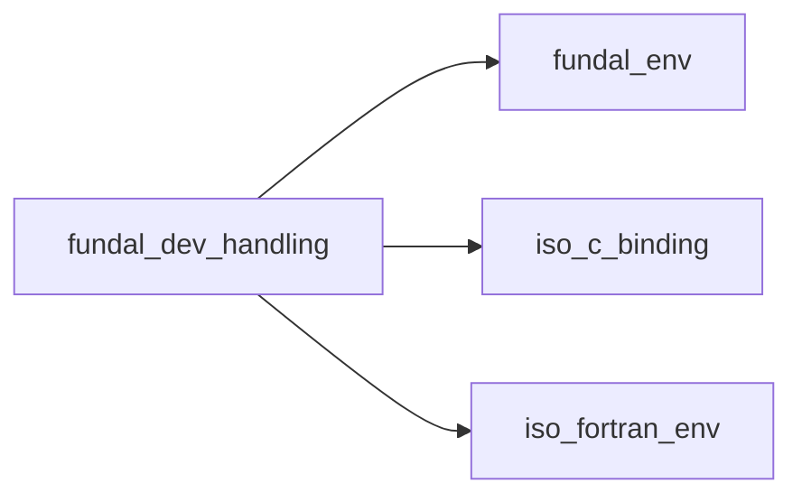
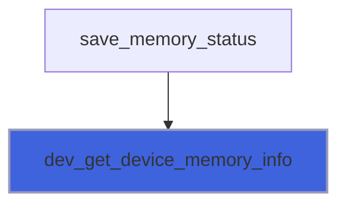
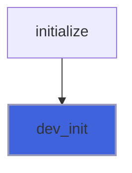

# fundal_dev_handling

> FUNDAL, device handling module.

**Source**: `src/lib/fundal_dev_handling.F90`

**Dependencies**



## Contents

- [dev_get_device_memory_info](#dev-get-device-memory-info)
- [dev_get_property_string](#dev-get-property-string)
- [dev_set_device_num](#dev-set-device-num)
- [dev_init](#dev-init)
- [dev_get_device_num](#dev-get-device-num)
- [dev_get_device_type](#dev-get-device-type)
- [dev_get_host_num](#dev-get-host-num)
- [dev_get_num_devices](#dev-get-num-devices)

## Subroutines

### dev_get_device_memory_info

Get the current device memory status.

```fortran
subroutine dev_get_device_memory_info(mem_free, mem_total)
```

**Arguments**

| Name | Type | Intent | Attributes | Description |
|------|------|--------|------------|-------------|
| `mem_free` | integer(kind=I8P) | out | optional | Free memory. |
| `mem_total` | integer(kind=I8P) | out | optional | Total memory. |

**Call graph**



### dev_get_property_string

Return the value of a device-property for the specified device.
 Note: host fallback does not provide such a runtime routine, added only for seamless unified API.

```fortran
subroutine dev_get_property_string(dev_num, string, prefix, memory)
```

**Arguments**

| Name | Type | Intent | Attributes | Description |
|------|------|--------|------------|-------------|
| `dev_num` | integer | in | value | Device ID. |
| `string` | character(len=*) | out |  | Stringified device property. |
| `prefix` | character(len=*) | in | optional | String prefix. |
| `memory` | integer(kind=I8P) | out | optional | Device memory. |

### dev_set_device_num

Set the runtime for the specified device type and device number.
 Note: host fallback does not provide such a runtime routine, added only for seamless unified API.

```fortran
subroutine dev_set_device_num(dev_num)
```

**Arguments**

| Name | Type | Intent | Attributes | Description |
|------|------|--------|------------|-------------|
| `dev_num` | integer | in | value | Device ID. |

### dev_init

Initialize device.
 Note: backsafe backend does nothing, obviously.

```fortran
subroutine dev_init()
```

**Call graph**



## Functions

### dev_get_device_num

Return the value of current device ID for the current thread.
 Note: host fallback does not provide such a runtime routine, added only for seamless unified API.

**Returns**: `integer(kind=I4P)`

```fortran
function dev_get_device_num() result(device_num)
```

### dev_get_device_type

Return the device type.
 Note: host fallback does not provide such a runtime routine, added only for seamless unified API.

**Returns**: `integer(kind=I4P)`

```fortran
function dev_get_device_type() result(devtype_)
```

### dev_get_host_num

Return the value of current host ID for the current thread.
 Note: host fallback does not provide such a runtime routine, added only for seamless unified API.

**Returns**: `integer(kind=I4P)`

```fortran
function dev_get_host_num() result(host_num)
```

### dev_get_num_devices

Return the number of available (non host) devices.
 Note: host fallback does not provide such a runtime routine, added only for seamless unified API.

**Returns**: `integer(kind=I4P)`

```fortran
function dev_get_num_devices() result(devices_number)
```
