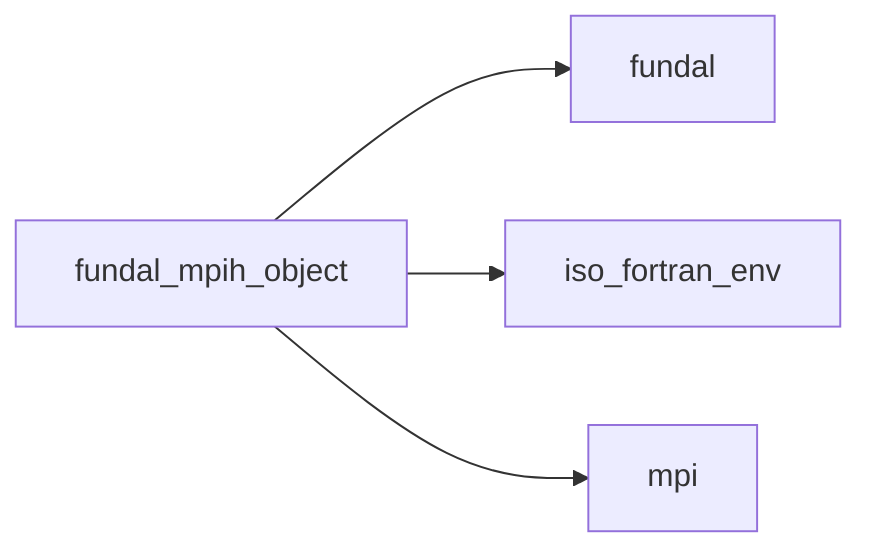
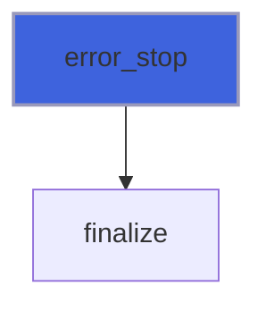
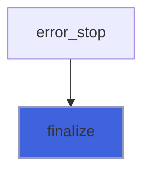
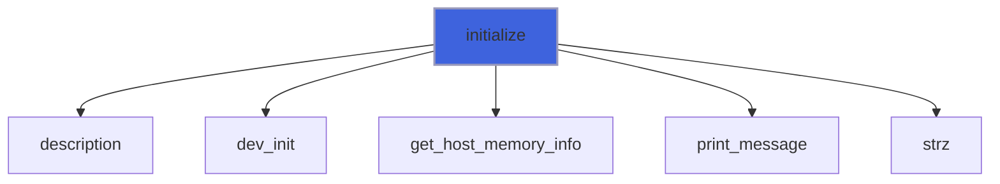
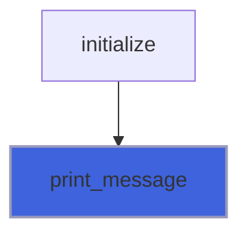
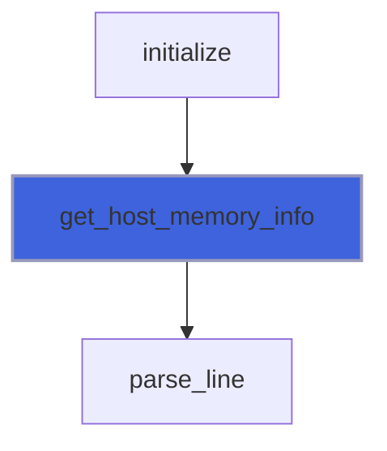
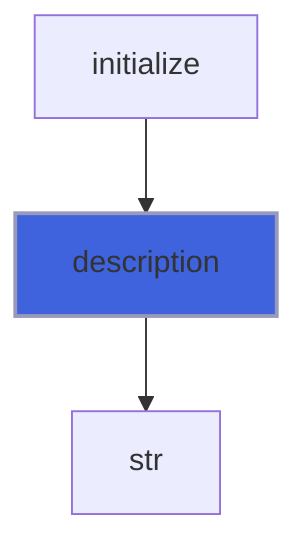
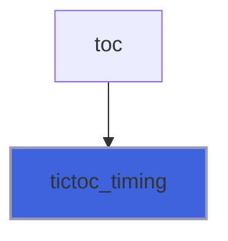
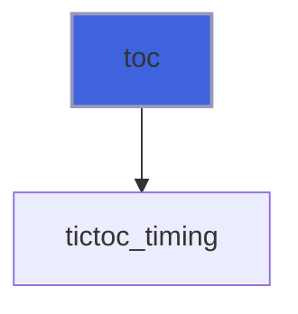
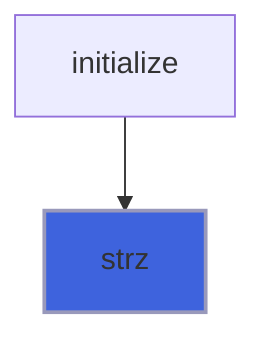

# fundal_mpih_object

> MPI handler classs definition.

**Source**: `src/lib/fundal_mpih_object.F90`

**Dependencies**



## Contents

- [mpih_object](#mpih-object)
- [str](#str)
- [abort](#abort)
- [barrier](#barrier)
- [error_stop](#error-stop)
- [finalize](#finalize)
- [initialize](#initialize)
- [print_message](#print-message)
- [tic](#tic)
- [get_host_memory_info](#get-host-memory-info)
- [description](#description)
- [tictoc_timing](#tictoc-timing)
- [toc](#toc)
- [cton](#cton)
- [str_I4P](#str-i4p)
- [str_I8P](#str-i8p)
- [strz](#strz)

## Derived Types

### mpih_object

MPI handler class.

#### Components

| Name | Type | Attributes | Description |
|------|------|------------|-------------|
| `error` | integer(kind=I4P) |  | Error traping flag. |
| `myrank` | integer(kind=I4P) |  | MPI ID process. |
| `procs_number` | integer(kind=I4P) |  | Number of MPI processes. |
| `hos_memory_avail` | integer(kind=I8P) |  | Host (CPU) memory available (GB) for each process. |
| `timing` | real(kind=R8P) |  | Tic toc timing. |
| `tictoc` | integer(kind=I4P) |  | Next is tic or toc? |
| `req_send_recv` | integer(kind=I4P) | allocatable | MPI request receive flags. |
| `devs_number` | integer(kind=I4P) | pointer | Number of devices. |
| `dev_memory_avail` | integer(kind=I8P) | pointer | Device memory available (GB). |
| `mydev` | integer(kind=I4P) | pointer | Device ID. |
| `local_comm` | integer(kind=I4P) | pointer | Local communicator. |
| `myhos` | integer(kind=I4P) | pointer | Host ID. |
| `devtype` | integer(kind=[IDk](/api/src/lib/fundal_env)) | pointer | Device type (currently used only for OpenACC backend). |
| `myrankstr` | character(len=:) | allocatable | MPI ID stringified. |

#### Type-Bound Procedures

| Name | Attributes | Description |
|------|------------|-------------|
| `abort` | pass(self) | Handy MPI abort wrapper. |
| `barrier` | pass(self) | Handy MPI barrier wrapper. |
| `description` | pass(self) | Return pretty-printed object description. |
| `error_stop` | pass(self) | Stop run with error output. |
| `finalize` | pass(self) | Handy MPI finalize wrapper. |
| `initialize` | pass(self) | Initialize MPI handler data. |
| `print_message` | pass(self) | Print a message on stdout with rank prefix. |
| `tictoc_timing` | pass(self) | Return the last tic toc timing. |
| `tic` | pass(self) | Start a tic toc timing. |
| `toc` | pass(self) | Stop  a tic toc timing. |

## Interfaces

### str

Stringify integer functions overloading.

**Module procedures**: [`str_I4P`](/api/src/lib/fundal_mpih_object#str-i4p), [`str_I8P`](/api/src/lib/fundal_mpih_object#str-i8p)

## Subroutines

### abort

Handy MPI abort wrapper.

```fortran
subroutine abort(self, error_code, msg)
```

**Arguments**

| Name | Type | Intent | Attributes | Description |
|------|------|--------|------------|-------------|
| `self` | class([mpih_object](/api/src/lib/fundal_mpih_object#mpih-object)) | inout |  | MPI handler. |
| `error_code` | integer(kind=I4P) | in | optional | Abort error code. |
| `msg` | character(len=*) | in | optional | Error message. |

### barrier

Handy MPI barrier wrapper.

```fortran
subroutine barrier(self, tictoc, timing, single)
```

**Arguments**

| Name | Type | Intent | Attributes | Description |
|------|------|--------|------------|-------------|
| `self` | class([mpih_object](/api/src/lib/fundal_mpih_object#mpih-object)) | inout |  | MPI handler. |
| `tictoc` | logical | in | optional | Activate tic toc timing between 2 barrier calls. |
| `timing` | real(kind=R8P) | out | optional | Current timing. |
| `single` | logical | in | optional | Single tictoc for one-shot timing. |

### error_stop

Stop run with error output.

```fortran
subroutine error_stop(self, msg)
```

**Arguments**

| Name | Type | Intent | Attributes | Description |
|------|------|--------|------------|-------------|
| `self` | class([mpih_object](/api/src/lib/fundal_mpih_object#mpih-object)) | inout |  | MPI handler. |
| `msg` | character(len=*) | in | optional | Error message. |

**Call graph**



### finalize

Handy MPI finalize wrapper.

```fortran
subroutine finalize(self)
```

**Arguments**

| Name | Type | Intent | Attributes | Description |
|------|------|--------|------------|-------------|
| `self` | class([mpih_object](/api/src/lib/fundal_mpih_object#mpih-object)) | inout |  | MPI handler. |

**Call graph**



### initialize

Initialize MPI handler.

```fortran
subroutine initialize(self, do_mpi_init, do_device_init, myrankstr_char_length, verbose)
```

**Arguments**

| Name | Type | Intent | Attributes | Description |
|------|------|--------|------------|-------------|
| `self` | class([mpih_object](/api/src/lib/fundal_mpih_object#mpih-object)) | out |  | MPI handler. |
| `do_mpi_init` | logical | in | optional | Flag to activate MPI init call. |
| `do_device_init` | logical | in | optional | Flag to activate device init call (used by backends). |
| `myrankstr_char_length` | integer(kind=I4P) | in | optional | MPI ID string length. |
| `verbose` | logical | in | optional | Trigger verbose output. |

**Call graph**



### print_message

Print a message on stdout with rank prefix.

```fortran
subroutine print_message(self, msg)
```

**Arguments**

| Name | Type | Intent | Attributes | Description |
|------|------|--------|------------|-------------|
| `self` | class([mpih_object](/api/src/lib/fundal_mpih_object#mpih-object)) | in |  | MPI handler. |
| `msg` | character(len=*) | in |  | Message to print. |

**Call graph**



### tic

Start a tic toc timing.

```fortran
subroutine tic(self)
```

**Arguments**

| Name | Type | Intent | Attributes | Description |
|------|------|--------|------------|-------------|
| `self` | class([mpih_object](/api/src/lib/fundal_mpih_object#mpih-object)) | inout |  | MPI handler. |

### get_host_memory_info

Get the current CPU-memory status.

```fortran
subroutine get_host_memory_info(mem_free, mem_total)
```

**Arguments**

| Name | Type | Intent | Attributes | Description |
|------|------|--------|------------|-------------|
| `mem_free` | integer(kind=I8P) | out |  | Free memory. |
| `mem_total` | integer(kind=I8P) | out |  | Total memory. |

**Call graph**



## Functions

### description

Return a pretty-formatted object description.

**Attributes**: pure

**Returns**: `character(len=:)`

```fortran
function description(self) result(desc)
```

**Arguments**

| Name | Type | Intent | Attributes | Description |
|------|------|--------|------------|-------------|
| `self` | class([mpih_object](/api/src/lib/fundal_mpih_object#mpih-object)) | in |  | MPI handler. |

**Call graph**



### tictoc_timing

Return the last tic toc timing.

**Returns**: `real(kind=R8P)`

```fortran
function tictoc_timing(self) result(timing)
```

**Arguments**

| Name | Type | Intent | Attributes | Description |
|------|------|--------|------------|-------------|
| `self` | class([mpih_object](/api/src/lib/fundal_mpih_object#mpih-object)) | in |  | MPI handler. |

**Call graph**



### toc

Stop a tic toc timing.

**Returns**: `real(kind=R8P)`

```fortran
function toc(self) result(timing)
```

**Arguments**

| Name | Type | Intent | Attributes | Description |
|------|------|--------|------------|-------------|
| `self` | class([mpih_object](/api/src/lib/fundal_mpih_object#mpih-object)) | inout |  | MPI handler. |

**Call graph**



### cton

Convert string to integer.

**Returns**: `integer(kind=I8P)`

```fortran
function cton(str, knd, pref, error) result(n)
```

**Arguments**

| Name | Type | Intent | Attributes | Description |
|------|------|--------|------------|-------------|
| `str` | character(len=*) | in |  | String containing input number. |
| `knd` | integer(kind=I8P) | in |  | Number kind. |
| `pref` | character(len=*) | in | optional | Prefixing string. |
| `error` | integer(kind=I4P) | out | optional | Error trapping flag: 0 no errors, >0 error occurs. |

### str_I4P

Return integer cast to string (I4P kind).

**Attributes**: elemental

**Returns**: `character(len=11)`

```fortran
function str_I4P(n)
```

**Arguments**

| Name | Type | Intent | Attributes | Description |
|------|------|--------|------------|-------------|
| `n` | integer(kind=I4P) | in |  | Integer to be converted. |

### str_I8P

Return integer cast to string (I8P kind).

**Attributes**: elemental

**Returns**: `character(len=20)`

```fortran
function str_I8P(n)
```

**Arguments**

| Name | Type | Intent | Attributes | Description |
|------|------|--------|------------|-------------|
| `n` | integer(kind=I8P) | in |  | Integer to be converted. |

### strz

Return integer cast to string, prefixing with the right number of zeros.

**Attributes**: elemental

**Returns**: `character(len=11)`

```fortran
function strz(n, nz_pad)
```

**Arguments**

| Name | Type | Intent | Attributes | Description |
|------|------|--------|------------|-------------|
| `n` | integer(kind=I4P) | in |  | Integer to be converted. |
| `nz_pad` | integer(kind=I4P) | in | optional | Number of zeros padding. |

**Call graph**


