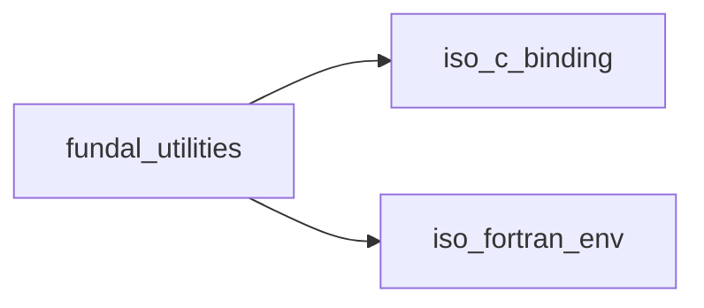

# fundal_utilities

> FUNDAL, utilities module.

**Source**: `src/lib/fundal_utilities.F90`

**Dependencies**



## Contents

- [bytes_size](#bytes-size)
- [bytes_size_R8P_1D](#bytes-size-r8p-1d)
- [bytes_size_R8P_2D](#bytes-size-r8p-2d)
- [bytes_size_R8P_3D](#bytes-size-r8p-3d)
- [bytes_size_R8P_4D](#bytes-size-r8p-4d)
- [bytes_size_R8P_5D](#bytes-size-r8p-5d)
- [bytes_size_R8P_6D](#bytes-size-r8p-6d)
- [bytes_size_R8P_7D](#bytes-size-r8p-7d)
- [bytes_size_R4P_1D](#bytes-size-r4p-1d)
- [bytes_size_R4P_2D](#bytes-size-r4p-2d)
- [bytes_size_R4P_3D](#bytes-size-r4p-3d)
- [bytes_size_R4P_4D](#bytes-size-r4p-4d)
- [bytes_size_R4P_5D](#bytes-size-r4p-5d)
- [bytes_size_R4P_6D](#bytes-size-r4p-6d)
- [bytes_size_R4P_7D](#bytes-size-r4p-7d)
- [bytes_size_I8P_1D](#bytes-size-i8p-1d)
- [bytes_size_I8P_2D](#bytes-size-i8p-2d)
- [bytes_size_I8P_3D](#bytes-size-i8p-3d)
- [bytes_size_I8P_4D](#bytes-size-i8p-4d)
- [bytes_size_I8P_5D](#bytes-size-i8p-5d)
- [bytes_size_I8P_6D](#bytes-size-i8p-6d)
- [bytes_size_I8P_7D](#bytes-size-i8p-7d)
- [bytes_size_I4P_1D](#bytes-size-i4p-1d)
- [bytes_size_I4P_2D](#bytes-size-i4p-2d)
- [bytes_size_I4P_3D](#bytes-size-i4p-3d)
- [bytes_size_I4P_4D](#bytes-size-i4p-4d)
- [bytes_size_I4P_5D](#bytes-size-i4p-5d)
- [bytes_size_I4P_6D](#bytes-size-i4p-6d)
- [bytes_size_I4P_7D](#bytes-size-i4p-7d)
- [bytes_size_I2P_1D](#bytes-size-i2p-1d)
- [bytes_size_I2P_2D](#bytes-size-i2p-2d)
- [bytes_size_I2P_3D](#bytes-size-i2p-3d)
- [bytes_size_I2P_4D](#bytes-size-i2p-4d)
- [bytes_size_I2P_5D](#bytes-size-i2p-5d)
- [bytes_size_I2P_6D](#bytes-size-i2p-6d)
- [bytes_size_I2P_7D](#bytes-size-i2p-7d)
- [bytes_size_I1P_1D](#bytes-size-i1p-1d)
- [bytes_size_I1P_2D](#bytes-size-i1p-2d)
- [bytes_size_I1P_3D](#bytes-size-i1p-3d)
- [bytes_size_I1P_4D](#bytes-size-i1p-4d)
- [bytes_size_I1P_5D](#bytes-size-i1p-5d)
- [bytes_size_I1P_6D](#bytes-size-i1p-6d)
- [bytes_size_I1P_7D](#bytes-size-i1p-7d)

## Interfaces

### bytes_size

Return bytes size of input array.

**Module procedures**: [`bytes_size_R8P_1D`](/api/src/lib/fundal_utilities#bytes-size-r8p-1d), [`bytes_size_R8P_2D`](/api/src/lib/fundal_utilities#bytes-size-r8p-2d), [`bytes_size_R8P_3D`](/api/src/lib/fundal_utilities#bytes-size-r8p-3d), [`bytes_size_R8P_4D`](/api/src/lib/fundal_utilities#bytes-size-r8p-4d), [`bytes_size_R8P_5D`](/api/src/lib/fundal_utilities#bytes-size-r8p-5d), [`bytes_size_R8P_6D`](/api/src/lib/fundal_utilities#bytes-size-r8p-6d), [`bytes_size_R8P_7D`](/api/src/lib/fundal_utilities#bytes-size-r8p-7d), [`bytes_size_R4P_1D`](/api/src/lib/fundal_utilities#bytes-size-r4p-1d), [`bytes_size_R4P_2D`](/api/src/lib/fundal_utilities#bytes-size-r4p-2d), [`bytes_size_R4P_3D`](/api/src/lib/fundal_utilities#bytes-size-r4p-3d), [`bytes_size_R4P_4D`](/api/src/lib/fundal_utilities#bytes-size-r4p-4d), [`bytes_size_R4P_5D`](/api/src/lib/fundal_utilities#bytes-size-r4p-5d), [`bytes_size_R4P_6D`](/api/src/lib/fundal_utilities#bytes-size-r4p-6d), [`bytes_size_R4P_7D`](/api/src/lib/fundal_utilities#bytes-size-r4p-7d), [`bytes_size_I8P_1D`](/api/src/lib/fundal_utilities#bytes-size-i8p-1d), [`bytes_size_I8P_2D`](/api/src/lib/fundal_utilities#bytes-size-i8p-2d), [`bytes_size_I8P_3D`](/api/src/lib/fundal_utilities#bytes-size-i8p-3d), [`bytes_size_I8P_4D`](/api/src/lib/fundal_utilities#bytes-size-i8p-4d), [`bytes_size_I8P_5D`](/api/src/lib/fundal_utilities#bytes-size-i8p-5d), [`bytes_size_I8P_6D`](/api/src/lib/fundal_utilities#bytes-size-i8p-6d), [`bytes_size_I8P_7D`](/api/src/lib/fundal_utilities#bytes-size-i8p-7d), [`bytes_size_I4P_1D`](/api/src/lib/fundal_utilities#bytes-size-i4p-1d), [`bytes_size_I4P_2D`](/api/src/lib/fundal_utilities#bytes-size-i4p-2d), [`bytes_size_I4P_3D`](/api/src/lib/fundal_utilities#bytes-size-i4p-3d), [`bytes_size_I4P_4D`](/api/src/lib/fundal_utilities#bytes-size-i4p-4d), [`bytes_size_I4P_5D`](/api/src/lib/fundal_utilities#bytes-size-i4p-5d), [`bytes_size_I4P_6D`](/api/src/lib/fundal_utilities#bytes-size-i4p-6d), [`bytes_size_I4P_7D`](/api/src/lib/fundal_utilities#bytes-size-i4p-7d), [`bytes_size_I2P_1D`](/api/src/lib/fundal_utilities#bytes-size-i2p-1d), [`bytes_size_I2P_2D`](/api/src/lib/fundal_utilities#bytes-size-i2p-2d), [`bytes_size_I2P_3D`](/api/src/lib/fundal_utilities#bytes-size-i2p-3d), [`bytes_size_I2P_4D`](/api/src/lib/fundal_utilities#bytes-size-i2p-4d), [`bytes_size_I2P_5D`](/api/src/lib/fundal_utilities#bytes-size-i2p-5d), [`bytes_size_I2P_6D`](/api/src/lib/fundal_utilities#bytes-size-i2p-6d), [`bytes_size_I2P_7D`](/api/src/lib/fundal_utilities#bytes-size-i2p-7d), [`bytes_size_I1P_1D`](/api/src/lib/fundal_utilities#bytes-size-i1p-1d), [`bytes_size_I1P_2D`](/api/src/lib/fundal_utilities#bytes-size-i1p-2d), [`bytes_size_I1P_3D`](/api/src/lib/fundal_utilities#bytes-size-i1p-3d), [`bytes_size_I1P_4D`](/api/src/lib/fundal_utilities#bytes-size-i1p-4d), [`bytes_size_I1P_5D`](/api/src/lib/fundal_utilities#bytes-size-i1p-5d), [`bytes_size_I1P_6D`](/api/src/lib/fundal_utilities#bytes-size-i1p-6d), [`bytes_size_I1P_7D`](/api/src/lib/fundal_utilities#bytes-size-i1p-7d)

## Functions

### bytes_size_R8P_1D

Return bytes size of input array, kind R8P, rank 1.

**Returns**: `integer(kind=c_size_t)`

```fortran
function bytes_size_R8P_1D(a, sizes) result(bytes)
```

**Arguments**

| Name | Type | Intent | Attributes | Description |
|------|------|--------|------------|-------------|
| `a` | real(kind=R8P) | in | target | Input array. |
| `sizes` | integer(kind=I8P) | in | optional | Sizes. |

### bytes_size_R8P_2D

Return bytes size of input array, kind R8P, rank 2.

**Returns**: `integer(kind=c_size_t)`

```fortran
function bytes_size_R8P_2D(a, sizes) result(bytes)
```

**Arguments**

| Name | Type | Intent | Attributes | Description |
|------|------|--------|------------|-------------|
| `a` | real(kind=R8P) | in | target | Input array. |
| `sizes` | integer(kind=I8P) | in | optional | Sizes. |

### bytes_size_R8P_3D

Return bytes size of input array, kind R8P, rank 3.

**Returns**: `integer(kind=c_size_t)`

```fortran
function bytes_size_R8P_3D(a, sizes) result(bytes)
```

**Arguments**

| Name | Type | Intent | Attributes | Description |
|------|------|--------|------------|-------------|
| `a` | real(kind=R8P) | in | target | Input array. |
| `sizes` | integer(kind=I8P) | in | optional | Sizes. |

### bytes_size_R8P_4D

Return bytes size of input array, kind R8P, rank 4.

**Returns**: `integer(kind=c_size_t)`

```fortran
function bytes_size_R8P_4D(a, sizes) result(bytes)
```

**Arguments**

| Name | Type | Intent | Attributes | Description |
|------|------|--------|------------|-------------|
| `a` | real(kind=R8P) | in | target | Input array. |
| `sizes` | integer(kind=I8P) | in | optional | Sizes. |

### bytes_size_R8P_5D

Return bytes size of input array, kind R8P, rank 5.

**Returns**: `integer(kind=c_size_t)`

```fortran
function bytes_size_R8P_5D(a, sizes) result(bytes)
```

**Arguments**

| Name | Type | Intent | Attributes | Description |
|------|------|--------|------------|-------------|
| `a` | real(kind=R8P) | in | target | Input array. |
| `sizes` | integer(kind=I8P) | in | optional | Sizes. |

### bytes_size_R8P_6D

Return bytes size of input array, kind R8P, rank 6.

**Returns**: `integer(kind=c_size_t)`

```fortran
function bytes_size_R8P_6D(a, sizes) result(bytes)
```

**Arguments**

| Name | Type | Intent | Attributes | Description |
|------|------|--------|------------|-------------|
| `a` | real(kind=R8P) | in | target | Input array. |
| `sizes` | integer(kind=I8P) | in | optional | Sizes. |

### bytes_size_R8P_7D

Return bytes size of input array, kind R8P, rank 7.

**Returns**: `integer(kind=c_size_t)`

```fortran
function bytes_size_R8P_7D(a, sizes) result(bytes)
```

**Arguments**

| Name | Type | Intent | Attributes | Description |
|------|------|--------|------------|-------------|
| `a` | real(kind=R8P) | in | target | Input array. |
| `sizes` | integer(kind=I8P) | in | optional | Sizes. |

### bytes_size_R4P_1D

Return bytes size of input array, kind R4P, rank 1.

**Returns**: `integer(kind=c_size_t)`

```fortran
function bytes_size_R4P_1D(a, sizes) result(bytes)
```

**Arguments**

| Name | Type | Intent | Attributes | Description |
|------|------|--------|------------|-------------|
| `a` | real(kind=R4P) | in | target | Input array. |
| `sizes` | integer(kind=I8P) | in | optional | Sizes. |

### bytes_size_R4P_2D

Return bytes size of input array, kind R4P, rank 2.

**Returns**: `integer(kind=c_size_t)`

```fortran
function bytes_size_R4P_2D(a, sizes) result(bytes)
```

**Arguments**

| Name | Type | Intent | Attributes | Description |
|------|------|--------|------------|-------------|
| `a` | real(kind=R4P) | in | target | Input array. |
| `sizes` | integer(kind=I8P) | in | optional | Sizes. |

### bytes_size_R4P_3D

Return bytes size of input array, kind R4P, rank 3.

**Returns**: `integer(kind=c_size_t)`

```fortran
function bytes_size_R4P_3D(a, sizes) result(bytes)
```

**Arguments**

| Name | Type | Intent | Attributes | Description |
|------|------|--------|------------|-------------|
| `a` | real(kind=R4P) | in | target | Input array. |
| `sizes` | integer(kind=I8P) | in | optional | Sizes. |

### bytes_size_R4P_4D

Return bytes size of input array, kind R4P, rank 4.

**Returns**: `integer(kind=c_size_t)`

```fortran
function bytes_size_R4P_4D(a, sizes) result(bytes)
```

**Arguments**

| Name | Type | Intent | Attributes | Description |
|------|------|--------|------------|-------------|
| `a` | real(kind=R4P) | in | target | Input array. |
| `sizes` | integer(kind=I8P) | in | optional | Sizes. |

### bytes_size_R4P_5D

Return bytes size of input array, kind R4P, rank 5.

**Returns**: `integer(kind=c_size_t)`

```fortran
function bytes_size_R4P_5D(a, sizes) result(bytes)
```

**Arguments**

| Name | Type | Intent | Attributes | Description |
|------|------|--------|------------|-------------|
| `a` | real(kind=R4P) | in | target | Input array. |
| `sizes` | integer(kind=I8P) | in | optional | Sizes. |

### bytes_size_R4P_6D

Return bytes size of input array, kind R4P, rank 6.

**Returns**: `integer(kind=c_size_t)`

```fortran
function bytes_size_R4P_6D(a, sizes) result(bytes)
```

**Arguments**

| Name | Type | Intent | Attributes | Description |
|------|------|--------|------------|-------------|
| `a` | real(kind=R4P) | in | target | Input array. |
| `sizes` | integer(kind=I8P) | in | optional | Sizes. |

### bytes_size_R4P_7D

Return bytes size of input array, kind R4P, rank 7.

**Returns**: `integer(kind=c_size_t)`

```fortran
function bytes_size_R4P_7D(a, sizes) result(bytes)
```

**Arguments**

| Name | Type | Intent | Attributes | Description |
|------|------|--------|------------|-------------|
| `a` | real(kind=R4P) | in | target | Input array. |
| `sizes` | integer(kind=I8P) | in | optional | Sizes. |

### bytes_size_I8P_1D

Return bytes size of input array, kind I8P, rank 1.

**Returns**: `integer(kind=c_size_t)`

```fortran
function bytes_size_I8P_1D(a, sizes) result(bytes)
```

**Arguments**

| Name | Type | Intent | Attributes | Description |
|------|------|--------|------------|-------------|
| `a` | integer(kind=I8P) | in | target | Input array. |
| `sizes` | integer(kind=I8P) | in | optional | Sizes. |

### bytes_size_I8P_2D

Return bytes size of input array, kind I8P, rank 2.

**Returns**: `integer(kind=c_size_t)`

```fortran
function bytes_size_I8P_2D(a, sizes) result(bytes)
```

**Arguments**

| Name | Type | Intent | Attributes | Description |
|------|------|--------|------------|-------------|
| `a` | integer(kind=I8P) | in | target | Input array. |
| `sizes` | integer(kind=I8P) | in | optional | Sizes. |

### bytes_size_I8P_3D

Return bytes size of input array, kind I8P, rank 3.

**Returns**: `integer(kind=c_size_t)`

```fortran
function bytes_size_I8P_3D(a, sizes) result(bytes)
```

**Arguments**

| Name | Type | Intent | Attributes | Description |
|------|------|--------|------------|-------------|
| `a` | integer(kind=I8P) | in | target | Input array. |
| `sizes` | integer(kind=I8P) | in | optional | Sizes. |

### bytes_size_I8P_4D

Return bytes size of input array, kind I8P, rank 4.

**Returns**: `integer(kind=c_size_t)`

```fortran
function bytes_size_I8P_4D(a, sizes) result(bytes)
```

**Arguments**

| Name | Type | Intent | Attributes | Description |
|------|------|--------|------------|-------------|
| `a` | integer(kind=I8P) | in | target | Input array. |
| `sizes` | integer(kind=I8P) | in | optional | Sizes. |

### bytes_size_I8P_5D

Return bytes size of input array, kind I8P, rank 5.

**Returns**: `integer(kind=c_size_t)`

```fortran
function bytes_size_I8P_5D(a, sizes) result(bytes)
```

**Arguments**

| Name | Type | Intent | Attributes | Description |
|------|------|--------|------------|-------------|
| `a` | integer(kind=I8P) | in | target | Input array. |
| `sizes` | integer(kind=I8P) | in | optional | Sizes. |

### bytes_size_I8P_6D

Return bytes size of input array, kind I8P, rank 6.

**Returns**: `integer(kind=c_size_t)`

```fortran
function bytes_size_I8P_6D(a, sizes) result(bytes)
```

**Arguments**

| Name | Type | Intent | Attributes | Description |
|------|------|--------|------------|-------------|
| `a` | integer(kind=I8P) | in | target | Input array. |
| `sizes` | integer(kind=I8P) | in | optional | Sizes. |

### bytes_size_I8P_7D

Return bytes size of input array, kind I8P, rank 7.

**Returns**: `integer(kind=c_size_t)`

```fortran
function bytes_size_I8P_7D(a, sizes) result(bytes)
```

**Arguments**

| Name | Type | Intent | Attributes | Description |
|------|------|--------|------------|-------------|
| `a` | integer(kind=I8P) | in | target | Input array. |
| `sizes` | integer(kind=I8P) | in | optional | Sizes. |

### bytes_size_I4P_1D

Return bytes size of input array, kind I4P, rank 1.

**Returns**: `integer(kind=c_size_t)`

```fortran
function bytes_size_I4P_1D(a, sizes) result(bytes)
```

**Arguments**

| Name | Type | Intent | Attributes | Description |
|------|------|--------|------------|-------------|
| `a` | integer(kind=I4P) | in | target | Input array. |
| `sizes` | integer(kind=I8P) | in | optional | Sizes. |

### bytes_size_I4P_2D

Return bytes size of input array, kind I4P, rank 2.

**Returns**: `integer(kind=c_size_t)`

```fortran
function bytes_size_I4P_2D(a, sizes) result(bytes)
```

**Arguments**

| Name | Type | Intent | Attributes | Description |
|------|------|--------|------------|-------------|
| `a` | integer(kind=I4P) | in | target | Input array. |
| `sizes` | integer(kind=I8P) | in | optional | Sizes. |

### bytes_size_I4P_3D

Return bytes size of input array, kind I4P, rank 3.

**Returns**: `integer(kind=c_size_t)`

```fortran
function bytes_size_I4P_3D(a, sizes) result(bytes)
```

**Arguments**

| Name | Type | Intent | Attributes | Description |
|------|------|--------|------------|-------------|
| `a` | integer(kind=I4P) | in | target | Input array. |
| `sizes` | integer(kind=I8P) | in | optional | Sizes. |

### bytes_size_I4P_4D

Return bytes size of input array, kind I4P, rank 4.

**Returns**: `integer(kind=c_size_t)`

```fortran
function bytes_size_I4P_4D(a, sizes) result(bytes)
```

**Arguments**

| Name | Type | Intent | Attributes | Description |
|------|------|--------|------------|-------------|
| `a` | integer(kind=I4P) | in | target | Input array. |
| `sizes` | integer(kind=I8P) | in | optional | Sizes. |

### bytes_size_I4P_5D

Return bytes size of input array, kind I4P, rank 5.

**Returns**: `integer(kind=c_size_t)`

```fortran
function bytes_size_I4P_5D(a, sizes) result(bytes)
```

**Arguments**

| Name | Type | Intent | Attributes | Description |
|------|------|--------|------------|-------------|
| `a` | integer(kind=I4P) | in | target | Input array. |
| `sizes` | integer(kind=I8P) | in | optional | Sizes. |

### bytes_size_I4P_6D

Return bytes size of input array, kind I4P, rank 6.

**Returns**: `integer(kind=c_size_t)`

```fortran
function bytes_size_I4P_6D(a, sizes) result(bytes)
```

**Arguments**

| Name | Type | Intent | Attributes | Description |
|------|------|--------|------------|-------------|
| `a` | integer(kind=I4P) | in | target | Input array. |
| `sizes` | integer(kind=I8P) | in | optional | Sizes. |

### bytes_size_I4P_7D

Return bytes size of input array, kind I4P, rank 7.

**Returns**: `integer(kind=c_size_t)`

```fortran
function bytes_size_I4P_7D(a, sizes) result(bytes)
```

**Arguments**

| Name | Type | Intent | Attributes | Description |
|------|------|--------|------------|-------------|
| `a` | integer(kind=I4P) | in | target | Input array. |
| `sizes` | integer(kind=I8P) | in | optional | Sizes. |

### bytes_size_I2P_1D

Return bytes size of input array, kind I2P, rank 1.

**Returns**: `integer(kind=c_size_t)`

```fortran
function bytes_size_I2P_1D(a, sizes) result(bytes)
```

**Arguments**

| Name | Type | Intent | Attributes | Description |
|------|------|--------|------------|-------------|
| `a` | integer(kind=I2P) | in | target | Input array. |
| `sizes` | integer(kind=I8P) | in | optional | Sizes. |

### bytes_size_I2P_2D

Return bytes size of input array, kind I2P, rank 2.

**Returns**: `integer(kind=c_size_t)`

```fortran
function bytes_size_I2P_2D(a, sizes) result(bytes)
```

**Arguments**

| Name | Type | Intent | Attributes | Description |
|------|------|--------|------------|-------------|
| `a` | integer(kind=I2P) | in | target | Input array. |
| `sizes` | integer(kind=I8P) | in | optional | Sizes. |

### bytes_size_I2P_3D

Return bytes size of input array, kind I2P, rank 3.

**Returns**: `integer(kind=c_size_t)`

```fortran
function bytes_size_I2P_3D(a, sizes) result(bytes)
```

**Arguments**

| Name | Type | Intent | Attributes | Description |
|------|------|--------|------------|-------------|
| `a` | integer(kind=I2P) | in | target | Input array. |
| `sizes` | integer(kind=I8P) | in | optional | Sizes. |

### bytes_size_I2P_4D

Return bytes size of input array, kind I2P, rank 4.

**Returns**: `integer(kind=c_size_t)`

```fortran
function bytes_size_I2P_4D(a, sizes) result(bytes)
```

**Arguments**

| Name | Type | Intent | Attributes | Description |
|------|------|--------|------------|-------------|
| `a` | integer(kind=I2P) | in | target | Input array. |
| `sizes` | integer(kind=I8P) | in | optional | Sizes. |

### bytes_size_I2P_5D

Return bytes size of input array, kind I2P, rank 5.

**Returns**: `integer(kind=c_size_t)`

```fortran
function bytes_size_I2P_5D(a, sizes) result(bytes)
```

**Arguments**

| Name | Type | Intent | Attributes | Description |
|------|------|--------|------------|-------------|
| `a` | integer(kind=I2P) | in | target | Input array. |
| `sizes` | integer(kind=I8P) | in | optional | Sizes. |

### bytes_size_I2P_6D

Return bytes size of input array, kind I2P, rank 6.

**Returns**: `integer(kind=c_size_t)`

```fortran
function bytes_size_I2P_6D(a, sizes) result(bytes)
```

**Arguments**

| Name | Type | Intent | Attributes | Description |
|------|------|--------|------------|-------------|
| `a` | integer(kind=I2P) | in | target | Input array. |
| `sizes` | integer(kind=I8P) | in | optional | Sizes. |

### bytes_size_I2P_7D

Return bytes size of input array, kind I2P, rank 7.

**Returns**: `integer(kind=c_size_t)`

```fortran
function bytes_size_I2P_7D(a, sizes) result(bytes)
```

**Arguments**

| Name | Type | Intent | Attributes | Description |
|------|------|--------|------------|-------------|
| `a` | integer(kind=I2P) | in | target | Input array. |
| `sizes` | integer(kind=I8P) | in | optional | Sizes. |

### bytes_size_I1P_1D

Return bytes size of input array, kind I1P, rank 1.

**Returns**: `integer(kind=c_size_t)`

```fortran
function bytes_size_I1P_1D(a, sizes) result(bytes)
```

**Arguments**

| Name | Type | Intent | Attributes | Description |
|------|------|--------|------------|-------------|
| `a` | integer(kind=I1P) | in | target | Input array. |
| `sizes` | integer(kind=I8P) | in | optional | Sizes. |

### bytes_size_I1P_2D

Return bytes size of input array, kind I1P, rank 2.

**Returns**: `integer(kind=c_size_t)`

```fortran
function bytes_size_I1P_2D(a, sizes) result(bytes)
```

**Arguments**

| Name | Type | Intent | Attributes | Description |
|------|------|--------|------------|-------------|
| `a` | integer(kind=I1P) | in | target | Input array. |
| `sizes` | integer(kind=I8P) | in | optional | Sizes. |

### bytes_size_I1P_3D

Return bytes size of input array, kind I1P, rank 3.

**Returns**: `integer(kind=c_size_t)`

```fortran
function bytes_size_I1P_3D(a, sizes) result(bytes)
```

**Arguments**

| Name | Type | Intent | Attributes | Description |
|------|------|--------|------------|-------------|
| `a` | integer(kind=I1P) | in | target | Input array. |
| `sizes` | integer(kind=I8P) | in | optional | Sizes. |

### bytes_size_I1P_4D

Return bytes size of input array, kind I1P, rank 4.

**Returns**: `integer(kind=c_size_t)`

```fortran
function bytes_size_I1P_4D(a, sizes) result(bytes)
```

**Arguments**

| Name | Type | Intent | Attributes | Description |
|------|------|--------|------------|-------------|
| `a` | integer(kind=I1P) | in | target | Input array. |
| `sizes` | integer(kind=I8P) | in | optional | Sizes. |

### bytes_size_I1P_5D

Return bytes size of input array, kind I1P, rank 5.

**Returns**: `integer(kind=c_size_t)`

```fortran
function bytes_size_I1P_5D(a, sizes) result(bytes)
```

**Arguments**

| Name | Type | Intent | Attributes | Description |
|------|------|--------|------------|-------------|
| `a` | integer(kind=I1P) | in | target | Input array. |
| `sizes` | integer(kind=I8P) | in | optional | Sizes. |

### bytes_size_I1P_6D

Return bytes size of input array, kind I1P, rank 6.

**Returns**: `integer(kind=c_size_t)`

```fortran
function bytes_size_I1P_6D(a, sizes) result(bytes)
```

**Arguments**

| Name | Type | Intent | Attributes | Description |
|------|------|--------|------------|-------------|
| `a` | integer(kind=I1P) | in | target | Input array. |
| `sizes` | integer(kind=I8P) | in | optional | Sizes. |

### bytes_size_I1P_7D

Return bytes size of input array, kind I1P, rank 7.

**Returns**: `integer(kind=c_size_t)`

```fortran
function bytes_size_I1P_7D(a, sizes) result(bytes)
```

**Arguments**

| Name | Type | Intent | Attributes | Description |
|------|------|--------|------------|-------------|
| `a` | integer(kind=I1P) | in | target | Input array. |
| `sizes` | integer(kind=I8P) | in | optional | Sizes. |
