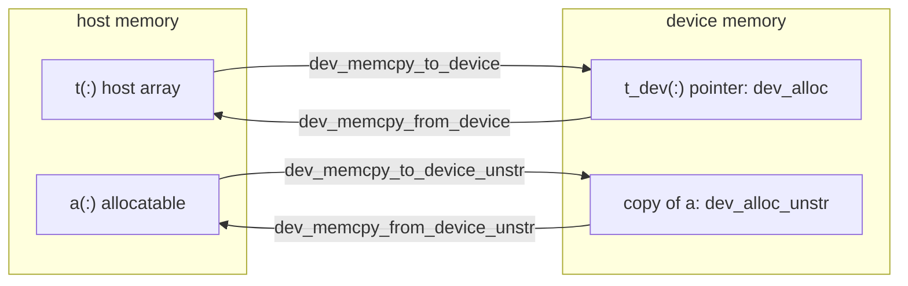

# Concepts

## Two memory models

FUNDAL manages device memory in two ways.

**Structured model**: the memory exists only on the device. `dev_alloc` asks the runtime for a device buffer and returns
a Fortran `pointer` to it, with the bounds you choose; the host never sees the data unless you copy it with
`dev_memcpy_to_device`/`dev_memcpy_from_device`. The pointer is valid in kernels, and on the host it may be used only
for its descriptor (`lbound`, `size`, passing it to FUNDAL): dereferencing it on the host reads device memory.

**Unstructured model**: the array is an ordinary host `allocatable`, and `dev_alloc_unstr` gives it a copy on the device
(an OpenACC `enter data create`, an OpenMP `target enter data map(alloc:)`). There are two copies of the same array, one
per memory: `dev_memcpy_to_device_unstr` and `dev_memcpy_from_device_unstr` update one from the other.

| | Structured | Unstructured |
|---|---|---|
| Variable | `pointer` to device memory | host `allocatable` (or any contiguous host array) |
| Allocate, free | `dev_alloc`, `dev_alloc_replace`, `dev_free` | `dev_alloc_unstr`, `dev_free_unstr` |
| Copies | `dev_memcpy_to_device(dst, src)`, `dev_memcpy_from_device(dst, src)`, `dev_assign_*` | `dev_memcpy_to_device_unstr(dst)`, `dev_memcpy_from_device_unstr(dst)` |
| Host memory used | none | the whole array |
| Kernel clause | `DEVICEVAR` (OpenACC), `DEVICEPTR` (OpenMP) | `present` (OpenACC), none (OpenMP) |
| Tracked by the [registry](/reference/registry) | yes | no (the runtime present table) |
| Use it for | arrays that live on the device: the state of a solver, work arrays | arrays the host also reads and writes, existing host code |

## Backends and the compile-time CPU mode

The backend is chosen when FUNDAL is compiled, by a preprocessor macro:

- `DEV_OAC`: OpenACC (`acc_malloc`, `acc_free`, `acc_memcpy_*`, `acc_*` device queries);
- `DEV_OMP`: OpenMP offload (`omp_target_alloc`, `omp_target_free`, `omp_target_memcpy`, `omp_*` queries); with
  `DEV_HIP` (AMD) the device memory and properties are queried from the HIP runtime;
- neither: the **compile-time CPU mode**. "Device" memory is host memory (`malloc`/`free`), copies are assignments, and
  the device queries return fixed values. It is a build choice, not a failure: the same program runs without any
  offloading.

The procedures keep their names and arguments in every build, so a program needs no `#ifdef` to call them. Only the
kernel directives differ between backends, and `fundal.H` hides that difference.

## Why the kernel macros

A kernel on structured device memory must tell the compiler that the pointer already holds a device address, and the
clause that says it depends on the backend and on the compiler:

| Build | Clause | Defined by `fundal.H` as |
|---|---|---|
| OpenACC, nvfortran | `deviceptr(a)` | `DEVICEVAR` |
| OpenACC, gfortran | `present(a)` | `DEVICEVAR` |
| OpenMP | `has_device_addr(a)` | `DEVICEPTR`, with `OMPLOOP` = `target teams distribute parallel do` |
| CPU mode | `shared(a)` | `DEVICEVAR`, `DEVICEPTR`, with `OMPLOOP` = `parallel do` |

So each kernel carries both directives, and the compiler reads only the one of the enabled backend:

<<< @/examples/snippets/heat_3-step.F90{fortran}

The [macros reference](/reference/macros) has the whole header and its rules. The OpenACC specification allows
`deviceptr` only on dummy arguments; nvfortran also accepts it on a pointer, as above, but the portable form passes the
device arrays to a procedure ([tutorial chapter 4](/guide/tutorial/04-routines-types)).

## Host fallback

A device build (OpenACC or OpenMP) can run where no device is available: the runtime then runs the "device" memory and
the kernels on the host. FUNDAL calls this a **host fallback** and makes it visible: `dev_init` writes a warning,
`dev_is_host_fallback()` returns `.true.`, and `dev_init(require_device=.true.)`, `ACC_DEVICE_TYPE=nvidia` or
`OMP_TARGET_OFFLOAD=MANDATORY` turn it into an error. An explicit host request (`ACC_DEVICE_TYPE=host`,
`OMP_TARGET_OFFLOAD=DISABLED`) is a fallback without warning: the examples of this documentation run this way. See
[Host fallback](/reference/devices#host-fallback).

A fallback hides bugs: a "device" pointer dereferenced on the host works, because the memory is host memory. Test on a
device before trusting a code that has only run in fallback.

## Allocation registry

FUNDAL records every structured allocation (address, size, device, optional label) in a host-side table. With it,
`dev_free` frees a buffer on the device where it was allocated, recognizes a pointer it did not allocate (a double free
through an alias, a section, a foreign pointer), and `dev_get_alloc_stats`/`dev_alloc_report` count and list the live
allocations on every backend. What a misuse does is set by a policy: warn (default), error or off. See
[Registry and statistics](/reference/registry).
