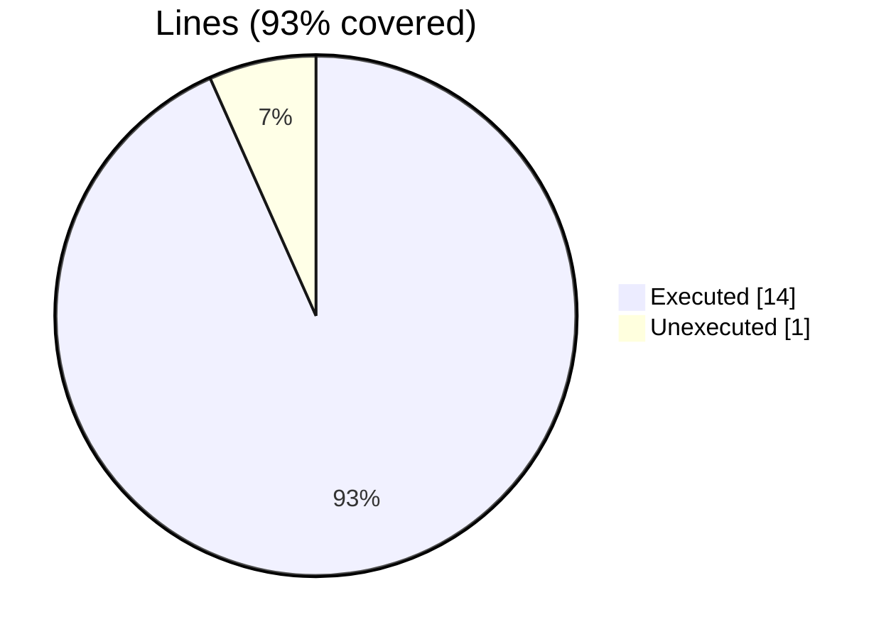
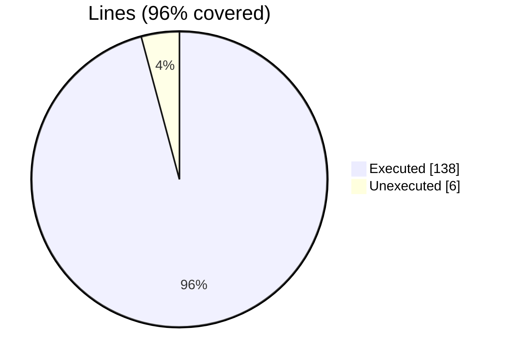
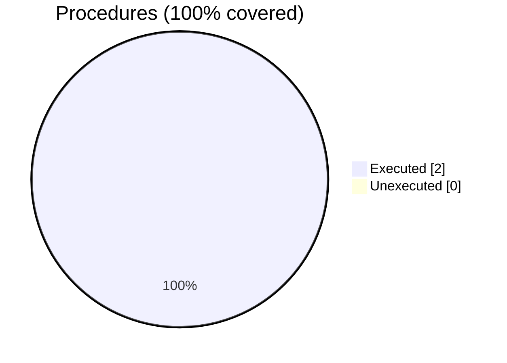
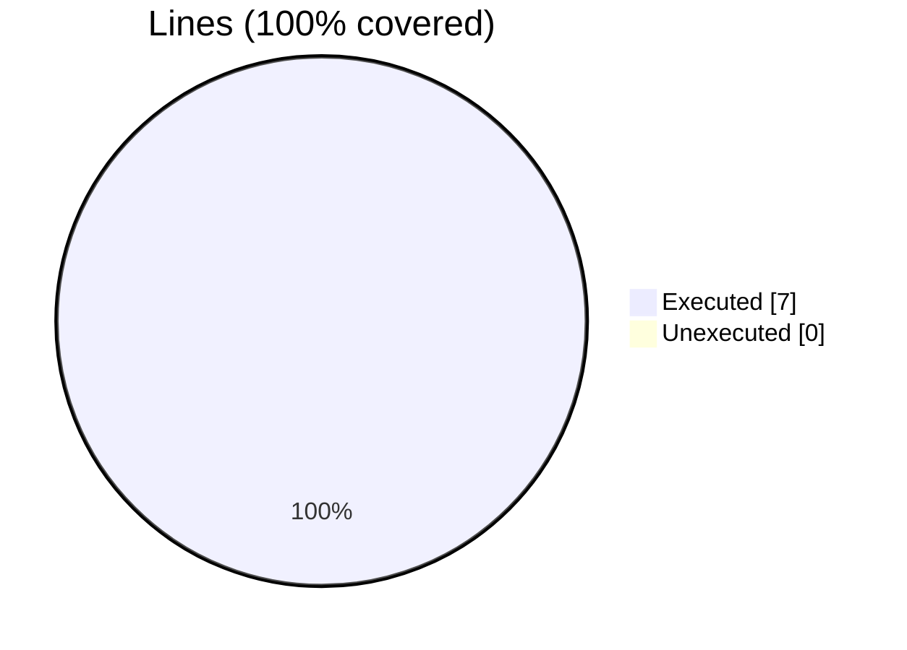
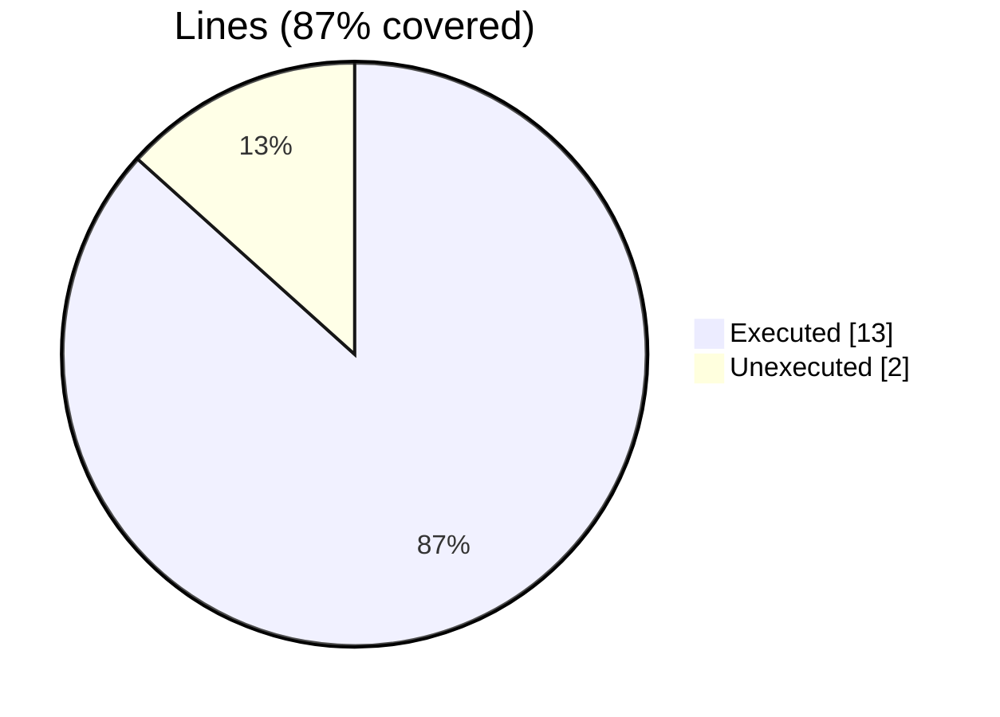
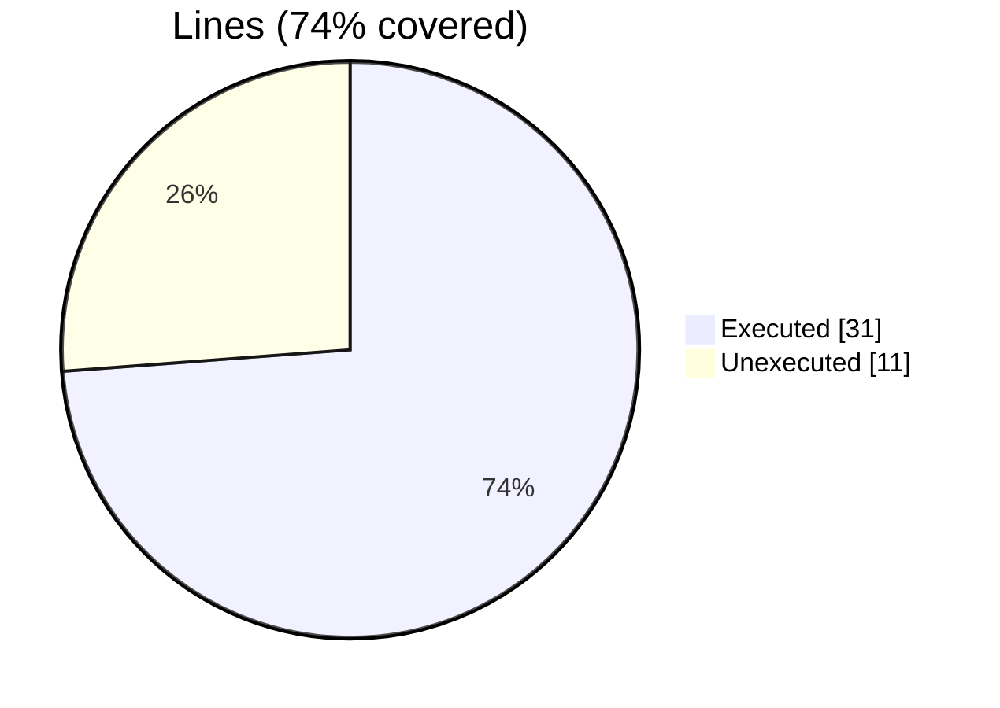
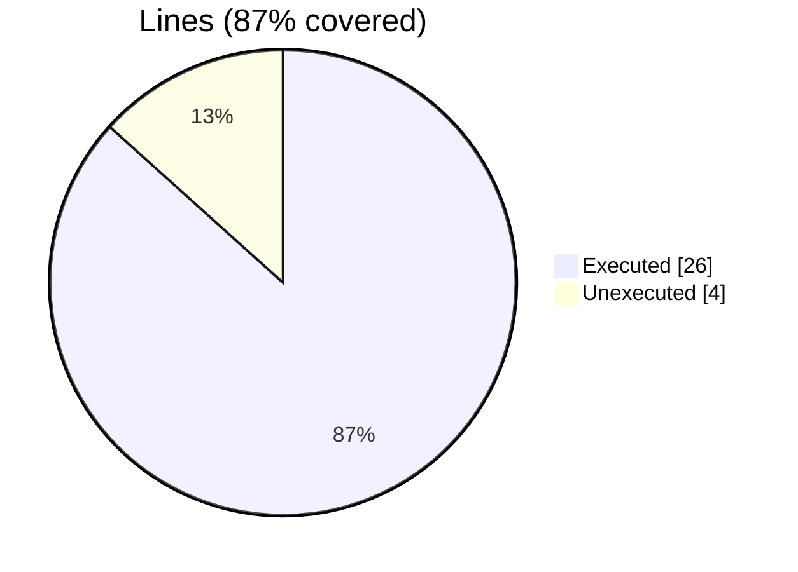

### coverage-analysis

#### [[fundal_save_memory_status_test.F90.gcov]]

|Lines| | |
| --- | --- | --- |
|Executable lines            |15| |
|Executed lines              |14|93%|
|Unexecuted lines            |1|7%|
|Average hits / executed     |1.0| |




#### [[fundal_assign_test_agnostic.INC.gcov]]

|Lines| | |
| --- | --- | --- |
|Executable lines            |144| |
|Executed lines              |138|96%|
|Unexecuted lines            |6|4%|
|Average hits / executed     |4272683.884057971| |



|Procedures| | |
| --- | --- | --- |
|Total procedures            |1| |
|Executed procedures         |1|100%|
|Unexecuted procedures       |0|0%|
|Average hits / executed     |6.0| |


#### [[fundal_device_handling_test.F90.gcov]]

|Lines| | |
| --- | --- | --- |
|Executable lines            |15| |
|Executed lines              |15|100%|
|Unexecuted lines            |0|0%|
|Average hits / executed     |1.1333333333333333| |


#### [[fundal_array_access_test.F90.gcov]]

|Lines| | |
| --- | --- | --- |
|Executable lines            |73| |
|Executed lines              |69|95%|
|Unexecuted lines            |4|5%|
|Average hits / executed     |920422.0434782609| |


|Procedures| | |
| --- | --- | --- |
|Total procedures            |2| |
|Executed procedures         |2|100%|
|Unexecuted procedures       |0|0%|
|Average hits / executed     |2.0| |




#### [[fundal.F90.gcov]]

|Lines| | |
| --- | --- | --- |
|Executable lines            |7| |
|Executed lines              |7|100%|
|Unexecuted lines            |0|0%|
|Average hits / executed     |3.0| |



|Procedures| | |
| --- | --- | --- |
|Total procedures            |1| |
|Executed procedures         |1|100%|
|Unexecuted procedures       |0|0%|
|Average hits / executed     |3.0| |


#### [[fundal_dev_free_unstructured_agnostic.INC.gcov]]

|Lines| | |
| --- | --- | --- |
|Executable lines            |3| |
|Executed lines              |3|100%|
|Unexecuted lines            |0|0%|
|Average hits / executed     |36.0| |


|Procedures| | |
| --- | --- | --- |
|Total procedures            |1| |
|Executed procedures         |1|100%|
|Unexecuted procedures       |0|0%|
|Average hits / executed     |36.0| |


#### [[fundal_dev_alloc_agnostic.INC.gcov]]

|Lines| | |
| --- | --- | --- |
|Executable lines            |15| |
|Executed lines              |13|87%|
|Unexecuted lines            |2|13%|
|Average hits / executed     |58.61538461538461| |



|Procedures| | |
| --- | --- | --- |
|Total procedures            |1| |
|Executed procedures         |1|100%|
|Unexecuted procedures       |0|0%|
|Average hits / executed     |50.0| |


#### [[fundal_dev_alloc_unstructured_agnostic.INC.gcov]]

|Lines| | |
| --- | --- | --- |
|Executable lines            |6| |
|Executed lines              |6|100%|
|Unexecuted lines            |0|0%|
|Average hits / executed     |35.333333333333336| |


|Procedures| | |
| --- | --- | --- |
|Total procedures            |1| |
|Executed procedures         |1|100%|
|Unexecuted procedures       |0|0%|
|Average hits / executed     |38.0| |


#### [[fundal_dev_memcpy_unstructured.F90.gcov]]

|Lines| | |
| --- | --- | --- |
|Executable lines            |252| |
|Executed lines              |252|100%|
|Unexecuted lines            |0|0%|
|Average hits / executed     |2.0357142857142856| |


|Procedures| | |
| --- | --- | --- |
|Total procedures            |84| |
|Executed procedures         |84|100%|
|Unexecuted procedures       |0|0%|
|Average hits / executed     |2.0357142857142856| |


#### [[fundal_derived_type_memcpy_test.F90.gcov]]

|Lines| | |
| --- | --- | --- |
|Executable lines            |42| |
|Executed lines              |31|74%|
|Unexecuted lines            |11|26%|
|Average hits / executed     |194.70967741935485| |




#### [[fundal_alloc_free_test_agnostic.INC.gcov]]

|Lines| | |
| --- | --- | --- |
|Executable lines            |172| |
|Executed lines              |172|100%|
|Unexecuted lines            |0|0%|
|Average hits / executed     |215067.88372093023| |


|Procedures| | |
| --- | --- | --- |
|Total procedures            |1| |
|Executed procedures         |1|100%|
|Unexecuted procedures       |0|0%|
|Average hits / executed     |12.0| |


#### [[fundal_external_routine_test.F90.gcov]]

|Lines| | |
| --- | --- | --- |
|Executable lines            |30| |
|Executed lines              |26|87%|
|Unexecuted lines            |4|13%|
|Average hits / executed     |2581.076923076923| |



|Procedures| | |
| --- | --- | --- |
|Total procedures            |2| |
|Executed procedures         |2|100%|
|Unexecuted procedures       |0|0%|
|Average hits / executed     |1.0| |

```mermaid
pie showData
    title Procedures (100% covered)
    "Executed" : 2
    "Unexecuted" : 0
```


#### [[fundal_use_test.F90.gcov]]

|Lines| | |
| --- | --- | --- |
|Executable lines            |4| |
|Executed lines              |4|100%|
|Unexecuted lines            |0|0%|
|Average hits / executed     |1.0| |

```mermaid
pie showData
    title Lines (100% covered)
    "Executed" : 4
    "Unexecuted" : 0
```


#### [[fundal_memcpy_test.F90.gcov]]

|Lines| | |
| --- | --- | --- |
|Executable lines            |23| |
|Executed lines              |18|78%|
|Unexecuted lines            |5|22%|
|Average hits / executed     |14.833333333333334| |

```mermaid
pie showData
    title Lines (78% covered)
    "Executed" : 18
    "Unexecuted" : 5
```

|Procedures| | |
| --- | --- | --- |
|Total procedures            |2| |
|Executed procedures         |2|100%|
|Unexecuted procedures       |0|0%|
|Average hits / executed     |42.5| |

```mermaid
pie showData
    title Procedures (100% covered)
    "Executed" : 2
    "Unexecuted" : 0
```


#### [[fundal_memcpy_test_agnostic.INC.gcov]]

|Lines| | |
| --- | --- | --- |
|Executable lines            |179| |
|Executed lines              |145|81%|
|Unexecuted lines            |34|19%|
|Average hits / executed     |3141771.324137931| |

```mermaid
pie showData
    title Lines (81% covered)
    "Executed" : 145
    "Unexecuted" : 34
```

|Procedures| | |
| --- | --- | --- |
|Total procedures            |1| |
|Executed procedures         |1|100%|
|Unexecuted procedures       |0|0%|
|Average hits / executed     |6.0| |

```mermaid
pie showData
    title Procedures (100% covered)
    "Executed" : 1
    "Unexecuted" : 0
```


#### [[fundal_dev_handling.F90.gcov]]

|Lines| | |
| --- | --- | --- |
|Executable lines            |48| |
|Executed lines              |47|98%|
|Unexecuted lines            |1|2%|
|Average hits / executed     |5.0212765957446805| |

```mermaid
pie showData
    title Lines (98% covered)
    "Executed" : 47
    "Unexecuted" : 1
```

|Procedures| | |
| --- | --- | --- |
|Total procedures            |7| |
|Executed procedures         |7|100%|
|Unexecuted procedures       |0|0%|
|Average hits / executed     |7.142857142857143| |

```mermaid
pie showData
    title Procedures (100% covered)
    "Executed" : 7
    "Unexecuted" : 0
```


#### [[fundal_transpose_array_agnostic.INC.gcov]]

|Lines| | |
| --- | --- | --- |
|Executable lines            |6| |
|Executed lines              |6|100%|
|Unexecuted lines            |0|0%|
|Average hits / executed     |475.6666666666667| |

```mermaid
pie showData
    title Lines (100% covered)
    "Executed" : 6
    "Unexecuted" : 0
```

|Procedures| | |
| --- | --- | --- |
|Total procedures            |1| |
|Executed procedures         |1|100%|
|Unexecuted procedures       |0|0%|
|Average hits / executed     |12.0| |

```mermaid
pie showData
    title Procedures (100% covered)
    "Executed" : 1
    "Unexecuted" : 0
```


#### [[fundal_assign_test.F90.gcov]]

|Lines| | |
| --- | --- | --- |
|Executable lines            |23| |
|Executed lines              |18|78%|
|Unexecuted lines            |5|22%|
|Average hits / executed     |7.833333333333333| |

```mermaid
pie showData
    title Lines (78% covered)
    "Executed" : 18
    "Unexecuted" : 5
```

|Procedures| | |
| --- | --- | --- |
|Total procedures            |2| |
|Executed procedures         |2|100%|
|Unexecuted procedures       |0|0%|
|Average hits / executed     |21.5| |

```mermaid
pie showData
    title Procedures (100% covered)
    "Executed" : 2
    "Unexecuted" : 0
```


#### [[fundal_dev_free_agnostic.INC.gcov]]

|Lines| | |
| --- | --- | --- |
|Executable lines            |4| |
|Executed lines              |4|100%|
|Unexecuted lines            |0|0%|
|Average hits / executed     |48.0| |

```mermaid
pie showData
    title Lines (100% covered)
    "Executed" : 4
    "Unexecuted" : 0
```

|Procedures| | |
| --- | --- | --- |
|Total procedures            |1| |
|Executed procedures         |1|100%|
|Unexecuted procedures       |0|0%|
|Average hits / executed     |48.0| |

```mermaid
pie showData
    title Procedures (100% covered)
    "Executed" : 1
    "Unexecuted" : 0
```


#### [[fundal_utilities.F90.gcov]]

|Lines| | |
| --- | --- | --- |
|Executable lines            |211| |
|Executed lines              |210|100%|
|Unexecuted lines            |1|0%|
|Average hits / executed     |28.347619047619048| |

```mermaid
pie showData
    title Lines (100% covered)
    "Executed" : 210
    "Unexecuted" : 1
```

|Procedures| | |
| --- | --- | --- |
|Total procedures            |42| |
|Executed procedures         |42|100%|
|Unexecuted procedures       |0|0%|
|Average hits / executed     |17.666666666666668| |

```mermaid
pie showData
    title Procedures (100% covered)
    "Executed" : 42
    "Unexecuted" : 0
```


#### [[fundal_dev_memcpy_agnostic.INC.gcov]]

|Lines| | |
| --- | --- | --- |
|Executable lines            |3| |
|Executed lines              |3|100%|
|Unexecuted lines            |0|0%|
|Average hits / executed     |25.0| |

```mermaid
pie showData
    title Lines (100% covered)
    "Executed" : 3
    "Unexecuted" : 0
```

|Procedures| | |
| --- | --- | --- |
|Total procedures            |1| |
|Executed procedures         |1|100%|
|Unexecuted procedures       |0|0%|
|Average hits / executed     |25.0| |

```mermaid
pie showData
    title Procedures (100% covered)
    "Executed" : 1
    "Unexecuted" : 0
```


#### [[fundal_dev_free.F90.gcov]]

|Lines| | |
| --- | --- | --- |
|Executable lines            |1| |
|Executed lines              |0|0%|
|Unexecuted lines            |1|100%|
|Average hits / executed     |0| |

```mermaid
pie showData
    title Lines (0% covered)
    "Executed" : 0
    "Unexecuted" : 1
```


#### [[fundal_dev_assign_agnostic.INC.gcov]]

|Lines| | |
| --- | --- | --- |
|Executable lines            |5| |
|Executed lines              |5|100%|
|Unexecuted lines            |0|0%|
|Average hits / executed     |8.0| |

```mermaid
pie showData
    title Lines (100% covered)
    "Executed" : 5
    "Unexecuted" : 0
```

|Procedures| | |
| --- | --- | --- |
|Total procedures            |1| |
|Executed procedures         |1|100%|
|Unexecuted procedures       |0|0%|
|Average hits / executed     |6.0| |

```mermaid
pie showData
    title Procedures (100% covered)
    "Executed" : 1
    "Unexecuted" : 0
```


#### [[fundal_alloc_free_test.F90.gcov]]

|Lines| | |
| --- | --- | --- |
|Executable lines            |21| |
|Executed lines              |19|90%|
|Unexecuted lines            |2|10%|
|Average hits / executed     |27.36842105263158| |

```mermaid
pie showData
    title Lines (90% covered)
    "Executed" : 19
    "Unexecuted" : 2
```

|Procedures| | |
| --- | --- | --- |
|Total procedures            |1| |
|Executed procedures         |1|100%|
|Unexecuted procedures       |0|0%|
|Average hits / executed     |168.0| |

```mermaid
pie showData
    title Procedures (100% covered)
    "Executed" : 1
    "Unexecuted" : 0
```

