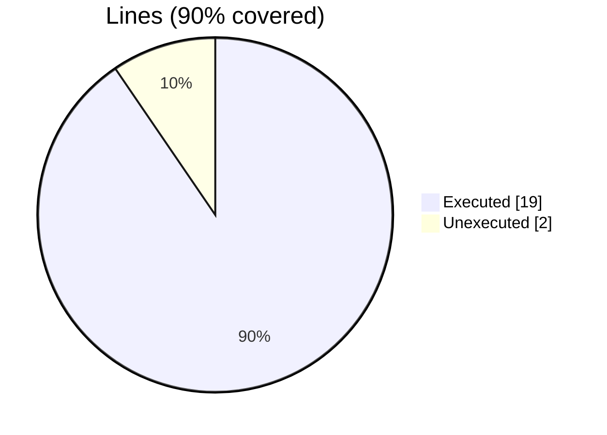
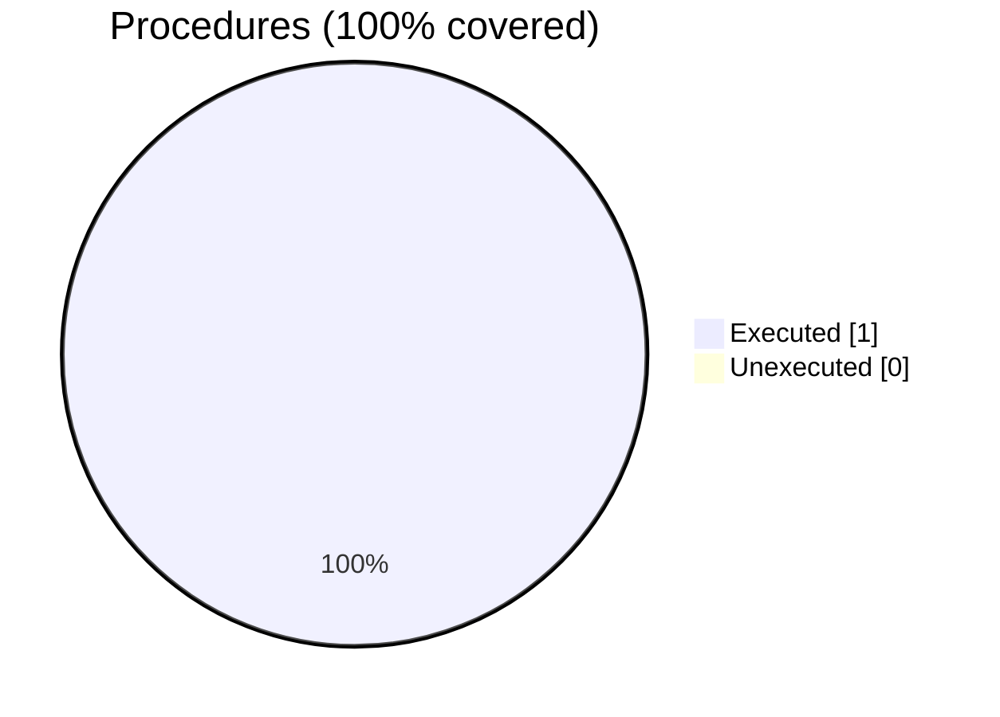

### Coverage analysis of *fundal_alloc_free_test.F90*

|Lines| | |
| --- | --- | --- |
|Executable lines            |21| |
|Executed lines              |19|90%|
|Unexecuted lines            |2|10%|
|Average hits / executed     |27.36842105263158| |

|Procedures| | |
| --- | --- | --- |
|Total procedures            |1| |
|Executed procedures         |1|100%|
|Unexecuted procedures       |0|0%|
|Average hits / executed     |168.0| |

#### Unexecuted procedures

 + *none*

#### Executed procedures

 + *subroutine* **error_print**: tested **168** times

 --- 
 Report generated by [FoBiS.py](https://github.com/szaghi/FoBiS)