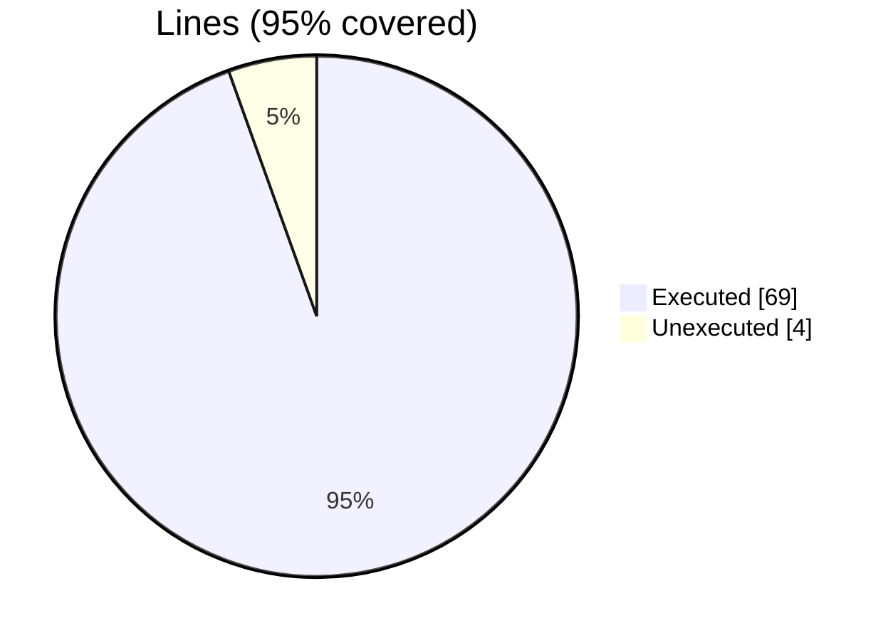
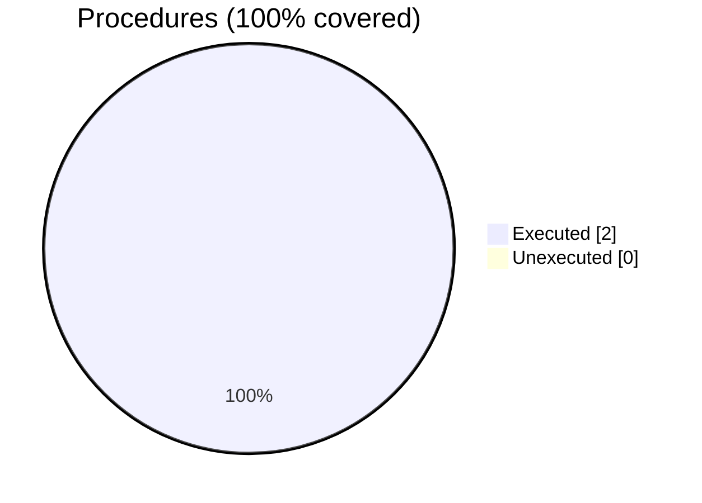

### Coverage analysis of *fundal_array_access_test.F90*

|Lines| | |
| --- | --- | --- |
|Executable lines            |73| |
|Executed lines              |69|95%|
|Unexecuted lines            |4|5%|
|Average hits / executed     |920422.0434782609| |

|Procedures| | |
| --- | --- | --- |
|Total procedures            |2| |
|Executed procedures         |2|100%|
|Unexecuted procedures       |0|0%|
|Average hits / executed     |2.0| |

#### Unexecuted procedures

 + *none*

#### Executed procedures

 + *subroutine* **error_print**: tested **3** times
 + *subroutine* **get_n_cli**: tested **1** times

 --- 
 Report generated by [FoBiS.py](https://github.com/szaghi/FoBiS)