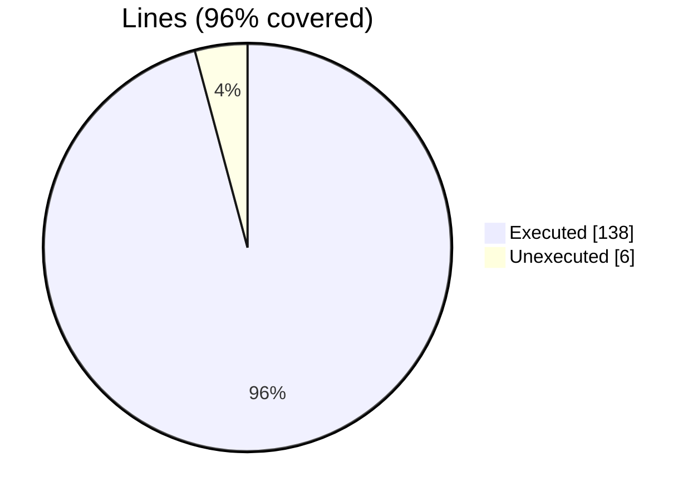
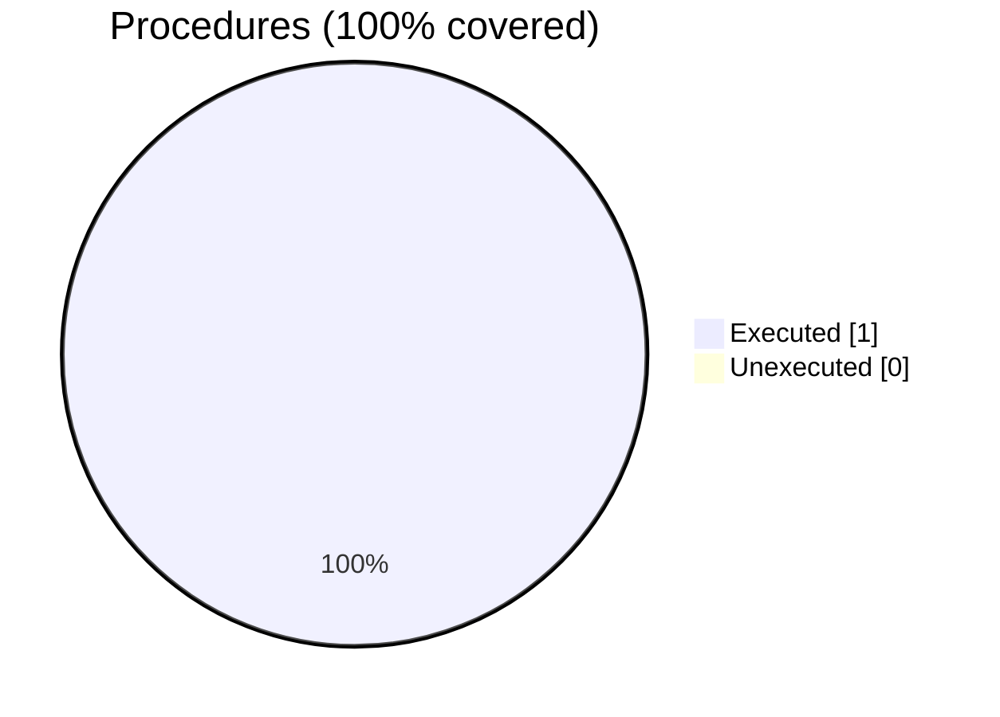

### Coverage analysis of *fundal_assign_test_agnostic.INC*

|Lines| | |
| --- | --- | --- |
|Executable lines            |144| |
|Executed lines              |138|96%|
|Unexecuted lines            |6|4%|
|Average hits / executed     |4272683.884057971| |

|Procedures| | |
| --- | --- | --- |
|Total procedures            |1| |
|Executed procedures         |1|100%|
|Unexecuted procedures       |0|0%|
|Average hits / executed     |6.0| |

#### Unexecuted procedures

 + *none*

#### Executed procedures

 + *subroutine* **TEST_KKP**: tested **6** times

 --- 
 Report generated by [FoBiS.py](https://github.com/szaghi/FoBiS)