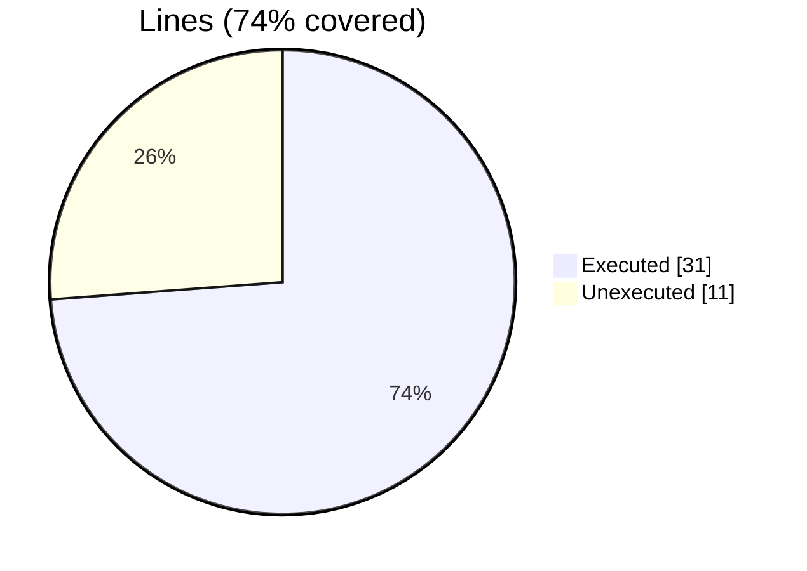

### Coverage analysis of *fundal_derived_type_memcpy_test.F90*

|Lines| | |
| --- | --- | --- |
|Executable lines            |42| |
|Executed lines              |31|74%|
|Unexecuted lines            |11|26%|
|Average hits / executed     |194.70967741935485| |

#### Unexecuted procedures

 + *none*

#### Executed procedures

 + *none*

 --- 
 Report generated by [FoBiS.py](https://github.com/szaghi/FoBiS)