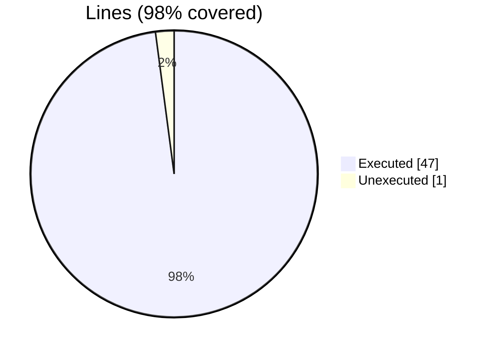
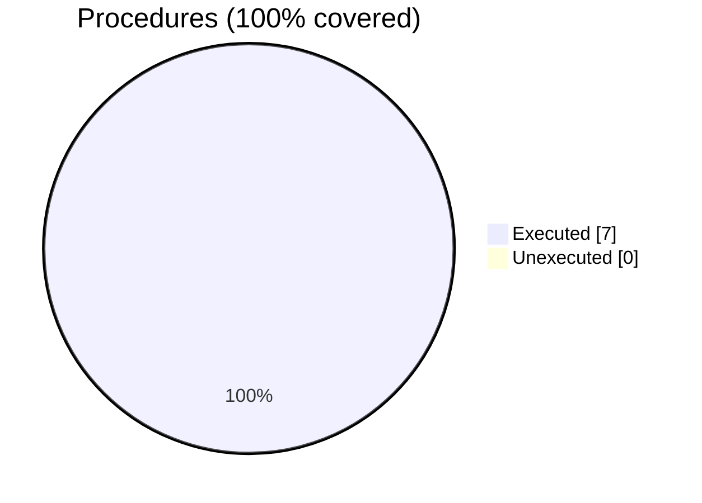

### Coverage analysis of *fundal_dev_handling.F90*

|Lines| | |
| --- | --- | --- |
|Executable lines            |48| |
|Executed lines              |47|98%|
|Unexecuted lines            |1|2%|
|Average hits / executed     |5.0212765957446805| |

|Procedures| | |
| --- | --- | --- |
|Total procedures            |7| |
|Executed procedures         |7|100%|
|Unexecuted procedures       |0|0%|
|Average hits / executed     |7.142857142857143| |

#### Unexecuted procedures

 + *none*

#### Executed procedures

 + *subroutine* **dev_init**: tested **14** times
 + *subroutine* **dev_get_device_memory_info**: tested **10** times
 + *function* **dev_get_host_num**: tested **8** times
 + *function* **dev_get_num_devices**: tested **8** times
 + *subroutine* **dev_set_device_num**: tested **8** times
 + *function* **dev_get_device_num**: tested **1** times
 + *subroutine* **dev_get_property_string**: tested **1** times

 --- 
 Report generated by [FoBiS.py](https://github.com/szaghi/FoBiS)