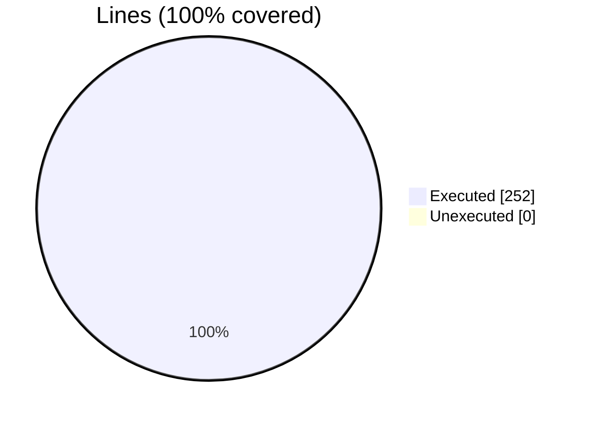
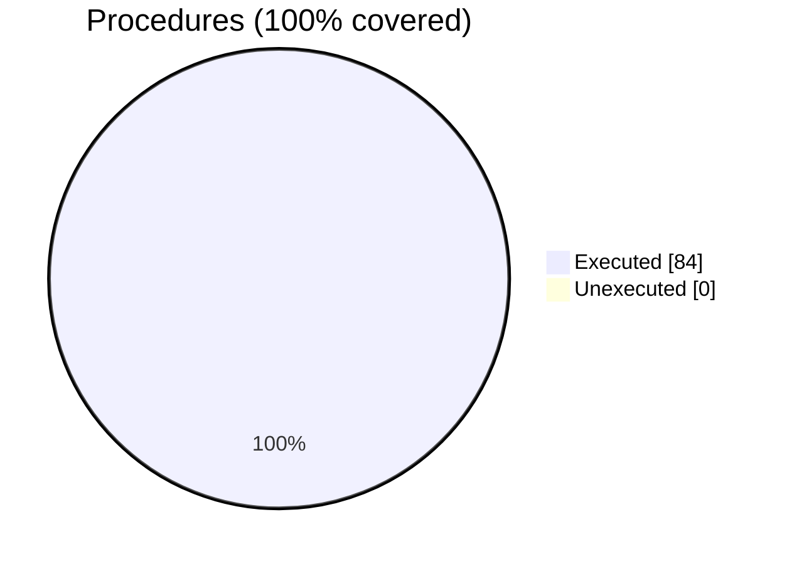

### Coverage analysis of *fundal_dev_memcpy_unstructured.F90*

|Lines| | |
| --- | --- | --- |
|Executable lines            |252| |
|Executed lines              |252|100%|
|Unexecuted lines            |0|0%|
|Average hits / executed     |2.0357142857142856| |

|Procedures| | |
| --- | --- | --- |
|Total procedures            |84| |
|Executed procedures         |84|100%|
|Unexecuted procedures       |0|0%|
|Average hits / executed     |2.0357142857142856| |

#### Unexecuted procedures

 + *none*

#### Executed procedures

 + *subroutine* **dev_memcpy_from_device_R8P_1D**: tested **4** times
 + *subroutine* **dev_memcpy_from_device_R8P_2D**: tested **4** times
 + *subroutine* **dev_memcpy_from_device_R8P_3D**: tested **3** times
 + *subroutine* **dev_memcpy_from_device_R8P_4D**: tested **3** times
 + *subroutine* **dev_memcpy_from_device_R8P_5D**: tested **3** times
 + *subroutine* **dev_memcpy_from_device_R8P_6D**: tested **3** times
 + *subroutine* **dev_memcpy_from_device_R8P_7D**: tested **3** times
 + *subroutine* **dev_memcpy_from_device_R4P_1D**: tested **3** times
 + *subroutine* **dev_memcpy_from_device_R4P_2D**: tested **3** times
 + *subroutine* **dev_memcpy_from_device_R4P_3D**: tested **3** times
 + *subroutine* **dev_memcpy_from_device_R4P_4D**: tested **3** times
 + *subroutine* **dev_memcpy_from_device_R4P_5D**: tested **3** times
 + *subroutine* **dev_memcpy_from_device_R4P_6D**: tested **3** times
 + *subroutine* **dev_memcpy_from_device_R4P_7D**: tested **3** times
 + *subroutine* **dev_memcpy_from_device_I8P_1D**: tested **3** times
 + *subroutine* **dev_memcpy_from_device_I8P_2D**: tested **3** times
 + *subroutine* **dev_memcpy_from_device_I8P_3D**: tested **3** times
 + *subroutine* **dev_memcpy_from_device_I8P_4D**: tested **3** times
 + *subroutine* **dev_memcpy_from_device_I8P_5D**: tested **3** times
 + *subroutine* **dev_memcpy_from_device_I8P_6D**: tested **3** times
 + *subroutine* **dev_memcpy_from_device_I8P_7D**: tested **3** times
 + *subroutine* **dev_memcpy_from_device_I4P_1D**: tested **3** times
 + *subroutine* **dev_memcpy_from_device_I4P_2D**: tested **3** times
 + *subroutine* **dev_memcpy_from_device_I4P_3D**: tested **3** times
 + *subroutine* **dev_memcpy_from_device_I4P_4D**: tested **3** times
 + *subroutine* **dev_memcpy_from_device_I4P_5D**: tested **3** times
 + *subroutine* **dev_memcpy_from_device_I4P_6D**: tested **3** times
 + *subroutine* **dev_memcpy_from_device_I4P_7D**: tested **3** times
 + *subroutine* **dev_memcpy_from_device_I2P_1D**: tested **3** times
 + *subroutine* **dev_memcpy_from_device_I2P_2D**: tested **3** times
 + *subroutine* **dev_memcpy_from_device_I2P_3D**: tested **3** times
 + *subroutine* **dev_memcpy_from_device_I2P_4D**: tested **3** times
 + *subroutine* **dev_memcpy_from_device_I2P_5D**: tested **3** times
 + *subroutine* **dev_memcpy_from_device_I2P_6D**: tested **3** times
 + *subroutine* **dev_memcpy_from_device_I2P_7D**: tested **3** times
 + *subroutine* **dev_memcpy_from_device_I1P_1D**: tested **3** times
 + *subroutine* **dev_memcpy_from_device_I1P_2D**: tested **3** times
 + *subroutine* **dev_memcpy_from_device_I1P_3D**: tested **3** times
 + *subroutine* **dev_memcpy_from_device_I1P_4D**: tested **3** times
 + *subroutine* **dev_memcpy_from_device_I1P_5D**: tested **3** times
 + *subroutine* **dev_memcpy_from_device_I1P_6D**: tested **3** times
 + *subroutine* **dev_memcpy_from_device_I1P_7D**: tested **3** times
 + *subroutine* **dev_memcpy_to_device_R8P_1D**: tested **2** times
 + *subroutine* **dev_memcpy_to_device_R8P_2D**: tested **1** times
 + *subroutine* **dev_memcpy_to_device_R8P_3D**: tested **1** times
 + *subroutine* **dev_memcpy_to_device_R8P_4D**: tested **1** times
 + *subroutine* **dev_memcpy_to_device_R8P_5D**: tested **1** times
 + *subroutine* **dev_memcpy_to_device_R8P_6D**: tested **1** times
 + *subroutine* **dev_memcpy_to_device_R8P_7D**: tested **1** times
 + *subroutine* **dev_memcpy_to_device_R4P_1D**: tested **1** times
 + *subroutine* **dev_memcpy_to_device_R4P_2D**: tested **1** times
 + *subroutine* **dev_memcpy_to_device_R4P_3D**: tested **1** times
 + *subroutine* **dev_memcpy_to_device_R4P_4D**: tested **1** times
 + *subroutine* **dev_memcpy_to_device_R4P_5D**: tested **1** times
 + *subroutine* **dev_memcpy_to_device_R4P_6D**: tested **1** times
 + *subroutine* **dev_memcpy_to_device_R4P_7D**: tested **1** times
 + *subroutine* **dev_memcpy_to_device_I8P_1D**: tested **1** times
 + *subroutine* **dev_memcpy_to_device_I8P_2D**: tested **1** times
 + *subroutine* **dev_memcpy_to_device_I8P_3D**: tested **1** times
 + *subroutine* **dev_memcpy_to_device_I8P_4D**: tested **1** times
 + *subroutine* **dev_memcpy_to_device_I8P_5D**: tested **1** times
 + *subroutine* **dev_memcpy_to_device_I8P_6D**: tested **1** times
 + *subroutine* **dev_memcpy_to_device_I8P_7D**: tested **1** times
 + *subroutine* **dev_memcpy_to_device_I4P_1D**: tested **1** times
 + *subroutine* **dev_memcpy_to_device_I4P_2D**: tested **1** times
 + *subroutine* **dev_memcpy_to_device_I4P_3D**: tested **1** times
 + *subroutine* **dev_memcpy_to_device_I4P_4D**: tested **1** times
 + *subroutine* **dev_memcpy_to_device_I4P_5D**: tested **1** times
 + *subroutine* **dev_memcpy_to_device_I4P_6D**: tested **1** times
 + *subroutine* **dev_memcpy_to_device_I4P_7D**: tested **1** times
 + *subroutine* **dev_memcpy_to_device_I2P_1D**: tested **1** times
 + *subroutine* **dev_memcpy_to_device_I2P_2D**: tested **1** times
 + *subroutine* **dev_memcpy_to_device_I2P_3D**: tested **1** times
 + *subroutine* **dev_memcpy_to_device_I2P_4D**: tested **1** times
 + *subroutine* **dev_memcpy_to_device_I2P_5D**: tested **1** times
 + *subroutine* **dev_memcpy_to_device_I2P_6D**: tested **1** times
 + *subroutine* **dev_memcpy_to_device_I2P_7D**: tested **1** times
 + *subroutine* **dev_memcpy_to_device_I1P_1D**: tested **1** times
 + *subroutine* **dev_memcpy_to_device_I1P_2D**: tested **1** times
 + *subroutine* **dev_memcpy_to_device_I1P_3D**: tested **1** times
 + *subroutine* **dev_memcpy_to_device_I1P_4D**: tested **1** times
 + *subroutine* **dev_memcpy_to_device_I1P_5D**: tested **1** times
 + *subroutine* **dev_memcpy_to_device_I1P_6D**: tested **1** times
 + *subroutine* **dev_memcpy_to_device_I1P_7D**: tested **1** times

 --- 
 Report generated by [FoBiS.py](https://github.com/szaghi/FoBiS)