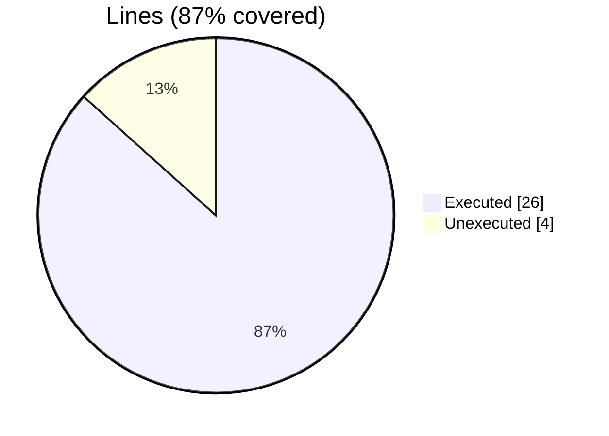
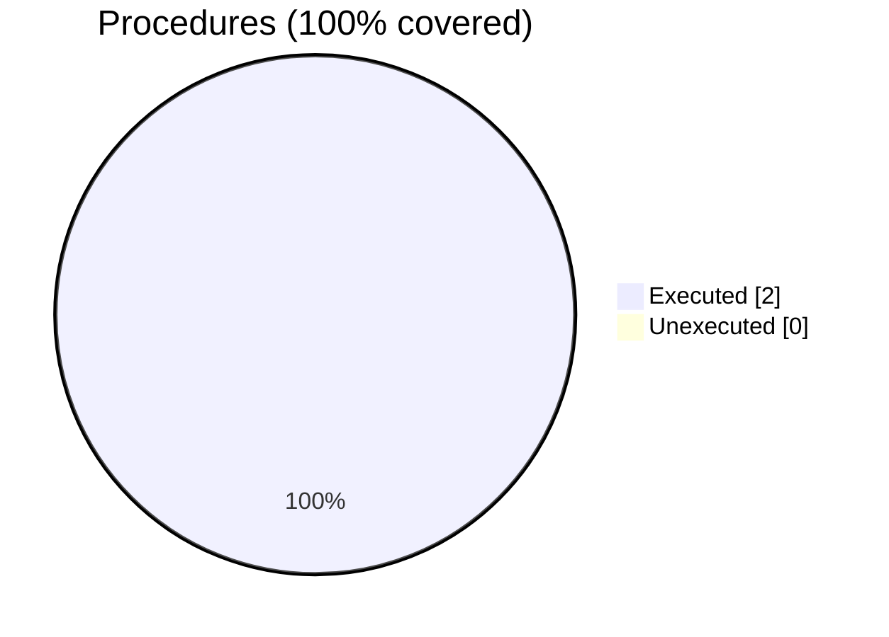

### Coverage analysis of *fundal_external_routine_test.F90*

|Lines| | |
| --- | --- | --- |
|Executable lines            |30| |
|Executed lines              |26|87%|
|Unexecuted lines            |4|13%|
|Average hits / executed     |2581.076923076923| |

|Procedures| | |
| --- | --- | --- |
|Total procedures            |2| |
|Executed procedures         |2|100%|
|Unexecuted procedures       |0|0%|
|Average hits / executed     |1.0| |

#### Unexecuted procedures

 + *none*

#### Executed procedures

 + *subroutine* **do_work_ptr**: tested **1** times
 + *subroutine* **do_work_unstr**: tested **1** times

 --- 
 Report generated by [FoBiS.py](https://github.com/szaghi/FoBiS)