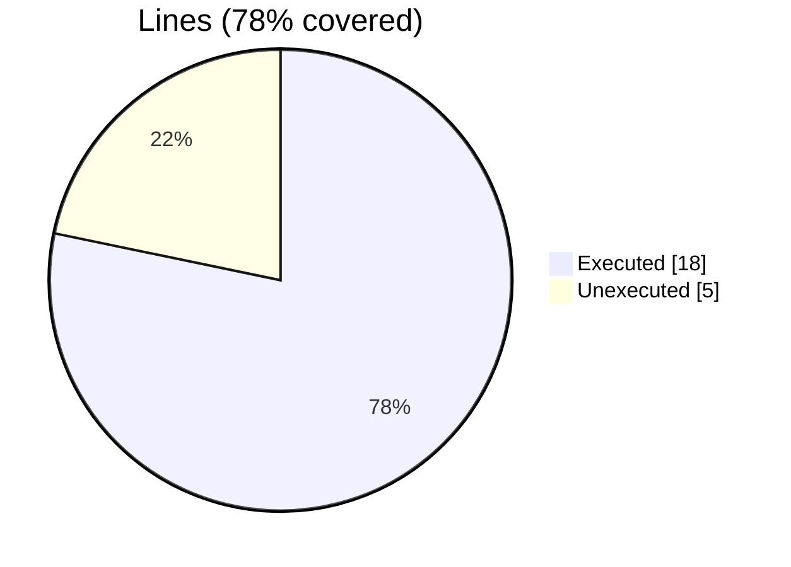
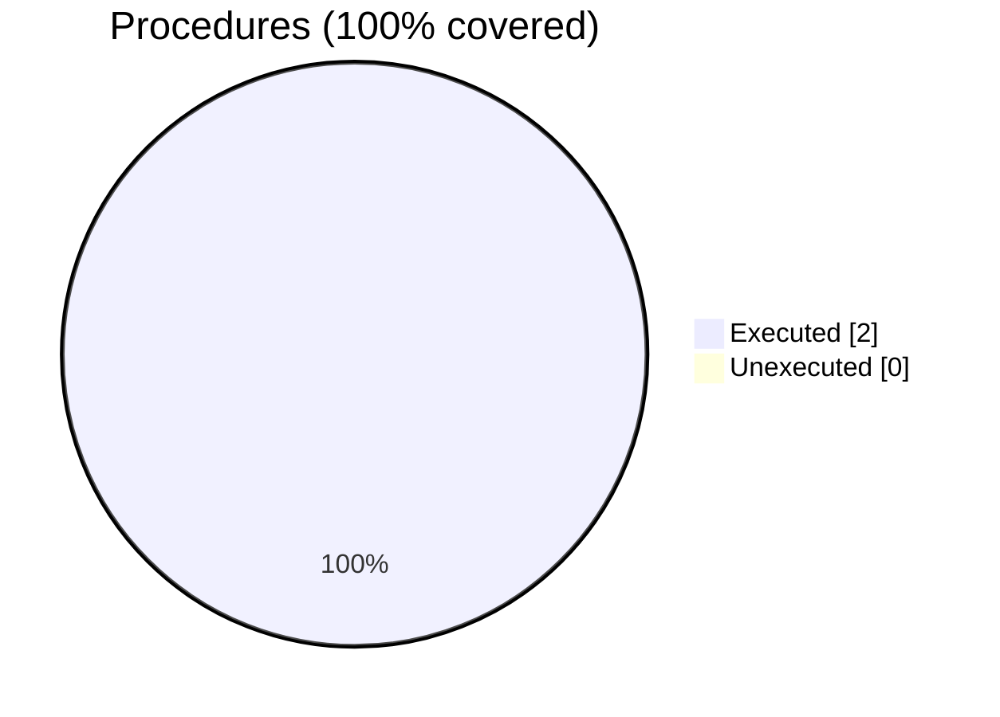

### Coverage analysis of *fundal_memcpy_test.F90*

|Lines| | |
| --- | --- | --- |
|Executable lines            |23| |
|Executed lines              |18|78%|
|Unexecuted lines            |5|22%|
|Average hits / executed     |14.833333333333334| |

|Procedures| | |
| --- | --- | --- |
|Total procedures            |2| |
|Executed procedures         |2|100%|
|Unexecuted procedures       |0|0%|
|Average hits / executed     |42.5| |

#### Unexecuted procedures

 + *none*

#### Executed procedures

 + *subroutine* **error_print**: tested **84** times
 + *subroutine* **get_n_cli**: tested **1** times

 --- 
 Report generated by [FoBiS.py](https://github.com/szaghi/FoBiS)