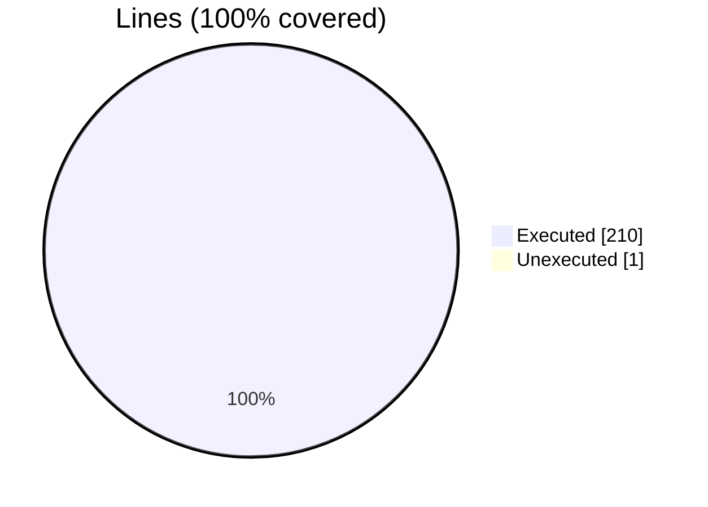
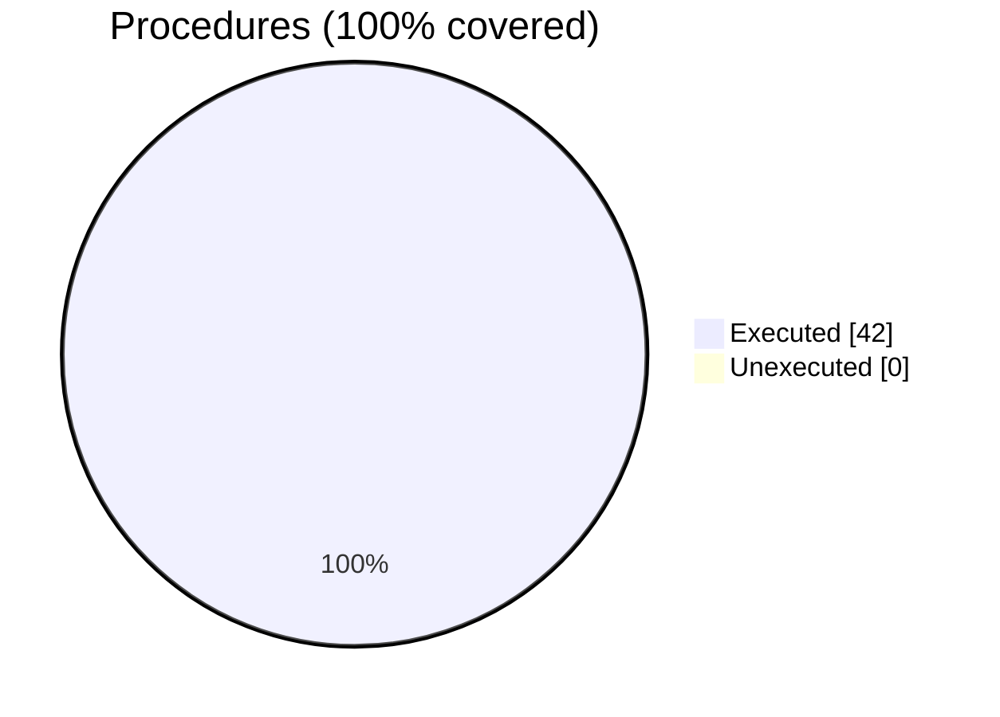

### Coverage analysis of *fundal_utilities.F90*

|Lines| | |
| --- | --- | --- |
|Executable lines            |211| |
|Executed lines              |210|100%|
|Unexecuted lines            |1|0%|
|Average hits / executed     |28.347619047619048| |

|Procedures| | |
| --- | --- | --- |
|Total procedures            |42| |
|Executed procedures         |42|100%|
|Unexecuted procedures       |0|0%|
|Average hits / executed     |17.666666666666668| |

#### Unexecuted procedures

 + *none*

#### Executed procedures

 + *function* **bytes_size_R8P_4D**: tested **21** times
 + *function* **bytes_size_R8P_2D**: tested **20** times
 + *function* **bytes_size_I4P_3D**: tested **19** times
 + *function* **bytes_size_R8P_1D**: tested **18** times
 + *function* **bytes_size_R8P_3D**: tested **18** times
 + *function* **bytes_size_R8P_5D**: tested **18** times
 + *function* **bytes_size_R8P_6D**: tested **18** times
 + *function* **bytes_size_R8P_7D**: tested **18** times
 + *function* **bytes_size_R4P_2D**: tested **18** times
 + *function* **bytes_size_R4P_3D**: tested **18** times
 + *function* **bytes_size_R4P_4D**: tested **18** times
 + *function* **bytes_size_R4P_5D**: tested **18** times
 + *function* **bytes_size_R4P_6D**: tested **18** times
 + *function* **bytes_size_R4P_7D**: tested **18** times
 + *function* **bytes_size_I8P_2D**: tested **18** times
 + *function* **bytes_size_I8P_3D**: tested **18** times
 + *function* **bytes_size_I8P_4D**: tested **18** times
 + *function* **bytes_size_I8P_5D**: tested **18** times
 + *function* **bytes_size_I8P_6D**: tested **18** times
 + *function* **bytes_size_I8P_7D**: tested **18** times
 + *function* **bytes_size_I4P_2D**: tested **18** times
 + *function* **bytes_size_I4P_4D**: tested **18** times
 + *function* **bytes_size_I4P_5D**: tested **18** times
 + *function* **bytes_size_I4P_6D**: tested **18** times
 + *function* **bytes_size_I4P_7D**: tested **18** times
 + *function* **bytes_size_I2P_2D**: tested **18** times
 + *function* **bytes_size_I2P_3D**: tested **18** times
 + *function* **bytes_size_I2P_4D**: tested **18** times
 + *function* **bytes_size_I2P_5D**: tested **18** times
 + *function* **bytes_size_I2P_6D**: tested **18** times
 + *function* **bytes_size_I2P_7D**: tested **18** times
 + *function* **bytes_size_I1P_2D**: tested **18** times
 + *function* **bytes_size_I1P_3D**: tested **18** times
 + *function* **bytes_size_I1P_4D**: tested **18** times
 + *function* **bytes_size_I1P_5D**: tested **18** times
 + *function* **bytes_size_I1P_6D**: tested **18** times
 + *function* **bytes_size_I1P_7D**: tested **18** times
 + *function* **bytes_size_R4P_1D**: tested **14** times
 + *function* **bytes_size_I8P_1D**: tested **14** times
 + *function* **bytes_size_I4P_1D**: tested **14** times
 + *function* **bytes_size_I2P_1D**: tested **14** times
 + *function* **bytes_size_I1P_1D**: tested **14** times

 --- 
 Report generated by [FoBiS.py](https://github.com/szaghi/FoBiS)