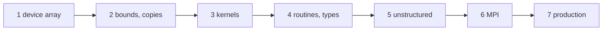

# The tutorial

The tutorial teaches FUNDAL by growing one program, a solver of the 1-D heat equation, from a first device array to a
multi-device MPI run with production checks. Each chapter is a complete program that is compiled and run; every output
shown is the real output of that program. The [cookbook](/cookbook/) then collects short recipes, and the
[reference](/reference/) has every argument of every procedure.

## The problem

The temperature $T(x,t)$ of a bar of unit length, with the ends kept at zero, obeys $\partial_t T = \alpha\,\partial_{xx} T$.
On $n$ cells of size $\Delta x = 1/(n+1)$, with ghost cells $0$ and $n+1$ holding the boundary values, the explicit
scheme advances one time step as

$$T^{new}_i = T_i + r\,(T_{i-1} - 2T_i + T_{i+1}),\qquad r = \alpha\,\Delta t/\Delta x^2 \le 1/2 .$$

Starting from one sine arch, $T_i = \sin(\pi i \Delta x)$, each step multiplies the solution by the same factor
$g = 1 - 4r\sin^2(\pi\Delta x/2)$: the programs compare the device result with this exact solution of the discrete
problem, so every kernel checks itself.

## The chapters

| Chapter | You learn |
|---|---|
| [1. A first device array](./01-first-device-array) | `dev_init`, `dev_alloc` with a label, `dev_memcpy_to_device`/`_from_device`, `dev_free`, `dev_get_alloc_stats` |
| [2. Bounds, resizing, copies](./02-bounds-resizing) | lower bounds and ghost cells, `init_value`, `dev_alloc_replace`, `dev_assign_to_device`/`_from_device` and their bounds |
| [3. Portable kernels](./03-portable-kernels) | `fundal.H`, the `DEVICEVAR`/`DEVICEPTR`/`OMPLOOP` macros, a diffusion step on the device, pointer swaps |
| [4. Routines and types](./04-routines-types) | kernels in procedures with device dummy arguments, a derived type holding device arrays |
| [5. The unstructured model](./05-unstructured) | host allocatables mapped to the device: `dev_alloc_unstr`, `dev_memcpy_*_unstr`, `dev_free_unstr` |
| [6. Several devices with MPI](./06-mpi) | `mpih_object`, one device per rank, halo exchange through host buffers |
| [7. Production runs](./07-production) | `require_device`, `dev_is_host_fallback`, the registry policy, `dev_alloc_report`, checked `dev_free` |



## Building the examples

Every program of the tutorial and of the cookbook is in
[`docs/examples/src`](https://github.com/szaghi/FUNDAL/tree/main/docs/examples/src). With FUNDAL built by make (see
[Installation](/guide/install)):

```bash
make COMPILER=gnu BACKEND=oac
gfortran -cpp -DCOMPILER_GNU -DDEV_OAC -fopenacc -I src/lib -I build/gnu-oac/mod \
         docs/examples/src/heat_1.F90 build/gnu-oac/libfundal.a -o heat_1
./heat_1
```

Chapter 6 needs the MPI handler: build the library with `MPI=1` and compile the program with `mpif90`.
`bash scripts/docs_examples.sh` builds and runs all of them as the documentation does: gfortran through the MPI wrapper,
OpenACC backend, on the host (`ACC_DEVICE_TYPE=host`), regenerating the outputs shown in these pages.
