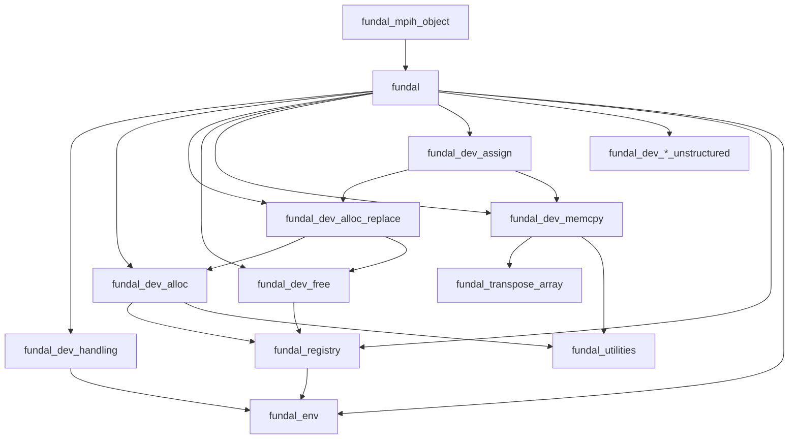

# Reference

Every public entity of FUNDAL, with its exact signature. All of them come from one module:

```fortran
use fundal
```

except the MPI handler, in `fundal_mpih_object`. The kinds in the signatures are those of `iso_fortran_env`: `I1P` =
`int8`, `I2P` = `int16`, `I4P` = `int32`, `I8P` = `int64`, `R4P` = `real32`, `R8P` = `real64`. FUNDAL does not export
them: import them in your code (`use, intrinsic :: iso_fortran_env, only : I4P=>int32, R8P=>real64`).

## Feature map

| Area | Routines | Page |
|---|---|---|
| Initialization, device queries | `dev_init`, `dev_is_host_fallback`, `dev_get_num_devices`, `dev_get_device_num`, `dev_set_device_num`, `dev_get_host_num`, `dev_get_device_type`, `dev_get_device_memory_info`, `dev_get_property_string`, `save_memory_status` | [Initialization and devices](./devices) |
| Structured memory | `dev_alloc`, `dev_alloc_replace`, `dev_free`, `dev_memcpy_to_device`, `dev_memcpy_from_device` (also transposed), `dev_assign_to_device`, `dev_assign_from_device` | [Structured memory](./structured) |
| Unstructured memory | `dev_alloc_unstr`, `dev_free_unstr`, `dev_memcpy_to_device_unstr`, `dev_memcpy_from_device_unstr` | [Unstructured memory](./unstructured) |
| Allocation registry | `dev_set_registry_policy`, `dev_get_alloc_stats`, `dev_alloc_report`, `FUNDAL_REGISTRY` | [Registry and statistics](./registry) |
| MPI | `mpih_object` | [MPI handler](./mpi) |
| Kernel directives | `DEVICEVAR`, `DEVICEPTR`, `OMPLOOP`, `DEVMODULE` | [Macros](./macros) |
| Error codes and constants | `FUNDAL_ERR_*`, [`dev_error_message`](./errors#dev-error-message), `FUNDAL_REGISTRY_*`, `FUNDAL_DEVICE_*` | [Errors and constants](./errors) |
| Global state | `mydev`, `myhos`, `devtype`, `IDK`, `devs_number`, `dev_memory_avail`, `dev_memory_total`, `local_comm` | [Global variables](./globals) |
| Specifications | OpenACC, OpenMP | [Standards](./standards) |

Generic procedures exist for six kinds (`R8P`, `R4P`, `I8P`, `I4P`, `I2P`, `I1P`) and ranks 1 to 7, unless the page says
otherwise.

## Modules



`fundal` is the only module a program needs; the others are its implementation. `fundal_mpih_object` is built only with
MPI.
